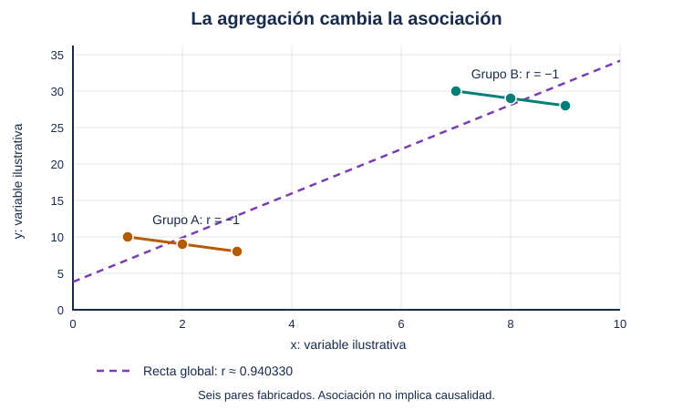

# Unidad 4 — Probabilidad y estadística

[Unidad anterior: matemática aplicada](../unidad03-matematica-aplicada/README.md) · [Volver al índice](../README.md)

Una media no describe por completo un conjunto de datos. Una alerta no confirma por sí sola que ocurrió un evento. Una proporción calculada en una muestra tampoco es una certeza sobre toda una población.

La estadística nos ayuda a resumir observaciones y estudiar qué podemos inferir a partir de ellas. La probabilidad permite expresar supuestos sobre resultados inciertos. En inteligencia artificial necesitamos ambas para comprender datos, interpretar predicciones y evaluar cuánto sustenta la evidencia una conclusión.

Trabajaremos con casos propios, datos sintéticos y cuatro programas pequeños. Calcularemos primero a mano y después contrastaremos cada procedimiento con Python.

## Objetivos

Al terminar podrás:

- Distinguir población, muestra, parámetro y estadístico.
- Identificar tipos de variables y una unidad de análisis.
- Calcular frecuencias, media, mediana, moda y medidas de dispersión.
- Interpretar cuartiles y valores señalados sin eliminarlos automáticamente.
- Explicar correlación, agregación y límites de una interpretación causal.
- Calcular probabilidades conjuntas, condicionales y complementarias.
- Aplicar Bayes considerando la frecuencia inicial de un evento.
- Reconocer variables aleatorias y distribuciones sencillas.
- Separar variabilidad de datos e incertidumbre de una estimación.
- Interpretar una simulación y un intervalo de confianza bajo sus supuestos.
- Relacionar sesgo de selección, dependencia y evaluación de modelos.

## Antes de comenzar

Completa las unidades 0 a 3. Necesitas fracciones, porcentajes, sumas, cuadrados, raíz cuadrada y funciones de Python. Usaremos derivadas solo como conexión conceptual con el entrenamiento, sin introducir cálculos adicionales.

Los programas utilizan biblioteca estándar, CPU y archivos locales. Se verificaron con Python 3.12.14 en Linux. Activa el entorno virtual y ejecuta los comandos desde la raíz del curso.

Los ejemplos de consumo y alertas son **sintéticos**. No corresponden a mediciones, diagnósticos ni resultados de un sistema desplegado. Distingue en cada apartado los números observados en un archivo de los supuestos de un escenario o simulador.

## 1. Qué estamos observando

Antes de calcular necesitamos definir qué representa cada registro. Una fila puede ser un equipo, una jornada, un documento o una solicitud. Esa **unidad de análisis** determina qué significa contar seis observaciones y qué relaciones podrían existir entre ellas.

| Concepto | Significado | Ejemplo ficticio |
|---|---|---|
| Población objetivo | Conjunto sobre el que queremos concluir | Jornadas de todas las zonas de un edificio durante un periodo definido |
| Muestra | Observaciones seleccionadas de esa población | Jornadas elegidas mediante un procedimiento documentado |
| Parámetro | Característica de la población | Media de consumo de todas esas jornadas |
| Estadístico | Cantidad calculada en la muestra | Media de las jornadas seleccionadas |
| Censo | Observación de todas las unidades definidas | Registro completo de ese conjunto y periodo |

La población debe delimitarse por entidad, contexto y periodo. «Todos los consumos» no es una definición operativa suficiente.

En el archivo de esta unidad hay seis números fabricados. Podemos describirlos exactamente. No son una muestra real representativa de un edificio; llamarlos sintéticos no crea una población real de la cual inferir resultados.

### Tipos de variables

- **Categórica nominal:** valores sin orden intrínseco, como tipo de equipo.
- **Categórica ordinal:** categorías ordenadas, como prioridad baja, media y alta. Las distancias entre categorías no se suponen iguales.
- **Cuantitativa discreta:** conteos, como número de solicitudes.
- **Cuantitativa continua:** cantidades modeladas en un continuo, como tiempo o energía; el instrumento puede registrarlas con precisión limitada.

Codificar baja, media y alta como 0, 1 y 2 no demuestra que media esté a la misma distancia de ambas categorías. Tampoco convertir un identificador a entero lo transforma en una cantidad que tenga sentido promediar.

Los faltantes requieren una política explícita. Un consumo desconocido no equivale a consumo cero. En nuestros laboratorios se rechazan campos vacíos para hacer visible esa diferencia.

## 2. Frecuencias: contar antes de resumir

Usaremos los valores de [consumos_sinteticos.csv](datos/consumos_sinteticos.csv):

```text
10, 12, 12, 14, 16, 26
```

| Valor kWh | Frecuencia absoluta | Frecuencia relativa |
|---:|---:|---:|
| 10 | 1 | $1/6$ |
| 12 | 2 | $2/6$ |
| 14 | 1 | $1/6$ |
| 16 | 1 | $1/6$ |
| 26 | 1 | $1/6$ |
| **Total** | **6** | **1** |

La frecuencia relativa es conteo dividido por total. Los porcentajes redondeados pueden sumar algo distinto de 100 %; las fracciones exactas sí suman uno.

La **distribución empírica** asigna a cada valor su frecuencia relativa en estos registros. Si elegimos uniformemente una de las seis filas, la probabilidad de obtener 12 es $2/6$. Esa afirmación describe la selección dentro del archivo; no estima automáticamente la probabilidad de una jornada futura real.

En variables continuas, casi todos los valores pueden ser distintos. Para un histograma agrupamos intervalos y contamos registros dentro de cada uno. Elegir bordes y anchos cambia la apariencia; un histograma debe indicar ambos y aclarar si su eje vertical representa conteo, proporción o densidad.

## 3. Tendencia central: media, mediana y moda

### Media

La media aritmética es:

$$
\bar x=\frac{1}{n}\sum_{i=1}^{n}x_i
$$

Para nuestros seis valores:

$$
\bar x=(10+12+12+14+16+26)/6=90/6=15\text{ kWh}
$$

La media utiliza todas las magnitudes. Un valor extremo puede desplazarla mucho.

### Mediana

Ordenamos los datos. Con una cantidad impar, la mediana es el valor central; con una cantidad par, promediamos los dos centrales:

$$
\operatorname{mediana}=(12+14)/2=13\text{ kWh}
$$

La mediana puede no coincidir con un valor observado. No es la media de toda la lista: solo utiliza la posición central después de ordenar.

### Moda

La moda es un valor de frecuencia máxima. Aquí es 12. Puede haber varias modas; si todos los valores aparecen una sola vez, algunas convenciones dicen que no hay moda informativa y otras devuelven todos los valores empatados. Debe explicarse la convención.

`statistics.multimode` devuelve todos los valores con frecuencia máxima. No selecciones el primero y lo presentes como una única moda cuando existe un empate.

### Comparar sin elegir una medida por costumbre

Si reemplazamos 26 por 60, la media pasa a $124/6\approx20.666667$, mientras mediana y moda siguen siendo 13 y 12. Cada medida responde a una pregunta diferente.

La mediana ayuda a describir una posición central menos sensible a extremos, pero no reemplaza la media al calcular un total. Una media de 15 con seis registros implica total 90. Una mediana de 13 no implica total 78.

### Promedios con pesos y grupos

Si un grupo de dos registros tiene media 10 y otro de ocho tiene media 20, la media conjunta es:

$$
\bar x=\frac{2\times10+8\times20}{2+8}=18
$$

Promediar las dos medias sin considerar tamaños produciría 15. El mismo cuidado se aplica al combinar porcentajes de grupos con denominadores diferentes.

## 4. Dispersión: cuánto varían los datos

Dos conjuntos pueden tener la misma media y variaciones muy diferentes. `[10,10,10]` y `[0,10,20]` tienen media 10, pero el segundo presenta valores más alejados del centro.

### Rango

$$
\operatorname{rango}=\max(x)-\min(x)=26-10=16\text{ kWh}
$$

Solo utiliza los extremos. Un error de captura en un extremo puede alterarlo mucho.

### Varianza con divisor n

Para describir una población finita completa de $n$ valores:

$$
\sigma^2=\frac{1}{n}\sum_{i=1}^{n}(x_i-\mu)^2
$$

Si consideramos los seis valores como todo el conjunto que queremos describir, su media es 15 y el cálculo es:

| $x$ | $x-15$ | $(x-15)^2$ |
|---:|---:|---:|
| 10 | -5 | 25 |
| 12 | -3 | 9 |
| 12 | -3 | 9 |
| 14 | -1 | 1 |
| 16 | 1 | 1 |
| 26 | 11 | 121 |
| **Suma** | **0** | **166** |

$$
\sigma^2=166/6\approx27.666667\text{ kWh}^2
$$

Las desviaciones con signo suman cero. Sus cuadrados permiten medir magnitud sin cancelación, igual que al construir MSE en la Unidad 3.

### Varianza muestral

Para estimar una varianza poblacional a partir de una muestra usamos habitualmente:

$$
s^2=\frac{1}{n-1}\sum_{i=1}^{n}(x_i-\bar x)^2
$$

En este cálculo, $s^2=166/5=33.2$ kWh². El divisor $n-1$ compensa que la media se estimó con la misma muestra. Bajo observaciones independientes con distribución común y varianza finita, este estimador es insesgado para la varianza poblacional.

Esos supuestos no se comprueban solo al calcular la fórmula. En nuestros datos fabricados mostraremos ambos divisores para aprender a distinguirlos, sin afirmar inferencia sobre una población real.

Con un único dato, la varianza con divisor $n$ es cero y la muestral no está definida porque $n-1=0$.

### Desviación estándar

Es la raíz de la varianza. La desviación muestral del ejemplo es:

$$
s=\sqrt{33.2}\approx5.761944\text{ kWh}
$$

La varianza tiene unidades al cuadrado y la desviación estándar conserva las unidades originales. No confundas **desviación estándar** con **error estándar**: el primero describe variación de observaciones; el segundo, variación de un estimador entre muestras.

## 5. Cuartiles, IQR y valores señalados

Los cuantiles describen posiciones en datos ordenados. Los cuartiles suelen asociarse a los percentiles 25, 50 y 75; sus valores concretos pueden variar según el método de interpolación.

En esta unidad fijaremos una convención sencilla:

1. Ordenar.
2. Dividir en mitades.
3. Si hay un valor central único, excluirlo de ambas mitades.
4. Calcular las medianas de la mitad inferior y superior.

Para `[10,12,12,14,16,26]`, las mitades son `[10,12,12]` y `[14,16,26]`; por tanto $Q_1=12$ y $Q_3=16$.

El **rango intercuartílico**, IQR, es:

$$
\operatorname{IQR}=Q_3-Q_1=4
$$

Una regla exploratoria señala valores fuera de:

$$
[Q_1-1.5\operatorname{IQR},\;Q_3+1.5\operatorname{IQR}]=[6,22]
$$

El 26 queda señalado. Eso no demuestra que sea incorrecto: podría ser un consumo válido, un cambio de contexto, un evento importante o un error de captura. Es necesario revisar procedencia y significado antes de decidir.

El programa conserva todos los registros. Además, con pocas observaciones o IQR cero, esta regla puede señalar valores por diferencias pequeñas y debe interpretarse con cuidado.

### Laboratorio 1 — Resumir sin borrar

Archivo: [01_resumir_datos.py](ejemplos/01_resumir_datos.py).

```bash
python unidad04-probabilidad-estadistica/ejemplos/01_resumir_datos.py
```

Resultados principales:

```text
n=6; media=15.000000; mediana=13.000000; modas=[12.0]
Varianza con divisor n = 27.666667 kWh²
Varianza con divisor n-1 = 33.200000 kWh²
Desviación muestral = 5.761944 kWh
Q1=12; Q3=16; IQR=4; límites=(6.0, 22.0)
Señalados por la regla de 1.5 IQR: [26.0]
```

El lector comprueba encabezado, identificadores únicos y valores finitos no negativos. `statistics.pvariance` utiliza divisor $n`; `statistics.variance` utiliza $n-1`. Los cuartiles se calculan con nuestra función para que su convención quede visible.

### Experimenta

- Cambia 26 por 60 en una copia y usa `--datos ruta/a/copia.csv`. ¿Qué medidas cambian?
- Multiplica todos los consumos por 1000 para convertir kWh a Wh. ¿Cómo cambian media, desviación y varianza? Documenta que el programa original imprime unidades kWh: adapta las etiquetas si cambias la unidad del archivo.
- Usa `[5,5,5,5]`. ¿Qué significa varianza cero dentro del archivo?
- Deja una sola fila. Explica por qué no se informa varianza muestral.
- Cambia un consumo a `nan` o deja un campo vacío. Explica por qué se rechaza.

## 6. Correlación: asociación entre dos variables

Para pares $(x_i,y_i)$, una covariación positiva indica que valores de $x$ por encima de su media tienden a acompañar valores de $y$ por encima de la suya. Una negativa indica la tendencia contraria.

La correlación lineal de Pearson normaliza esa asociación:

$$
r=\frac{\sum_i(x_i-\bar x)(y_i-\bar y)}
{\sqrt{\sum_i(x_i-\bar x)^2\sum_i(y_i-\bar y)^2}}
$$

Se encuentra entre -1 y 1. Requiere variación en ambas variables; si alguna es constante, el denominador es cero y la correlación no está definida.

Con `x=[1,2,3]`, `y=[2,4,6]`, se obtiene $r=1$: existe una relación lineal creciente exacta en esos pares. Eso no demuestra que aumentar $x$ mediante una intervención cause aumentar $y$.

También puede haber una relación no lineal con correlación cero. Para `x=[-1,0,1]`, `y=[1,0,1]`, se cumple $y=x^2$, pero $r=0$. Cero correlación no equivale a independencia en general.

### Agregación y contexto

Construimos dos grupos ficticios:

| Grupo | Pares $(x,y)$ | Correlación dentro del grupo |
|---|---|---:|
| A | (1,10), (2,9), (3,8) | -1 |
| B | (7,30), (8,29), (9,28) | -1 |

En ambos, $y$ disminuye al aumentar $x$. Sin embargo, el grupo B tiene valores mayores de ambas variables. Al reunir las seis filas, la correlación pasa a ser positiva: aproximadamente 0.940330.



La recta discontinua resume la asociación global mediante mínimos cuadrados; las líneas de cada grupo conectan relaciones exactas de pendiente -1. La figura y el programa utilizan los mismos seis pares. La línea global tiene pendiente $176/58\approx3.034483$ y término independiente $19-5(176/58)\approx3.827586$.

Este ejemplo de inversión por agregación, relacionado con la paradoja de Simpson, muestra que debemos revisar cómo se forman los grupos. Tampoco garantiza que ajustar por cualquier grupo sea causalmente correcto: la selección de variables necesita conocimiento del problema.

### Laboratorio 4 — Relación global y por grupos

Archivo: [04_correlacion_y_grupos.py](ejemplos/04_correlacion_y_grupos.py).

```bash
python unidad04-probabilidad-estadistica/ejemplos/04_correlacion_y_grupos.py
```

```text
Correlación global = 0.940330
Correlación en grupo A = -1.000000
Correlación en grupo B = -1.000000
```

El número del archivo distingue los cuatro laboratorios; puedes ejecutar este ahora y continuar después con probabilidad. Utiliza `statistics.correlation` y valores incluidos en el código, documentados como sintéticos.

### Experimenta

- Añade 100 a todos los valores de $y$. ¿Cambia la correlación?
- Reemplaza `y` por `-y`. ¿Cómo cambia el signo?
- Haz constante `y` en un grupo. La función deja de tener un resultado definido.
- Explica por qué ni la relación global ni la de grupos prueba un efecto causal.

## 7. Probabilidad: resultados, eventos y reglas

Un **experimento aleatorio** tiene resultados inciertos bajo un modelo. Su **espacio muestral**, $\Omega$, reúne los resultados posibles. Un **evento** es un conjunto de resultados.

Para un dado ideal justo:

$$
\Omega=\{1,2,3,4,5,6\}
$$

Cada resultado tiene probabilidad $1/6$ porque hemos supuesto que el dado es justo. La fórmula «favorables sobre posibles» necesita esa equiprobabilidad; no se aplica automáticamente a un dado alterado ni a categorías reales de distinta frecuencia.

Definamos $A=$ «par» y $B=$ «mayor que 3»:

$$
A=\{2,4,6\},\qquad B=\{4,5,6\}
$$

| Evento | Resultados | Probabilidad |
|---|---|---|
| $A$ | 2, 4, 6 | $3/6$ |
| $B$ | 4, 5, 6 | $3/6$ |
| $A\cap B$: ambos | 4, 6 | $2/6$ |
| $A\cup B$: al menos uno | 2, 4, 5, 6 | $4/6$ |
| $A^c$: no A | 1, 3, 5 | $3/6$ |

Las probabilidades son no negativas y la de todo el espacio es uno. Para el complemento:

$$
P(A^c)=1-P(A)
$$

Para la unión:

$$
P(A\cup B)=P(A)+P(B)-P(A\cap B)
$$

Restamos la intersección porque estaba contada dos veces. Solo si los eventos son mutuamente excluyentes la intersección vale cero.

## 8. Condicionar cambia el denominador

La probabilidad de A **dado B** es:

$$
P(A\mid B)=\frac{P(A\cap B)}{P(B)},\qquad P(B)>0
$$

Si sabemos que el dado dio un número mayor que 3, restringimos la atención a `{4,5,6}`. Dos de esos tres son pares:

$$
P(A\mid B)=2/3
$$

No es $2/6$. Saber que ocurrió B cambia el conjunto de referencia. Si $P(B)=0$, esta fórmula no define una probabilidad condicional.

Dos eventos son **independientes** cuando $P(A\cap B)=P(A)P(B)$. Si $P(B)>0$, equivale a $P(A\mid B)=P(A)$.

En el dado, $2/6\ne(3/6)(3/6)$: A y B no son independientes. La probabilidad conjunta general se calcula como:

$$
P(A\cap B)=P(A\mid B)P(B)
$$

### Independientes no significa mutuamente excluyentes

Si dos eventos de probabilidad positiva son excluyentes, no pueden ocurrir juntos y por tanto no son independientes. Por ejemplo, obtener 1 y obtener 2 en el mismo lanzamiento son excluyentes; saber que ocurrió uno elimina al otro.

En cambio, dos lanzamientos separados pueden modelarse como independientes bajo condiciones apropiadas. Esa independencia es un supuesto del proceso, no una propiedad garantizada por tener filas separadas en un archivo.

Lecturas consecutivas de un sensor, varios registros del mismo equipo y copias de un documento pueden ser dependientes. Contar cada fila como evidencia independiente puede exagerar la información disponible.

## 9. Bayes y la frecuencia inicial del evento

Definamos $E=$ «evento que requiere revisión» y $A=$ «sistema emite alerta». Son variables ficticias; en este laboratorio no entrenaremos un clasificador.

La regla de Bayes invierte una probabilidad condicional:

$$
P(E\mid A)=\frac{P(A\mid E)P(E)}{P(A)}
$$

Los supuestos del escenario son:

- **Prevalencia:** $P(E)=0.01$: ocurre el evento en 1 % de casos.
- **Sensibilidad:** $P(A\mid E)=0.90$: se alerta en 90 % de los casos con evento.
- **Especificidad:** $P(A^c\mid E^c)=0.95$: se evita alertar en 95 % de casos sin evento.
- Tasa de falsas alertas: $P(A\mid E^c)=1-0.95=0.05$.

Sobre una referencia de 10 000 casos, los **conteos esperados** son:

| | Alerta | Sin alerta | Total |
|---|---:|---:|---:|
| Evento | 90 TP | 10 FN | 100 |
| Sin evento | 495 FP | 9405 TN | 9900 |
| **Total** | **585** | **9415** | **10 000** |

TP es verdadero positivo; FN, falso negativo; FP, falso positivo; TN, verdadero negativo. Estos números resultan de multiplicar supuestos por el total. No son mediciones de desempeño real.

La probabilidad de alerta es:

$$
P(A)=P(A\mid E)P(E)+P(A\mid E^c)P(E^c)
=0.9(0.01)+0.05(0.99)=0.0585
$$

Por tanto:

$$
P(E\mid A)=\frac{0.009}{0.0585}=\frac{90}{585}\approx0.153846
$$

Entre las alertas, aproximadamente 15.38 % corresponde a un evento en este escenario. La sensibilidad 90 % no significa que 90 % de las alertas sea correcto: su denominador es distinto.

### Cambiar prevalencia manteniendo condicionales

Con prevalencia 10 %, igual sensibilidad y especificidad:

$$
P(E\mid A)=\frac{0.9(0.1)}{0.9(0.1)+0.05(0.9)}=2/3
$$

La probabilidad posterior cambia a 66.67 %. Esto ocurre porque cambia la proporción de eventos, suponiendo que las probabilidades condicionales permanecen iguales. En datos reales también pueden cambiar sensibilidad y especificidad; no podemos transportarlas a otro contexto sin evaluar ese supuesto.

### Laboratorio 2 — Alertas y denominadores

Archivo: [02_bayes_alertas.py](ejemplos/02_bayes_alertas.py).

```bash
python unidad04-probabilidad-estadistica/ejemplos/02_bayes_alertas.py
python unidad04-probabilidad-estadistica/ejemplos/02_bayes_alertas.py --prevalencia 0.1
python unidad04-probabilidad-estadistica/ejemplos/02_bayes_alertas.py --especificidad 0.99
```

El programa acepta probabilidades entre 0 y 1, inclusive. `--total` solo determina la escala de los conteos esperados; cambiarlo no cambia la probabilidad posterior. Algunos conteos pueden ser fraccionarios porque son expectativas, no observaciones individuales.

Si los supuestos implican $P(A)=0$, informa que la posterior dada alerta no está definida. No sustituye una división por cero por un porcentaje inventado.

### Experimenta

- Mantén prevalencia 1 % y cambia especificidad a 99 %. Comprueba los conteos y la posterior.
- Cambia solo el total de 10 000 a 1000. Explica qué se conserva.
- Prueba prevalencia cero y especificidad uno. ¿Puede ocurrir una alerta bajo esos supuestos?
- Escribe con palabras los denominadores de sensibilidad y posterior.
- Explica qué información necesitarías para estimar los supuestos a partir de registros reales.

## 10. Variables aleatorias y distribuciones

Una **variable aleatoria** asigna un número al resultado de un experimento. Por ejemplo, $X=1$ si ocurre un evento y $X=0$ si no ocurre. La distribución indica cómo se reparte la probabilidad entre sus valores.

### Bernoulli: una observación binaria

Si $P(X=1)=p$ y $P(X=0)=1-p$, $X$ tiene distribución Bernoulli. Su media teórica o esperanza es $p$ y su varianza es $p(1-p)$.

La media de una lista de ceros y unos es su proporción de unos. Esta conexión permite estimar una frecuencia mediante el mismo cálculo de media.

### Binomial: cuántos eventos en n ensayos

Si contamos unos en $n$ ensayos Bernoulli **independientes con la misma probabilidad p**, el conteo $K$ es binomial:

$$
P(K=k)=\binom{n}{k}p^k(1-p)^{n-k},\qquad k=0,\ldots,n
$$

$\binom{n}{k}$ cuenta las formas de elegir cuáles $k$ ensayos tuvieron evento. Para $n=3$, $p=0.5$ y $k=2$:

$$
P(K=2)=3(0.5)^2(0.5)=0.375
$$

No es 0.125: hay tres secuencias diferentes con exactamente dos unos. La media de K es $np$ y su varianza $np(1-p)$.

Si las probabilidades cambian entre ensayos o existen dependencias, esta distribución deja de ser automáticamente apropiada. Repetir cien veces una lectura del mismo evento no equivale a cien eventos independientes.

### Continua: probabilidad como área

En una distribución continua, una **densidad** describe cómo se concentra la probabilidad. La probabilidad de un intervalo es el área bajo la densidad entre sus límites. La altura de la densidad en un punto no es la probabilidad de ese valor y puede superar uno.

Como ejemplo, una distribución uniforme entre 0 y 2 tiene densidad $1/2$. La probabilidad de estar entre 0.5 y 1 es ancho $0.5$ por densidad $0.5$: 0.25.

En un modelo continuo, un valor puntual tiene probabilidad cero. Una lectura redondeada a dos decimales representa un intervalo de precisión; no debemos confundir el modelo continuo con el conjunto discreto de resultados del instrumento.

### Normal: un modelo posible

La distribución normal es simétrica y se caracteriza por media $\mu$ y desviación estándar $\sigma>0$. Puede modelar algunas variaciones, pero no todos los datos tienen esa forma.

Duraciones positivas, eventos raros, mezclas de grupos y series con cambios pueden requerir otros modelos. Una media y desviación estándar calculadas en seis registros no demuestran normalidad.

El programa de intervalos utilizará un cuantil de la normal estándar, aunque las observaciones simuladas sean binarias. Eso proviene del método de construcción del intervalo; no significa que los ceros y unos tengan distribución normal.

## 11. Esperanza: un promedio bajo probabilidades

Para una variable discreta:

$$
\operatorname{E}[X]=\sum_x xP(X=x)
$$

Supongamos un costo ficticio: 0 unidades con probabilidad 0.8 y 10 unidades con probabilidad 0.2. El costo esperado es:

$$
0(0.8)+10(0.2)=2
$$

No significa que cada caso cueste 2. Es un promedio bajo el modelo de probabilidades; en cada caso se paga 0 o 10.

Su varianza es el promedio de desviaciones cuadradas respecto a la esperanza:

$$
\operatorname{Var}(X)=\operatorname{E}[(X-\operatorname{E}[X])^2]
=0.8(0-2)^2+0.2(10-2)^2=16
$$

La desviación estándar es 4 unidades. Dos alternativas pueden tener el mismo costo esperado y riesgos distintos; evaluar solo el promedio puede ocultar consecuencias importantes.

### Decisiones con probabilidad y costo

Para ilustrar, supongamos una decisión binaria con costos cero cuando se acierta, costo 1 al revisar innecesariamente y costo 5 al omitir un evento. Si la probabilidad del evento para un caso es $q$:

- Costo esperado de revisar: $1(1-q)$.
- Costo esperado de no revisar: $5q$.

Revisar tiene menor costo esperado si $1-q<5q$, es decir, $q>1/6$. En igualdad, los costos empatan. Esta regla depende de esos costos y de una probabilidad pertinente; si revisar cuesta también cuando hay evento, cambia la fórmula.

El ejemplo no incorpora capacidad, otros efectos ni calidad de las probabilidades. La Unidad 2 mostró que una decisión necesita contexto y restricciones. Calcular una posterior no basta para elegir una política real.

## 12. Muestreo: más datos no corrigen todo

Una muestra aleatoria simple, una muestra por grupos y una muestra por conveniencia tienen propiedades distintas. Debemos explicar cómo se seleccionó cada observación y qué unidades quedaron fuera.

| Situación | Problema posible | Pregunta de revisión |
|---|---|---|
| Solo responden quienes tienen tiempo | Sesgo de selección o no respuesta | ¿Quiénes no aparecen? |
| Solo se conservan lecturas exitosas | Sesgo hacia condiciones fáciles | ¿Qué sucede cuando falla el sensor? |
| Muchas filas del mismo equipo | Dependencia y concentración | ¿Cuántos equipos distintos existen? |
| Mezclar jornadas antes y después de una intervención | Cambio de distribución | ¿Qué periodo representa la muestra? |
| Copias casi idénticas en ajuste y prueba | Filtración y evaluación optimista | ¿Se separaron entidades y duplicados? |

Recolectar más filas bajo el mismo mecanismo sesgado puede producir una estimación muy precisa del conjunto equivocado. Una semilla aleatoria fija facilita reproducir el muestreo programado; no garantiza representatividad.

### Independencia e idéntica distribución

La abreviatura **iid** significa independientes e idénticamente distribuidas. Es un supuesto útil en procedimientos introductorios. No lo impone el formato CSV ni una división aleatoria.

En series temporales o datos agrupados puede requerirse separación temporal, partición por entidad o un método de incertidumbre que respete los grupos. La elección debe seguir la unidad de análisis y el uso previsto.

## 13. Una estimación cambia entre muestras

Un **estimador** es una regla para calcular una cantidad; una **estimación** es el número obtenido al aplicarla a una muestra. La proporción $\hat p=K/n$ es un estimador de $p$ en ensayos Bernoulli.

Si repetimos muestras independientes del mismo tamaño, las proporciones no suelen ser idénticas. Su distribución entre repeticiones es una **distribución muestral**.

Bajo Bernoulli iid con $p$ constante:

$$
\operatorname{E}[\hat p]=p,\qquad
\operatorname{Var}(\hat p)=\frac{p(1-p)}{n}
$$

La desviación de ese estimador, su error estándar teórico, es:

$$
\operatorname{SE}(\hat p)=\sqrt{\frac{p(1-p)}{n}}
$$

Con $p=0.3$ y $n=200$, se obtiene aproximadamente 0.032404. Multiplicar $n$ por cuatro divide este error estándar por dos, bajo los mismos supuestos. La disminución no sigue una regla de «doble muestra, mitad de error».

En datos reales no conocemos $p$; puede sustituirse por una estimación al construir aproximaciones. Eso añade condiciones, especialmente cerca de cero o uno o con tamaños pequeños.

Para una media de observaciones iid con varianza finita, el error estándar teórico es $\sigma/\sqrt n$. Utilizar $s/\sqrt n$ lo estima. Esto no es un intervalo de predicción para una observación nueva, que debe considerar la variabilidad individual.

## 14. Intervalos de confianza y cobertura

Un intervalo de confianza combina datos y un procedimiento para producir límites sobre un parámetro. El nivel nominal 95 % describe la intención de cobertura del **método** bajo sus supuestos: en repeticiones, los intervalos deberían contener el parámetro con una frecuencia aproximadamente correspondiente a ese nivel, según el método y contexto.

En la interpretación frecuentista, el parámetro es fijo y el intervalo cambia entre muestras. Una vez calculado un intervalo, no decimos que el parámetro fijo tenga 95 % de probabilidad de estar dentro basándonos únicamente en ese nivel. Tampoco significa que 95 % de las observaciones individuales caiga en esos límites.

Un intervalo creíble bayesiano utiliza otra construcción e interpretación, basada en un modelo y una distribución previa. No basta con cambiarle el nombre al intervalo frecuentista.

### Intervalo de Wilson para una proporción

Usaremos Wilson, una alternativa al intervalo simétrico simple que puede fallar cerca de los extremos. Para $k$ eventos en $n$ ensayos y $\hat p=k/n$, con nivel nominal 95 % y $z\approx1.959964$:

$$
c=\frac{\hat p+z^2/(2n)}{1+z^2/n}
$$

$$
h=\frac{z\sqrt{\hat p(1-\hat p)/n+z^2/(4n^2)}}{1+z^2/n}
$$

El intervalo es $[c-h,c+h]$. No se centra necesariamente en $\hat p$. Su construcción se describe en la lectura del NIST [3]. Es un método aproximado: su cobertura real no es exactamente 95 % para todos los valores de $p$ y $n$.

Por ejemplo, $k=70$, $n=200$ produce $\hat p=0.35$ e intervalo aproximado `[0.287288, 0.418365]`.

Si observamos cero eventos, una estimación puntual cero no prueba que la probabilidad poblacional sea cero. Wilson produce un límite superior positivo. Con todos los ensayos positivos, produce un límite inferior menor que uno.

### Laboratorio 3 — Simular estimaciones e intervalos

Archivo: [03_simular_estimaciones.py](ejemplos/03_simular_estimaciones.py).

```bash
python unidad04-probabilidad-estadistica/ejemplos/03_simular_estimaciones.py
python unidad04-probabilidad-estadistica/ejemplos/03_simular_estimaciones.py --n 50
python unidad04-probabilidad-estadistica/ejemplos/03_simular_estimaciones.py --n 800
python unidad04-probabilidad-estadistica/ejemplos/03_simular_estimaciones.py --seed 7
```

El programa conoce $p=0.3$ porque lo elegimos al construir el simulador. Genera 1000 muestras independientes de tamaño 200 con esa probabilidad constante. En cada una estima $p$, construye un intervalo y comprueba si contiene el valor usado para generar los datos.

Con Python 3.12.14 y semilla 42:

```text
Primera muestra: k=70; proporción=0.350000
Wilson nominal 95 %: [0.287288, 0.418365]
Promedio de proporciones = 0.299990
Ancho medio de intervalos = 0.125648
Intervalos que contienen p: 937/1000; cobertura=93.70 %
```

La proporción de la primera muestra, 0.35, difiere de la probabilidad generadora 0.3. El promedio de 1000 estimaciones se acerca a 0.3. La cobertura observada 93.70 % no es una promesa de 95 % incumplida: intervienen tanto la variación de la simulación como la cobertura real aproximada del método.

No exigimos una cobertura exacta en una semilla. Para estudiar el método conviene repetir, cambiar tamaños y separar la variación Monte Carlo de sus limitaciones.

### Cómo leer el código

```python
rng = random.Random(semilla)
k = sum(rng.random() < probabilidad for _ in range(n))
```

`rng.random()` genera un número pseudoaleatorio en `[0,1)`. Compararlo con $p$ produce un resultado binario cuya probabilidad de uno se modela como $p$. `sum` cuenta los verdaderos. La semilla fija la secuencia para reproducir el experimento en las condiciones documentadas.

`NormalDist().inv_cdf(0.975)` obtiene el cuantil positivo usado para 95 %. Los límites de Wilson se calculan con las fórmulas anteriores. Se fijan exactamente en 0 o 1 los extremos correspondientes a cero o todos los eventos, evitando pequeños desajustes por redondeo.

El programa admite $n$ entre 1 y 10 000, repeticiones entre 1 y 5000 y hasta dos millones de ensayos en total. Es un límite de ejecución del laboratorio; no es un criterio estadístico de tamaño de muestra.

### Experimenta

1. Cambia la semilla y observa la primera muestra. ¿Tiene que conservar exactamente 70 eventos?
2. Compara los anchos medios con $n=50$, 200 y 800, manteniendo lo demás. Explica el efecto del tamaño bajo estos supuestos.
3. Usa `--probabilidad 0` y después `--probabilidad 1`. Diferencia estimación puntual e intervalo.
4. Usa `--repeticiones 1`. ¿Qué valores puede tomar la cobertura observada?
5. Explica por qué este simulador no describe automáticamente lecturas consecutivas de un sensor ni solicitudes repetidas de una misma persona.

## 15. Remuestreo e hipótesis: reconocer los límites

La simulación anterior genera datos nuevos desde una distribución elegida. Un **bootstrap** ordinario, en cambio, toma muestras del mismo tamaño **con reemplazo** de los datos observados y recalcula un estadístico.

La variación de esos estadísticos puede ayudar a estudiar incertidumbre cuando el método y los supuestos son apropiados. Remuestrear seis números sintéticos no añade información sobre una población real. El bootstrap ordinario tampoco corrige sesgo de selección ni respeta automáticamente dependencia temporal o por grupos.

Una **prueba de hipótesis** compara un resultado con lo que se esperaría bajo un modelo nulo. Un valor p describe, bajo ese modelo y el procedimiento fijado, la probabilidad de un resultado tan extremo como el observado o más extremo. No es la probabilidad de que la hipótesis nula sea verdadera.

Una diferencia puede ser estadísticamente detectable y tener poca importancia práctica. Probar muchas alternativas y reportar solo la que produce un resultado pequeño puede inducir conclusiones engañosas. Diseño, tamaño del efecto, incertidumbre y selección deben documentarse juntos.

Esta introducción permite reconocer el vocabulario. Antes de aplicar una prueba concreta hay que revisar su diseño, supuestos y comparación. Los cuatro laboratorios de esta unidad no realizan pruebas de hipótesis ni bootstrap.

## 16. Conectar con el aprendizaje automático

### Probabilidad frente a puntuación

Un modelo puede producir un número entre cero y uno sin que ese número sea una probabilidad bien calibrada. **Calibración** significa, de manera intuitiva, que en conjuntos de casos a los que se asigna una probabilidad cercana a 0.7, la frecuencia del evento sea cercana a 70 %, en el contexto evaluado.

Para examinarlo necesitamos referencias, datos de evaluación pertinentes y suficientes casos. Un texto que dice «tengo 90 % de confianza» tampoco se convierte en una medición estadística por contener un porcentaje.

La probabilidad de generar una secuencia de palabras, una probabilidad estimada de clase y la probabilidad de que una respuesta sea correcta son cantidades distintas. Debe precisarse cuál se está usando.

### Verosimilitud y pérdida

La **verosimilitud** considera los datos observados y compara parámetros de un modelo. Como función de los parámetros no tiene por qué sumar o integrar uno; no es automáticamente una distribución sobre ellos.

Si un modelo asigna probabilidad $q$ al evento y observamos una etiqueta binaria $y$, una pérdida habitual es:

$$
\ell(q,y)=-[y\log q+(1-y)\log(1-q)]
$$

Con logaritmo natural, etiqueta 1 y $q=0.9$, la pérdida es aproximadamente 0.105361; con $q=0.1$, aproximadamente 2.302585. Una predicción muy segura y equivocada recibe una penalización grande. Los extremos requieren tratamiento numérico, porque $\log 0$ no está definido como número real finito.

En casos independientes, sumar estas pérdidas equivale a tomar el negativo del logaritmo de la verosimilitud del modelo Bernoulli. El entrenamiento conecta así probabilidad, pérdida y optimización. Estudiaremos la implementación de esta pérdida al desarrollar clasificación.

### Evaluación y contexto

Una exactitud calculada sobre un conjunto es una proporción de aciertos. Su incertidumbre depende de cómo se obtuvieron los casos y de sus relaciones. No podemos aplicar Wilson sin revisar si modelar los aciertos como ensayos independientes de probabilidad común es una aproximación adecuada.

Además, si el mismo conjunto influyó en seleccionar el modelo, su resultado no equivale a una evaluación final independiente. La preparación de datos, la selección y la prueba deben conservar sus funciones distintas.

## 17. Ejercicios

Resuelve primero a mano. Conserva fracciones exactas cuando sea posible y declara el método de cuartiles y el divisor de varianza.

1. **Población y muestra.** Quieres estudiar solicitudes recibidas por una plataforma durante tres meses, pero el archivo solo conserva las atendidas en horario diurno. Define unidad, población objetivo y muestra disponible. ¿Qué conclusión quedaría limitada por la selección?
2. **Resumen.** Para `[2,4,4,6,9]`, calcula frecuencias, media, mediana, moda, rango, varianza con divisor $n$, varianza con divisor $n-1$ y desviación muestral.
3. **Cuartiles.** Para los datos del ejercicio 2, utiliza medianas de mitades excluyendo el centro. Calcula $Q_1$, $Q_3$, IQR y límites 1.5 IQR. ¿Qué valores quedan señalados?
4. **Grupos y asociación.** Combina un grupo de dos casos con media 10 y otro de ocho con media 20. Después interpreta el ejemplo de correlación global positiva y por grupos negativa. ¿Puede concluirse causalidad?
5. **Eventos.** Se cumple $P(A)=0.4$, $P(B)=0.3$ y $P(A\cap B)=0.12$. Calcula unión, complemento de A y $P(A\mid B)$. ¿Son independientes? ¿Son mutuamente excluyentes?
6. **Bayes.** Mantén prevalencia 1 %, sensibilidad 90 % y total 10 000, pero cambia especificidad a 99 %. Calcula TP, FN, FP, TN, probabilidad de alerta y posterior dado alerta.
7. **Distribuciones.** Para cinco ensayos Bernoulli independientes con $p=0.3$, calcula esperanza y varianza del número de eventos y probabilidad de exactamente dos. Identifica los supuestos necesarios.
8. **Estimación.** Calcula el error estándar teórico de una proporción con $p=0.3$, $n=200$ y $n=800$. Explica por qué no es la desviación de las observaciones individuales.
9. **Intervalo.** Usa la función `wilson` con 7 eventos en 20 ensayos. Interpreta su resultado y explica qué no significa el nivel 95 %. Compara con cero eventos en 20.
10. **Decisión y evidencia.** Con costo 1 por revisión innecesaria y 5 por omisión, compara costos esperados para $q=0.1$ y $q=0.3$. Explica qué falta para aplicar la decisión en un proyecto real y por qué una muestra mayor no garantiza ausencia de sesgo.

Consulta las [soluciones comentadas](soluciones/README.md) después de documentar tu intento.

## 18. Reto aplicado — Interpretar datos e incertidumbre

Completa el [reto con rúbrica](reto.md): un informe que combine descripción de datos, escenario de alertas, simulación e interpretación de asociaciones. Usa la [plantilla de informe](plantillas/informe_estadistico.md) para registrar condiciones y conclusiones.

Los datos pueden ser los incluidos o variantes explícitamente sintéticas. Debe poder reproducirse cada cálculo y distinguirse entre resultado del archivo, supuesto probabilístico y conclusión condicionada a un modelo.

## 19. Errores frecuentes

| Error | Cómo corregirlo |
|---|---|
| Definir muestra sin población ni unidad | Especificar entidad, contexto, periodo y selección |
| Confundir faltante y cero | Documentar una política sin inventar observaciones |
| Usar solo media | Revisar distribución, mediana y dispersión |
| Promediar medias de grupos sin tamaños | Ponderar por sus denominadores |
| Mezclar divisores de varianza | Declarar si se usa $n$ o $n-1$ y por qué |
| Comparar cuartiles de métodos distintos como error | Registrar la convención de cálculo |
| Eliminar todo valor señalado | Revisar procedencia y significado primero |
| Confundir correlación y causalidad | Revisar grupos, selección y posibles causas comunes |
| Confundir exclusión e independencia | Comprobar las probabilidades conjuntas |
| Invertir una condicional sin Bayes | Escribir eventos y denominadores |
| Ignorar prevalencia | Incorporar la frecuencia inicial del evento |
| Suponer filas independientes | Revisar entidades, tiempo y duplicados |
| Interpretar confianza como probabilidad del parámetro | Distinguir cobertura del procedimiento y un intervalo concreto |
| Tratar una puntuación como probabilidad calibrada | Evaluar su significado y frecuencia en datos pertinentes |
| Creer que más datos corrigen sesgo | Examinar el mecanismo de selección |

## Checklist

- [ ] Defino población, muestra y unidad de análisis.
- [ ] Identifico tipos de variables y faltantes.
- [ ] Calculo y comparo media, mediana y moda.
- [ ] Explico unidades y divisores de varianza.
- [ ] Declaro el método de cuartiles y reviso valores señalados.
- [ ] Distingo asociación global, por grupos y causalidad.
- [ ] Calculo probabilidades conjuntas y condicionales con el denominador correcto.
- [ ] Aplico Bayes incorporando prevalencia.
- [ ] Reconozco los supuestos Bernoulli y binomial.
- [ ] Distingo variación de observaciones y de estimaciones.
- [ ] Interpreto cobertura y límites de un intervalo.
- [ ] Documento selección, dependencia, semilla y contexto de evaluación.

## Resumen

La estadística describe lo observado y ayuda a estudiar lo que puede inferirse bajo un diseño. La probabilidad expresa un modelo sobre resultados inciertos. Medias, correlaciones, alertas e intervalos necesitan unidades, denominadores y supuestos claros.

Los laboratorios mostraron que un valor señalado no es automáticamente incorrecto, que la prevalencia cambia la interpretación de una alerta, que las estimaciones varían entre muestras y que agrupar datos puede invertir una asociación. Estas distinciones son necesarias antes de preparar datos, entrenar modelos o presentar resultados de una aplicación.

La siguiente unidad de la ruta estudia **búsqueda, estados y heurísticas**. Consulta su disponibilidad en el índice.

## Referencias y lecturas

Los datos, casos, figura, programas y ejercicios de esta unidad son material educativo propio. Las lecturas amplían los conceptos y documentan las funciones o métodos empleados.

1. NIST/SEMATECH. *e-Handbook of Statistical Methods*. [Medidas de dispersión](https://www.itl.nist.gov/div898/handbook/eda/section3/eda356.htm).
2. Zhang, A., Lipton, Z. C., Li, M. y Smola, A. J. *Dive into Deep Learning*. [Probabilidad y estadística](https://d2l.ai/chapter_preliminaries/probability.html).
3. NIST/SEMATECH. *e-Handbook of Statistical Methods*. [Intervalos de confianza para proporciones](https://www.itl.nist.gov/div898/handbook/prc/section2/prc241.htm).
4. Python Software Foundation. [Módulo statistics de Python 3.12](https://docs.python.org/3.12/library/statistics.html).
5. Illowsky, B. y Dean, S. *Introductory Statistics 2e*, OpenStax. [Reglas de probabilidad](https://openstax.org/books/introductory-statistics-2e/pages/3-3-two-basic-rules-of-probability).

[Unidad anterior](../unidad03-matematica-aplicada/README.md) · [Volver al índice](../README.md)
