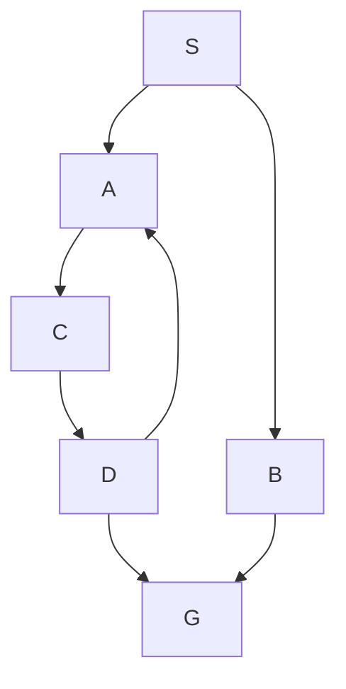
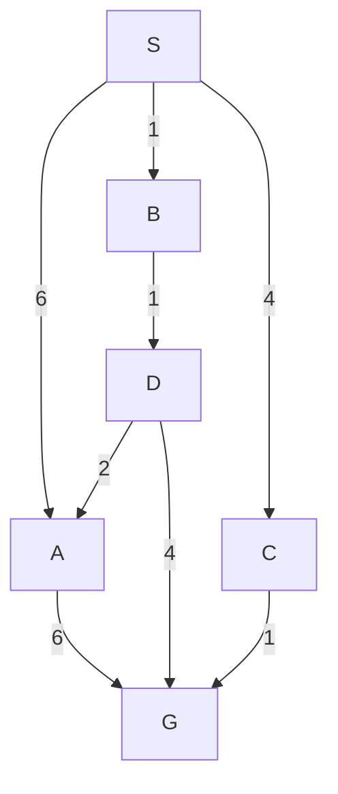
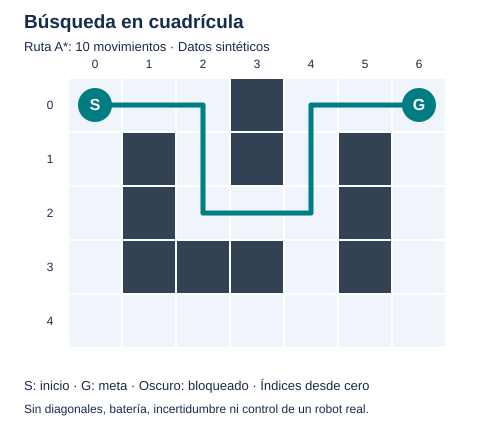

# Unidad 5 — Búsqueda, estados y heurísticas

[Unidad anterior: probabilidad y estadística](../unidad04-probabilidad-estadistica/README.md) · [Volver al índice](../README.md)

Encontrar una secuencia de acciones es un problema diferente de predecir una etiqueta. Si un sistema debe ir de un lugar a otro, ordenar tareas o resolver un rompecabezas, necesita representar situaciones, identificar acciones válidas y explorar sus consecuencias.

Esta unidad introduce búsqueda en espacios de estados. Compararemos BFS, DFS, costo uniforme, búsqueda voraz y A*. Veremos por qué encontrar una solución no significa encontrar la mejor y cómo una heurística puede ayudar o inducir errores.

Los casos y programas son propios, sintéticos y pequeños. No entrenaremos un modelo ni controlaremos un robot real. Primero construiremos el problema y realizaremos trazas a mano; después verificaremos el resultado con Python.

## Objetivos

Al terminar podrás:

- Formular un problema mediante estado inicial, acciones, transición, meta y costos.
- Distinguir un estado de un registro de búsqueda y de un camino.
- Utilizar una frontera y controlar estados repetidos.
- Explicar las diferencias entre explorar por profundidad, pasos, costo y estimación.
- Calcular g, h y f para una búsqueda A*.
- Distinguir heurística admisible y consistente.
- Identificar cuándo debe aceptarse una meta y cuándo reabrir un estado.
- Comparar costo de solución con trabajo de búsqueda.
- Formular una cuadrícula y justificar Manhattan bajo sus condiciones.
- Verificar una implementación y reconocer los límites de su modelo.

## Antes de comenzar

Completa las unidades 0 a 4. Necesitas listas, diccionarios, conjuntos, funciones y bucles. Usaremos `deque`, `heapq` y `itertools` de la biblioteca estándar. No se requieren instalaciones adicionales, GPU ni servicios externos.

Los programas se verificaron con Python 3.12.14 en Linux. Activa tu entorno virtual y ejecuta los comandos desde la raíz del curso. Conserva el orden de los vecinos si quieres reproducir las mismas trazas y desempates.

## 1. Resolver mediante estados y acciones

Supongamos una ruta ficticia desde S hasta G. En cada estado existen movimientos permitidos hacia otros estados. Queremos una secuencia que llegue a G y, si hay costos diferentes, decidir cuál minimiza la suma.

Este es un ejemplo de IA simbólica: representamos entidades, acciones y reglas de transición de manera explícita. Una búsqueda no necesita haber aprendido esas reglas desde datos. En una aplicación pueden combinarse percepción aprendida, búsqueda y reglas, pero cada componente cumple un papel distinto.

| Tarea | Salida principal | Información necesaria |
|---|---|---|
| Clasificar una observación | Etiqueta | Características y modelo o regla |
| Buscar una ruta | Secuencia de movimientos | Estados, transiciones y objetivo |
| Planificar tareas | Secuencia de acciones | Precondiciones, efectos y restricciones |
| Elegir entre alternativas inciertas | Política o decisión contextual | Resultados, probabilidades y consecuencias |

En esta unidad trabajaremos entornos deterministas, conocidos y estáticos: cada acción tiene un resultado definido y el mapa no cambia mientras buscamos. Si hay incertidumbre de movimiento o cambios durante la ejecución, debemos ampliar el modelo; A* sobre un mapa fijo no resuelve por sí solo esa situación.

## 2. Los componentes de un problema de búsqueda

Una formulación incluye:

1. **Estado inicial:** situación desde la que empezamos.
2. **Espacio de estados:** situaciones consideradas por el modelo.
3. **Acciones disponibles:** qué podemos hacer en cada estado.
4. **Transición:** estado resultante de una acción.
5. **Prueba de meta:** condición que identifica una solución.
6. **Costo de cada acción:** cantidad que se suma para evaluar un camino.

| Componente | Grafo de rutas | Cuadrícula |
|---|---|---|
| Estado | Nombre S, A, B, C, D o G | Par fila, columna |
| Inicial | S | Celda marcada S |
| Acciones | Ir a un vecino declarado | Arriba, derecha, abajo, izquierda |
| Transición | Arista dirigida | Celda adyacente transitable |
| Meta | Nombre igual a G | Celda marcada G |
| Costo | Minutos sintéticos por arista | Un movimiento cuesta 1 |

En problemas generales la meta puede ser una condición, como «todas las tareas completadas», y puede haber varias soluciones finales. El núcleo del curso acepta **una meta identificada por nombre**; no debemos atribuirle funciones de planificación que no implementa.

### Un estado debe contener lo necesario para decidir

Si solo importa la posición, `(fila,columna)` puede ser suficiente. Si abrir una puerta requiere una llave, dos situaciones en la misma posición pero con inventarios distintos no son equivalentes.

Si hay límite de batería, el estado podría ser `(fila,columna,bateria)`. Si el costo depende de la hora de llegada, tal vez necesitemos tiempo. Decidir qué incluir depende de las reglas y restricciones del problema, no de una preferencia de programación.

Un estado incompleto puede hacer que el algoritmo descarte como repetida una situación que permitiría otras acciones. Aumentar el detalle sin necesidad, por otro lado, puede multiplicar el espacio de búsqueda.

### Estados legales y movimientos legales

Una celda libre puede existir aunque no sea accesible desde el inicio. Una transición válida debe respetar límites y obstáculos. Tener una meta dentro del mapa no garantiza que exista una ruta hacia ella.

Nuestros grafos son dirigidos: declarar `S → A` no crea automáticamente `A → S`. En la cuadrícula, las reglas generan movimientos de ida y vuelta entre celdas libres adyacentes.

## 3. Estado, camino y registro de búsqueda

Un **camino** es una secuencia de estados conectados por transiciones válidas. Su costo acumulado es:

$$
g=\sum_{i=0}^{k-1}c(s_i,s_{i+1})
$$

Un mismo estado puede alcanzarse por varios caminos. En el grafo de esta unidad llegaremos a A por:

- S → A: costo 6.
- S → B → D → A: costo $1+1+2=4$.

El estado final es el mismo, pero el costo del camino es diferente. Por eso un **registro de búsqueda** incluye estado, costo acumulado y predecesor, además de la prioridad si se utiliza.

No confundas grafo de estados con árbol de exploración. El árbol despliega caminos: puede contener varias apariciones del mismo estado del grafo. Controlar repeticiones evita explorar cíclicamente y, cuando corresponde, conserva la mejor forma conocida de llegar a cada estado.

### Representación del programa

```python
grafo = {
    "S": [("A", 6), ("B", 1), ("C", 4)],
    "A": [("G", 6)],
    # Los demás estados también deben declararse.
}
```

Cada par es `(destino,costo)`. La acción implícita es ir al destino. El laboratorio no admite dos aristas paralelas hacia el mismo destino desde un mismo estado; para varias acciones con efectos distintos necesitaríamos ampliar la representación.

Los nombres deben ser textos no vacíos y cada destino debe existir. Los costos son finitos y no negativos. Aceptamos costo cero porque trabajamos con grafos finitos y mejoras estrictas; no trasladamos esa condición sin revisión a espacios infinitos.

## 4. Frontera, extracción y expansión

La **frontera** contiene registros pendientes. El algoritmo decide cuál extraer, comprueba si es meta y, si no lo es, genera sucesores válidos.

Los términos tienen papeles distintos:

- **Generar:** crear una entrada para la frontera.
- **Extraer:** retirar una entrada según la política.
- **Expandir:** examinar los sucesores de un estado extraído.
- **Aceptar meta:** terminar cuando la condición de meta se cumple bajo la política correcta.

No todos los sucesores se insertan. Una transición hacia un estado ya conocido puede no producir una nueva entrada si no aporta una mejora.

### El esquema general

1. Insertar el estado inicial.
2. Mientras haya registros pendientes, extraer uno.
3. Descartarlo si su información quedó obsoleta, cuando el método lo requiera.
4. Comprobar si es meta.
5. Expandir, actualizar y continuar.
6. Si se vacía la frontera, informar que no se encontró ruta en ese grafo.

En nuestros programas la meta extraída se registra, pero **no se cuenta como expandida**, porque sus vecinos no se examinan. Se documenta esta convención para que las métricas sean comparables.

## 5. BFS: primero las rutas con menos pasos

**BFS**, *breadth-first search*, búsqueda en anchura, utiliza una cola FIFO: primero entra, primero sale. Explora por profundidad del camino, medida en número de acciones.

Usaremos un grafo unitario con un ciclo:



Todos los movimientos cuestan uno. Desde S, el orden de vecinos es A y después B.

| Operación | Frontera después de operar, próxima extracción a la izquierda |
|---|---|
| Inicializar | S |
| Expandir S | A, B |
| Expandir A | B, C |
| Expandir B | C, G |
| Expandir C | G, D |
| Extraer G | Se acepta la ruta S → B → G |

La ruta tiene dos pasos y costo 2. BFS conserva el primer predecesor de cada estado al descubrirlo. El ciclo D → A no causa una repetición infinita porque A ya está registrado.

### Qué garantiza BFS

En un grafo finito con control de estados repetidos, encuentra una solución si existe una alcanzable. La primera meta tiene el menor número de pasos. Si todas las acciones tienen el mismo costo positivo, también minimiza la suma de costos.

Con costos distintos, menor cantidad de acciones no significa menor costo. BFS no compara los números de las aristas para decidir el orden.

La implementación usa `deque.popleft()` para extraer y `append()` para insertar. En una lista, `pop(0)` desplaza elementos; una cola apropiada evita ese trabajo innecesario.

## 6. DFS: seguir una rama antes de cambiar

**DFS**, *depth-first search*, búsqueda en profundidad, utiliza una pila LIFO: último entra, primero sale. Sigue una rama y vuelve a alternativas cuando esa rama no permite continuar.

En el mismo grafo, priorizando el primer vecino declarado:

$$
S\rightarrow A\rightarrow C\rightarrow D\rightarrow G
$$

La solución tiene cuatro pasos y costo 4. Es válida, pero no mínima. El ciclo hacia A se descarta por repetición.

El programa inserta vecinos en orden inverso para que el primero declarado quede arriba de la pila. Esta es una política iterativa que marca estados al insertarlos. Su orden puede diferir de una implementación recursiva que marque en otro momento; el nombre DFS no fija por sí solo todos los desempates y convenciones.

En un grafo finito con estados repetidos controlados, esta DFS puede encontrar una meta alcanzable. En árboles o espacios infinitos, una rama infinita puede impedir explorar una alternativa con solución. No confundas la garantía del ejemplo finito con una garantía general para cualquier problema.

### Laboratorio 1 — Anchura y profundidad

Archivo: [01_bfs_y_dfs.py](ejemplos/01_bfs_y_dfs.py).

```bash
python unidad05-busqueda-heuristicas/ejemplos/01_bfs_y_dfs.py
python unidad05-busqueda-heuristicas/ejemplos/01_bfs_y_dfs.py --traza
```

Resultados:

```text
BFS: ruta=S → B → G; pasos=2; costo=2
DFS: ruta=S → A → C → D → G; pasos=4; costo=4
```

Ambos expanden cuatro estados con esta política, pero no los mismos. Un número igual de expansiones no implica una solución igual de buena.

### Experimenta

- Cambia el orden de vecinos de S a B, A. ¿Qué ruta encuentra DFS?
- Elimina la transición B → G. ¿Qué ocurre con la ruta de BFS?
- Mantén G declarado, pero elimina todas las aristas que llegan a él. Explica la salida sin ruta.
- Añade un ciclo de costo cero. Comprueba por qué no se insertan indefinidamente estados ya conocidos.

## 7. Costo uniforme: elegir el menor g

**UCS**, *uniform-cost search*, búsqueda de costo uniforme, extrae el registro de menor costo acumulado $g$. Con costos no negativos está estrechamente relacionada con Dijkstra; aquí se detiene al extraer la meta, sin necesitar calcular distancias a todos los estados.

Este es el grafo dirigido de [grafo_rutas.json](datos/grafo_rutas.json):



Los costos representan minutos inventados, no mediciones de rutas reales. Algunas alternativas son:

| Camino | Pasos | Costo |
|---|---:|---:|
| S → A → G | 2 | 12 |
| S → C → G | 2 | 5 |
| S → B → D → G | 3 | 6 |
| S → B → D → A → G | 4 | 10 |

BFS elige S → A → G porque esa meta se descubre primero a profundidad dos. UCS elige S → C → G porque su costo 5 es el mínimo.

### Traza manual de UCS

| Estado extraído | g | Efecto principal |
|---|---:|---|
| S | 0 | Inserta A:6, B:1, C:4 |
| B | 1 | Inserta D:2 |
| D | 2 | Mejora A a 4; inserta G:6 |
| C | 4 | Mejora G a 5 |
| A | 4 | Propone G:10, que no mejora 5 |
| G | 5 | Acepta la solución |

El empate C:4 y A:4 se resuelve por orden de inserción: C ya estaba pendiente. Las entradas antiguas A:6 y G:6 pueden permanecer en el heap, pero no representan el mejor costo conocido.

### Generar la meta todavía no basta

Si al expandir S aparece una arista directa a G de costo 10, pero existe S → A → G de costo 2, terminar al **generar** G devolvería una solución peor.

En UCS se acepta la meta al extraer una entrada vigente de costo mínimo. Los costos no negativos permiten esa garantía. Con aristas negativas el razonamiento falla; el programa las rechaza y no implementa Bellman–Ford.

## 8. Heurística: estimar lo que falta

Una **heurística** $h(s)$ estima el costo restante desde el estado s hasta una meta. Debe ser una función disponible durante la búsqueda; no necesariamente se obtiene de aprendizaje automático.

El grafo de rutas incluye:

| Estado | h | Costo óptimo restante h* |
|---|---:|---:|
| S | 5 | 5 |
| A | 1 | 6 |
| B | 4 | 5 |
| C | 1 | 1 |
| D | 3 | 4 |
| G | 0 | 0 |

La tercera columna se calculó resolviendo el pequeño grafo desde cada estado. En un problema grande conocer esos costos exactos puede ser tan difícil como resolver la búsqueda; la heurística debe resultar útil a un costo razonable.

### Unidades compatibles

Si $g$ mide minutos, $h$ debe estimar minutos antes de sumarse. Una distancia en metros no es directamente una estimación de tiempo.

Una cota de tiempo podría surgir de distancia dividida por una velocidad máxima justificada. Si no se conoce ese límite o existen transiciones especiales, no podemos afirmar que sea una cota válida.

## 9. Búsqueda voraz: elegir el menor h

La búsqueda voraz o *greedy best-first* prioriza únicamente $h$. Intenta acercarse a lo que parece la meta, ignorando el costo acumulado al decidir qué extraer.

En nuestro grafo, A y C tienen h=1. El orden de inserción favorece A. Después aparece G con h=0 y se acepta:

$$
S\rightarrow A\rightarrow G,\qquad\text{costo }12
$$

Explora menos en ese caso, pero la ruta cuesta más que la obtenida por UCS. Una heurística admisible no garantiza optimalidad de la búsqueda voraz: falta considerar cuánto se pagó para llegar al estado.

El núcleo permite también mejoras de g y nuevas entradas en la variante voraz. Su prioridad sigue siendo h y termina en la primera meta extraída. Esa política no se convierte en UCS por almacenar costos.

## 10. A*: combinar g y h

**A*** usa:

$$
f=g+h
$$

- $g$: costo del camino recorrido hasta este registro.
- $h$: estimación del costo restante desde su estado.
- $f$: estimación del costo total de completar una solución por ese camino.

Con el grafo de rutas:

| Estado extraído | g | h | f |
|---|---:|---:|---:|
| S | 0 | 5 | 5 |
| B | 1 | 4 | 5 |
| C | 4 | 1 | 5 |
| D | 2 | 3 | 5 |
| G | 5 | 0 | 5 |

Todos empatan en f. Se extraen por orden de inserción. Tras expandir C, aparece G:5; D ya estaba insertado y se extrae antes. D propone A:4, f=5, pero G ya estaba pendiente y se extrae antes que esa nueva entrada.

El resultado es S → C → G, costo 5. A* expande cuatro estados y UCS cinco bajo los desempates incluidos. No afirmamos que A* siempre use menos expansiones o tiempo: una heurística poco informativa, su costo de cálculo, empates y reaperturas pueden cambiar la comparación.

### Heurística cero

Si h es cero en todos los estados, f=g y A* reproduce UCS con la misma política de desempates. Es una referencia útil para comprobar la implementación.

Que h sea mayor puede volverla más informativa, pero aumentar sus valores sin una justificación puede hacer que deje de ser una cota y pierda la garantía de optimalidad.

## 11. Admisibilidad y consistencia

Una heurística **admisible** no sobreestima el costo óptimo restante:

$$
0\le h(s)\le h^*(s)
$$

En la meta su valor es cero. Si un estado no tiene ruta hacia una meta, podemos considerar su costo restante infinito; una estimación finita no lo sobreestima, aunque tampoco indica que exista solución.

Una heurística **consistente** satisface, para cada transición de s a t:

$$
h(s)\le c(s,t)+h(t)
$$

Además exigimos h(meta)=0. A lo largo de cualquier camino hacia la meta, esas desigualdades implican que h no supera el costo de ese camino. Por tanto, la consistencia implica admisibilidad bajo estas condiciones.

### Comprobar en el grafo principal

Para B → D, $h(B)=4\le1+3=4$. Para D → A, $h(D)=3\le2+1=3$. Las demás aristas también cumplen la condición.

La tabla de costos restantes muestra admisibilidad y las desigualdades por arista muestran consistencia. Que todos los valores sean positivos y finitos no demuestra ninguna de las dos propiedades.

### Admisible puede ser inconsistente

En [grafo_reapertura.json](datos/grafo_reapertura.json):

| Transición | Costo |
|---|---:|
| S → A | 2 |
| S → B | 1 |
| B → A | 0.5 |
| A → G | 2 |

Se define h(S)=0, h(A)=0, h(B)=2.5 y h(G)=0. Los costos óptimos restantes son 3.5, 2, 2.5 y 0, respectivamente. Ningún valor sobreestima, pero B → A viola consistencia:

$$
2.5\nleq0.5+0
$$

A* sigue esta secuencia de extracciones válidas:

| Estado | g | h | f | Efecto |
|---|---:|---:|---:|---|
| S | 0 | 0 | 0 | Inserta A:2 y B:3.5 por prioridad f |
| A | 2 | 0 | 2 | Inserta G con g=4 |
| B | 1 | 2.5 | 3.5 | Encuentra A con g=1.5 |
| A | 1.5 | 0 | 1.5 | Se expande de nuevo y mejora G a 3.5 |
| G | 3.5 | 0 | 3.5 | Acepta S → B → A → G |

Si se cerrara A definitivamente tras la primera expansión y se rechazara su mejora, podría devolverse costo 4. La **reapertura** permite conservar optimalidad con esta heurística admisible e inconsistente en el grafo finito.

### Condiciones de la garantía

Para la versión A* de esta unidad trabajamos con grafo finito, costos no negativos, h admisible con cero en la meta, mejoras de g y reaperturas. Aceptamos la meta al extraer una entrada vigente. Bajo esas condiciones y el cálculo matemático de costos, devuelve una solución de costo mínimo si existe.

Una versión que cierre estados definitivamente necesita condiciones más fuertes, como consistencia, para asegurar ese comportamiento. No basta con escribir f=g+h y llamar A* al programa.

En espacios infinitos la terminación requiere otras condiciones: ramificación finita y costos acotados por debajo de un valor positivo son condiciones habituales. Nuestros laboratorios no implementan ese caso.

### Escalar una heurística puede romper la cota

En el grafo de reapertura, multiplicar h por dos cambia h(B) de 2.5 a 5, por encima de su costo restante real 2.5. A* extrae A y después G:4 antes de B:6, y devuelve costo 4 en vez de 3.5.

La reapertura no corrige una meta aceptada demasiado pronto debido a una heurística que sobreestima. Este es un contraejemplo concreto; no significa que toda heurística no admisible produzca siempre una ruta subóptima.

## 12. Cómo está implementado el núcleo

Archivo compartido: [busqueda.py](ejemplos/busqueda.py). Los tres laboratorios lo importan desde su misma carpeta.

### Cola de prioridad y desempates

Una entrada del heap es:

```python
(prioridad, numero_de_insercion, estado, costo_acumulado)
```

`heapq.heappop` extrae la entrada mínima. El contador de inserción deshace empates de forma reproducible y evita usar el nombre del estado como criterio accidental.

La representación interna de un heap no es una lista totalmente ordenada. Las tablas de la explicación presentan el orden lógico de extracción, no una promesa sobre cómo se imprime el arreglo interno.

### Mejor costo conocido

```python
nuevo_g = g + costo
if nuevo_g < mejor_g.get(destino, math.inf):
    mejor_g[destino] = nuevo_g
    # Registrar el camino e insertar una nueva entrada.
```

La mejora es estricta. Una vuelta por un ciclo de costo cero no mejora g y no genera inserciones indefinidas. BFS y DFS utilizan otra política: registran el primer descubrimiento y no intentan mejorar su costo.

### Entradas obsoletas

Actualizar la prioridad de una entrada existente no es necesario aquí. Insertamos una nueva y dejamos la antigua en el heap. Al extraer:

```python
if g != mejor_g[estado]:
    continue
```

La entrada anterior se descarta antes de probar la meta o expandir. Esto es importante tanto para corrección como para interpretar las métricas.

### Conservar el camino de cada registro

`padres` usa claves `(estado,g)` y enlaza el registro predecesor, no solo el nombre del estado. Una mejora posterior no cambia el historial del camino de un registro antiguo.

Esta distinción evita que se reconstruya una ruta con predecesores nuevos pero se informe el costo de una ruta antigua, algo que podría ocurrir en una búsqueda voraz o con una heurística inadecuada. La solución conserva transiciones válidas y un costo coherente con el camino devuelto.

### Qué mide el resultado

| Campo | Convención |
|---|---|
| `camino` | Estados del inicio a la meta, incluidos ambos |
| `costo` | Suma acumulada del camino devuelto; `None` si no hay ruta |
| `extraidos` | Entradas vigentes extraídas, incluida la meta aceptada |
| `expandidos` | Estados cuyos sucesores se examinan; puede repetir nombres si se reabren |
| `generados` | Entradas insertadas, incluida la inicial y mejoras |
| `frontera_maxima` | Máxima cantidad de entradas pendientes, incluidas obsoletas todavía en el heap |

El pico de frontera no mide bytes ni cantidad exacta de estados únicos. Tampoco un número de expansiones determina por sí solo el tiempo de ejecución. Compararemos esas cantidades bajo la misma representación y condiciones.

### Validación y precisión

Se comprueban estados, destinos, costos y valores h. El formato del laboratorio permite hasta 500 estados y 10 000 transiciones; son límites de ejecución, no propiedades matemáticas de los algoritmos.

El núcleo usa números `float`. En los casos incluidos, enteros y 0.5 se representan exactamente en binario. Con otros decimales puede haber redondeo y cambios de desempates. Si un proyecto requiere exactitud de costos, debe elegir una representación numérica apropiada, por ejemplo unidades enteras suficientemente pequeñas.

La validación estructural no demuestra que un mapa sea correcto ni que una heurística represente el mundo. Esa justificación pertenece a la formulación y los datos.

## 13. Laboratorio 2 — Comparar pasos, costo y heurística

Archivo: [02_comparar_rutas.py](ejemplos/02_comparar_rutas.py).

```bash
python unidad05-busqueda-heuristicas/ejemplos/02_comparar_rutas.py
python unidad05-busqueda-heuristicas/ejemplos/02_comparar_rutas.py --traza
```

Resultados con el grafo principal y factor h=1:

| Método | Camino | Costo | Expansiones | Entradas generadas | Pico de frontera |
|---|---|---:|---:|---:|---:|
| BFS | S → A → G | 12 | 4 | 6 | 3 |
| DFS | S → A → G | 12 | 2 | 5 | 3 |
| UCS | S → C → G | 5 | 5 | 8 | 4 |
| Voraz | S → A → G | 12 | 2 | 5 | 3 |
| A* | S → C → G | 5 | 4 | 7 | 3 |

Esta tabla corresponde a los vecinos y desempates incluidos. Menos expansiones no hace mejor la ruta de DFS o voraz según el objetivo de costo mínimo.

Para observar la reapertura:

```bash
python unidad05-busqueda-heuristicas/ejemplos/02_comparar_rutas.py --datos unidad05-busqueda-heuristicas/datos/grafo_reapertura.json --traza
```

Para observar el efecto de sobreestimar:

```bash
python unidad05-busqueda-heuristicas/ejemplos/02_comparar_rutas.py --datos unidad05-busqueda-heuristicas/datos/grafo_reapertura.json --factor-heuristica 2 --traza
```

El factor debe ser finito y no negativo. Se permite una heurística no admisible para estudiar el contraejemplo; el programa informa violaciones de consistencia, pero no afirma optimalidad de cualquier factor aceptado.

### Auditar el pequeño grafo

Archivo: [01_auditar_heuristica.py](soluciones/01_auditar_heuristica.py).

```bash
python unidad05-busqueda-heuristicas/soluciones/01_auditar_heuristica.py
python unidad05-busqueda-heuristicas/soluciones/01_auditar_heuristica.py --datos unidad05-busqueda-heuristicas/datos/grafo_reapertura.json
```

La auditoría resuelve UCS desde cada estado hasta la meta, compara h con ese costo y revisa las aristas. El caso principal es admisible y consistente; el de reapertura es admisible e inconsistente.

Esta comprobación se refiere al grafo declarado. Calcular los costos exactos desde todos sus estados puede ser más caro que una búsqueda aislada; es útil en casos pequeños y pruebas, no una heurística gratuita.

### Experimenta

- Usa factor cero en el caso principal y compara A* con UCS, incluida la traza.
- Cambia el orden A, B, C en los vecinos de S. Explica los efectos de empate.
- Aumenta el costo C → G en una copia. ¿Cuál pasa a ser la ruta de mínimo costo? Revisa también si la heurística conserva sus propiedades.
- Añade un estado sin ruta a la meta y observa cómo lo trata la auditoría.
- Introduce costo negativo, destino inexistente o nombre JSON repetido. Explica el rechazo.

## 14. Cuadrícula y distancia Manhattan

Una posición se representa como `(fila,columna)`. Cada celda es libre o bloqueada. Las acciones permitidas son los cuatro movimientos ortogonales y cada una cuesta uno.

Usamos índices desde cero. El mapa de [cuadricula.txt](datos/cuadricula.txt) tiene cinco filas y siete columnas; S está en `(0,0)` y G en `(0,6)`.



Para este problema definimos Manhattan:

$$
h((r,c))=|r-r_G|+|c-c_G|
$$

Desde `(0,0)` hasta `(0,6)`, h=6. Ignora obstáculos, de modo que calcula el costo en un problema relajado donde se puede recorrer cualquier celda. La ruta del mapa real necesita diez movimientos.

### Por qué aquí es admisible

Cada movimiento cambia una sola coordenada en una unidad. Para compensar la diferencia de filas se necesitan al menos $|r-r_G|$ movimientos, y para columnas al menos $|c-c_G|$. Los obstáculos pueden exigir un rodeo, pero no reducir ese mínimo.

### Por qué aquí es consistente

Entre celdas vecinas Manhattan cambia como máximo una unidad. Por tanto $h(s)\le1+h(t)$, y el costo de esa transición es uno. En la meta h=0.

Si permitimos diagonales de costo uno, desde `(0,0)` a `(1,1)` hay un movimiento, pero Manhattan vale dos: ya no es admisible. Con teletransportes, movimientos especiales o costos menores que uno también debemos reconsiderar la cota.

Para terrenos de costos variables no negativos, puede utilizarse Manhattan multiplicada por una cota inferior válida del costo por movimiento, manteniendo las mismas acciones. Si esa cota es cero, la heurística resultante no aporta más que h=0.

### Laboratorio 3 — Una ruta en el mapa

Archivo: [03_buscar_en_cuadricula.py](ejemplos/03_buscar_en_cuadricula.py).

```bash
python unidad05-busqueda-heuristicas/ejemplos/03_buscar_en_cuadricula.py
python unidad05-busqueda-heuristicas/ejemplos/03_buscar_en_cuadricula.py --traza
```

Resultados:

| Método | Pasos/costo | Expansiones | Entradas generadas | Pico de frontera |
|---|---:|---:|---:|---:|
| BFS | 10 | 20 | 22 | 3 |
| UCS | 10 | 20 | 22 | 3 |
| A* | 10 | 12 | 15 | 3 |

Con costos unitarios, BFS y UCS coinciden bajo el orden de vecinos usado. A* reduce expansiones en este mapa y conserva el costo mínimo.

La ruta es `(0,0),(0,1),(0,2),(1,2),(2,2),(2,3),(2,4),(1,4),(0,4),(0,5),(0,6)`. Hay once estados y diez movimientos; incluir el inicio al contar no crea una acción adicional.

### Leer y convertir el mapa

En el archivo de texto:

- `S`: inicio único.
- `G`: meta única.
- `.`: celda libre.
- `#`: obstáculo.

Se comprueba forma rectangular, símbolos permitidos y presencia de exactamente una S y una G. El programa construye un grafo de todas las celdas transitables. No genera diagonales ni conecta el borde derecho con el izquierdo.

Admite hasta 30 celdas por dimensión y hasta 500 transitables. Materializar todo el grafo facilita comprenderlo; una aplicación grande puede generar vecinos bajo demanda, pero esa optimización no está implementada aquí.

### Guardar una figura propia

```bash
python unidad05-busqueda-heuristicas/ejemplos/03_buscar_en_cuadricula.py --svg resultados/ruta_unidad05.svg
```

El destino debe ser nuevo: se rechaza un archivo ya existente. Si no hay ruta, se informa y no se guarda figura. La figura del curso se generó con el mismo programa y mapa.

### Experimenta

- Bloquea `(2,3)` en una copia. ¿Qué rodeo queda disponible?
- Bloquea `(0,1)` y `(1,0)`. El inicio queda aislado: explica la diferencia entre meta existente y meta alcanzable.
- Cambia una fila a otra longitud. ¿Por qué se rechaza?
- Propón cómo cambiarían estado y acciones si hubiera una llave o batería. No asumas que el programa ya contiene esas reglas.

## 15. Completo, óptimo y eficiente son propiedades distintas

Un algoritmo es **completo** si encuentra una solución cuando existe bajo las condiciones consideradas. Es **óptimo** si devuelve una solución que minimiza el criterio. La **eficiencia** se refiere a recursos como tiempo y memoria.

Para nuestros grafos finitos y sus políticas de repetición:

| Método | Selección | Encuentra meta alcanzable | Garantía sobre solución |
|---|---|---|---|
| BFS | Menor profundidad por cola | Sí | Menor número de pasos |
| DFS | Rama actual por pila | Sí | Sin garantía de mínimo costo o pasos |
| UCS | Menor g | Sí, con costos no negativos | Costo mínimo |
| Voraz | Menor h | Sí en el grafo finito con esta política | Sin garantía de costo mínimo |
| A* | Menor g+h | Sí con las condiciones expuestas | Costo mínimo si h es admisible y se permiten mejoras/reaperturas |

Esas afirmaciones no se trasladan sin cambios a árboles infinitos, búsquedas con cortes de memoria ni métodos que supriman reaperturas.

### Tamaño del espacio y memoria

Con ramificación b y profundidad d, un árbol puede contener aproximadamente $1+b+\cdots+b^d$ registros hasta ese nivel. Para b=3 y d=5, son 364. Añadir profundidad puede aumentar mucho la exploración.

En un grafo explícito de V estados y E aristas, BFS y DFS con control global de repeticiones recorren como máximo cada estado una vez y examinan sus aristas: orden $O(V+E)$. También almacenan registros de estados conocidos. La implementación DFS del curso no tiene memoria limitada solo a la rama actual.

UCS y A* consistente usan heap y pueden conservar varias entradas por estado. Nuestra implementación retiene predecesores históricos y trazas para enseñar el proceso; eso añade memoria. Con heurística inconsistente, A* puede reexpandir y no tiene necesariamente el mismo trabajo que la variante consistente.

### Otras estrategias que conviene reconocer

La **profundización iterativa** repite una búsqueda con límites de profundidad crecientes. Un corte de profundidad no demuestra ausencia de solución; solo indica que no se encontró dentro del límite explorado. Bajo condiciones apropiadas puede encontrar soluciones de menor profundidad sin mantener toda la frontera de BFS.

La **búsqueda por haz** conserva solo un número limitado de alternativas y descarta otras. Puede ahorrar recursos y perder tanto completitud como optimalidad. Estas estrategias se presentan para reconocer sus decisiones; no están implementadas en los laboratorios de esta unidad.

## 16. Verificar antes de interpretar

El material incluye [pruebas de corrección](pruebas/test_busqueda.py). Ejecuta:

```bash
python -m unittest discover -s unidad05-busqueda-heuristicas/pruebas -v
```

Las siete pruebas verifican meta al extraer, reapertura, reconstrucción de registros históricos, ciclos de costo cero, falta de ruta, inicio igual a meta y rechazo de costos inválidos. También comparan UCS y A* con una referencia que enumera caminos simples en veinte grafos pequeños reproducibles.

La enumeración es independiente de la cola de prioridad del núcleo. Con costos no negativos, si existe un camino mínimo puede elegirse uno sin ciclos; por eso enumerar caminos simples sirve como referencia en esos grafos diminutos. No se usa como algoritmo eficiente para casos grandes.

Pasar estas pruebas sustenta los casos verificados y detecta regresiones concretas. No demuestra formalmente corrección para toda entrada ni confirma que un entorno real coincida con el modelo.

### Qué falta para una aplicación real

Un robot requiere ubicación, mapa, tamaño físico, detección de obstáculos, control y manejo de cambios. Una ruta de celdas libres no garantiza espacio de paso para su cuerpo ni seguridad de una trayectoria.

Una planificación educativa requiere tareas, precondiciones, tiempos, recursos y restricciones pertinentes. Convertir nombres de tareas en nodos no resuelve automáticamente todas esas condiciones.

Este laboratorio apoya la comprensión del componente de búsqueda. La formulación, la validación del entorno y la evaluación siguen siendo necesarias para integrarlo en un proyecto.

## 17. Ejercicios

Resuelve primero a mano. Declara el orden de vecinos y de desempates al escribir trazas.

1. **Formulación.** Un robot debe recoger una llave y llegar a una puerta. Define estado inicial, estado, acciones, transición, prueba de meta y costo. Explica por qué posición sola puede ser insuficiente.
2. **BFS y DFS.** Reproduce las fronteras del grafo unitario del Laboratorio 1. Indica qué estados se expanden, la ruta y número de pasos de cada método. Cambia el orden inicial B, A y analiza DFS.
3. **Objetivo.** En el grafo de rutas, calcula todos los caminos simples de S a G y sus costos. ¿Cuál devuelve BFS con el orden incluido? ¿Qué ruta minimiza minutos?
4. **UCS.** Escribe su traza y señala cuándo A y G mejoran. Explica por qué generar G no basta para terminar.
5. **A*.** Calcula g, h y f de las entradas extraídas del caso principal. Explica los empates y por qué no se expande A antes de aceptar G.
6. **Heurística.** Comprueba todas las desigualdades de consistencia del grafo principal. Usa los costos restantes para revisar admisibilidad. Explica la relación entre ambas propiedades.
7. **Reapertura.** Sigue el segundo grafo con h(B)=2.5. Después usa h(B)=5. Compara rutas y explica qué garantía se conserva o se pierde.
8. **Cuadrícula.** Calcula Manhattan desde `(2,2)` a `(0,6)` y comprueba el costo real de una ruta desde esa celda. Explica por qué permitir una diagonal de costo uno puede invalidar Manhattan.
9. **Casos límite.** Describe la salida esperada para inicio igual a meta, meta aislada, ciclo de costo cero y costo negativo. Distingue búsqueda sin solución de entrada inválida.
10. **Comparación.** Diseña un informe que distinga costo de ruta, pasos, expansiones, entradas generadas y pico de frontera. Explica por qué dos valores iguales no demuestran que los algoritmos hicieron lo mismo ni que sean igual de rápidos.

Consulta las [soluciones comentadas](soluciones/README.md) después de documentar tu intento.

## 18. Reto aplicado — Modelar y comparar una búsqueda

Completa el [reto y su rúbrica](reto.md) mediante un escenario sintético de rutas, tareas o sensores. Utiliza la [plantilla de informe](plantillas/informe_busqueda.md) para documentar modelo, algoritmos, heurística, pruebas y límites.

El resultado debe permitir reconstruir una búsqueda, justificar el criterio de solución y distinguir propiedades comprobadas en el modelo de afirmaciones sobre el entorno real.

## 19. Errores frecuentes

| Error | Cómo corregirlo |
|---|---|
| Confundir estado y camino | Registrar también costo y predecesor de cada entrada |
| Omitir llave, batería o tiempo necesarios | Diseñar un estado que distinga futuros diferentes |
| Crear automáticamente aristas de vuelta | Declarar la dirección de cada transición |
| Usar BFS para minimizar costos distintos | Comparar con UCS y justificar el objetivo |
| Terminar al generar la meta en UCS o A* | Aceptar una entrada vigente al extraer |
| Marcar definitivamente un estado de A* con h inconsistente | Permitir mejoras y reaperturas |
| Expandir entradas antiguas del heap | Descartarlas según el mejor g conocido |
| Sumar distancia a minutos | Expresar g y h en unidades compatibles |
| Afirmar admisibilidad porque h parece pequeña | Comparar con una cota demostrada o costos exactos del caso pequeño |
| Escalar h sin revisar propiedades | Auditar y mostrar el efecto sobre la solución |
| Usar Manhattan con diagonales baratas | Derivar una cota válida para las acciones nuevas |
| Medir frontera como si fueran bytes | Indicar la convención y medir memoria si hace falta |
| Confundir corte y ausencia de ruta | Precisar qué parte del espacio se exploró |
| Atribuir navegación real al mapa sintético | Validar percepción, geometría y control por separado |

## Checklist

- [ ] Defino estado, inicio, acciones, transición, meta y costo.
- [ ] Justifico qué información distingue situaciones relevantes.
- [ ] Comprendo cola, pila y cola de prioridad.
- [ ] Diferencio generar, extraer y expandir.
- [ ] Explico qué optimiza BFS y qué optimiza UCS.
- [ ] Calculo g, h y f sin mezclar unidades.
- [ ] Distingo admisibilidad y consistencia.
- [ ] Comprendo cuándo reabrir y descartar registros obsoletos.
- [ ] Reconstruyo una ruta y compruebo su costo.
- [ ] Justifico Manhattan con las acciones del mapa.
- [ ] Registro desempates, métricas y condiciones de comparación.
- [ ] Diferencio corrección del programa, validez del modelo y utilidad real.

## Resumen

La búsqueda transforma una formulación de estados y acciones en una secuencia que alcanza una meta. La política de frontera determina qué alternativas se exploran primero. BFS prioriza pasos; UCS, costo acumulado; voraz, estimación restante; A*, la suma de costo y estimación.

Las garantías dependen de costos, espacio de estados, heurística y manejo de repeticiones. Los laboratorios mostraron rutas válidas pero costosas, una solución de costo mínimo, reapertura con heurística inconsistente y el efecto de una cota que sobreestima.

La siguiente unidad de la ruta estudia **conocimiento, reglas y restricciones**. Consulta su disponibilidad en el índice.

## Referencias y lecturas

Los grafos, mapa, programas, figura, pruebas y desarrollos numéricos son material educativo propio. Las lecturas siguientes permiten ampliar las estrategias y documentan las estructuras utilizadas.

1. UC Berkeley, CS 188. [Búsqueda no informada](https://inst.eecs.berkeley.edu/~cs188/textbook/search/uninformed.html).
2. UC Berkeley, CS 188. [Búsqueda informada y heurísticas](https://inst.eecs.berkeley.edu/~cs188/textbook/search/informed.html).
3. Poole, D. L. y Mackworth, A. K. *Artificial Intelligence: Foundations of Computational Agents*, tercera edición. [Búsqueda heurística](https://www.cs.ubc.ca/~poole/aibook/3e/html/ArtInt3e.Ch3.S6.html).
4. Python Software Foundation. [Módulo heapq de Python 3.12](https://docs.python.org/3.12/library/heapq.html).

[Unidad anterior](../unidad04-probabilidad-estadistica/README.md) · [Volver al índice](../README.md)
