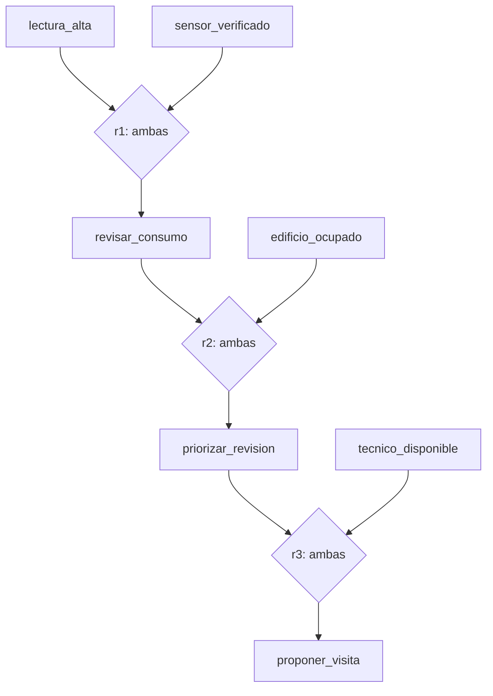

# Unidad 6 — Conocimiento, reglas y restricciones

[Unidad anterior: búsqueda y heurísticas](../unidad05-busqueda-heuristicas/README.md) · [Volver al índice](../README.md)

En la unidad anterior buscamos rutas mediante estados y acciones. Ahora abordaremos dos preguntas diferentes: **¿qué podemos concluir a partir de lo que sabemos?** y **¿qué combinaciones cumplen todas las condiciones de un problema?**

Una aplicación puede reconocer una lectura elevada con un modelo aprendido, explicar una propuesta mediante reglas y organizar las revisiones mediante restricciones. Esos componentes tienen responsabilidades distintas. En esta unidad construiremos los dos últimos con ejemplos pequeños que podamos verificar a mano.

## Objetivos

Al terminar podrás:

- Distinguir observaciones, hechos, reglas, inferencias y acciones.
- Representar conocimiento proposicional con un significado explícito.
- Aplicar reglas con varias condiciones y explicar una conclusión.
- Diferenciar ausencia de evidencia, negación e incompatibilidad declarada.
- Seguir un encadenamiento hacia adelante hasta que no haya hechos nuevos.
- Explicar por qué los ciclos no deben crear conocimiento sin apoyo.
- Formular variables, dominios y restricciones de un CSP.
- Resolver casos pequeños por enumeración y retroceso.
- Comprender el filtrado hacia adelante y la selección MRV.
- Diferenciar una solución válida, una solución preferida y un problema imposible.

## Antes de comenzar

Completa las unidades 0 a 5. Necesitas funciones, listas, diccionarios, conjuntos, bucles y una primera comprensión de recursión. Explicaremos el retroceso mediante una traza antes de leer el código.

Los programas utilizan solo la biblioteca estándar y se verificaron con **Python 3.12.3 en Linux**. No requieren paquetes adicionales, GPU, cuentas ni acceso a Internet. Activa el entorno virtual y ejecuta los comandos desde la raíz del curso. Si tu sistema usa `python3` fuera del entorno, sustituye `python` por ese comando.

Los casos son sintéticos. Las reglas de consumo son decisiones didácticas; los horarios son franjas abstractas. No representan políticas técnicas ni disponibilidades reales.

## 1. Representar antes de razonar

Considera esta observación ficticia: «el consumo registrado supera el umbral que elegimos para el ejercicio». Podemos representarla mediante `lectura_alta`. El símbolo es corto, pero su significado debe estar documentado.

| Elemento | Ejemplo del laboratorio | Pregunta de revisión |
|---|---|---|
| Observación | Una lectura supera un umbral | ¿Cómo se obtuvo y con qué unidad? |
| Hecho inicial | `lectura_alta` | ¿Por qué lo damos por cierto en este caso? |
| Regla | Lectura alta y sensor verificado implican revisar consumo | ¿Quién definió esta condición? |
| Inferencia | `revisar_consumo` | ¿Qué regla y hechos la sostienen? |
| Propuesta | `proponer_visita` | ¿Faltan restricciones operativas? |
| Acción | Programar o realizar una visita | ¿Quién está autorizado a ejecutarla? |

El archivo de práctica empieza en los hechos iniciales: **no lee un sensor ni calcula un umbral**. Por tanto, que produzca una inferencia no verifica la observación que la originó.

Una base de conocimiento reúne hechos y reglas. El motor de inferencia aplica las reglas. Separarlos permite cambiar un caso sin reescribir el algoritmo, aunque también exige validar el archivo y revisar el significado de sus símbolos.

### Una instantánea de un solo caso

En este laboratorio, todos los hechos se refieren a un edificio y un momento ficticios. No mezcles hechos de edificios distintos en el mismo conjunto: podrías usar la lectura de uno y la verificación del sensor de otro para justificar una propuesta incorrecta.

Para varios casos, una opción introductoria es ejecutar el motor por separado para cada caso. Un sistema más general puede usar predicados con argumentos, entidades y tiempos. Ese lenguaje requiere ampliar el motor; escribir `sensor_verificado_edificio_b` solo crea otro símbolo, no le enseña relaciones al programa.

## 2. Proposiciones y conectores

Una proposición expresa algo que puede ser verdadero o falso dentro de una interpretación. Usaremos A para `lectura_alta`, V para `sensor_verificado` y R para `revisar_consumo`.

| Escritura | Lectura |
|---|---|
| A ∧ V | A y V |
| A ∨ V | A o V, incluyendo ambos |
| ¬A | No A |
| A → R | Si A, entonces R |

La regla del ejemplo es `(A ∧ V) → R`. Se necesita **la conjunción completa** para aplicarla. Observar solamente A no basta.

La implicación tampoco autoriza invertir la relación: de R no deducimos A. Podría haber otra razón para revisar el consumo. Tampoco es una relación causal demostrada: en el ejemplo expresa una política de revisión elegida para practicar.

El laboratorio implementa una parte de este lenguaje: reglas de la forma «varios símbolos positivos implican otro símbolo positivo». No implementa negación, cuantificadores, probabilidades ni expresiones arbitrarias. Esta restricción permite comprender y verificar el motor. Amplía las definiciones en [proposiciones y lógica](https://artint.info/3e/html/ArtInt3e.Ch5.S1.html).

## 3. Una base de reglas que podemos recorrer a mano

Archivo: [reglas_revision.json](datos/reglas_revision.json).

Hechos iniciales:

```text
lectura_alta
sensor_verificado
edificio_ocupado
tecnico_disponible
```

| Identificador | Si se conocen todas estas condiciones | Añadir |
|---|---|---|
| r1 | lectura_alta, sensor_verificado | revisar_consumo |
| r2 | revisar_consumo, edificio_ocupado | priorizar_revision |
| r3 | priorizar_revision, tecnico_disponible | proponer_visita |
| r4 | mantenimiento_programado | posponer_visita |

En JSON, una regla se escribe así:

```json
{"id": "r1", "si": ["lectura_alta", "sensor_verificado"], "entonces": "revisar_consumo"}
```

Los identificadores permiten citar la regla en una explicación. `si` representa una conjunción: **todos** sus elementos deben estar presentes. Dos reglas distintas pueden tener la misma conclusión; bastará que una pueda aplicarse.



Cada rombo necesita sus dos entradas. Las flechas muestran dependencias lógicas del ejemplo, no probabilidades ni efectos físicos.

## 4. Encadenamiento hacia adelante

Partimos de los hechos disponibles y añadimos consecuencias. El **cierre** es el conjunto final cuando ninguna regla aporta un hecho nuevo.

1. Copiar los hechos iniciales a `conocidos`.
2. Recorrer las reglas en el orden del archivo.
3. Si todas las condiciones están en `conocidos` y la conclusión todavía no, añadirla y registrar su justificación.
4. Repetir el recorrido si apareció algún hecho nuevo.
5. Terminar cuando un recorrido no añada nada.

En nuestro caso:

| Paso que añade conocimiento | Regla | Hecho nuevo | Total de hechos |
|---|---|---|---:|
| Inicio | — | Cuatro hechos iniciales | 4 |
| 1 | r1 | revisar_consumo | 5 |
| 2 | r2 | priorizar_revision | 6 |
| 3 | r3 | proponer_visita | 7 |

r4 no se aplica: falta `mantenimiento_programado`. Como actualizamos el conjunto inmediatamente, las tres reglas se aplican durante el primer recorrido; el siguiente confirma que no hay novedades. **Paso de derivación y recorrido completo no son lo mismo.**

El núcleo está en [reglas.py](ejemplos/reglas.py):

```python
if regla.conclusion not in conocidos and all(c in conocidos for c in regla.condiciones):
    conocidos.add(regla.conclusion)
```

Un conjunto evita duplicados. Con una cantidad finita de símbolos y reglas positivas que solo añaden hechos, cada cambio incorpora un símbolo antes ausente: el proceso termina. Un ciclo `a → b`, `b → a` no deriva nada sin hechos iniciales que lo activen; con `a` inicial añade `b` una sola vez.

Cambiar el orden de las reglas puede cambiar los recorridos y la primera justificación registrada, pero no el cierre de este motor. No hay prioridades ni retractaciones durante una ejecución. La referencia sobre [cláusulas definidas](https://artint.info/3e/html/ArtInt3e.Ch5.S3.html) desarrolla este tipo de inferencia.

### ¿Y el encadenamiento hacia atrás?

Parte de una consulta y busca reglas capaces de demostrarla, convirtiendo sus condiciones en subobjetivos. Para preguntar por `proponer_visita`, empezaría por r3 y buscaría sus dos apoyos.

Nuestro motor **no implementa ese algoritmo**. Primero calcula el cierre hacia adelante; después recorre la justificación ya guardada. Imprimir un árbol desde la conclusión hacia sus apoyos no convierte la inferencia en encadenamiento hacia atrás.

## 5. Desconocido no significa falso

Retira `sensor_verificado`. Ya no se puede aplicar r1, y tampoco se obtienen las consecuencias de r2 y r3. La conclusión correcta es «no se deriva una propuesta con esta base».

No podemos afirmar «el sensor está defectuoso» ni «es imposible visitar». Puede faltar un registro de verificación o una regla alternativa. El programa no representa explícitamente valores desconocidos: la distinción está en **cómo interpretamos la ausencia de un símbolo**.

En algunos sistemas se adopta una hipótesis de mundo cerrado: lo no registrado se trata como falso para ciertas consultas. Es una decisión del modelo y necesita justificación. Aquí no la usamos para concluir negaciones.

Si escribes `no_sensor_verificado`, el programa lo considera un nombre ordinario. No conoce por su prefijo una negación lógica. Tampoco asigna un porcentaje de confianza a `proponer_visita`.

### Monotonía y cambios de observación

Con las mismas reglas positivas, añadir hechos no elimina conclusiones anteriores. Esta propiedad se llama monotonía. Si retiras un hecho inicial, debes volver a calcular desde la base modificada; borrar solo ese elemento del cierre viejo dejaría consecuencias sin apoyo.

Cada ejecución del laboratorio vuelve a calcular. No implementamos mantenimiento incremental de justificaciones, caducidad de hechos ni excepciones que anulen reglas.

## 6. Detectar propuestas incompatibles

Supón que añadimos `mantenimiento_programado`. r4 deriva `posponer_visita`, mientras las otras reglas siguen derivando `proponer_visita`.

El archivo declara explícitamente que ambas propuestas son incompatibles **para la misma visita del caso**:

```json
"incompatibles": [["proponer_visita", "posponer_visita"]]
```

El motor conserva ambas y emite una señal de revisión. No elige la última, no borra una y no ejecuta una visita. Es una comprobación adicional sobre pares declarados, no un demostrador general de consistencia lógica.

Por eso la salida dice «sin incompatibilidades declaradas activas». Si olvidamos declarar un par, el programa no lo descubrirá por el significado de las palabras. Reglas internamente coherentes también pueden representar una política equivocada.

## 7. Laboratorio 1 — Derivar y explicar una revisión

Archivo: [01_inferir_revision.py](ejemplos/01_inferir_revision.py).

```bash
python unidad06-conocimiento-reglas/ejemplos/01_inferir_revision.py
```

Después de mostrar los hechos iniciales y tres derivaciones, imprime esta explicación:

```text
proponer_visita: por r3
  priorizar_revision: por r2
    revisar_consumo: por r1
      lectura_alta: hecho inicial
      sensor_verificado: hecho inicial
    edificio_ocupado: hecho inicial
  tecnico_disponible: hecho inicial
Sin incompatibilidades declaradas activas.
```

### Cómo leer el programa

- `leer_base` valida el JSON, los identificadores y las condiciones.
- `inferir` calcula hechos derivados, primera justificación, traza e incompatibilidades.
- `explicar` recorre ese registro; conserva una prueba por conclusión, no todas las pruebas posibles.
- `main` aplica los cambios pedidos por argumentos a una copia de los hechos y presenta el resultado.

Se rechazan identificadores de regla repetidos, condiciones vacías, símbolos mal formados y pares de incompatibilidad inválidos. El formato del motor es deliberadamente pequeño. Los detalles de cada campo están en la [documentación de los datos](datos/README.md).

### Experimenta

Predice el resultado antes de ejecutar:

```bash
python unidad06-conocimiento-reglas/ejemplos/01_inferir_revision.py --quitar sensor_verificado
python unidad06-conocimiento-reglas/ejemplos/01_inferir_revision.py --agregar mantenimiento_programado
python unidad06-conocimiento-reglas/ejemplos/01_inferir_revision.py --consulta posponer_visita
```

1. En el primer caso, explica por qué no se deriva `proponer_visita` sin afirmar que su negación quedó probada.
2. En el segundo, localiza las reglas que sostienen las dos propuestas incompatibles.
3. En el tercero, distingue una consulta sin apoyo de un archivo inválido.
4. En una copia del JSON, invierte el orden de las reglas. Compara el conjunto final y la traza.
5. Añade un ciclo entre dos símbolos nuevos, sin hechos iniciales que los activen. Comprueba que el motor no los inventa.

Las opciones `--agregar` y `--quitar` pueden repetirse y no escriben en el archivo original. Un conflicto es un resultado del análisis y conserva código de salida 0; una entrada inválida devuelve 2. Así se distingue contenido problemático de una ejecución fallida.

## 8. De las reglas a las restricciones

Ahora debemos asignar tres talleres a tres franjas. Derivar una propuesta no determina cómo distribuirlos. Un **problema de satisfacción de restricciones**, o CSP por sus siglas en inglés, se formula con variables, dominios y condiciones que deben cumplirse simultáneamente. Consulta la [introducción de CS 188](https://inst.eecs.berkeley.edu/~cs188/textbook/csp/csps.html).

| Componente | Nuestro problema |
|---|---|
| Variables | `datos`, `reglas`, `revision` |
| Significado de cada variable | Franja en que ocurre ese taller |
| Dominio inicial de cada una | 1, 2, 3 |
| Precedencia | `datos < reglas` |
| Separación | `datos != revision`, `reglas != revision` |
| Solución | Asignar todas las variables y cumplir las tres restricciones |

Cada taller ocupa una franja completa. Todos usan un mismo recurso, de modo que no pueden coincidir. La condición `datos < reglas` ya impide que esos dos talleres tengan la misma franja; no hace falta repetir su desigualdad.

El nombre `revision` no obliga a ponerla al final: **solo las restricciones escritas tienen efecto**. Puedes imaginarla como revisión de un material anterior, independiente de los otros talleres. Si quieres que revise lo aprendido en ambos, debes añadir `reglas < revision` y documentar el cambio de problema.

### Duras y blandas

Una restricción dura es obligatoria. Una preferencia, como «conviene terminar temprano» o «se prefiere revisión en la tercera franja», necesita una puntuación o un objetivo si queremos optimizarla.

El laboratorio resuelve satisfacción y enumera todas las soluciones. No tiene función de costo; **la primera solución no es por eso la mejor**. Para optimizar necesitaríamos definir un criterio y comparar las soluciones con él.

## 9. Enumerar antes de optimizar la búsqueda

Con tres valores por variable, existen `3 × 3 × 3 = 27` asignaciones completas antes de filtrar. Algunas son inválidas:

| datos | reglas | revision | Resultado |
|---:|---:|---:|---|
| 1 | 1 | 3 | Inválida: datos no precede a reglas |
| 1 | 2 | 2 | Inválida: reglas coincide con revisión |
| 1 | 2 | 3 | Válida |
| 2 | 3 | 1 | Válida con las condiciones declaradas |
| 3 | 2 | 1 | Inválida: precedencia invertida |

La línea base genera el producto cartesiano de los dominios con `itertools.product` y comprueba cada asignación completa. Es fácil de revisar y costosa al crecer: con n variables y d valores por variable aparecen `d**n` combinaciones.

Para este caso pequeño podemos justificar las **tres soluciones** sin programa:

1. Si `datos=1`, `reglas` puede ser 2 o 3. La revisión ocupa la franja restante: `(1,2,3)` y `(1,3,2)`.
2. Si `datos=2`, solo `reglas=3` cumple la precedencia; queda revisión en 1: `(2,3,1)`.
3. Si `datos=3`, ninguna franja disponible puede asignarse a reglas.

Las tuplas están en el orden `(datos, reglas, revision)`. Esta enumeración manual será nuestra primera referencia.

## 10. Retroceso: construir y descartar asignaciones parciales

El **retroceso**, o *backtracking*, asigna una variable cada vez y abandona una rama cuando ya incumple alguna restricción. Al volver, prueba otra alternativa. En este modelo finito, explorar todas las ramas permitidas sin cortes permite encontrar todas las soluciones. La [lectura sobre resolución de CSP](https://inst.eecs.berkeley.edu/~cs188/textbook/csp/solving.html) amplía la estrategia.

Una traza inicial con orden fijo es:

```text
{}
  datos=1                         parcial aceptable
    reglas=1                      rechazar: 1 < 1 no se cumple
    reglas=2                      parcial aceptable
      revision=1                  rechazar: coincide con datos
      revision=2                  rechazar: coincide con reglas
      revision=3                  solución
    reglas=3                      probar ahora otra rama
```

Las sangrías muestran niveles de decisión. Al terminar una rama, regresamos a la llamada anterior. El programa crea un diccionario nuevo para cada extensión, por lo que una asignación descartada no contamina sus alternativas.

### Parcial aceptable no significa solución

Con `datos=3`, la restricción `datos < reglas` aún no se puede evaluar en una asignación donde falta `reglas`. El verificador de pares asignados acepta provisionalmente la parcial; eso no significa que exista una extensión válida. El siguiente mecanismo detectará ese callejón sin salida antes.

El núcleo [restricciones.py](ejemplos/restricciones.py) separa `compatible`, que evalúa las restricciones cuyos dos extremos tienen valor, de `resolver`, que construye asignaciones y comprueba que estén completas antes de guardarlas.

## 11. Filtrar dominios y elegir la variable

### Filtrado hacia adelante

Después de una asignación, podemos descartar de los dominios restantes los valores incompatibles con lo ya asignado. Si una variable se queda sin valores, la rama no puede completarse. Esta es la idea de *forward checking*; consulta [filtrado de dominios](https://inst.eecs.berkeley.edu/~cs188/textbook/csp/filtering.html).

En el laboratorio recalculamos esos dominios temporales para cada llamada:

| Parcial | Valores posibles de reglas | Valores posibles de revisión | Decisión |
|---|---|---|---|
| datos=1 | 2, 3 | 2, 3 | Continuar |
| datos=2 | 3 | 1, 3 | Continuar |
| datos=3 | ninguno | 1, 2 | Podar |
| datos=1, reglas=2 | ya asignada | 3 | Completar |

No basta con que todos los dominios restantes sean no vacíos para garantizar solución: todavía puede haber conflictos entre variables sin asignar. El caso de tres talleres y solo dos franjas lo mostrará.

Nuestro filtrado no implementa consistencia de arcos ni AC-3. Esos métodos propagan información entre dominios de variables todavía no asignadas. Reconoce la diferencia sin atribuirla al código del laboratorio.

### MRV: la variable con menos valores disponibles

La heurística **MRV**, *minimum remaining values*, selecciona la variable pendiente con menos valores compatibles con la parcial actual. Si hay empate, este programa respeta el orden del archivo. Los valores conservan también su orden original. Consulta [orden de variables y valores](https://inst.eecs.berkeley.edu/~cs188/textbook/csp/ordering.html).

MRV y filtrado son decisiones separadas. El programa permite orden fijo o MRV, con o sin poda. Incluso con `--sin-poda`, MRV calcula valores compatibles para elegir variable; después intenta los valores del dominio original y rechaza los incompatibles.

En nuestro caso principal, MRV y el orden fijo eligen las mismas variables. La reducción de intentos observada se debe al filtrado. **Este ejemplo no demuestra una mejora adicional por MRV**. Para experimentar, cambia en una copia el dominio de revisión a `[1]` y el de reglas a `[2,3]`: MRV comenzará por revisión, mientras el orden fijo comenzará por datos.

## 12. Laboratorio 2 — Organizar talleres y comparar métodos

Archivo: [02_organizar_talleres.py](ejemplos/02_organizar_talleres.py). Datos: [horarios.json](datos/horarios.json).

```bash
python unidad06-conocimiento-reglas/ejemplos/02_organizar_talleres.py
python unidad06-conocimiento-reglas/ejemplos/02_organizar_talleres.py --orden fija --sin-poda
python unidad06-conocimiento-reglas/ejemplos/02_organizar_talleres.py --traza
```

La primera ejecución imprime:

```text
Enumeración: 27 asignaciones completas evaluadas.
Retroceso: orden=mrv; poda=True; intentos=9.
Soluciones: 3; coinciden con la línea base.
1. datos=1; reglas=2; revision=3
2. datos=1; reglas=3; revision=2
3. datos=2; reglas=3; revision=1
```

| Método | Asignaciones completas evaluadas por enumeración | Intentos de asignar un valor en retroceso | Soluciones |
|---|---:|---:|---:|
| Enumeración | 27 | No aplica | 3 |
| Orden fijo, sin poda de dominios | No aplica | 21 | 3 |
| Orden fijo, con poda | No aplica | 9 | 3 |
| MRV, con poda | No aplica | 9 | 3 |

Los contadores tienen significados distintos. Un intento de retroceso es una propuesta `variable=valor` realizada en el bucle de búsqueda, sea aceptada o rechazada. No cuenta por separado las comprobaciones realizadas al filtrar dominios o elegir con MRV. Por tanto, **9 frente a 27 no demuestra que el programa sea tres veces más rápido**.

### Leer el recorrido del programa

1. `leer_problema` valida variables, dominios enteros y operadores.
2. `enumerar` calcula la línea base.
3. `resolver` genera soluciones y traza con la configuración elegida.
4. El programa compara conjuntos completos de soluciones, sin depender de su orden.
5. Solo después presenta los resultados.

Los dos métodos comparten `compatible`; una equivocación en esa función podría afectar a ambos. Por eso las pruebas incluyen otra referencia que evalúa directamente las restricciones sin llamar a `compatible`, además del resultado manual anterior.

### Experimenta

- Añade `reglas < revision` en una copia. Debe quedar solo `(1,2,3)`.
- Restringe revisión a la franja 1. Predice cuántas soluciones quedan.
- Cambia el orden de las variables y compara trazas conservando las mismas restricciones.
- Quita una restricción de separación. Explica qué solución antes inválida puede aparecer y por qué ya representa otro problema.
- Usa `--orden fija` con poda para comprobar que MRV no explica por sí sola el cambio de 21 a 9 intentos.

El programa acepta entre una y ocho variables, hasta ocho enteros distintos por dominio y los operadores `!=` y `<` entre variables diferentes. El comando rechaza problemas de más de 100000 combinaciones completas para limitar el tamaño del laboratorio. No es un solucionador industrial de horarios, duraciones o capacidades.

## 13. Un problema sin solución también enseña

Archivo: [horarios_imposibles.json](datos/horarios_imposibles.json).

```bash
python unidad06-conocimiento-reglas/ejemplos/02_organizar_talleres.py --datos unidad06-conocimiento-reglas/datos/horarios_imposibles.json
```

Se evalúan ocho asignaciones completas en la línea base y tres intentos en el retroceso predeterminado. Ambos métodos devuelven **cero soluciones**.

La explicación es estructural: tres talleres deben ocupar franjas diferentes, pero solo existen dos. Si asignamos datos en 1 y reglas en 2, revisión no tiene dónde ir. Si asignamos datos en 2, reglas ya no puede ir después.

Un dominio vacío también representa imposibilidad dentro del modelo; es distinto de un nombre de variable desconocido o un operador no admitido, que son entradas inválidas.

El programa informa «sin solución» tras agotar la búsqueda, sin corte por tiempo. No confunde una interrupción con una prueba de imposibilidad. Un caso rechazado por el límite de tamaño tampoco se declara imposible.

Modificar una condición puede hacer viable un caso, pero exige explicar la nueva decisión: añadir una tercera franja es distinto de permitir dos talleres simultáneos. El algoritmo no determina qué cambio es aceptable para una organización.

## 14. Comprobar corrección y revisar el modelo

Ejecuta las [pruebas de la unidad](pruebas/test_conocimiento.py):

```bash
python -m unittest discover -s unidad06-conocimiento-reglas/pruebas -v
```

Las 15 pruebas incluyen cadenas de reglas, conjunciones incompletas, ciclos, incompatibilidades, cambios de orden, retirada de hechos, soluciones conocidas, dominios vacíos, datos inválidos y ausencia de mutación de las entradas.

Dos comparaciones refuerzan la revisión:

- **Reglas:** se generan 30 bases pequeñas reproducibles sobre cuatro átomos. Se enumeran las 16 interpretaciones posibles y se comprueba qué átomos son verdaderos en todos los modelos de cada base; deben coincidir con el cierre.
- **Restricciones:** se generan 30 problemas pequeños reproducibles y se compara el conjunto de soluciones de las cuatro configuraciones de retroceso con una enumeración independiente.

Estas pruebas cubren casos concretos; no sustituyen revisar si el conocimiento es correcto para una aplicación real. Mantén tres preguntas separadas:

| Nivel | Pregunta |
|---|---|
| Programa | ¿Aplica correctamente las reglas y restricciones declaradas? |
| Modelo | ¿Las declaraciones representan el problema que queríamos resolver? |
| Uso | ¿La propuesta resulta útil y apropiada en su contexto? |

## 15. Ejercicios

Resuelve a mano antes de abrir las soluciones.

1. **Representación.** Distingue una lectura de 18 kWh, el hecho `lectura_alta`, la regla r1 y `proponer_visita`. Explica qué validación de datos no realiza el laboratorio.
2. **Conjunción.** Con solo `lectura_alta` y `edificio_ocupado`, ¿qué reglas del archivo se aplican? ¿Puedes afirmar que el sensor no está verificado?
3. **Dirección.** Partiendo únicamente de `proponer_visita`, ¿puedes obtener `lectura_alta`? Explica por qué no se deben invertir las reglas.
4. **Ciclo y orden.** Traza `a → b`, `b → c`, `c → a` primero sin hechos y después con `a`. Invierte el orden y compara el cierre.
5. **Conflicto.** Añade mantenimiento al caso principal. Identifica las dos pruebas que sostienen la incompatibilidad y propone qué información pedirías antes de resolverla.
6. **Formulación.** Escribe variables, dominios y restricciones del horario. Añade que revisión debe ir después de reglas y enumera las soluciones restantes.
7. **Retroceso.** Explica de dónde salen los 21 intentos sin poda. Diferencia ese contador de las 27 asignaciones completas.
8. **Filtrado.** Para `datos=2`, calcula los dominios temporales antes y después de asignar reglas. Explica por qué un dominio no vacío no garantiza completar todo el horario.
9. **Imposibilidad.** Justifica sin ejecutar por qué tres talleres separados no caben en dos franjas. Propón dos cambios posibles y qué supuesto modifica cada uno.
10. **Preferencias y límites.** Entre las tres soluciones principales, elige una según una preferencia explícita. Explica qué necesitaría el programa para optimizarla y por qué el orden de salida no sirve como criterio de calidad.

Consulta las [soluciones comentadas](soluciones/README.md) después de registrar tu intento.

## 16. Reto aplicado — Propuestas explicables y agenda viable

Completa el [reto y su rúbrica](reto.md) con la [plantilla de informe](plantillas/informe_conocimiento.md). Documentarás reglas para proponer revisiones y un CSP pequeño para organizar actividades, incluyendo un caso sin evidencia suficiente, un conflicto y una agenda imposible.

La conexión entre ambos componentes se documenta en el informe. No hay integración automática que convierta hechos inferidos en variables del horario; si construyes esa extensión, debes especificar y comprobar esa transformación.

## 17. Errores frecuentes

| Error | Corrección |
|---|---|
| Mezclar hechos de varios edificios | Separar casos o ampliar la representación con entidades |
| Interpretar `si` como cualquiera de sus condiciones | Comprobar todas las condiciones |
| Invertir una regla | Usar únicamente la dirección declarada |
| Convertir ausencia en negación | Informar que no se deriva con la base disponible |
| Confundir explicación con probabilidad | Identificar reglas y hechos; no inventar confianza numérica |
| Dejar conclusiones de un hecho retirado | Recalcular el cierre desde los hechos vigentes |
| Resolver un conflicto tomando la última regla | Definir una política justificada fuera de este motor |
| Confundir parcial aceptable con solución | Exigir asignación completa y todas las restricciones |
| Llamar AC-3 al filtrado del laboratorio | Describir su revisión respecto de variables ya asignadas |
| Afirmar que MRV siempre acelera | Medir su costo y separar el efecto de la poda |
| Elegir la primera solución como óptima | Definir y evaluar una función objetivo |
| Dar por imposible un caso que no se ejecutó | Distinguir rechazo, interrupción y búsqueda exhaustiva |

## Checklist

- [ ] Explico qué significa cada símbolo y a qué caso se refiere.
- [ ] Distingo hechos iniciales, reglas y consecuencias.
- [ ] Reconstruyo la primera justificación de una consulta.
- [ ] Explico por qué ausencia no es negación.
- [ ] Reconozco ciclos sin apoyo y pares incompatibles declarados.
- [ ] Recalculo cuando cambian las observaciones iniciales.
- [ ] Formulo variables, dominios y restricciones explícitas.
- [ ] Distingo parcial aceptable, solución y solución preferida.
- [ ] Comparo enumeración y retroceso con contadores bien definidos.
- [ ] Diferencio filtrado hacia adelante, MRV y consistencia de arcos.
- [ ] Justifico al menos un problema sin solución.
- [ ] Ejecuto las pruebas y documento los límites del modelo.

## Resumen

Las reglas positivas permiten obtener consecuencias y conservar una justificación. El motor no decide si los hechos son fiables, no transforma ausencias en negaciones ni ejecuta acciones. Los conflictos solo se detectan para los pares declarados.

Los CSP buscan asignaciones que cumplan condiciones. Enumerar ofrece una referencia pequeña; el retroceso descarta parciales incompatibles y el filtrado puede anticipar ramas inviables. Ninguna solución es óptima sin definir un objetivo.

La siguiente unidad de la ruta es **obtención y comprensión de datos**: estudiaremos de dónde llegan las observaciones que alimentan reglas y modelos. Consulta su disponibilidad en el índice.

## Referencias y lecturas

Los casos, datos, programas, ejercicios y pruebas son desarrollos educativos propios. Las lecturas amplían los conceptos; no necesitas copiarlas ni instalar herramientas para completar la unidad.

1. Poole, D. L. y Mackworth, A. K. *Artificial Intelligence: Foundations of Computational Agents*, tercera edición. [Variables y restricciones](https://artint.info/3e/html/ArtInt3e.Ch4.S1.html), [proposiciones](https://artint.info/3e/html/ArtInt3e.Ch5.S1.html) y [cláusulas definidas](https://artint.info/3e/html/ArtInt3e.Ch5.S3.html).
2. UC Berkeley, CS 188. [Problemas de satisfacción de restricciones](https://inst.eecs.berkeley.edu/~cs188/textbook/csp/csps.html) y [resolución mediante búsqueda](https://inst.eecs.berkeley.edu/~cs188/textbook/csp/solving.html).
3. UC Berkeley, CS 188. [Filtrado](https://inst.eecs.berkeley.edu/~cs188/textbook/csp/filtering.html) y [orden de variables](https://inst.eecs.berkeley.edu/~cs188/textbook/csp/ordering.html).

[Unidad anterior](../unidad05-busqueda-heuristicas/README.md) · [Volver al índice](../README.md)
