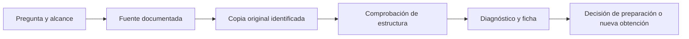

# Unidad 7 — Obtención y comprensión de datos

[Unidad anterior: conocimiento y reglas](../unidad06-conocimiento-reglas/README.md) · [Volver al índice](../README.md)

En la Unidad 6 partimos de hechos ya declarados, como `lectura_alta`. Pero ¿de dónde viene una lectura?, ¿qué representa una fila?, ¿cuándo estuvo disponible?, ¿qué observaciones faltan? Antes de aplicar reglas o entrenar modelos necesitamos responder esas preguntas.

Esta unidad enseña a obtener una copia identificable de los datos, comprender su estructura y producir un diagnóstico inicial. Trabajaremos con lecturas diarias en CSV y eventos con tiempos de disponibilidad en JSON. Primero contaremos casos a mano; después contrastaremos las cuentas con programas que conservan los originales.

## Objetivos

Al terminar podrás:

- Relacionar una fuente de datos con una pregunta y una decisión.
- Definir unidad de observación, población de interés, muestra y cobertura.
- Distinguir formato de archivo, esquema, tipo de dato y significado.
- Registrar procedencia, condiciones de uso, versión y límites de una fuente.
- Leer archivos CSV y JSON con validación explícita de su estructura.
- Distinguir faltantes, valores inválidos, duplicados y claves repetidas.
- Calcular cobertura respecto de un plan de observación declarado.
- Diferenciar cuándo ocurrió un evento y cuándo estuvo disponible.
- Identificar entradas posteriores a la decisión y objetivos que no deben usarse como entradas.
- Elaborar una ficha de datos y decidir qué investigar antes de prepararlos.

## Antes de comenzar

Completa las unidades 0 a 6. Usaremos funciones, diccionarios, conjuntos, archivos y excepciones. Conviene recordar la distinción entre muestra y población de la Unidad 4 y la [ficha de proyecto de la Unidad 2](../unidad02-proyecto-ia/plantillas/ficha_proyecto.md).

Los ejemplos se verificaron con **Python 3.12.3 en Linux**. Solo utilizan la biblioteca estándar: no requieren pandas, GPU, cuentas ni Internet. Ejecuta los comandos desde la raíz del curso con el entorno virtual activo. Fuera del entorno, tu sistema puede requerir `python3` en lugar de `python`.

Los dos archivos son **sintéticos y deliberadamente pequeños**. No contienen datos personales ni observaciones reales. Son casos independientes: el CSV resume días y el JSON representa eventos; no se deben unir como si fueran mediciones equivalentes.

## 1. La pregunta determina qué datos necesitamos

Imagina que queremos revisar registros inusuales de consumo. Esa frase todavía admite varias tareas:

| Pregunta | Unidad de observación posible | Información necesaria |
|---|---|---|
| ¿Qué registros diarios requieren revisión? | Sensor-día | Consumo del periodo, contexto y comprobaciones del registro |
| ¿Qué consumo tendrá mañana un edificio? | Edificio en una fecha de decisión | Historial disponible y objetivo futuro claramente definido |
| ¿Se recibió un evento a tiempo? | Evento emitido por un dispositivo | Tiempo de observación, recepción y límite de decisión |
| ¿Qué edificios están insuficientemente cubiertos? | Edificio o conjunto de sensores | Inventario esperado y observaciones recibidas |

Un archivo que sirve para una pregunta puede no servir para otra. Un consumo diario no explica por sí solo una variación de segundos. Una etiqueta de fallo conocida tras una inspección no estaba necesariamente disponible al enviar una alerta.

Antes de descargar una tabla, completa esta frase:

> Queremos apoyar la decisión ___, tomada por ___ en el instante ___, para los casos ___, usando información que ya estaba disponible entonces.

Para el primer laboratorio, la tarea es **examinar un archivo diario antes de utilizarlo**. No vamos a predecir fallos ni decidir qué edificio consume demasiado.

## 2. Unidad de observación, clave y granularidad

En [lecturas_sinteticas.csv](datos/lecturas_sinteticas.csv), una observación pretendida es el resumen de un sensor durante un día del escenario ficticio. Su clave candidata es el par `(fecha, sensor_id)`.

Una **clave candidata** es un conjunto de campos que se espera identifique una observación. Que la llamemos clave no hace que el archivo cumpla la unicidad: eso debe comprobarse.

```text
2026-09-02,S2,9,20,9
2026-09-02,S2,9,20,9
```

Aquí hay dos registros del archivo, pero ambos pretenden describir el mismo sensor-día. En otro punto aparecen dos valores de consumo para la misma clave. Tendremos que distinguir ambos casos.

La **granularidad** expresa el nivel de detalle de una observación: sensor-día, edificio-mes, evento o documento, por ejemplo. Una suma de consumos por edificio cambia esa granularidad; no es solo cambiar nombres de columnas.

### Evitar multiplicar observaciones al unir tablas

Si una tabla contiene dos filas para una clave y otra contiene tres, una unión por esa clave puede producir seis combinaciones. Antes de unir, pregunta si la relación esperada es uno a uno, uno a muchos o muchos a muchos.

No haremos uniones en esta práctica. Detectar claves repetidas es parte de la preparación conceptual necesaria para construirlas correctamente después.

## 3. Población de interés, muestra y cobertura

La población de interés es el conjunto de casos sobre el que queremos responder. Los datos disponibles pueden cubrir solo una parte, por razones de selección, fallos de captura o disponibilidad.

En el CSV fijamos un **plan de observación** de tres sensores ficticios, S1, S2 y S3, durante cuatro días, del 1 al 4 de septiembre de 2026. Se esperan:

$$
3\ \text{sensores}\times4\ \text{días}=12\ \text{claves sensor-día}
$$

El archivo también tiene doce filas, pero esa coincidencia no demuestra cobertura completa. Para medir presencia de claves, eliminamos repeticiones solo en un conjunto auxiliar de conteo, sin borrar registros del archivo.

La cobertura depende de un denominador explícito. Si no sabemos qué sensores debían reportar ni en qué días, podemos contar lo observado, pero no deducir cuántos casos faltan.

### Cobertura no equivale a representatividad

Un inventario completo de tres sensores no demuestra que esos sensores representen a todos los edificios. Asimismo, datos recogidos solo en horas laborales pueden omitir otros patrones aunque no tengan celdas vacías.

El perfil técnico describe el archivo. La representatividad exige examinar cómo se eligieron los casos y a qué contexto se pretende extender una conclusión. Nuestros valores sintéticos no permiten estimar propiedades de una población real.

## 4. Fuentes y formas de obtención

| Fuente | Qué conviene conservar | Pregunta antes de usarla |
|---|---|---|
| Archivo de una organización | Responsable, fecha de exportación y consulta que lo produjo | ¿Qué filtros y transformaciones se aplicaron? |
| Portal de datos públicos | URL del conjunto, versión, documentación y condiciones declaradas | ¿Qué cobertura y actualizaciones ofrece? |
| API | Endpoint, parámetros, paginación y momento de consulta | ¿Recibimos todos los resultados o solo una página? |
| Base de datos | Consulta y versión o instantánea pertinente | ¿Qué representa cada tabla y cada relación? |
| Sensores | Dispositivo, unidad, frecuencia y tiempos de recepción | ¿Qué pasa si el equipo pierde conexión? |
| Datos sintéticos | Método de construcción y propósito | ¿Qué mecanismo enseñan y qué conclusiones no sustentan? |

Un recurso visible en Internet necesita revisión de sus condiciones de uso y de su documentación. En la ficha registra la información comprobada y los permisos que sigan pendientes; no inventes una licencia ni una autorización.

No se necesita recopilar nombres, identificadores personales o información sensible para practicar este diagnóstico. Elige los campos que realmente requiere el problema y documenta quién podrá acceder a la copia.

### Flujo de adquisición reproducible



Al obtener datos reales, registra consulta o URL, parámetros, versión, fecha de extracción, formato y responsable. Conserva una copia original cuando las condiciones de uso lo permitan. Si una API pagina, registra cómo se recorrieron sus páginas; un resultado válido con cien elementos no implica que solo existan cien.

Aquí obtenemos los archivos desde la carpeta `datos` incluida en el repositorio. El JSON simula una exportación; **no se conecta a una API**. Esto permite estudiar la estructura y repetir el análisis sin depender de un servicio externo.

## 5. Formato, esquema y significado son capas diferentes

CSV y JSON describen cómo se serializa información. No garantizan por sí mismos su interpretación.

| Capa | Pregunta | Ejemplo |
|---|---|---|
| Formato | ¿Cómo leo los bytes? | CSV UTF-8 separado por comas |
| Esquema | ¿Qué campos espero y de qué tipo? | fecha, sensor, consumo, temperatura y horas |
| Semántica | ¿Qué significa cada valor? | Energía del día, en kWh, no potencia en kW |
| Contexto | ¿Para qué sirve esa observación? | Revisar un registro de un sensor-día |

`12` podría ser energía, temperatura, una categoría o parte de un identificador. Un identificador como `0012` no debe convertirse a número solo porque contiene dígitos: podría perder ceros significativos.

La documentación del [modelo tabular de W3C](https://www.w3.org/TR/tabular-data-model/) distingue la tabla y sus metadatos. En nuestros ejemplos usaremos un diccionario de campos explícito, sin implementar todo ese estándar.

## 6. Leer un CSV con cuidado

El CSV del laboratorio usa encabezado, comas, punto decimal y UTF-8. Sus campos están descritos en la [documentación de datos](datos/README.md).

| Campo | Tipo interpretado | Significado | Condición del ejemplo |
|---|---|---|---|
| `fecha` | Fecha | Día del resumen | AAAA-MM-DD válido |
| `sensor_id` | Texto | Identificador del sensor | No vacío; S1–S3 son los esperados |
| `consumo_kwh` | Número | Energía del día | Finito y mayor o igual que cero |
| `temperatura_c` | Número | Temperatura media del día | Finito; sin umbral de plausibilidad implementado |
| `horas_uso` | Número | Horas de uso declaradas | Entre 0 y 24, inclusive |

La biblioteca `csv` interpreta separadores y comillas; no conviene usar `linea.split(',')`, porque un campo entre comillas puede contener comas. El lector devuelve texto y no deduce automáticamente fechas o unidades. Consulta la [documentación oficial de csv](https://docs.python.org/3.12/library/csv.html).

Nuestro lector:

1. Lee los bytes una sola vez para analizarlos y calcular su huella.
2. Decodifica UTF-8, admitiendo un marcador BOM inicial.
3. Comprueba que las cinco columnas aparezcan una sola vez; admite otro orden.
4. Rechaza registros con distinta cantidad de campos o comillas mal cerradas.
5. Conserva los valores como texto original para el diagnóstico.

Después interpreta cada celda según el esquema. A diferencia de un encabezado roto, una celda numérica inválida se **registra como incidencia** y no aborta todo el perfil. Esta decisión permite observar los problemas presentes antes de corregirlos.

Los números de registro empiezan en 1 después del encabezado. No son necesariamente números de línea física: CSV permite saltos de línea dentro de campos entre comillas.

## 7. Faltante, inválido y cero

Para los archivos de esta práctica, se consideran faltantes una cadena vacía y el marcador exacto `NA`, después de interpretar espacios exteriores.

| Texto en consumo | Interpretación | Motivo |
|---|---|---|
| `0` | Válido | Cero es un valor, no ausencia |
| Celda vacía | Faltante | No se declaró un valor |
| `NA` | Faltante | Es el marcador acordado |
| `-2` | Inválido | Contradice el consumo no negativo de este esquema |
| `NaN` o `inf` | Inválido | No son mediciones finitas admitidas |
| `1,2` dentro de un campo | Inválido | El esquema usa punto decimal |

La convención depende del campo: una temperatura de −2 °C puede ser válida, aunque un consumo negativo no lo sea bajo este modelo. Una aplicación que registre energía neta exportada podría permitir negativos; necesitaría otra definición.

Interpretar espacios o tipos no cambia la copia original. Tampoco imputamos ceros, borramos filas ni elegimos cuál de dos valores conflictivos es correcto. Esas decisiones deben justificarse en la Unidad 8.

Para cada columna se cumple:

$$
\text{válidos}+\text{faltantes}+\text{inválidos}=\text{número de registros}
$$

Los conteos incluyen filas repetidas porque describen el archivo recibido. El porcentaje de celdas faltantes no debe confundirse con el porcentaje de observaciones esperadas ausentes.

## 8. Duplicados y claves repetidas

Dos comparaciones responden a preguntas distintas:

- **Duplicado exacto de registro:** todos los textos de las cinco celdas coinciden después de leer el CSV. Cuenta las apariciones adicionales a la primera.
- **Clave repetida:** varias filas comparten fecha interpretada y sensor. Sus demás textos pueden coincidir o ser diferentes.

Los registros 6 y 7 son idénticos y comparten `(2026-09-02, S2)`. Los registros 10 y 11 comparten `(2026-09-01, S3)`, pero tienen consumos 6 y 7 kWh.

El programa etiqueta el segundo caso como «textos distintos; requiere revisión». No concluye cuál fila es verdadera. Podría existir una corrección, una doble captura o una clave insuficiente. Incluso `6` y `6.0` producirían textos distintos con el mismo valor numérico: por eso no llamamos automáticamente contradicción semántica a toda diferencia textual.

La igualdad de registros leídos tampoco es igualdad de bytes del archivo: entrecomillar un valor puede conservar el texto interpretado, y cambiar finales de línea altera los bytes. La huella identifica la copia completa; el contador de duplicados compara sus celdas.

## 9. Calcular cobertura a mano

Estas son las claves observadas dentro del plan:

| Sensor | Día 1 | Día 2 | Día 3 | Día 4 | Claves presentes |
|---|---|---|---|---|---:|
| S1 | Sí | Sí | Sí, consumo faltante | Sí, temperatura faltante | 4 |
| S2 | Sí | Sí, repetida | Sí, consumo inválido | Sí | 4 |
| S3 | Sí, dos textos distintos | Ausente | Sí, horas faltantes | Ausente | 2 |

Hay diez claves distintas de las doce esperadas:

$$
\text{cobertura de claves}=\frac{10}{12}\times100\approx83.33\%
$$

Los registros de consumo faltante o inválido **siguen aportando presencia de clave** si fecha y sensor se interpretan correctamente. Por eso este 83.33 % no es cobertura de mediciones válidas.

Las ausencias son `(2026-09-02, S3)` y `(2026-09-04, S3)`. No sabemos por el archivo si hubo desconexión, exclusión deliberada o pérdida durante una exportación. Debemos investigar antes de rellenar.

Si aparece una clave fuera del periodo o de los sensores esperados, se reporta aparte y no aumenta el numerador. Si no podemos interpretar fecha o sensor, se señala el registro sin clave y tampoco cuenta como cobertura.

## 10. Laboratorio 1 — Perfil inicial del CSV

Archivo: [01_perfilar_lecturas.py](ejemplos/01_perfilar_lecturas.py). Núcleo: [perfil_datos.py](ejemplos/perfil_datos.py).

Antes de ejecutar, predice cuántos faltantes tiene consumo y cuántas claves esperadas están presentes.

```bash
python unidad07-obtencion-datos/ejemplos/01_perfilar_lecturas.py
```

Parte de la salida:

```text
Filas: 12; duplicados exactos adicionales: 1
fecha: válidos=12; faltantes=0; inválidos=0
sensor_id: válidos=12; faltantes=0; inválidos=0
consumo_kwh: válidos=10; faltantes=1; inválidos=1
temperatura_c: válidos=11; faltantes=1; inválidos=0
horas_uso: válidos=11; faltantes=1; inválidos=0
Cobertura de claves: 10/12 = 83.33%
```

También aparecen las claves repetidas, ausencias e incidencias con su registro y texto. La celda vacía de consumo es el registro 3; la temperatura `NA`, el 4; el consumo −2, el 8; las horas vacías, el 12.

### Recorrido del programa

- `leer_csv` verifica estructura y devuelve registros originales y huella.
- `interpretar` clasifica cada celda con el esquema.
- `perfilar` cuenta categorías, agrupa claves y compara presencia con el plan esperado.
- `main` presenta los resultados y permite guardar un informe JSON nuevo.

### Guardar evidencia de la ejecución

```bash
python unidad07-obtencion-datos/ejemplos/01_perfilar_lecturas.py --salida resultados/perfil_unidad07.json
```

El informe incluye archivo, SHA-256, versión de Python, periodo y sensores esperados, conteos e incidencias. El destino debe ser nuevo: se rechaza sobrescribirlo, incluso si fuera el propio archivo de entrada. Elige otro nombre para otra ejecución.

Una huella permite comprobar si los bytes coinciden con otra copia conocida. No demuestra que los datos sean ciertos, completos ni apropiados. La versión del código se conserva en Git; para un informe de proyecto registra también el commit utilizado.

### Experimenta

```bash
python unidad07-obtencion-datos/ejemplos/01_perfilar_lecturas.py --sensores S1 S2
python unidad07-obtencion-datos/ejemplos/01_perfilar_lecturas.py --fin 2026-09-05
```

1. Con S1 y S2, la cobertura es `8/8 = 100%`; las dos claves distintas de S3 quedan fuera del plan. No corregimos las mediciones al cambiar el denominador.
2. Al ampliar hasta el día 5 con los tres sensores, se esperan quince claves y siguen presentes diez: `66.67%`.
3. En una copia, añade otra vez una fila existente. Predice qué cambia y por qué la cobertura no aumenta.
4. Cambia una fecha a `2026-02-30`. Predice el registro sin clave y la incidencia de fecha.
5. Cambia una temperatura a 900. El programa la considera numéricamente válida: identifica la validación de plausibilidad que falta.

Los parámetros de periodo son inclusivos y permiten hasta 366 días. El programa carga el archivo completo en memoria; está diseñado para datasets pequeños de enseñanza.

## 11. JSON: registros y metadatos juntos

El segundo archivo, [eventos_disponibilidad.json](datos/eventos_disponibilidad.json), contiene dos elementos principales:

```text
origen
  tipo, version, descripcion
registros
  lista de eventos
```

Cada evento tiene identificador, sensor, variable, rol, valor y dos instantes. El diccionario permite conservar metadatos junto a una lista de registros sin convertirlos artificialmente en filas de mediciones.

JSON representa números, textos, booleanos, `null`, listas y objetos. Que un archivo se pueda decodificar no garantiza que siga nuestro esquema: `"12"` es texto, `12` es número y `true` es booleano. Para el consumo del caso aceptamos un número finito no negativo; para `fallo_confirmado`, únicamente un booleano.

El lector rechaza identificadores repetidos, claves JSON duplicadas, campos desconocidos y tipos incompatibles. También rechaza `NaN` e `Infinity`, extensiones que el decodificador de Python puede admitir por defecto, pero que no pertenecen al formato JSON estándar. Consulta la [documentación de json](https://docs.python.org/3.12/library/json.html).

El esquema de esta práctica no es genérico: acepta las variables `consumo_kwh`, `temperatura_c` y `fallo_confirmado` con los roles previstos. Añadir otra variable exige ampliar su definición y sus pruebas, no solo escribir otra clave.

## 12. Cuándo ocurrió y cuándo pudimos usarlo

Una medición puede producirse a las 08:30 y recibirse a las 09:10. Si la decisión ocurrió a las 09:00, esa medición todavía no estaba disponible aunque describa un momento anterior.

| Campo | Pregunta |
|---|---|
| `observado_en` | ¿Cuándo ocurrió o se observó lo registrado? |
| `disponible_en` | ¿Cuándo pudo acceder a ello el sistema de decisión? |
| Instante de decisión | ¿Hasta qué momento podemos usar información en esta reconstrucción? |

El ejemplo adopta la siguiente condición para entradas:

$$
t_{observado}\leq t_{decisión}\quad\text{y}\quad t_{disponible}\leq t_{decisión}
$$

La igualdad está incluida deliberadamente. En un sistema real puede ser necesario modelar latencia adicional o un orden de procesamiento más preciso. La convención debe declararse, no quedar escondida en un operador.

Nuestros eventos representan observaciones, por lo que se rechaza una disponibilidad anterior a la observación. Un pronóstico emitido hoy para mañana requiere distinguir fecha de emisión y periodo pronosticado; no debe forzarse dentro de ese supuesto.

### Zonas horarias

Los instantes contienen fecha, `T`, hora y desplazamiento respecto de UTC. `2026-09-05T09:00:00+00:00` y `2026-09-05T04:00:00-05:00` representan el mismo instante.

El programa usa objetos con zona horaria para comparar instantes, y rechaza horas sin zona. No convierte textos por quitarles el sufijo ni supone que toda hora local es UTC. Consulta la distinción entre fechas conscientes y no conscientes de zona en [datetime](https://docs.python.org/3.12/library/datetime.html).

## 13. Entradas, objetivos y filtración de información

Para este caso didáctico, consumo y temperatura son **posibles entradas**. `fallo_confirmado` cumple el rol de **objetivo de evaluación** y se separa siempre de las entradas del ejercicio.

Usar una inspección posterior como entrada para reproducir una decisión anterior puede hacer que un sistema parezca mejor de lo que sería en operación. Este es un ejemplo de filtración de información: utilizamos datos que no correspondían al momento o al protocolo de evaluación. La [guía de errores frecuentes de scikit-learn](https://scikit-learn.org/stable/common_pitfalls.html#data-leakage) explica otros mecanismos que retomaremos al entrenar modelos.

La disponibilidad temporal es necesaria, pero no suficiente. El evento e06 contiene una etiqueta ya disponible antes de las 09:00 y sigue apartado porque su rol declarado aquí es objetivo. En otro proyecto, un historial de fallos podría definirse como entrada legítima; habría que precisar qué episodio describe y cómo se relaciona con el objetivo futuro.

La auditoría no decide esa relación automáticamente. No empareja entradas y etiquetas, no selecciona el último valor de cada sensor y no construye todavía una matriz de entrenamiento. Solo muestra qué eventos cumplen el corte temporal bajo los roles declarados.

## 14. Laboratorio 2 — Auditar disponibilidad

Archivo: [02_auditar_disponibilidad.py](ejemplos/02_auditar_disponibilidad.py). Núcleo: [disponibilidad.py](ejemplos/disponibilidad.py).

Para una decisión a las 09:00 UTC del 5 de septiembre, predice la clasificación:

| Evento | Variable | Observado | Disponible | Resultado esperado |
|---|---|---|---|---|
| e01 | Consumo S1 | 08:00 | 08:05 | Entrada disponible |
| e02 | Temperatura S1 | 08:30 | 09:10 | Excluida: llegó tarde |
| e03 | Consumo S2 | 09:00 | 09:00 | Entrada disponible por la igualdad inclusiva |
| e04 | Consumo S3 | 09:30 | 09:35 | Excluida: observación futura |
| e05 | Fallo confirmado S1 | 11:00 | 12:00 | Objetivo separado |
| e06 | Fallo confirmado S2 | 08:00 | 08:15 | Objetivo separado, aunque ya estaba disponible |

Todas las horas de esta tabla son UTC en esa fecha. Ejecuta:

```bash
python unidad07-obtencion-datos/ejemplos/02_auditar_disponibilidad.py
```

Salida, omitiendo la huella final:

```text
Origen: sintetico versión 1.0
Decisión: 2026-09-05T09:00:00+00:00
Entradas disponibles: e01, e03
Excluida e02: observada antes, recibida después de la decisión
Excluida e04: observación posterior a la decisión
Objetivos separados: e05, e06
```

### Recorrido del programa

1. `leer_eventos` comprueba el contenedor, sus campos, tipos, roles y tiempos. Los metadatos son declaraciones del archivo; validarlos estructuralmente no certifica su verdad.
2. `instante` interpreta fechas con zona y permite compararlas como instantes.
3. `auditar` separa objetivos y clasifica entradas respecto del corte.
4. `main` conserva el orden original al mostrar identificadores y permite exportar un informe nuevo.

No se modifican ni eliminan eventos. «Excluida» significa excluida como entrada para esa decisión, no borrada del archivo.

### Experimenta

```bash
python unidad07-obtencion-datos/ejemplos/02_auditar_disponibilidad.py --decision 2026-09-05T09:10:00+00:00
python unidad07-obtencion-datos/ejemplos/02_auditar_disponibilidad.py --decision 2026-09-05T04:00:00-05:00
python unidad07-obtencion-datos/ejemplos/02_auditar_disponibilidad.py --salida resultados/disponibilidad_unidad07.json
```

- A las 09:10 UTC se admite también e02; e04 sigue siendo futuro.
- El corte 04:00 con desplazamiento −05:00 produce el mismo resultado que 09:00 UTC.
- A las 12:00 UTC las cuatro entradas están disponibles, pero e05 y e06 siguen siendo objetivos.
- Omite la zona en una copia del argumento: el programa debe explicar el error, no adivinar una zona.
- En una copia del JSON, cambia e06 a rol `entrada`. El esquema lo rechaza porque contradice el papel de esa variable en el caso.

El informe opcional conserva origen, huella, versión de Python, instante de decisión y resultado. Usa un destino nuevo para cada archivo. Una entrada inválida devuelve código de salida 2; un diagnóstico correcto con incidencias o sin entradas disponibles devuelve 0.

## 15. La ficha de datos conecta el archivo con el proyecto

Un perfil de celdas no explica quién recogió los datos, para qué ni bajo qué condiciones. La propuesta académica [Datasheets for Datasets](https://arxiv.org/abs/1803.09010) recomienda acompañar los conjuntos con documentación sobre motivación, composición, recopilación y usos. Nuestra plantilla adapta esa idea al nivel del curso.

Completa la [ficha de datos](plantillas/ficha_datos.md) con estos elementos:

| Apartado | Evidencia útil |
|---|---|
| Propósito | Decisión y relación con la ficha de proyecto |
| Procedencia | Fuente, responsable, versión y forma de obtención |
| Uso | Condiciones verificadas, acceso y dudas pendientes |
| Observación | Qué representa una fila o evento, clave y periodo |
| Esquema | Campos, tipos, unidades, faltantes y restricciones |
| Disponibilidad | Momento de observación, recepción, objetivo y corte |
| Diagnóstico | Conteos, cobertura, incidencias y posibles causas por investigar |
| Reproducción | Archivos, huellas, comandos, parámetros y versión de código |
| Decisión siguiente | Qué validar, obtener, corregir o excluir y por qué |

Separa tres clases de afirmaciones: **observado en el archivo**, **declarado por la fuente** e **hipótesis por verificar**. Por ejemplo: «faltan dos claves» es un resultado del perfil; «se debió a desconexión» sería una hipótesis sin evidencia adicional.

### ¿El dataset ya está listo para modelar?

En los casos de esta unidad, todavía no. El CSV presenta registros repetidos y valores que necesitan revisión; el JSON no define una tabla de ejemplos con horizonte y objetivo emparejados. Además, ambos son sintéticos y no proporcionan una evaluación de utilidad real.

Una decisión razonable puede ser conservar la copia, documentar problemas y pasar a una preparación justificada. También puede ser solicitar aclaraciones o conseguir otra fuente. «El archivo abre» es una comprobación de formato, no una decisión de viabilidad.

## 16. Comprobar antes de continuar

Ejecuta las [pruebas de la unidad](pruebas/test_datos.py):

```bash
python -m unittest discover -s unidad07-obtencion-datos/pruebas -v
```

Las 19 pruebas comprueban resultados calculados a mano, conteos que suman el número de filas, cobertura independiente de repetir registros, valores fuera del plan, claves inválidas, cero frente a faltante, números no finitos, estructura CSV, BOM, comillas y encabezados reordenados.

También verifican horas equivalentes en zonas diferentes, el límite temporal inclusivo, llegadas tardías, objetivos separados, identificadores y claves JSON duplicados, tipos booleanos frente a números y preservación de las entradas. Los comandos se ejecutan desde una carpeta distinta para comprobar que localizan sus datos; se verifica además que una segunda exportación no sobrescriba el informe existente.

Las pruebas respaldan esas propiedades del software. No prueban que una fuente real haya comunicado correctamente todos sus tiempos ni que un inventario sea completo. Esa evidencia debe documentarse fuera de la ejecución.

## 17. Ejercicios

1. **Unidad de observación.** Explica qué representa una fila del CSV y un registro del JSON. ¿Por qué compartir sensor no basta para unirlos directamente?
2. **Procedencia.** Recibes por correo una tabla llamada `datos_finales.csv`. Enumera seis preguntas necesarias antes de decidir si sirve para tu proyecto.
3. **Tipos y unidades.** Diferencia el identificador `0012`, consumo `12` y etiqueta `true`. Explica dos daños posibles de convertir todo a número.
4. **Conteos.** Calcula válidos, faltantes e inválidos del consumo. Explica por qué cero es válido y por qué −2 depende de la definición de la variable.
5. **Duplicados.** Distingue los pares de registros 6–7 y 10–11. ¿Qué significa el contador de duplicados adicionales? ¿Borrarías una fila de cada par sin investigar?
6. **Cobertura.** Reproduce el 83.33 %. Calcula la cobertura con solo S1 y S2 y con el periodo ampliado al día 5. Explica qué no cambia al modificar el denominador.
7. **Disponibilidad.** Clasifica los seis eventos para las 08:00, 09:00 y 09:10 UTC. Justifica el caso e01 a las 08:00 y el caso e03 a las 09:00.
8. **Objetivo.** Explica por qué e06 no se usa como entrada aunque ya estuviera disponible y qué habría que definir para usar un historial de fallos en otro proyecto.
9. **Reproducción.** Describe qué conserva una huella de archivo, qué altera la huella sin cambiar las mediciones y qué información adicional necesita el informe.
10. **Decisión siguiente.** Redacta una conclusión de cinco a ocho líneas que diferencie incidencias observadas, causas no comprobadas y trabajo de preparación pendiente.

Consulta las [soluciones comentadas](soluciones/README.md) después de resolverlos.

## 18. Reto aplicado — Ficha y diagnóstico de una fuente

Completa el [reto y su rúbrica](reto.md) mediante la [plantilla de ficha](plantillas/ficha_datos.md). Documentarás el CSV y el JSON como fuentes distintas, ejecutarás variantes y justificarás qué se necesita antes de preparar datos.

La entrega debe conectar la decisión del proyecto con unidad de observación, esquema, cobertura y disponibilidad. No basta con adjuntar salidas del terminal sin interpretar sus límites.

## 19. Errores frecuentes

| Error | Corrección |
|---|---|
| Descargar antes de definir la pregunta | Delimitar decisión, casos y momento |
| Interpretar cada fila como una observación única | Comprobar la clave candidata |
| Suponer licencia o procedencia por el nombre del archivo | Registrar evidencia y dudas pendientes |
| Separar CSV con `split(',')` | Usar un lector que interprete comillas |
| Convertir un identificador a número | Mantener el tipo que conserva su significado |
| Confundir faltante con cero | Declarar los marcadores de ausencia |
| Medir cobertura con número de filas | Comparar claves únicas con un plan esperado |
| Confundir presencia con medición válida | Mantener indicadores separados |
| Borrar todo registro con clave repetida | Investigar reenvíos, correcciones y granularidad |
| Usar información porque ocurrió antes de decidir | Comprobar también cuándo llegó |
| Usar el objetivo como entrada | Declarar roles y protocolo temporal |
| Tratar una huella como certificado de veracidad | Usarla para identificar bytes, con documentación de origen |
| Limpiar mientras se diagnostica sin registrar cambios | Conservar original y justificar la preparación posterior |

## Checklist

- [ ] Relaciono fuente, pregunta y decisión.
- [ ] Defino población de interés y unidad de observación.
- [ ] Registro procedencia, versión y condiciones conocidas de uso.
- [ ] Distingo formato, esquema y significado.
- [ ] Documento campos, tipos, unidades y marcadores de ausencia.
- [ ] Compruebo clave candidata y registros repetidos.
- [ ] Calculo cobertura con un plan explícito.
- [ ] Distingo incidencia observada de causa supuesta.
- [ ] Separo observación, disponibilidad y decisión con zona horaria.
- [ ] Mantengo objetivos separados de las entradas del caso.
- [ ] Conservo originales e informes reproducibles.
- [ ] Justifico la decisión siguiente antes de preparar o modelar.

## Resumen

Comprender datos exige saber qué representan, de dónde vienen, qué casos cubren y cuándo estaban disponibles. El perfil inicial hace visibles problemas sin resolverlos silenciosamente: una celda faltante, una clave ausente y una observación tardía necesitan decisiones diferentes.

El CSV permitió comprobar calidad y cobertura; el JSON mostró cómo reconstruir disponibilidad temporal bajo un esquema de roles. La ficha reúne esas comprobaciones con el contexto del proyecto y las preguntas pendientes.

Continúa con la [Unidad 8 — Calidad y preparación de datos](../unidad08-preparacion-datos/README.md): transformaciones justificadas, tratamiento de problemas y conservación del proceso.

## Referencias y lecturas

Los datos, casos, programas, ejercicios y pruebas son material educativo propio. Las fuentes siguientes documentan formatos y amplían las decisiones de trabajo.

1. Python Software Foundation. [Lectura de CSV](https://docs.python.org/3.12/library/csv.html), [JSON](https://docs.python.org/3.12/library/json.html) y [fechas con datetime](https://docs.python.org/3.12/library/datetime.html).
2. W3C. [Model for Tabular Data and Metadata on the Web](https://www.w3.org/TR/tabular-data-model/).
3. Gebru, T. y colaboradores. [Datasheets for Datasets](https://arxiv.org/abs/1803.09010), versión publicada en 2021.
4. Scikit-learn. [Filtración de información y errores frecuentes](https://scikit-learn.org/stable/common_pitfalls.html#data-leakage). Lectura conceptual: esta unidad no instala ni utiliza scikit-learn.

[Unidad anterior](../unidad06-conocimiento-reglas/README.md) · [Volver al índice](../README.md)
