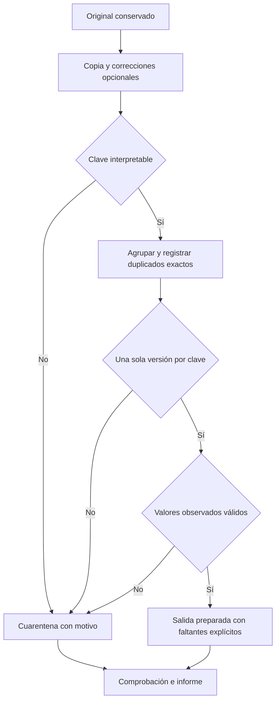

# Unidad 8 — Calidad y preparación de datos

[Unidad anterior: obtención y comprensión de datos](../unidad07-obtencion-datos/README.md) · [Volver al índice](../README.md)

En la Unidad 7 identificamos faltantes, un consumo inválido, registros repetidos y claves ausentes. Ahora debemos decidir qué hacer con esas incidencias. Preparar datos exige justificar cambios y conservar lo necesario para revisarlos; no consiste en conseguir una tabla que deje de mostrar advertencias.

Construiremos una preparación conservadora del CSV anterior y un segundo experimento de imputación y escalado. La primera práctica conserva originales, cuarentena y trazabilidad. La segunda distingue aprender parámetros de aplicarlos, sin utilizar validación para ajustar la transformación.

## Objetivos

Al terminar podrás:

- Evaluar calidad respecto de una tarea y un esquema concretos.
- Distinguir normalización de formato, corrección, imputación, exclusión y cuarentena.
- Definir una política explícita para faltantes y registros repetidos.
- Corregir una celda solo cuando existe una referencia adicional identificada.
- Separar versiones conflictivas de una clave sin elegir por conveniencia.
- Conservar identificadores de origen y justificar el destino de cada registro.
- Comparar calidad y cobertura antes y después de preparar.
- Imputar una variable con una mediana calculada solo en entrenamiento.
- Aplicar una escala aprendida sin reajustarla sobre validación.
- Verificar casos límite y documentar las decisiones pendientes.

## Antes de comenzar

Completa las unidades 0 a 7. Necesitas funciones, listas, diccionarios, conjuntos y lectura de archivos. Recuerda la mediana de la Unidad 4 y la diferencia entre información disponible y futura de la Unidad 7.

Los programas se comprobaron con **Python 3.12.3 en Linux** y usan únicamente la biblioteca estándar. No requieren instalar paquetes, GPU, cuentas ni Internet. Ejecuta desde la raíz del curso con el entorno virtual activo; tu sistema puede usar `python3` fuera del entorno.

El Laboratorio 1 reutiliza el lector y el esquema de la Unidad 7 mediante una importación explícita. Conserva ambas carpetas del repositorio para ejecutarlo. El Laboratorio 2 usa un archivo independiente: no es una continuación numérica ni una partición de las lecturas diarias.

## 1. Calidad para un propósito

Un archivo puede ser sintácticamente válido y no servir para la decisión que queremos apoyar. La calidad tiene varias dimensiones:

| Dimensión | Pregunta sobre nuestro CSV |
|---|---|
| Validez | ¿Cada fecha existe y cada medición respeta el esquema? |
| Completitud de celdas | ¿Qué variables están ausentes en las filas disponibles? |
| Cobertura de casos | ¿Qué combinaciones sensor-día esperadas están presentes? |
| Unicidad | ¿Cada clave identifica una sola observación? |
| Consistencia | ¿Las versiones de una observación concuerdan? |
| Exactitud respecto de una referencia | ¿La lectura coincide con una fuente comprobada? |
| Disponibilidad | ¿La observación podía utilizarse al decidir? |

Estas dimensiones no se reemplazan entre sí. Un consumo de 10 kWh respeta el esquema, pero eso no certifica que el dispositivo haya medido 10. Dos registros idénticos pueden ser un reenvío o dos observaciones legítimas si definimos mal la clave.

La política de esta unidad conserva la definición de **sensor-día** del caso anterior. Por eso trata las repeticiones como representaciones de una misma observación. En otro problema, la decisión podría ser distinta.

## 2. Acciones que no debemos confundir

| Acción | Qué hace | Qué evidencia necesita |
|---|---|---|
| Interpretar formato | Convierte `12` textual a número o reconoce una fecha | Esquema y convenciones |
| Convertir unidad | Por ejemplo, Wh a kWh mediante división por 1000 | Unidad original y destino confirmados |
| Corregir | Sustituye un valor por una referencia comprobada | Registro que identifica el caso y el valor correcto |
| Imputar | Sustituye una ausencia por una estimación | Método, datos de ajuste y limitaciones |
| Excluir de una salida | No utiliza un registro en una vista o análisis | Regla y efecto sobre la población cubierta |
| Poner en cuarentena | Aparta para revisión conservando el registro y el motivo | Incidencia identificada y decisión pendiente |

Convertir 1200 Wh a 1.2 kWh no aprende nada de la distribución del dataset. Calcular una mediana para completar faltantes sí aprende un parámetro de los datos. Mantendremos esa distinción durante toda la unidad.

Ninguna de estas acciones autoriza modificar silenciosamente el original. Incluso una corrección apoyada en evidencia se aplica a una copia y se documenta.

### Una cifra inválida no revela su valor verdadero

El consumo −2 del CSV es inválido bajo el esquema de energía consumida no negativa. Eso no significa que el valor correcto sea 2, 0 o el promedio. Tomar el valor absoluto, truncar a cero o imputar transformaría el problema de maneras diferentes.

En esta unidad añadimos una [referencia sintética explícita](datos/acta_sintetica.md) que establece 10 kWh para ese registro. Se trata de información nueva creada para el escenario, no de algo deducido del signo negativo.

## 3. Diseñar la política antes del programa

Aplicaremos esta política al archivo original de la Unidad 7:

1. Leer y validar su estructura con el mismo esquema.
2. Si se solicita, comprobar y aplicar un lote de correcciones a una copia.
3. Apartar las filas cuya fecha o sensor no permita formar una clave.
4. Agrupar por fecha y sensor; dentro de cada grupo, representar una sola vez cada registro con textos idénticos y registrar las copias adicionales.
5. Si quedan varias versiones distintas de una clave, apartarlas todas en cuarentena.
6. Para una clave con una sola versión, revisar las mediciones: si hay valores inválidos, enviarla a cuarentena.
7. Conservar las demás filas, incluidos sus faltantes, con referencia al registro de origen.
8. Volver a perfilar la salida y comprobar balance, unicidad y validez de valores observados.



El orden importa. Si dos versiones de una clave discrepan y una tiene un valor inválido, eliminar primero esa versión podría hacer parecer que la otra es correcta. Nuestra política registra primero el conflicto y no decide cuál representa la observación real.

## 4. Duplicados exactos y versiones conflictivas

Los registros 6 y 7 del CSV tienen las mismas cinco celdas. El programa conserva el 6 como representante y registra que el 7 es una copia adicional. Elegir el primer registro solo sirve para fijar una referencia: las mediciones coinciden.

Los registros 10 y 11 comparten `(2026-09-01, S3)` y tienen consumos 6 y 7. Ambos pasan a cuarentena. No tomamos el primero, el último, el mayor ni el promedio.

La igualdad exacta se refiere a los textos de las celdas leídas, antes de convertirlos a números. Por tanto, `6` y `6.0` se consideran versiones textuales diferentes y requieren revisión en esta política conservadora, aunque sus valores numéricos coincidan. Cambiar esa regla exige documentar qué equivalencias admitimos.

### Si un duplicado pertenece a un conflicto

Supón tres filas de la misma clave con valores 6, 7 y 6. La tercera se registra como duplicado de la primera. Las dos versiones representantes van a cuarentena. El nombre «representante» no significa que haya sido aceptado para el análisis: puede estar también apartado para revisión.

Todas las filas originales permanecen en el informe de trazabilidad, incluso las marcadas como duplicadas. Ninguna se borra de la fuente.

## 5. Faltantes y valores atípicos requieren contexto

En la salida preparada conservaremos como ausentes el consumo del registro 3, la temperatura del 4 y las horas del 12. Una fila parcialmente informada todavía puede ser útil para un análisis de otra variable.

Otras opciones que podríamos estudiar son:

| Opción | Posible utilidad | Riesgo que se debe revisar |
|---|---|---|
| Conservar ausencias | Mantener evidencia y decidir después por tarea | Algunas operaciones o modelos no las admiten |
| Trabajar con casos completos | Simplificar un análisis definido | Cambiar la composición de la muestra y perder cobertura |
| Imputar con una estadística | Disponer de una representación numérica | Reducir variabilidad y ocultar el mecanismo de ausencia |
| Añadir indicador de ausencia | Conservar información sobre qué se imputó | El patrón de captura puede cambiar en operación |
| Buscar una referencia adicional | Recuperar una medición documentada | No siempre existe o está disponible a tiempo |

La [documentación de imputación de scikit-learn](https://scikit-learn.org/stable/modules/impute.html) describe métodos e indicadores de ausencia. Aquí implementaremos uno sencillo para entender su funcionamiento, sin afirmar que sea el mejor para toda tarea.

Un valor extremo no es automáticamente un error. Una temperatura muy alta puede indicar una falla de registro, un proceso real o un contexto distinto. Nuestro esquema solo exige temperatura finita: no incorpora un intervalo de plausibilidad física. No podemos anunciar que detecta todas las anomalías.

## 6. Correcciones vinculadas a una copia

El archivo [correcciones_verificadas.json](datos/correcciones_verificadas.json) contiene una única corrección sustentada en el [acta sintética](datos/acta_sintetica.md):

| Elemento | Valor |
|---|---|
| Registro original | 8, sin contar encabezado |
| Fecha y sensor | 2026-09-03, S2 |
| Campo | consumo_kwh |
| Texto anterior | `-2` |
| Texto corregido | `10` |
| Referencia | ACTA-SIM-001 |

Antes de aplicar el lote se comprueban:

- La huella SHA-256 de la fuente completa.
- El número de registro y la coincidencia de fecha, sensor y texto anterior.
- Que la celda no se corrija dos veces en el mismo lote.
- Que el campo sea una medición y el nuevo valor cumpla el esquema.
- Que referencia y motivo estén declarados.

Se validan todos los cambios antes de aplicar alguno. No se permite alterar la clave ni convertir la corrección en una fila nueva. Si la fuente cambió, el programa se detiene para revisar la correspondencia.

Una huella coincidente evita aplicar un parche a otra copia; **no autentica el acta ni prueba la verdad física de la medición**. El contenido de la referencia forma parte de los supuestos explícitos de nuestro escenario sintético.

## 7. Laboratorio 1 — Preparación conservadora

Archivo: [01_preparar_lecturas.py](ejemplos/01_preparar_lecturas.py). Núcleo: [preparacion.py](ejemplos/preparacion.py).

Ejecuta primero sin correcciones:

```bash
python unidad08-preparacion-datos/ejemplos/01_preparar_lecturas.py
```

Resultado principal:

```text
Origen: 12 registros; correcciones: 0
Preparados: 8; duplicados: 1; cuarentena: 3
Preparados con faltantes: 3
Cobertura antes: 10/12 = 83.33%
Cobertura despues: 8/12 = 66.67%
Cuarentena registro 8: invalido:consumo_kwh
Cuarentena registro 10: conflicto_de_clave
Cuarentena registro 11: conflicto_de_clave
```

Podemos reconstruir la cuenta:

| Destino | Registros originales | Cantidad |
|---|---|---:|
| Preparados | 1, 2, 3, 4, 5, 6, 9, 12 | 8 |
| Copia duplicada | 7, representado por 6 | 1 |
| Cuarentena | 8, 10, 11 | 3 |
| Total | Todos los registros del archivo | 12 |

De los ocho preparados, cinco no tienen faltantes y tres conservan al menos uno. Por eso la salida no se llama «ocho casos completos» ni «ocho ejemplos listos para entrenar».

### Ejecutar con la referencia adicional

```bash
python unidad08-preparacion-datos/ejemplos/01_preparar_lecturas.py --correcciones unidad08-preparacion-datos/datos/correcciones_verificadas.json
```

Se recupera el registro 8 con consumo 10. Quedan **9 preparados, 1 duplicado y 2 en cuarentena**. La cobertura de claves preparadas es `9/12 = 75%`; los tres registros con faltantes siguen presentes.

La corrección no resuelve el conflicto de S3 ni crea sus días ausentes. Tampoco modifica el CSV de la Unidad 7: la referencia se aplica a una copia en memoria.

## 8. Exportar y poder reconstruir el proceso

```bash
python unidad08-preparacion-datos/ejemplos/01_preparar_lecturas.py --salida resultados/unidad08_sin_correcciones
python unidad08-preparacion-datos/ejemplos/01_preparar_lecturas.py --correcciones unidad08-preparacion-datos/datos/correcciones_verificadas.json --salida resultados/unidad08_con_referencia
```

Cada comando requiere una **carpeta nueva**. Se generan tres archivos:

| Archivo | Contenido |
|---|---|
| `preparados.csv` | Mediciones admitidas, registro de origen y lista de campos faltantes |
| `cuarentena.csv` | Representantes apartados, registro de origen y motivos |
| `informe.json` | Política, huellas, correcciones, perfiles, destinos y originales de cada registro |

Los CSV de salida amplían el esquema con columnas de trazabilidad. No se pasan directamente al lector estricto de cinco columnas de la Unidad 7: el programa construye una vista de esas cinco columnas para comparar perfiles. Un consumidor posterior debe reconocer el esquema de salida.

En `preparados.csv`, un faltante se escribe como celda vacía y la columna `campos_faltantes` explicita cuáles lo eran. En JSON se conserva como `null`. Interpretar tipos o ordenar por fecha y sensor cambia la representación derivada, no la copia original.

El informe final se escribe después de los dos CSV e incluye sus huellas. Una carpeta sin informe final, por ejemplo tras un fallo de escritura, no debe tratarse como una exportación terminada. El programa no sobrescribe carpetas existentes ni reutiliza archivos parciales.

### Recorrido del núcleo

1. `generar_informe` carga la fuente y conserva su huella.
2. `aplicar_correcciones` valida un lote opcional y modifica una copia.
3. `preparar` agrupa, separa duplicados, decide cuarentena y conserva faltantes.
4. Se comprueba que cada registro tenga exactamente un destino y que los preparados no tengan claves repetidas ni valores observados inválidos.
5. `exportar` produce archivos nuevos con referencias de origen.

Un campo inválido y un conflicto se diagnostican según el orden de la política. No se promete enumerar todas las causas posibles de una fila: si hay conflicto de clave, ese es el motivo prioritario registrado.

## 9. Comparar calidad y cobertura sin engañarnos

El plan de cobertura sigue siendo el mismo de la Unidad 7: S1–S3, del 1 al 4 de septiembre, doce claves esperadas. Está fijado en el laboratorio; no se aprende de las filas restantes.

| Indicador | Original | Preparación conservadora | Con corrección explícita |
|---|---:|---:|---:|
| Filas de la vista | 12 | 8 | 9 |
| Claves distintas presentes del plan | 10 | 8 | 9 |
| Cobertura de claves | 83.33% | 66.67% | 75% |
| Claves repetidas en la vista | 2 | 0 | 0 |
| Celdas numéricas inválidas | 1 | 0 | 0 |
| Celdas numéricas faltantes | 3 | 3 | 3 |

La salida tiene menos conflictos visibles porque apartó registros problemáticos. La cobertura **baja** en la preparación conservadora; los problemas de la fuente siguen documentados en cuarentena y en el informe. No sería correcto afirmar que «todos los datos ya son completos y correctos».

Revisa también quién queda representado. S3 pierde su clave del día 1 por conflicto y solo conserva la del día 3. Una exclusión puede afectar de forma desigual a grupos o dispositivos, aunque la regla se aplique igual a todos.

### Experimenta

- Repite la ejecución sobre el mismo original: deben coincidir decisiones y valores. Usa carpetas nuevas si exportas.
- En una copia, añade un duplicado de una fila conflictiva. Predice su referencia y el destino del representante.
- Cambia la fuente y vuelve a pasar el lote antiguo: debe rechazarse por huella, antes de aplicar correcciones.
- Cambia una temperatura a 900 en una copia sin lote: el esquema la admite como finita. Explica la limitación sin anunciar una medición real plausible.
- Pregunta cuántos preparados quedarían si tu tarea exigiera casos completos. No confundas esa nueva política con lo que ya hace el programa.

## 10. Preparación determinista y parámetros aprendidos

Hasta ahora usamos reglas fijadas de antemano: interpretar fechas, comprobar un intervalo o reconocer textos idénticos. La segunda práctica introduce operaciones que calculan parámetros a partir de los datos.

| Transformación | ¿Qué se fija o aprende? | Cómo usarla después |
|---|---|---|
| Convertir Wh a kWh | Factor conocido 1/1000 | Aplicar la misma conversión compatible |
| Interpretar `NA` | Convención del esquema | Mantener su significado |
| Completar con la mediana | Mediana de las observaciones de entrenamiento | Reutilizar esa mediana |
| Escalar con mínimo y máximo | Extremos observados en entrenamiento | Reutilizar esos extremos |
| Codificar categorías | Puede requerir un vocabulario observado | Conservarlo y definir categorías nuevas |

Una operación determinista también puede ser incorrecta si su supuesto es falso: dividir por 1000 un dato que ya estaba en kWh cambia la magnitud. La distinción no separa operaciones seguras e inseguras; señala qué información necesita cada una.

La preparación categórica requiere distinguir categorías nominales, ordinales e identificadores. Asignar números 0, 1 y 2 a nombres puede introducir un orden que no existe. El laboratorio trabaja con una sola variable numérica; retomaremos codificaciones y características en las unidades de aprendizaje automático.

## 11. Separar antes de ajustar

En aprendizaje automático, **entrenamiento** permite ajustar parámetros y **validación** permite examinar decisiones del desarrollo sobre datos separados. La evaluación final requiere otro protocolo que estudiaremos más adelante. Aquí no entrenamos un predictor ni calculamos su rendimiento: separamos dos grupos para estudiar una transformación.

La regla del laboratorio es:

```text
entrenamiento → ajustar parámetros
entrenamiento + parámetros fijos → transformar entrenamiento
validación + los mismos parámetros → transformar validación
```

Usar validación para calcular la mediana o los extremos mezcla información que debía permanecer separada durante el ajuste. La [guía de filtración de información de scikit-learn](https://scikit-learn.org/stable/common_pitfalls.html#data-leakage) explica por qué los pasos de preparación aprendidos deben ajustarse dentro del conjunto permitido; en validación cruzada, dentro de cada partición de entrenamiento.

La función `ajustar` de nuestro programa solo recibe los valores de entrenamiento. La función `transformar` recibe valores y parámetros ya calculados, sin volver a estimarlos.

### La separación debe respetar las observaciones

Dos copias de la misma observación no deben quedar una en entrenamiento y otra en validación. Lo mismo requiere atención con grupos y series temporales: filas distintas pueden representar el mismo dispositivo, episodio o información futura.

El archivo didáctico ya declara sus particiones y exige identificadores únicos entre ellas. Esa comprobación detecta IDs repetidos, pero no demuestra independencia ni descubre duplicados semánticos con IDs diferentes. No estamos proponiendo una partición adecuada para cualquier proyecto.

## 12. Un ejemplo que podemos calcular a mano

Archivo independiente: [particiones_sinteticas.json](datos/particiones_sinteticas.json).

| Grupo | Identificador | Temperatura, °C |
|---|---|---:|
| Entrenamiento | t1 | 18 |
| Entrenamiento | t2 | 20 |
| Entrenamiento | t3 | Faltante |
| Entrenamiento | t4 | 22 |
| Validación | v1 | 30 |
| Validación | v2 | Faltante |
| Validación | v3 | 40 |

Son mediciones sintéticas diseñadas para separar dos distribuciones pequeñas. No representan el historial de un edificio ni proporcionan etiquetas de predicción. El formato JSON usa `null` para ausencias; no admite `NA` textual en el campo numérico.

En entrenamiento hay tres valores observados: 18, 20 y 22. La mediana es **20**. Imputamos t3 con 20 y, al transformar validación, imputamos v2 con **ese mismo 20**.

No se calcula la mediana de validación, que sería 35, ni la mediana conjunta, que sería 22. Esas cifras pertenecen a otras fuentes de ajuste.

### Imputar no recuperar una medición

El valor 20 de t3 y v2 es una estimación elegida por el método. No se presenta como la temperatura realmente medida. La salida conserva:

- `original`: el valor o `null` recibido.
- `imputado`: el número después de completar si hacía falta.
- `era_faltante`: indicador booleano de la ausencia original.
- `escalado`: el valor transformado posteriormente.

Los valores observados no se sustituyen. El indicador de ausencia permite distinguir un 20 medido de un 20 imputado, aunque su valor escalado coincida.

## 13. Escalado min-max con parámetros fijos

Para esta práctica usamos:

$$
x_{escalado}=\frac{x-x_{mínimo,entrenamiento}}{x_{máximo,entrenamiento}-x_{mínimo,entrenamiento}}
$$

El mínimo de entrenamiento es 18 y el máximo 22. La mediana se encuentra entre ambos, de modo que imputar con ella no cambia esos extremos.

Con denominador `22−18=4`:

| Valor después de imputar | Cálculo | Escalado |
|---:|---|---:|
| 18 | (18−18)/4 | 0 |
| 20 | (20−18)/4 | 0.5 |
| 22 | (22−18)/4 | 1 |
| 30 | (30−18)/4 | 3 |
| 40 | (40−18)/4 | 5.5 |

Los valores observados en entrenamiento quedan entre 0 y 1. **Una observación nueva puede quedar fuera de ese intervalo**. No es un error aritmético: indica que supera los extremos usados para ajustar.

No recortamos automáticamente a 0 o 1. Recortar eliminaría información sobre la magnitud del exceso y constituiría otra decisión. Tampoco recalculamos el máximo con validación para forzar todos los valores al intervalo.

El resultado es adimensional. La documentación y el informe conservan la unidad original para interpretar la transformación. Escalar no demuestra que los valores sean físicamente plausibles ni que un modelo vaya a mejorar.

## 14. Casos que exigen otra decisión

### Todo entrenamiento está ausente

Sin observaciones no existe una mediana que podamos estimar a partir de esa columna. El ejemplo se detiene con un error claro. Rellenar con cero, pedir otra fuente o excluir la variable serían políticas nuevas que necesitan fundamento.

### La columna de entrenamiento es constante

Si mínimo y máximo coinciden, el denominador del escalado es cero. Nuestro ejemplo también se detiene: no elige silenciosamente qué hacer. Una implementación más general podría conservar la constante, retirar la variable o adoptar una convención documentada.

### El origen usa otro formato

`"20"` es un texto JSON y `true` es un booleano. El lector del segundo laboratorio exige número o `null`; no aplica automáticamente las convenciones del CSV anterior. Los valores no finitos se rechazan.

### Las ausencias no ocurren al azar

Si un sensor deja de reportar con temperaturas extremas, la mediana de lo observado puede ocultar justamente ese comportamiento. El archivo por sí solo no identifica la causa. La imputación no resuelve un mecanismo de captura desconocido ni crea evidencia de rendimiento real.

## 15. Laboratorio 2 — Imputar y escalar sin filtración

Archivo: [02_imputar_sin_filtracion.py](ejemplos/02_imputar_sin_filtracion.py). Núcleo: [transformaciones.py](ejemplos/transformaciones.py).

```bash
python unidad08-preparacion-datos/ejemplos/02_imputar_sin_filtracion.py
```

Salida:

```text
Ajuste solo con entrenamiento: mediana=20; mínimo=18; máximo=22
ENTRENAMIENTO
t1: original=18; imputado=18; faltante=False; escalado=0.000
t2: original=20; imputado=20; faltante=False; escalado=0.500
t3: original=None; imputado=20; faltante=True; escalado=0.500
t4: original=22; imputado=22; faltante=False; escalado=1.000
VALIDACION
v1: original=30; imputado=30; faltante=False; escalado=3.000
v2: original=None; imputado=20; faltante=True; escalado=0.500
v3: original=40; imputado=40; faltante=False; escalado=5.500
```

`None` es la representación que imprime Python para el `null` del JSON. El informe JSON vuelve a utilizar `null`.

### Recorrido del código

1. `leer_particiones` valida contenedor, registros, tipos e identificadores.
2. `ajustar` calcula mediana, mínimo y máximo con los valores observados de entrenamiento.
3. `Parametros` conserva esos tres valores en una estructura inmutable.
4. `transformar` imputa y escala cada grupo con esos mismos parámetros.
5. El comando puede guardar un informe con fuente, huella, unidad, versión de Python, parámetros y resultados.

```bash
python unidad08-preparacion-datos/ejemplos/02_imputar_sin_filtracion.py --salida resultados/transformacion_unidad08.json
```

El destino debe ser un archivo nuevo. No se guardan un modelo predictivo ni resultados de evaluación: es un informe del preprocesamiento.

## 16. Ver el error de mezclar validación

Ejecuta el contraejemplo explícito:

```bash
python unidad08-preparacion-datos/ejemplos/02_imputar_sin_filtracion.py --comparar-filtracion
```

Después de los resultados correctos imprime:

```text
CONTRAEJEMPLO: mezclar validación al ajustar produce filtración; no usar estos parámetros.
Ajuste incorrecto: mediana=22; mínimo=18; máximo=40
```

Los valores observados conjuntos son 18, 20, 22, 30 y 40. Su mediana es 22 y su máximo 40, pero ambos utilizaron validación para ajustar. El faltante de validación se completaría con 22 en lugar de 20; la escala tendría denominador 22 en lugar de 4.

Incluso entrenamiento cambiaría: el 22 de t4 pasaría de 1 a `4/22 ≈ 0.182`. Esto demuestra que la información de validación afectó la representación aprendida. No demuestra una mejora ni una caída de precisión de un modelo, porque no entrenamos ninguno.

La comparación incorrecta se muestra aparte. Si combinas `--comparar-filtracion` con `--salida`, el informe conserva **únicamente los parámetros y resultados correctos**.

### Experimenta

- Cambia 40 a 400 en una copia de validación. Los parámetros correctos deben seguir siendo 20, 18 y 22; la transformación de ese valor será `(400−18)/4 = 95.5`.
- Cambia el faltante de validación por 20 observado. Su escalado sigue en 0.5, pero el indicador de ausencia cambia a falso.
- Deja todo entrenamiento en `null`. Explica por qué se rechaza.
- Deja entrenamiento en `[20,20,null,20]`. Identifica el problema del rango cero.
- Usa 16 como nuevo valor de validación. Predice −0.5 y explica por qué no se recorta.

## 17. Verificar propiedades, no solo una salida bonita

Ejecuta las [pruebas de la unidad](pruebas/test_preparacion.py):

```bash
python -m unittest discover -s unidad08-preparacion-datos/pruebas -v
```

Las 20 pruebas comprueban el balance y los registros concretos calculados a mano; la conservación de originales, faltantes y cero; el rechazo de correcciones desfasadas, ambiguas o sin referencia; y la cuarentena de conflictos incluso cuando una versión parece válida.

También verifican huellas de exportación, rechazo de sobrescritura, mediana y escala calculadas a mano, valores fuera de rango, indicadores de ausencia, entrenamiento vacío o constante, tipos inválidos e identificadores compartidos entre particiones. Los comandos se prueban fuera de la raíz del repositorio y el contraejemplo no contamina el informe correcto.

Estas comprobaciones sostienen propiedades del programa. La validez real de una corrección, la independencia entre muestras y la conveniencia de imputar siguen requiriendo evidencia del problema.

### Reproducibilidad e idempotencia

Repetir el proceso sobre el mismo original, lote y versión produce las mismas decisiones y valores. Eso es reproducibilidad del procedimiento.

No afirmamos que el comando pueda recibir su propio CSV exportado y dejarlo idéntico: el esquema de salida tiene campos adicionales y el lector los rechaza. La idempotencia de una transformación y la repetibilidad de una ejecución no son la misma propiedad.

## 18. Ejercicios

1. **Acciones.** Clasifica convertir Wh a kWh, reemplazar −2 por 10 con acta, completar una ausencia con la mediana y apartar dos versiones conflictivas. ¿Cuál de esas acciones aprende un parámetro?
2. **Balance.** Reconstruye los destinos de los doce registros antes y después de aplicar la referencia. Indica cuántos preparados tienen faltantes y cuántos están completos.
3. **Orden de la política.** Dos filas de la misma clave tienen consumo 10 y −2. Explica por qué nuestra preparación aparta ambas en lugar de quedarse automáticamente con 10.
4. **Corrección.** ¿Por qué el lote contiene huella, número de registro, clave y texto anterior? Explica qué comprueba y qué no demuestra cada elemento.
5. **Cobertura.** Calcula 10/12, 8/12 y 9/12. ¿Por qué una salida sin valores inválidos puede tener menos cobertura? Describe el efecto sobre S3.
6. **Imputación.** Calcula las medianas de entrenamiento, validación y ambos grupos. Indica cuál usa el método correcto y por qué el valor imputado no es una medición recuperada.
7. **Escalado.** Calcula los resultados para 18, 20, 22, 30, 40 y 16. Explica la unidad de salida y los valores fuera de [0,1].
8. **Filtración.** Al mezclar grupos, ¿en qué se convierten los parámetros y el valor escalado de t4? Explica por qué no se necesita observar una métrica para identificar el problema del procedimiento.
9. **Casos límite.** Propón una respuesta razonada ante entrenamiento completamente ausente, una columna constante y una temperatura extrema. Distingue la respuesta implementada de otras políticas posibles.
10. **Informe.** Redacta una conclusión que no confunda reducción de incidencias visibles con recuperación de la verdad ni con mejora de un modelo. Incluye una decisión pendiente.

Consulta las [soluciones comentadas](soluciones/README.md) después de escribir tu intento.

## 19. Reto aplicado — Preparación con decisiones y evidencia

Completa el [reto con rúbrica](reto.md) y la [plantilla de informe](plantillas/informe_preparacion.md). Debes producir una preparación conservadora, otra con la referencia adicional y un experimento de parámetros aprendidos solo en entrenamiento.

Conserva originales, salidas, huellas, política y evidencia. La conclusión debe explicar qué mejoró, qué cobertura se perdió y qué falta para utilizar esos datos en una tarea concreta.

## 20. Errores frecuentes

| Error | Corrección |
|---|---|
| Cambiar el original para que pasen las comprobaciones | Crear derivados y registrar decisiones |
| Interpretar un negativo inválido como su valor absoluto | Buscar referencia o apartarlo |
| Imputar sin conservar qué era faltante | Guardar indicador y valor original |
| Eliminar todas las filas incompletas por costumbre | Justificarlo por tarea y revisar cobertura |
| Elegir la última versión sin fecha ni autoridad | Mantener conflicto en revisión |
| Presentar cuarentena como datos reparados | Informar exclusiones y pendientes |
| Confundir código que valida referencia con autenticación | Documentar el origen y alcance de la evidencia |
| Calcular estadísticas con entrenamiento y validación juntos | Ajustar solo con el conjunto permitido |
| Escalar validación con sus propios extremos | Reutilizar los parámetros de entrenamiento |
| Recortar valores nuevos sin declarar la política | Conservarlos o justificar un tratamiento adicional |
| Dar la misma solución a todo faltante | Investigar su contexto y mecanismo |
| Llamar idempotente a un comando repetible | Comprobar el significado de cada propiedad |

## Checklist

- [ ] Distingo calidad de formato, validez, exactitud y cobertura.
- [ ] Declaro la política y el orden de sus decisiones.
- [ ] Conservo originales y registro el destino de cada fila.
- [ ] Diferencio duplicado exacto y conflicto de clave.
- [ ] Aplico correcciones solo con referencias explícitas y compatibles.
- [ ] Mantengo faltantes visibles si no hay tratamiento justificado.
- [ ] Comparo indicadores antes y después con el mismo denominador.
- [ ] Ajusto mediana y escala solo con entrenamiento.
- [ ] Transformo validación con los mismos parámetros.
- [ ] Explico resultados fuera del intervalo y casos límite.
- [ ] Exporto sin sobrescribir y con huellas verificables.
- [ ] Formulo una conclusión proporcional a la evidencia.

## Resumen

Preparar datos produce una representación apropiada para una tarea bajo decisiones explícitas. La cuarentena preserva problemas pendientes; una corrección necesita referencia; una imputación estima y debe conservar su condición de estimación.

Los parámetros aprendidos forman parte del procedimiento que se evalúa. La mediana y los extremos calculados con entrenamiento deben reutilizarse sin reajustar sobre validación. Los archivos e informes permiten revisar esas decisiones y comprobar qué registros se utilizaron.

La siguiente unidad es [exploración y visualización](../unidad09-exploracion-visualizacion/README.md): aprenderemos a formular preguntas sobre los datos y comunicar patrones con gráficos e interpretaciones proporcionadas.

## Referencias y lecturas

Los casos, acta sintética, datos, programas y ejercicios son desarrollos educativos propios.

1. Scikit-learn. [Preparación consistente y filtración de información](https://scikit-learn.org/stable/common_pitfalls.html#data-leakage).
2. Scikit-learn. [Imputación de valores ausentes](https://scikit-learn.org/stable/modules/impute.html) y [escalado min-max](https://scikit-learn.org/stable/modules/generated/sklearn.preprocessing.MinMaxScaler.html). Lecturas conceptuales: los ejemplos de esta unidad no instalan ni utilizan scikit-learn.
3. Python Software Foundation. [Lectura y escritura de CSV](https://docs.python.org/3.12/library/csv.html) y [mediana con statistics](https://docs.python.org/3.12/library/statistics.html#statistics.median).

[Unidad anterior](../unidad07-obtencion-datos/README.md) · [Unidad siguiente](../unidad09-exploracion-visualizacion/README.md) · [Volver al índice](../README.md)
