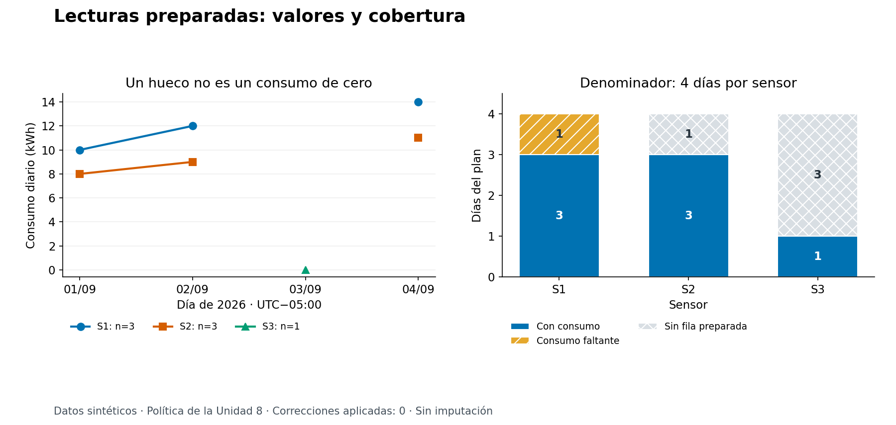
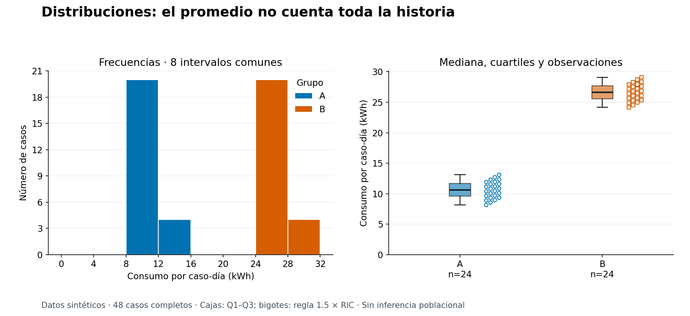
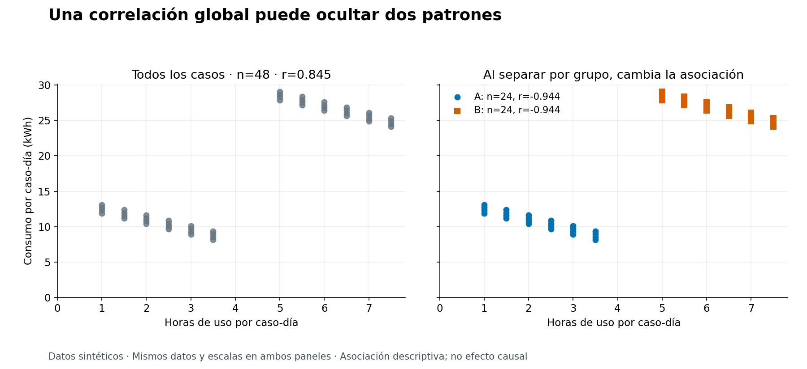

# Unidad 9 — Exploración y visualización

[Unidad anterior: calidad y preparación de datos](../unidad08-preparacion-datos/README.md) · [Volver al índice](../README.md)

Una tabla preparada todavía puede llevar a conclusiones equivocadas. Un promedio pequeño puede corresponder a pocos días observados; una correlación global puede cambiar de signo al separar grupos. Explorar consiste en formular preguntas, mirar los datos desde varias perspectivas y documentar qué permiten afirmar.

En esta unidad retomaremos las lecturas preparadas de la Unidad 8. Después usaremos 48 casos sintéticos para estudiar distribuciones y relaciones. Produciremos tablas y figuras reproducibles, acompañadas de su procedencia, tamaños y limitaciones.

## Objetivos

Al terminar podrás:

- Formular una pregunta exploratoria con unidad de observación y alcance explícitos.
- Elegir entre frecuencias, histogramas, cajas, dispersión y series temporales.
- Conectar media, mediana, cuartiles y dispersión con una distribución visible.
- Diferenciar un cero, una celda faltante y una observación ausente del conjunto preparado.
- Comparar grupos indicando cuántos casos intervienen en cada resumen.
- Revisar cómo influyen los intervalos, las escalas y la agregación.
- Reconocer valores extremos sin eliminarlos por su apariencia.
- Distinguir asociación descriptiva, hipótesis y evidencia causal.
- Exportar gráficos y resultados con versiones y huellas de sus datos.
- Redactar un informe breve que conecte pregunta, evidencia y límites.

## Antes de comenzar

Completa las unidades 0 a 8. Necesitas listas, diccionarios, funciones, archivos y entornos virtuales. Repasa [media, mediana y correlación](../unidad04-probabilidad-estadistica/README.md) y la [política de preparación](../unidad08-preparacion-datos/README.md).

Las prácticas se comprobaron con **Python 3.12.3, Matplotlib 3.10.8 y NumPy 2.2.6 en Linux**. Los cálculos y las salidas de texto usan la biblioteca estándar; exportar gráficos y ejecutar las pruebas de esta unidad requiere los paquetes indicados. No se necesita GPU, cuenta ni servicio externo. La instalación inicial descarga paquetes; las prácticas posteriores funcionan sin Internet.

Desde la raíz del repositorio y con el entorno virtual activo de la Unidad 0:

```bash
python -m pip install -r unidad09-exploracion-visualizacion/requirements.txt
```

Se fijan las dos bibliotecas principales en [requirements.txt](requirements.txt). El [entorno verificado](recursos/entorno-verificado.txt) registra también sus dependencias transitivas; para reconstruir ese entorno completo con Python 3.12, puedes instalar ese archivo en un entorno virtual nuevo. No sustituye un registro de sistema operativo y fuentes tipográficas. En versiones de Python distintas pueden cambiar las ruedas disponibles o la compatibilidad.

Matplotlib dibuja sobre una figura y sus **ejes** (`Axes`). Un eje contiene datos, escalas, etiquetas y leyenda. Usamos el motor `Agg` para guardar PNG y SVG sin abrir ventanas: que no aparezca una ventana es el comportamiento esperado.

Conserva las carpetas de las unidades 7 y 8: el primer laboratorio importa la preparación anterior. Los resultados nuevos se guardan bajo `resultados/`, carpeta ignorada por Git. Cada comando de exportación exige un destino **nuevo**; para repetirlo cambia el nombre de la carpeta. Si una exportación falla a mitad, revisa su salida y usa otra carpeta; no se promete una escritura transaccional.

## 1. Primero la pregunta

Antes de elegir colores, escribe qué quieres averiguar y qué representa cada fila.

| Pregunta | Unidad de observación | Evidencia útil | Límite inicial |
|---|---|---|---|
| ¿Qué días tienen consumo disponible por sensor? | Sensor-día del plan | Tabla de cobertura y serie con huecos | Solo cuatro días previstos |
| ¿Cómo se reparte el consumo en cada grupo? | Caso-día sintético | Histograma, cuartiles y puntos | Grupos construidos con una fórmula |
| ¿Cómo se relacionan horas y consumo? | Caso-día con ambas variables | Dispersión global y por grupo | Asociación, sin intervención causal |

Una pregunta vaga como «¿qué dicen los datos?» invita a seleccionar cualquier patrón llamativo. Una pregunta delimitada permite decidir qué calcular, qué descartar del informe y qué información hace falta.

La exploración sirve para detectar estructura, anomalías y preguntas nuevas. Si observas veinte gráficos y eliges después el patrón que parece más fuerte, ese hallazgo es una **hipótesis para investigar**. No se convierte por sí solo en una confirmación independiente. El [enfoque exploratorio de NIST](https://www.itl.nist.gov/div898/handbook/eda/section1/eda11.htm) destaca el papel de los gráficos para descubrir estructura y revisar supuestos.

En un proyecto predictivo, identifica el conjunto permitido para explorar y tomar decisiones de modelado. Examinar repetidamente el conjunto reservado de prueba para elegir variables, transformaciones o modelos también usa información de ese conjunto. La Unidad 10 organizará ese flujo; aquí no entrenamos ni evaluamos predictores.

## 2. De la variable al gráfico

| Tipo de información | Primera representación | Qué debes declarar |
|---|---|---|
| Categorías, como sensor o grupo | Tabla y barras de frecuencias | Conteo o proporción; denominador; categorías ausentes |
| Una variable numérica | Histograma y resumen de cuantiles | Unidad, intervalos, número de valores presentes |
| Una variable numérica por grupo | Cajas acompañadas de puntos | Tamaño de cada grupo; misma escala; faltantes |
| Dos variables numéricas | Dispersión | Unidad de cada eje; número de pares completos |
| Una medición en el tiempo | Puntos y líneas en orden temporal | Frecuencia esperada, zona horaria y huecos |

Una barra de categorías resume cuántos casos pertenecen a cada categoría. Un histograma agrupa números en **intervalos**: el orden y el ancho tienen significado. El identificador `S1` es una categoría, aunque contenga una cifra; no tiene sentido calcular su media.

Una proporción necesita denominador. «Tres lecturas» y «tres de cuatro días previstos» responden preguntas distintas. Si comparas frecuencias de grupos de tamaños muy diferentes, muestra también proporciones dentro de cada grupo y sus tamaños: más observaciones pueden producir barras más altas sin una mayor proporción del fenómeno.

Evita gráficos tridimensionales decorativos, áreas difíciles de comparar y una leyenda con demasiadas categorías. Los colores deben ayudar a leer la pregunta; acompáñalos con etiquetas, marcadores o tramas cuando sea posible.

## 3. Lo que una media deja fuera

Para los consumos disponibles de S1 tenemos `10, 12, 14` kWh. La media es:

$$
\bar{x}_{S1}=\frac{10+12+14}{3}=12\text{ kWh}.
$$

El denominador es **3 consumos disponibles**, aunque el plan tiene cuatro días. Dividir la suma por cuatro daría 9 kWh y trataría implícitamente el faltante como cero. Esa operación no está justificada por los datos.

Un resumen descriptivo debería indicar al menos `n`, faltantes, centro y dispersión. La media responde al balance de todos los valores; la mediana al centro de su orden. Ambas pueden ser útiles, pero ninguna describe por sí sola dos grupos separados o una cola larga.

### Cuartiles y cajas, paso a paso

Los cuartiles Q1 y Q3 delimitan el 25 % y el 75 % mediante una convención de cálculo. Hay varias convenciones; aquí usamos **interpolación lineal** sobre la posición `(n − 1) × p`, contando desde cero. Esto coincide con [`numpy.quantile(..., method="linear")`](https://numpy.org/doc/2.2/reference/generated/numpy.quantile.html) y con las cajas de esta práctica.

Para `1, 2, 3, 7, 8, 11, 14, 100`:

1. Q1 está en la posición `7 × 0.25 = 1.75`: entre 2 y 3, por lo que vale 2.75.
2. La mediana vale `(7 + 8) / 2 = 7.5`.
3. Q3 está en la posición `7 × 0.75 = 5.25`: entre 11 y 14, por lo que vale 11.75.
4. El rango intercuartílico, `RIC = Q3 − Q1`, vale 9.

En la caja, los extremos son Q1 y Q3 y una línea marca la mediana. Con la regla `1.5 × RIC`, los bigotes llegan hasta las observaciones más extremas que quedan dentro de `Q1 − 1.5 × RIC` y `Q3 + 1.5 × RIC`. Aquí las cercas son −10.75 y 25.25: los bigotes terminan en 1 y 14, y 100 queda señalado aparte. Los bigotes no terminan necesariamente en las cercas ni representan un intervalo de confianza. Consulta la [definición de `boxplot`](https://matplotlib.org/3.10.8/api/_as_gen/matplotlib.axes.Axes.boxplot.html).

El punto 100 merece revisión, pero el gráfico no demuestra que sea erróneo. Puede ser un evento válido, otra escala o un error de captura. Volvemos a la Unidad 8: una corrección o exclusión necesita política y evidencia. Con `n=1`, una caja colapsa y comunica poco; por eso no usaremos cajas para los sensores del primer laboratorio.

## 4. Intervalos: una decisión que cambia lo visible

Un histograma cuenta cuántos valores caen en cada intervalo. En esta unidad usamos intervalos de igual ancho y frecuencias absolutas, según la [descripción de histogramas de NIST](https://www.itl.nist.gov/div898/handbook/eda/section3/histogra.htm). La suma de los conteos debe recuperar el total de observaciones presentes.

Para `0, 1, 2, 4` con bordes `0, 1, 2, 4`, la regla será:

| Intervalo | Valores asignados | Conteo |
|---|---|---|
| `[0, 1)` | 0 | 1 |
| `[1, 2)` | 1 | 1 |
| `[2, 4]` | 2 y 4 | 2 |

El último intervalo incluye su extremo derecho. Así, cada valor aparece una vez. Estos bordes sirven para practicar la asignación; tienen anchos distintos y **no** son los intervalos de las figuras publicadas.

Pocos intervalos pueden ocultar estructura; demasiados pueden destacar irregularidades de pocos casos. Compararemos 4, 8 y 16 sobre el mismo rango. Elegir el que mejor apoya una historia sin mostrar alternativas sería una mala práctica.

Si normalizas a densidad, el eje vertical cambia: es el **área total** la que suma uno. Para intervalos de ancho desigual, la densidad permite comparar áreas proporcionales a las frecuencias; las alturas de conteos ya no son directamente comparables. Las figuras del curso mantienen anchos iguales y etiquetan «Número de casos».

## 5. Tiempo, cobertura y denominadores

Antes de trazar una serie, ordena sus fechas y construye el calendario esperado. Si eliminas los días faltantes de una lista y unes los restantes, puedes dibujar una continuidad que no está observada. Aquí reinsertamos cada fecha del plan y usamos `NaN` únicamente en el arreglo gráfico para interrumpir la línea. Matplotlib documenta ese comportamiento en su [ejemplo de valores ausentes](https://matplotlib.org/3.10.8/gallery/lines_bars_and_markers/masked_demo.html).

La tabla de análisis conserva `None` y el JSON conserva `null`. No cambiamos los CSV ni imputamos. El cero sí se dibuja, con su marcador correspondiente.

Tampoco sumamos consumos diarios de sensores con distinta disponibilidad y llamamos al resultado «total del sistema». Una suma de lo disponible puede bajar porque faltan sensores. Si es útil calcularla, debe llamarse suma parcial e indicar su cobertura. Calcular energía por hora requiere además decidir qué significa el cociente y tratar horas faltantes o iguales a cero.

## 6. Laboratorio 1 — Lecturas preparadas y huecos visibles

**Pregunta:** ¿cuántos consumos podemos describir por sensor y qué días quedan sin valor?

Usaremos los [originales de la Unidad 7](../unidad07-obtencion-datos/datos/lecturas_sinteticas.csv), procesados por la política conservadora de la Unidad 8. Por defecto no se aplican correcciones. El [diccionario de esta unidad](datos/README.md) explica la conexión y sus límites.

### Ejecuta y contrasta

```bash
python unidad09-exploracion-visualizacion/ejemplos/01_explorar_lecturas.py
```

Salida:

```text
Origen: 12; preparados: 8; duplicados: 1; cuarentena: 3
sensor | días esperados | preparados | n consumo | faltante | sin preparar | media kWh
S1 | 4 | 4 | 3 | 1 | 0 | 12.000
S2 | 4 | 3 | 3 | 0 | 1 | 9.333
S3 | 4 | 1 | 1 | 0 | 3 | 0.000
Las medias describen días disponibles; no permiten ordenar eficiencia.
```

«Faltante» cuenta consumo ausente **en una fila preparada**. «Sin preparar» cuenta días del plan sin fila preparada, ya sea por ausencia original o por cuarentena. No es el número de registros en cuarentena: S3 tiene dos versiones conflictivas de un mismo día. Los tres registros en cuarentena corresponden a dos claves sensor-día.

Comprueba los denominadores:

- Filas preparadas: `4 + 3 + 1 = 8` de 12 claves esperadas, 66.67 %.
- Consumos disponibles: `3 + 3 + 1 = 7` de 12, 58.33 %.
- Días de S1: tres con consumo y uno con consumo faltante.
- Días de S2: tres con consumo y uno en cuarentena.
- Días de S3: uno con consumo, uno con versiones en cuarentena y dos ausentes del original.

La celda faltante de temperatura de S1 y la de horas de S3 permanecen en la preparación, pero no cuentan como **consumo** faltante. La disponibilidad depende de la variable o del par analizado.

### Exporta y lee la figura

```bash
python unidad09-exploracion-visualizacion/ejemplos/01_explorar_lecturas.py --salida resultados/unidad09/lecturas
```

Se crean `lecturas.png`, `lecturas.svg` y `resumen.json`. El JSON incluye el análisis, el informe de preparación completo, la huella de la fuente y las versiones de ejecución.



La línea de S1 no une el 2 con el 4 de septiembre. El triángulo de S3 en cero es una observación válida del ejemplo. Las barras empiezan en cero y siempre suman cuatro días. La leyenda permite diferenciar disponibilidad de valor y disponibilidad de fila.

No podemos concluir que S3 sea más eficiente: hay un solo día disponible, faltan sus horas de uso y no conocemos servicios prestados, equipos ni condiciones comparables. Tampoco cuatro días permiten establecer una tendencia estable o una estacionalidad.

### Cómo funciona el código

El programa [01_explorar_lecturas.py](ejemplos/01_explorar_lecturas.py) coordina tres pasos:

1. `analizar_lecturas()` llama a `generar_informe()` de la Unidad 8, preservando su política y trazabilidad.
2. `resumir_lecturas()` construye el calendario, agrupa por sensor y calcula cada denominador. Rechaza claves repetidas o fuera del plan.
3. Si se solicita `--salida`, [graficos.py](ejemplos/graficos.py) dibuja una posición por día, conserva huecos y guarda las figuras junto al informe.

El cálculo de [exploracion.py](ejemplos/exploracion.py) filtra los `None` **solo para el resumen de valores presentes**; no borra posiciones de la serie. Esa diferencia mantiene correctos tanto la media como el dibujo.

### Experimenta

Aplica el lote de corrección sustentado en el acta sintética de la Unidad 8:

```bash
python unidad09-exploracion-visualizacion/ejemplos/01_explorar_lecturas.py --correcciones unidad08-preparacion-datos/datos/correcciones_verificadas.json --salida resultados/unidad09/lecturas-corregidas
```

Ahora S2 tiene cuatro consumos, media 9.500 kWh y una línea sin ese hueco. Hay nueve filas preparadas, ocho consumos disponibles y dos registros en cuarentena. S1 y S3 no cambian. La figura y el JSON declaran que se aplicó una corrección. Compara las entregas: el cambio nace de evidencia adicional explícita, no de una decisión estética.

## 7. Laboratorio 2 — Distribuciones y relaciones por grupo

**Pregunta:** ¿el promedio y la correlación global describen adecuadamente los dos grupos?

Usaremos [consumos_por_grupo.csv](datos/consumos_por_grupo.csv): 48 casos-día sintéticos, 24 por grupo, completos y sin fechas. No son nuevas lecturas de S1, S2 o S3 ni observaciones de personas o edificios reales. El [generador](datos/generar_datos.py) produce exactamente el CSV mediante una fórmula determinista, documentada en [datos/README.md](datos/README.md).

### Ejecuta y comprueba

```bash
python unidad09-exploracion-visualizacion/ejemplos/02_explorar_grupos.py
```

Salida:

```text
Casos sintéticos: 48; faltantes de consumo: 0
grupo | n | media | mediana | Q1 | Q3 | r de Pearson
A | 24 | 10.625 | 10.625 | 9.575 | 11.675 | -0.944
B | 24 | 26.625 | 26.625 | 25.575 | 27.675 | -0.944
Media global: 18.625
Correlación global: 0.845
Bordes (kWh): 0, 4, 8, 12, 16, 20, 24, 28, 32
Frecuencias: 0, 0, 20, 4, 0, 0, 20, 4
Una asociación en estos datos no demuestra una relación causal.
```

Los decimales se conservan para comprobar el ejercicio, no porque las cifras representen precisión de un instrumento real. Los resultados completos se guardan sin redondear en el JSON.

### Distribución y centro

```bash
python unidad09-exploracion-visualizacion/ejemplos/02_explorar_grupos.py --salida resultados/unidad09/grupos
```

Se generan `distribuciones.png`, `distribuciones.svg`, `relaciones.png`, `relaciones.svg` y `resumen.json`.



Hay 20 casos en `[8, 12)` y cuatro en `[12, 16)`; el otro grupo tiene 20 en `[24, 28)` y cuatro en `[28, 32]`. Los conteos suman 48. La media global, 18.625 kWh, cae en un intervalo sin observaciones. Es una media correcta, pero describe mal un supuesto caso «típico» del conjunto combinado.

En ambos grupos, `RIC = 2.100` kWh. Sus centros están separados 16 kWh. Las cajas conservan la misma escala y los puntos muestran todas las observaciones. Su pequeño desplazamiento horizontal es determinista y solo facilita verlos; no agrega una variable ni cambia el consumo. Las cajas no permiten ver toda la forma, por eso se acompañan del histograma y los puntos.

### Relación global y dentro de cada grupo



En el conjunto combinado, los casos de más horas pertenecen al grupo B, que fue construido con consumos mayores. Dentro de cada grupo, el consumo disminuye a medida que aumentan las horas según la fórmula del generador. Esa combinación produce el cambio de signo.

Por tanto, «más horas implican más consumo en cada grupo» sería una lectura incorrecta de la correlación global. Tampoco la pendiente interna demuestra que aumentar las horas reduzca el consumo real: la relación fue impuesta por el ejercicio. La [guía de dispersión de NIST](https://www.itl.nist.gov/div898/handbook/eda/section3/scatterp.htm) distingue una asociación visible de una demostración de causa y efecto.

El coeficiente de Pearson resume asociación **lineal**. Un valor cercano a cero no descarta una relación curva. Si una variable es constante o hay menos de dos pares completos, el programa devuelve `None`, mostrado como «no definido»; no lo reemplaza por cero. Separar por grupo es una comprobación útil, pero elegir qué variables condicionar en un análisis causal requiere conocimiento del problema y otro diseño de estudio.

### Código y decisiones gráficas

[02_explorar_grupos.py](ejemplos/02_explorar_grupos.py) lee y valida un CSV completo, calcula resúmenes y construye bordes comunes. El límite superior del histograma se redondea al siguiente múltiplo de cuatro que contiene el máximo; para estos datos vale 32. No hay valores descartados fuera de la figura.

`contar_intervalos()` permite comprobar los conteos sin Matplotlib; las pruebas los comparan con `numpy.histogram`. `figura_relaciones()` dibuja los mismos pares en los dos paneles y comparte ambos ejes. No añade una recta extrapolada entre grupos. La huella SHA-256 del CSV y los bordes usados quedan en `resumen.json`.

### Experimenta

```bash
python unidad09-exploracion-visualizacion/ejemplos/02_explorar_grupos.py --intervalos 4 --salida resultados/unidad09/grupos-4
python unidad09-exploracion-visualizacion/ejemplos/02_explorar_grupos.py --intervalos 16 --salida resultados/unidad09/grupos-16
```

Con cuatro intervalos, los conteos son `0, 24, 0, 24`: se oculta parte de la variación interna. Con dieciséis se ven más detalles. En ambos casos siguen siendo 48 observaciones y **no cambian** medias, cuartiles ni correlaciones. El parámetro cambia la representación, no el CSV.

Para experimentar con otros números, copia el CSV a `resultados/`, conserva su diccionario y usa `--datos ruta/a/tu_copia.csv`. Este lector acepta únicamente grupos A/B, identificadores únicos y números finitos completos: no es un importador genérico de cualquier base de datos. Documenta todos tus cambios y no presentes la copia como el conjunto original.

## 8. De la figura a una afirmación revisable

Redacta cada hallazgo con cuatro piezas:

> **Pregunta:** ¿hay un consumo típico común a los dos grupos? **Evidencia:** las medianas son 10.625 y 26.625 kWh, con 24 casos por grupo; el histograma tiene dos regiones separadas. **Interpretación:** resumir ambos grupos con una sola media pierde estructura. **Límite:** son datos construidos, sin representatividad externa.

Un título como «Distribución de consumo por grupo, 48 casos sintéticos» describe el alcance. «La solución para ahorrar energía» atribuiría un efecto que el análisis no evalúa.

Revisa siempre:

- **Ejes y unidades:** kWh no equivale a kW; tiempo, conteo y porcentaje tienen significados diferentes.
- **Escala:** las barras parten de cero porque su longitud codifica cantidad. Si amplías un tramo de una serie o dispersión, haz visible ese rango y usa escalas comparables entre paneles.
- **Denominador:** especifica si usas casos previstos, filas preparadas, valores presentes o pares completos.
- **Agregación:** no mezcles sensores, grupos o períodos sin comprobar sus diferencias y coberturas.
- **Ausencias:** un hueco no demuestra ni cero ni continuidad; una exclusión puede cambiar el conjunto observado.
- **Alcance:** describir no establece causalidad ni asegura utilidad predictiva.

Una escala logarítmica ordinaria no admite ceros o negativos y cambia la interpretación de distancias a razones. No la aplicamos aquí porque S3 incluye un cero. Si la necesitas en otro caso, explica cómo trata cada observación y por qué sirve a la pregunta; no sumes una constante arbitraria sin documentarla.

## 9. Errores frecuentes

| Error | Consecuencia | Revisión |
|---|---|---|
| Rellenar con cero para poder dibujar | Cambia medias y sugiere consumos inexistentes | Mantener ausencias y representar huecos |
| Omitir `n` al comparar grupos | Oculta diferencias de disponibilidad | Mostrar casos y denominadores |
| Cortar el eje de barras en 9 | Exagera la diferencia entre 10 y 12 | Partir de cero; usar otra representación si interesa el detalle |
| Eliminar puntos fuera de los bigotes | Confunde una regla descriptiva con diagnóstico de error | Investigar procedencia y conservar evidencia |
| Elegir intervalos diferentes por grupo | Hace difícil comparar formas y frecuencias | Usar los mismos bordes o justificar otra comparación |
| Confundir conteo con densidad | Interpreta mal alturas y áreas | Etiquetar el eje y la normalización |
| Usar un `r` global sin dispersión | Oculta grupos, curvas o extremos | Inspeccionar puntos y subgrupos pertinentes |
| Leer las filas como una serie temporal | Inventa orden cronológico | Exigir una variable temporal real |
| Afirmar causalidad a partir del gráfico | Excede la evidencia | Formular una hipótesis y proponer otro diseño |
| Exportar solo una imagen | Pierde parámetros, fuente y cálculos | Guardar datos de origen, resumen y versiones |

## 10. Ejercicios

Resuelve antes de consultar las [soluciones razonadas](soluciones/README.md).

1. Formula una pregunta exploratoria sobre cobertura y otra sobre relación entre variables. Indica la unidad de observación y una afirmación que los datos no permitan.
2. Elige un gráfico para frecuencias por sensor, distribución de consumos, relación horas-consumo y evolución diaria. Justifica por qué no son intercambiables.
3. Calcula cobertura de filas preparadas y de consumos disponibles del Laboratorio 1. Explica por qué los porcentajes difieren y qué denominador utiliza cada uno.
4. Calcula la media de S1 con sus valores presentes y luego sustituyendo el faltante por cero. Explica qué supuesto agrega la segunda operación.
5. Asigna `0, 1, 2, 4` a los intervalos con bordes `0, 1, 2, 4`. Explica qué ocurre en cada borde y cómo verificar que no perdiste datos.
6. Calcula Q1, mediana, Q3, RIC, cercas y bigotes de `1, 2, 3, 7, 8, 11, 14, 100` con la convención de esta unidad. ¿Eliminarías 100 automáticamente?
7. Compara los histogramas de 4, 8 y 16 intervalos del Laboratorio 2. Escribe dos propiedades que se conservan y una que cambia.
8. Explica cómo puede haber `r=0.845` global y `r=-0.944` en cada grupo. Distingue observación, mecanismo del generador y una conclusión causal que sería injustificada.
9. Corrige esta conclusión: «S3 es el sensor más eficiente porque su media es cero; el consumo del sistema aumentó cada día». Indica al menos tres problemas de evidencia.
10. Escribe un hallazgo de cuatro frases —pregunta, evidencia, interpretación y límite— y una comprobación automática que ayude a sostenerlo sin sustituir la revisión humana.

## 11. Reto aplicado

Elabora un informe exploratorio que combine cobertura, distribución y relación, con una variante de sensibilidad y conclusiones proporcionadas. Usa el [reto con rúbrica](reto.md) y la [plantilla de informe](plantillas/informe_exploratorio.md). La entrega debe poder reproducirse desde los archivos originales.

## 12. Verificación y cierre

```bash
python -m unittest discover -s unidad09-exploracion-visualizacion/pruebas -v
python herramientas/verificar_curso.py
```

Las 21 pruebas de esta unidad revisan fuentes intactas, regeneración exacta del CSV, denominadores, ceros y huecos, correcciones, cuantiles, pares completos, intervalos y exportación. También contrastan conteos y cuantiles con NumPy, verifican que los gráficos conserven observaciones y que los paneles de dispersión compartan escalas. La revisión visual de las tres figuras publicadas complementa esas pruebas; no se deduce legibilidad de que un archivo exista.

Antes de avanzar, comprueba que puedes:

- [ ] Formular una pregunta y delimitar su unidad de observación.
- [ ] Seleccionar un gráfico y justificar sus ejes, unidades y denominadores.
- [ ] Leer media, mediana, cuartiles y huecos sin confundir sus significados.
- [ ] Comparar grupos y explicar el cambio entre asociación global y condicionada.
- [ ] Ejecutar ambos laboratorios, exportar resultados y reproducir una variante.
- [ ] Separar una descripción, una hipótesis y una afirmación causal.
- [ ] Entregar el reto con sus fuentes y limitaciones.

La siguiente unidad prevista es la **Unidad 10 — Flujo de aprendizaje y líneas base**: convertir una pregunta predictiva en un procedimiento de partición, entrenamiento y evaluación. Todavía está pendiente de desarrollo.

## Fuentes y recursos

Las referencias primarias se consultaron el 9 de octubre de 2026. Las explicaciones, datos y ejercicios son elaboraciones para este curso.

- [NIST: enfoque del análisis exploratorio](https://www.itl.nist.gov/div898/handbook/eda/section1/eda11.htm).
- [NIST: histogramas](https://www.itl.nist.gov/div898/handbook/eda/section3/histogra.htm).
- [NIST: diagramas de dispersión](https://www.itl.nist.gov/div898/handbook/eda/section3/scatterp.htm).
- [Matplotlib 3.10.8: cajas y bigotes](https://matplotlib.org/3.10.8/api/_as_gen/matplotlib.axes.Axes.boxplot.html).
- [Matplotlib 3.10.8: líneas con valores ausentes](https://matplotlib.org/3.10.8/gallery/lines_bars_and_markers/masked_demo.html).
- [Datos, esquema y generación](datos/README.md), [figuras y reproducción](recursos/README.md), [soluciones](soluciones/README.md).

[Volver al índice](../README.md)
