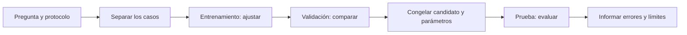

# Unidad 10 — Flujo de aprendizaje y líneas base

[Unidad anterior: exploración y visualización](../unidad09-exploracion-visualizacion/README.md) · [Volver al índice](../README.md)

Ya sabemos formular preguntas, revisar la procedencia de los datos, prepararlos y explorar sus patrones. Ahora necesitamos organizar un experimento predictivo: aprender con un conjunto de casos, tomar decisiones con otro y reservar una evaluación final.

Antes de entrenar un modelo complejo, construiremos **líneas base**: referencias sencillas que permiten saber qué aporta una alternativa. Una media, una mediana, el valor anterior o la clase más frecuente pueden ser competidores útiles. Superarlos en un conjunto pequeño no demuestra todavía utilidad real.

## Objetivos

Al terminar podrás:

- Distinguir entrada, objetivo, unidad de predicción, horizonte y momento de disponibilidad.
- Explicar para qué sirven entrenamiento, validación y prueba.
- Elegir una partición según la pregunta: nuevos casos, períodos futuros o grupos no vistos.
- Ajustar transformaciones y referencias únicamente con entrenamiento.
- Comparar candidatos sobre los mismos casos y con una métrica fijada de antemano.
- Construir líneas base de regresión y clasificación con Python básico.
- Calcular MAE, RMSE y una matriz de confusión pequeña.
- Reconocer una exactitud alta que oculta fallos importantes.
- Consultar prueba sin volver a elegir el candidato por su resultado.
- Registrar datos, parámetros, predicciones, errores y limitaciones del experimento.

## Antes de comenzar

Completa las unidades 0 a 9. Repasa la [disponibilidad temporal](../unidad07-obtencion-datos/README.md), el [ajuste de transformaciones](../unidad08-preparacion-datos/README.md) y los [denominadores y grupos](../unidad09-exploracion-visualizacion/README.md).

Los programas de esta unidad se comprobaron con **Python 3.12.3 en Linux** y utilizan solo su biblioteca estándar. No requieren nuevas instalaciones, GPU, cuentas ni Internet. El verificador de todo el curso sigue necesitando las dependencias gráficas declaradas en la Unidad 9.

Ejecuta los comandos desde la raíz del repositorio, con tu entorno virtual activo. Los datos son sintéticos, pequeños y regenerables. No son una ampliación de los sensores de las unidades 7–9 ni una muestra de equipos reales.

## 1. Definir qué se predice y cuándo

Un problema de aprendizaje supervisado relaciona entradas `X` con un objetivo `y` observado para casos históricos. En producción conocemos las entradas disponibles al decidir y emitimos una predicción `ŷ`; el objetivo verdadero se conocerá según el proceso de medición.

| Elemento | Laboratorio de regresión | Laboratorio de clasificación |
|---|---|---|
| Pregunta | ¿Cuánta energía se consumirá en las siguientes 24 horas? | ¿Se registrará un fallo en las siguientes 24 horas del aviso? |
| Unidad de predicción | Un día de una instalación sintética | Un aviso de un equipo sintético |
| Entrada permitida | Consumo del día anterior, o su ausencia | Señal previa: baja/alta |
| Objetivo | Consumo del período futuro, en kWh | `fallo_24h`: 0 o 1 |
| Generalización que se intenta examinar | Fechas posteriores en la misma instalación | Equipos no usados al ajustar |
| Identificadores | Sirven para auditar, no se usan como entradas | Equipo y caso permiten separar y revisar, no predecir |

**Regresión** predice un valor numérico; **clasificación** predice una categoría. Aunque una categoría se codifique como 0 o 1, su significado sigue siendo categórico. Las unidades 11 y 12 profundizarán en cada tarea.

No debe entrar como característica información producida después de la decisión: el consumo que intentas anticipar, el diagnóstico posterior o el resultado de la inspección. Que una columna exista en el archivo histórico no significa que estuviera disponible entonces.

## 2. Tres conjuntos, tres funciones

| Conjunto | Para qué se usa | Qué puede aprenderse o decidirse con él |
|---|---|---|
| Entrenamiento | Ajustar parámetros | Medianas de imputación, constantes y mayorías |
| Validación | Comparar alternativas durante el desarrollo | Selección entre candidatos definidos; revisión del diseño |
| Prueba | Evaluar el procedimiento elegido | Un resultado final que se comunica con sus límites |



El protocolo incluye partición, entradas, candidatos, transformación, métrica principal y desempate. Si cambias algo después de revisar validación, registra otra versión. Es normal desarrollar con validación; lo que no debemos hacer es presentar su mejor resultado como una evaluación independiente de todas esas decisiones.

La [guía de validación de scikit-learn](https://scikit-learn.org/stable/modules/cross_validation.html) explica la separación entre selección y evaluación. Aquí no instalamos esa biblioteca: implementamos referencias pequeñas para poder inspeccionar cada paso.

Consultar prueba, modificar el procedimiento para mejorar ese resultado y volver a reportarlo como «prueba final» usa la misma información para elegir y evaluar. En un proyecto real, esa prueba pasa a formar parte del desarrollo; se necesita una evaluación nueva apropiada para las siguientes afirmaciones.

En estos laboratorios **no reajustamos con entrenamiento más validación** antes del cierre. Conservamos los parámetros que se compararon. Otro protocolo puede prever ese reajuste, pero debe fijarlo antes de consultar prueba y repetir correctamente todas las transformaciones; no mezclar ambas prácticas sin explicarlo.

## 3. La partición debe parecerse a la pregunta

### Casos aproximadamente independientes

Una partición aleatoria puede servir para estudiar nuevos casos de una misma población cuando su dependencia es compatible con ese diseño. Se fija una semilla para reproducir la asignación. Una semilla no elimina sesgos ni hace independientes a observaciones relacionadas.

En clasificación, una partición estratificada puede ayudar a conservar proporciones de clases. No garantiza suficientes casos minoritarios, no resuelve dependencia por grupos y no sustituye restricciones temporales. Como lectura posterior, [`train_test_split`](https://scikit-learn.org/stable/modules/generated/sklearn.model_selection.train_test_split.html) documenta semilla y estratificación.

### Predicción hacia el futuro

Entrenamiento debe preceder a validación y esta a prueba. Además, las **etiquetas** del bloque anterior deben haber llegado al momento de preparar el siguiente. Si el objetivo tarda siete días en observarse, ordenar solo la fecha de cada fila puede ser insuficiente; puede hacer falta un margen entre bloques.

Nuestro caso usa objetivos disponibles 24 horas después y comprueba ese límite. Una partición aleatoria de sus días contestaría otra pregunta y mezclaría pasado y futuro durante el ajuste. [`TimeSeriesSplit`](https://scikit-learn.org/stable/modules/generated/sklearn.model_selection.TimeSeriesSplit.html) ilustra un esquema temporal con bloques sucesivos; nuestro laboratorio usa un solo corte fijo para cada conjunto.

### Equipos, personas o centros no vistos

Si varias filas proceden del mismo equipo y queremos evaluar equipos nuevos, mantenemos cada equipo completo en un conjunto. Separar filas al azar podría poner observaciones muy relacionadas en entrenamiento y evaluación. [`GroupShuffleSplit`](https://scikit-learn.org/stable/modules/generated/sklearn.model_selection.GroupShuffleSplit.html) documenta la asignación por grupos; aquí usamos una asignación fija, sin sorteo.

La prueba por grupos no garantiza por sí misma predicción temporal futura. Puede hacer falta combinar restricciones de grupo y tiempo. En nuestro segundo laboratorio no hay fechas: se practica separación por equipos bajo el supuesto de que los avisos históricos y sus etiquetas de entrenamiento están disponibles antes del despliegue. No se audita un corte temporal con ese archivo.

Los porcentajes 60/20/20 o 80/20 no son reglas universales. Importan la cantidad de grupos, la representación de clases, el horizonte y la precisión de evaluación que se necesita. Seis días o dos equipos sirven para comprobar código, pero ofrecen evidencia muy limitada sobre otros períodos o equipos.

## 4. Una línea base también tiene un procedimiento

| Referencia | Qué aprende de entrenamiento | Cómo predice |
|---|---|---|
| Mediana del objetivo | Una mediana | Repite ese número para cada caso |
| Media del objetivo | Una media | Repite ese número para cada caso |
| Persistencia | Solo la mediana de entrada para el respaldo por faltantes | Repite el consumo anterior disponible; si falta, usa el respaldo |
| Mayoría global | Clase más frecuente | Predice esa clase para todos |
| Mayoría por señal | Clase más frecuente dentro de baja y alta | Consulta la categoría de señal de cada aviso |

La última es una referencia algo más informativa: una tabla de dos categorías, no un clasificador avanzado. Si una categoría no tiene casos de entrenamiento, se usa la mayoría global y se registra soporte cero. En un empate de clases se elige 0 por convenio explícito; no porque siempre sea una decisión adecuada en una aplicación real.

La documentación de [estimadores de referencia de scikit-learn](https://scikit-learn.org/stable/modules/model_evaluation.html#dummy-estimators) incluye estrategias constantes como media, mediana y clase más frecuente. Nuestro código añade persistencia y la tabla por señal para comparar referencias pertinentes al caso.

Una línea base no debe recibir menos información legítima, menos datos de evaluación ni un tratamiento de faltantes más desfavorable solo para que otra alternativa parezca mejor. Tampoco hace falta escalar por costumbre: las referencias de consumo trabajan directamente en kWh y la tabla de categorías no necesita min-max.

## 5. Del ajuste a la predicción, sin filtración

La mediana usada para imputar se calcula solo con entradas observadas de entrenamiento. Después se aplica sin recalcular a validación y prueba. La mediana del **objetivo** de entrenamiento, usada para una predicción constante, es otro parámetro: no debe confundirse con la mediana de la **entrada** para imputar.

En el Laboratorio 1 esas cantidades son 22.0 y 21.5 kWh, respectivamente. Si el consumo anterior falta, persistencia predice 21.5. La constante mediana predice 22.0 para todos los casos, tenga o no entrada.

El código separa funciones:

```python
parametros = ajustar(entrenamiento, tarea)
entradas = entradas_de(validacion, tarea)
predicciones = predecir(entradas, parametros, candidato, tarea)
resultado = evaluar(validacion, predicciones, tarea)
```

`entradas_de()` entrega al predictor solo la columna permitida; no incluye objetivos ni identificadores. `evaluar()` sí recibe las respuestas observadas para calcular errores. Así resulta más fácil revisar dónde se usa cada información. La [guía sobre filtración de información](https://scikit-learn.org/stable/common_pitfalls.html#data-leakage) desarrolla por qué también los pasos de preparación deben aprenderse en el conjunto permitido.

## 6. Métricas mínimas para comparar

### Regresión: tamaño y dirección del error

Para valores reales `y` y predicciones `ŷ`:

$$
MAE = \frac{1}{n}\sum_{i=1}^{n}|y_i-\hat{y}_i|,
\qquad
RMSE = \sqrt{\frac{1}{n}\sum_{i=1}^{n}(y_i-\hat{y}_i)^2}.
$$

Ambas se expresan en las unidades del objetivo y cuanto menores, mejor bajo ese criterio. RMSE da más peso a errores grandes. Elegimos **MAE como métrica principal** antes de comparar; RMSE se conserva como diagnóstico, no como excusa para cambiar de ganador después.

Ejemplo manual: reales `10, 14, 12`, predicciones `11, 12, 13`. Los errores `real − predicción` son `−1, 2, −1`. Así, `MAE = 4/3 ≈ 1.333` y `RMSE = √2 ≈ 1.414`. El error medio firmado vale cero: errores positivos y negativos se cancelan. No significa que todas las predicciones sean correctas.

El informe llama `sesgo` a ese error medio firmado descriptivo. Un valor positivo indica subestimación media en los casos evaluados; no equivale a conocer el sesgo estadístico del estimador en una población. Al comparar constantes con MAE conviene incluir la mediana; para error cuadrático la media es una referencia natural. En estos datos ambas coinciden, pero eso no sucede siempre.

### Clasificación: qué errores se cometen

La clase positiva es `fallo_24h = 1`:

| Real / predicción | Predice 1 | Predice 0 |
|---|---|---|
| Real 1 | Verdadero positivo, VP | Falso negativo, FN |
| Real 0 | Falso positivo, FP | Verdadero negativo, VN |

$$
\text{exactitud} = \frac{VP+VN}{n},\quad
\text{precisión} = \frac{VP}{VP+FP},\quad
\text{recobrado} = \frac{VP}{VP+FN}.
$$

Precisión pregunta cuántos avisos predichos positivos eran positivos; recobrado, cuántos positivos reales encontramos. El recobrado también se conoce como sensibilidad o *recall*. No confundas la precisión de clasificación con la exactitud global.

Usaremos **F1 de la clase positiva** para seleccionar en el segundo laboratorio:

$$
F1 = \frac{2VP}{2VP+FP+FN}.
$$

Esta [definición de F1](https://scikit-learn.org/stable/modules/generated/sklearn.metrics.f1_score.html) combina precisión y recobrado. F1 no usa VN y no representa directamente costos económicos ni probabilidades calibradas. Es una elección didáctica para que detectar positivos cuente; otra tarea puede requerir costos, límites de falsas alarmas u otra métrica. Se profundizará en la Unidad 17.

Cuando un denominador es cero, nuestras funciones devuelven `None` y muestran «no definida». Si hay positivos reales pero ninguna predicción positiva, precisión no está definida, mientras que recobrado y F1 valen cero. Si no hay positivos reales ni predichos, F1 tampoco está definido. Son convenciones que hay que declarar: una biblioteca puede ofrecer otra opción para estos casos.

## 7. Laboratorio 1 — Predecir consumo con un corte temporal

### Protocolo antes de ejecutar

Unidad de predicción: un día de una instalación sintética. A las 00:00 UTC−05:00 se intenta predecir el consumo de las siguientes 24 horas. El valor del día anterior está disponible a esa hora, salvo faltantes simulados. La etiqueta del período que comienza se conoce 24 horas después.

| Conjunto | Casos | Momentos de predicción |
|---|---:|---|
| Entrenamiento | 20 | 2–21 de enero de 2026 |
| Validación | 6 | 22–27 de enero de 2026 |
| Prueba | 6 | 28 de enero–2 de febrero de 2026 |

Comparamos mediana, media y persistencia. Seleccionamos menor MAE de validación, con valores sin redondear. En un empate exacto se conserva el orden `mediana`, `media`, `persistencia`. No reajustamos antes del cierre. El [protocolo completo](datos/protocolo.md) y el [diccionario de datos](datos/README.md) dejan estas decisiones por escrito.

### Ejecuta la comparación

```bash
python unidad10-flujo-lineas-base/ejemplos/01_lineas_base_regresion.py
```

Salida:

```text
Protocolo: lineas-base-v1; tarea: regresion
Entrenamiento: 20; validación: 6
Ajuste: {'mediana': 22.0, 'media': 22.0, 'mediana_entrada': 21.5}
Validación: candidato | MAE kWh | RMSE kWh | sesgo (real - predicción) kWh
mediana | 2.833 | 3.240 | 2.833
media | 2.833 | 3.240 | 2.833
persistencia | 2.083 | 2.170 | 0.750
Seleccionado por mae: persistencia
Prueba reservada: no se leyó su archivo.
Datos sintéticos: estas métricas no demuestran utilidad en equipos reales.
```

La media y mediana del objetivo de entrenamiento coinciden en 22.0, por eso sus resultados son iguales. Persistencia reduce MAE en `0.750` kWh, aproximadamente un 26.47 % respecto de la constante en estos seis casos. La comparación usa exactamente los mismos identificadores y objetivos.

La instalación sintética cambia de nivel con el tiempo. Copiar una observación reciente puede seguir ese cambio mejor que una constante histórica. Eso no demuestra que siempre ocurra ni que persistencia resuelva un problema energético real.

### Guarda la evidencia e inspecciona errores

```bash
python unidad10-flujo-lineas-base/ejemplos/01_lineas_base_regresion.py --salida resultados/unidad10/regresion-validacion
```

Se crean `informe.json` y `predicciones_validacion.csv`. El CSV tiene 18 filas: seis casos para cada uno de tres candidatos. Cada fila conserva identificador, real, predicción, error firmado, error absoluto y si la entrada faltaba. Esa última marca describe el dato: solo persistencia utiliza su imputación; las constantes ignoran la entrada.

Localiza R23: falta el consumo anterior y persistencia usa 21.5 kWh. No se elimina esa fila para mejorar la métrica. El JSON incluye huellas, tamaños, parámetros, criterio, desempate, selección y todas las predicciones. El archivo de prueba no se abre en esta ejecución.

### Experimenta antes del cierre

En una copia de entrenamiento bajo `resultados/`, cambia un objetivo extremo o un consumo anterior. Usa `--datos` para señalar una carpeta con los CSV copiados y compara cuál parámetro cambia. Mantén intactos los archivos de referencia. Después prueba modificar solo validación: las métricas pueden cambiar, pero el ajuste debe permanecer igual. Registra esto como un experimento distinto.

El lector rechaza entradas fechadas después de predecir, etiquetas fuera del horizonte declarado y particiones temporales que se solapan. Que pase esos controles no garantiza que un reloj o una medición reales sean correctos; verifica también su procedencia.

### Cierre explícito

Cuando hayas fijado el protocolo, vuelve a los datos originales y ejecuta:

```bash
python unidad10-flujo-lineas-base/ejemplos/01_lineas_base_regresion.py --evaluar-prueba --salida resultados/unidad10/regresion-cierre
```

Se reproduce la misma selección con entrenamiento y validación, y solo entonces se lee prueba para evaluar **persistencia** con los mismos parámetros. Aparece además `predicciones_prueba.csv`.

<details>
<summary>Resultado de referencia del cierre; consúltalo después de fijar tu comparación</summary>

```text
Prueba final: n=6; solo persistencia; sin reajuste
mae=2.250 | rmse=2.354 | sesgo=1.250
```

El MAE final es mayor que el de validación. Se comunica ese resultado sin volver a elegir entre referencias usando prueba. La subestimación media es 1.250 kWh en esos seis días.

</details>

**El horizonte es de un día con observaciones actualizadas cada día.** Al llegar al segundo día de prueba se puede utilizar el consumo real del día anterior, ya disponible. Eso no reajusta parámetros ni anticipa información. Sería otro problema predecir de una vez los seis días sin recibir nuevas observaciones: persistencia tendría que definirse de otra manera y estas métricas no describirían ese escenario.

## 8. Laboratorio 2 — Clasificar avisos de equipos no vistos

### Protocolo antes de ejecutar

Cada fila es un aviso sintético. La señal baja/alta está definida antes de observar si habrá un fallo en 24 horas. El identificador del equipo se usa para separar y auditar; no entra al predictor.

| Conjunto | Equipos completos | Avisos |
|---|---|---:|
| Entrenamiento | E01, E02, E03, E04 | 32 |
| Validación | E05, E06 | 16 |
| Prueba | E07, E08 | 16 |

Cada equipo tiene ocho avisos. La asignación es fija, sin sorteo ni semilla. Se comparan mayoría global y mayoría por señal; se maximiza F1 positivo de validación. En empate se elige primero `mayoria`, la referencia más sencilla. En este conjunto la clase 1 es menos frecuente; examinamos también exactitud, precisión, recobrado y conteos de errores.

### Ejecuta y lee más allá de la exactitud

```bash
python unidad10-flujo-lineas-base/ejemplos/02_lineas_base_clasificacion.py
```

Salida:

```text
Protocolo: lineas-base-v1; tarea: clasificacion
Entrenamiento: 32; validación: 16
Ajuste: {'mayoria': 0, 'por_senal': {'baja': 0, 'alta': 1}, 'soportes': {'baja': 24, 'alta': 8}}
Validación: candidato | exactitud | precisión | recobrado | F1
mayoria | 0.812 | no definida | 0.000 | 0.000
por_senal | 0.938 | 0.750 | 1.000 | 0.857
Seleccionado por f1: por_senal
Prueba reservada: no se leyó su archivo.
Datos sintéticos: estas métricas no demuestran utilidad en equipos reales.
```

Las salidas de pantalla se redondean a tres decimales; las decisiones y el JSON conservan los valores calculados. La exactitud de la mayoría es exactamente `13/16 = 81.25 %`, pero falla en los tres positivos. Su recobrado y F1 son cero. Decir solo «más del 80 % de aciertos» ocultaría el problema.

| Candidato | VP | VN | FP | FN | F1 |
|---|---:|---:|---:|---:|---:|
| Mayoría | 0 | 13 | 0 | 3 | 0 |
| Por señal | 3 | 12 | 1 | 0 | `6/7 ≈ 0.857` |

La tabla por señal aprendió 0 para baja y 1 para alta. Se ajustó con 24 avisos bajos y ocho altos de entrenamiento. El único error de validación es C06-08, un falso positivo: señal alta y objetivo cero.

### Exporta y experimenta

```bash
python unidad10-flujo-lineas-base/ejemplos/02_lineas_base_clasificacion.py --salida resultados/unidad10/clasificacion-validacion
```

El CSV de validación contiene 32 predicciones: 16 casos por cada candidato. Incluye equipo y tipo de resultado VP/VN/FP/FN para revisar errores por grupo.

En una copia, cambia el equipo de una fila de validación a E01 sin repetir el identificador del aviso. El programa debe rechazarla: separar identificadores de fila no basta para separar equipos. Restaura la copia antes de seguir. También puedes estudiar un entrenamiento sin señal alta; el soporte será cero y la tabla usará la mayoría global para esa categoría permitida.

Si validación no contiene positivos, el programa detiene la selección por F1 y pide revisar el diseño. No buscamos repetidamente una partición que produzca un buen número. Hay que reconsiderar si existen datos suficientes y cómo evaluar la pregunta, conservando un registro de ese cambio.

### Cierre explícito

Con datos y protocolo fijados:

```bash
python unidad10-flujo-lineas-base/ejemplos/02_lineas_base_clasificacion.py --evaluar-prueba --salida resultados/unidad10/clasificacion-cierre
```

<details>
<summary>Resultado de referencia del cierre</summary>

```text
Prueba final: n=16; solo por_senal; sin reajuste
exactitud=0.938 | precision=1.000 | recobrado=0.800 | f1=0.889
```

Hay cuatro VP, once VN, cero FP y un FN. El falso negativo es C08-01. La precisión vale uno en este bloque pequeño, pero eso no garantiza ausencia futura de falsas alarmas. El recobrado cae a 0.8. Los resultados se mantienen en el informe sin redefinir señal, métrica o candidato para mejorarlos.

</details>

Tener 16 avisos no equivale a tener 16 equipos independientes: solo hay dos equipos en prueba. El generador impone una relación sencilla entre señal y objetivo. Hace falta otra evidencia para evaluar generalización, dependencia, cambio de distribución y utilidad operativa.

## 9. Cómo se organiza y registra el código

[flujo.py](ejemplos/flujo.py) contiene lectura, controles de separación, ajuste, predicción, métricas, selección y exportación. [interfaz.py](ejemplos/interfaz.py) comparte los argumentos de los dos programas. Los [CSV y su generador](datos/README.md) permiten reproducir los datos byte a byte.

La ejecución común abre entrenamiento y validación, revisa sus identificadores y restricciones, ajusta con entrenamiento y compara validación. `--evaluar-prueba` abre el tercer archivo **después** de seleccionar; comprueba su separación y evalúa solo al candidato elegido, sin reajuste.

La opción es una separación operativa del ejemplo, no una caja fuerte. Los CSV son públicos, puedes leerlos y los resultados educativos están documentados. Tampoco impide ejecutar muchas veces el cierre. Repetir exactamente el mismo cálculo comprueba reproducibilidad; ajustar decisiones después de verlo ya usa prueba para desarrollar.

Cada ejecución vuelve a usar los archivos actuales. Para un cierre comparable, conserva el mismo commit, protocolo y huellas de entrenamiento y validación; contrasta además los parámetros y la selección entre informes. El programa no certifica que nunca hayas consultado prueba previamente.

Guarda cada entrega en un directorio nuevo bajo `resultados/unidad10/`. No se sobrescribe una carpeta existente. Si una escritura falla, puede dejar archivos parciales: conserva lo necesario para diagnosticarla y repite en otra carpeta. `informe.json` se escribe después de las tablas y no es una firma digital ni una garantía de autenticidad.

## 10. Errores frecuentes

| Error | Por qué afecta la evaluación | Qué revisar |
|---|---|---|
| Ajustar y evaluar sobre las mismas filas | Mide ajuste a casos ya usados | Separación coherente con la pregunta |
| Imputar antes de separar usando todo el archivo | Incorpora información de evaluación | Ajustar la mediana solo con entrenamiento |
| Partir días al azar para pronosticar futuro | Mezcla información temporal | Cortes y llegada de las etiquetas |
| Separar avisos del mismo equipo entre conjuntos | No representa equipos nuevos | Grupos completos y claves disjuntas |
| Utilizar diagnóstico posterior como entrada | La información no existía al decidir | Auditoría de disponibilidad |
| Elegir la métrica que mejor luce después de ejecutar | Cambia la regla de comparación por conveniencia | Métrica principal y diagnóstico separados |
| Comparar candidatos en filas diferentes | Confunde dificultad de casos con calidad | Mismos identificadores y tratamiento declarado |
| Mostrar solo exactitud con clase rara | Puede ocultar todos los positivos omitidos | Matriz de confusión y métrica pertinente |
| Elegir el ganador mirando prueba | Convierte prueba en desarrollo | Selección previa y evaluación nueva si se rediseña |
| Interpretar una mejora pequeña como utilidad demostrada | Ignora tamaño, dependencia y costo real | Más evidencia, estabilidad y contexto de decisión |

## 11. Ejercicios

Resuelve antes de consultar las [soluciones razonadas](soluciones/README.md).

1. Define unidad de predicción, entrada, objetivo, horizonte e instante de disponibilidad para anticipar el consumo diario. Da un ejemplo de filtración por una columna futura.
2. Explica qué puede aprenderse con entrenamiento, qué se decide con validación y qué se informa con prueba. ¿Qué cambia si modificas el modelo después de leer prueba?
3. Elige una partición para predecir mañana en la misma instalación y otra para equipos no vistos. Explica por qué una semilla o un porcentaje fijo no resuelven ambos problemas.
4. Con objetivos de entrenamiento `2, 2, 8`, calcula media y mediana. Para objetivos de validación `2, 3`, calcula MAE de ambas constantes y selecciona por ese criterio.
5. Reproduce MAE, RMSE y error medio firmado de reales `10, 14, 12` y predicciones `11, 12, 13`. Explica por qué el error medio cero no basta.
6. Entradas de entrenamiento `10, None, 14`: ¿qué predice persistencia para entradas `None, 0, 20`? Explica qué información no debes usar para calcular el respaldo.
7. Calcula exactitud, precisión, recobrado y F1 cuando `VP=3`, `VN=12`, `FP=1`, `FN=0`. Compáralo con predecir siempre cero para los mismos casos.
8. Un equipo aparece en entrenamiento y validación con identificadores de aviso distintos. ¿Pasa la evaluación de equipos nuevos? Propón un control automático.
9. Un objetivo de entrenamiento se conocerá el 5 de febrero, pero validación empieza el 4. ¿Basta que las fechas de predicción estén ordenadas? Explica la corrección del diseño sin descartar filas por conveniencia.
10. Redacta un registro mínimo del experimento de clasificación: criterio, partición, parámetros, métrica principal, error concreto y límite. Añade qué harías si un modelo más complejo no superara la línea base en validación.

## 12. Reto aplicado y verificación

Entrega una comparación reproducible de líneas base con un protocolo previo y un cierre separado. Consulta el [reto y su rúbrica](reto.md) y usa la [plantilla del experimento](plantillas/informe_experimento.md).

```bash
python -m unittest discover -s unidad10-flujo-lineas-base/pruebas -v
python herramientas/verificar_curso.py
```

Las 24 pruebas incluyen cálculos manuales de métricas, casos sin positivos, datos inválidos, regeneración exacta, separación por tiempo/grupo y exportación. También verifican que validación no cambie el ajuste, que la ejecución común no necesite el archivo de prueba y que alterar sus objetivos no modifique ajuste, selección ni predicciones. Esas comprobaciones no convierten una muestra sintética pequeña en evidencia poblacional.

- [ ] Puedo definir qué información existe al emitir una predicción.
- [ ] Distingo ajuste, selección y evaluación final.
- [ ] Justifico la partición según tiempo, grupos y unidad de observación.
- [ ] Calculo al menos una línea base y su métrica a mano.
- [ ] Conservo los mismos casos al comparar candidatos.
- [ ] Reviso falsos positivos y negativos, además del número agregado.
- [ ] Registro el cierre sin elegir otra vez sobre prueba.
- [ ] Distingo reproducibilidad del código y utilidad fuera de esta demostración.

La siguiente entrega prevista es la **Unidad 11 — Regresión**, todavía pendiente de desarrollo. Comparará modelos numéricos con referencias sencillas dentro de un procedimiento de evaluación explícito.

## Referencias

Fuentes primarias consultadas el 9 de octubre de 2026. Los datos, protocolos y programas son elaboraciones educativas del curso. No se utiliza scikit-learn en estos programas.

- [Scikit-learn: validación, grupos y series temporales](https://scikit-learn.org/stable/modules/cross_validation.html).
- [Scikit-learn: referencias simples para evaluación](https://scikit-learn.org/stable/modules/model_evaluation.html#dummy-estimators).
- [Scikit-learn: prevención de filtración de información](https://scikit-learn.org/stable/common_pitfalls.html#data-leakage).
- [Scikit-learn: F1 y casos de división por cero](https://scikit-learn.org/stable/modules/generated/sklearn.metrics.f1_score.html).

[Volver al índice](../README.md)
