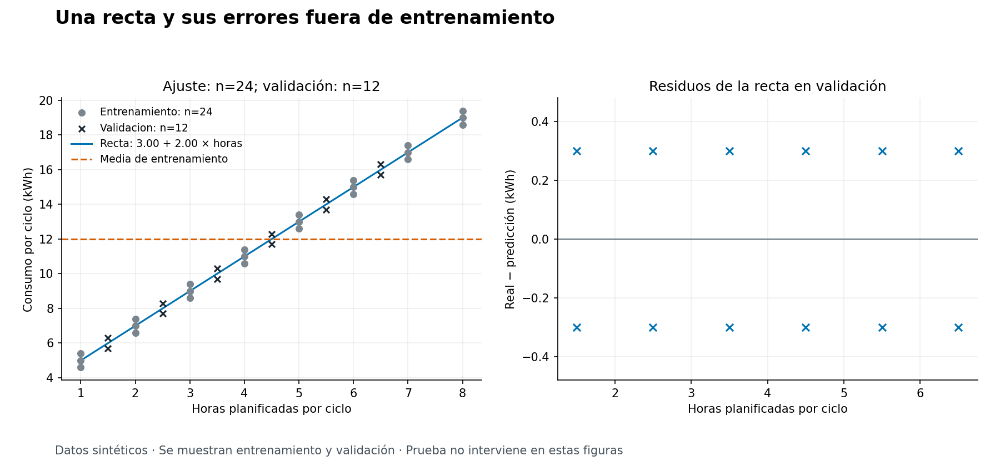
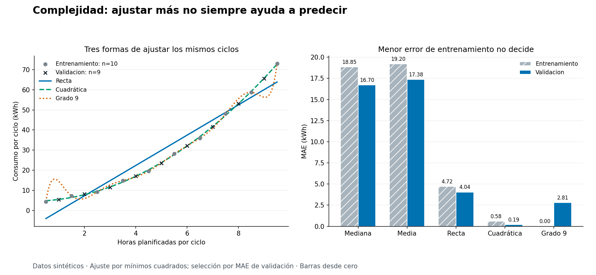
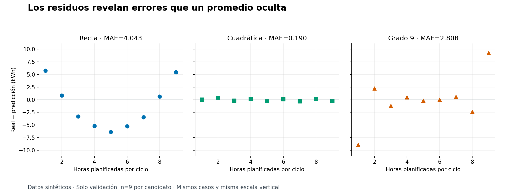

# Unidad 11 — Regresión

[Índice del curso](../README.md) · [Anterior: flujo de aprendizaje y líneas base](../unidad10-flujo-lineas-base/README.md)

En la Unidad 10 comparamos referencias sencillas sin confundir ajuste, selección y evaluación final. Ahora aprenderemos una relación entre una entrada y un objetivo numérico: **¿cómo ajustar un modelo, examinar sus errores y comprobar si mejora una referencia en casos que no usó para entrenar?**

La práctica usa ciclos de operación sintéticos. Antes de cada ciclo conocemos las horas planificadas; al terminar medimos el consumo de energía. Primero ajustaremos una recta. Después compararemos modelos de distinta complejidad y veremos por qué pasar exactamente por los puntos de entrenamiento puede producir peores predicciones.

## Objetivos

Al terminar podrás:

- Definir entrada, objetivo y unidades de un problema de regresión.
- Interpretar pendiente e intercepto dentro del alcance observado.
- Calcular una recta por mínimos cuadrados con un ejemplo pequeño.
- Distinguir la función usada para ajustar de la métrica usada para seleccionar.
- Comparar modelos y líneas base sobre los mismos casos.
- Calcular e interpretar residuos, MAE, RMSE y R².
- Detectar patrones de error que una métrica agregada puede ocultar.
- Explicar sensibilidad a valores extremos, extrapolación y sobreajuste.
- Ajustar una transformación solo con entrenamiento.
- Documentar una evaluación final sin volver a elegir con prueba.

## Antes de ejecutar

Conviene haber trabajado vectores y optimización en la [Unidad 3](../unidad03-matematica-aplicada/README.md), preparación sin filtración en la [Unidad 8](../unidad08-preparacion-datos/README.md), gráficos en la [Unidad 9](../unidad09-exploracion-visualizacion/README.md) y el flujo de la [Unidad 10](../unidad10-flujo-lineas-base/README.md).

Todos los comandos se ejecutan **desde la raíz del curso**, con el entorno virtual activo:

```bash
python -m pip install -r unidad11-regresion/requirements.txt
python unidad11-regresion/ejemplos/01_ajustar_recta.py
python unidad11-regresion/ejemplos/02_comparar_complejidad.py
```

Entorno comprobado: Python 3.12.3, NumPy 2.2.6 y Matplotlib 3.10.8, en CPU. El archivo de requisitos reutiliza las versiones de la Unidad 9. El primer laboratorio sin gráficos y el experimento de sensibilidad usan biblioteca estándar; el segundo requiere NumPy. Los gráficos y la suite completa requieren ambos paquetes. Tras la instalación no se necesitan Internet, GPU ni servicios externos.

Los datos son nuevos: **no reutilizamos la prueba de la Unidad 10** para seleccionar modelos. Consulta el [diccionario y generador](datos/README.md) y el [protocolo previo](datos/protocolo.md). Los archivos de prueba son públicos y las respuestas están documentadas: sirven para estudiar el procedimiento, no constituyen una evaluación externa ciega.

## 1. De la pregunta al modelo

Una fila representa un ciclo de operación. El identificador permite seguir el caso; no entra al predictor. La entrada es `horas_planificadas`, en horas, y el objetivo es `consumo_kwh`, en kilovatios hora. La predicción se emite antes del ciclo para anticipar su consumo total.

Declaramos que las horas planificadas se conocen antes de decidir. Los CSV no contienen marcas temporales ni equipos: **no permiten auditar esa disponibilidad ni evaluar generalización temporal o a equipos nuevos**. Es un supuesto del escenario sintético, no una propiedad comprobada en registros reales.

Una recta con intercepto propone:

```text
consumo_predicho = a + b × horas_planificadas
```

- `a` es el intercepto, en kWh.
- `b` es la pendiente, en kWh por hora.
- Los valores de `a` y `b` se aprenden con entrenamiento.

Si `a = 3` y `b = 2`, para 5 horas obtenemos `3 + 2 × 5 = 13 kWh`. El modelo aumenta su predicción en 2 kWh por cada hora adicional. Eso describe la relación ajustada; no demuestra que intervenir sobre las horas cause exactamente ese cambio.

El intercepto es la predicción para cero horas. Si solo entrenamos entre 1 y 8 horas, interpretarlo como consumo real en reposo requiere evidencia adicional: cero está fuera del rango observado. Tampoco debemos usar kW y kWh como si fueran la misma magnitud: potencia y energía responden a preguntas distintas.

Con varias entradas, una extensión sería `a + b1 × x1 + b2 × x2`. Esta unidad conserva una entrada para poder revisar el ajuste a mano y dibujar cada predicción. Agregar variables exige revisar su disponibilidad y su aporte, no solo añadir columnas.

## 2. Cómo se aprende la recta

El **residuo** de un caso es el valor real menos la predicción:

```text
e_i = y_i − prediccion_i
SSE = suma(e_i²)
```

Un residuo positivo indica que el modelo subestimó el consumo; uno negativo, que lo sobreestimó. Mínimos cuadrados elige `a` y `b` para minimizar la suma de errores al cuadrado en entrenamiento. Con un número fijo de casos, minimizar SSE equivale a minimizar MSE, su promedio. El cuadrado hace que los errores grandes pesen más.

Con intercepto y una entrada que varía, la solución es:

```text
x_media = promedio(x)
y_media = promedio(y)
b = suma((x_i − x_media) × (y_i − y_media)) / suma((x_i − x_media)²)
a = y_media − b × x_media
```

Si todas las entradas son iguales, el denominador es cero: no podemos identificar una pendiente única. El programa rechaza ese ajuste; una referencia constante todavía puede ser válida. La formulación de mínimos cuadrados está desarrollada en el [manual de NIST](https://www.itl.nist.gov/div898/handbook/pmd/section4/pmd431.htm).

### Un cálculo completo

Supón tres pares: `(1, 2)`, `(2, 4)` y `(3, 5)`.

| x | y | x − 2 | y − 11/3 | Producto de desviaciones |
|---:|---:|---:|---:|---:|
| 1 | 2 | −1 | −5/3 | 5/3 |
| 2 | 4 | 0 | 1/3 | 0 |
| 3 | 5 | 1 | 4/3 | 4/3 |

La suma de productos es 3 y la suma de desviaciones cuadradas de x es 2. Por tanto, `b = 3/2` y `a = 11/3 − (3/2) × 2 = 2/3`.

| x | Predicción `2/3 + (3/2)x` | Residuo |
|---:|---:|---:|
| 1 | 13/6 | −1/6 |
| 2 | 11/3 | 1/3 |
| 3 | 31/6 | −1/6 |

Los residuos suman cero y su MAE es `(1/6 + 1/3 + 1/6) / 3 = 2/9`. Un promedio de residuos cercano a cero no significa ausencia de errores. En mínimos cuadrados con intercepto esa suma es cero en entrenamiento, salvo redondeo numérico; es una propiedad del ajuste, no una prueba de utilidad.

En la Unidad 3 vimos actualizaciones mediante gradientes. Para `J = SSE/n`, las derivadas son `dJ/da = −2 × suma(e_i)/n` y `dJ/db = −2 × suma(x_i × e_i)/n`. Aquí usamos una solución directa: no necesitamos tasa de aprendizaje ni iteraciones. Ambos enfoques conectan con la misma función objetivo para esta recta.

## 3. Ajustar, seleccionar e interpretar

No todas las etapas usan el mismo criterio:

| Etapa | Datos | Regla de esta unidad |
|---|---|---|
| Ajustar media y mediana | Entrenamiento | Calcular cada constante con sus objetivos |
| Ajustar recta o polinomio | Entrenamiento | Minimizar suma de residuos al cuadrado |
| Seleccionar candidato | Validación | Menor MAE, sin redondear para decidir |
| Evaluar al elegido | Prueba, solo al cierre | Informar errores sin cambiar la selección |

La mediana minimiza el error absoluto entre predicciones constantes sobre entrenamiento; la media minimiza el error cuadrático entre constantes. Eso no determina cuál ganará en validación. Todos los candidatos deben predecir los mismos identificadores y ninguno recibe el objetivo del caso al predecir.

Reutilizamos MAE, RMSE y error medio firmado de la Unidad 10. MAE y RMSE se expresan en kWh. El informe usa `sesgo` para el promedio de `real − predicción`: resume dirección del error, no prueba una causa ni estima por sí solo el sesgo estadístico del algoritmo.

### Qué añade R²

En el conjunto que estamos evaluando:

```text
SSE = suma((real_i − prediccion_i)²)
SST = suma((real_i − promedio_de_reales_evaluados)²)
R² = 1 − SSE / SST
```

R² vale 1 para una predicción perfecta cuando SST es positiva. Puede ser negativo: el error cuadrático supera al de predecir la media de los objetivos de ese conjunto. Esa media se usa para describir la métrica; **no es la línea base desplegable**, que debe ajustarse con entrenamiento.

R² no es un porcentaje de aciertos ni la probabilidad de que la predicción sea correcta. Para reales `1, 2, 3` y predicciones `4, 4, 4`, tenemos `SST = 2`, `SSE = 14` y `R² = −6`.

Con un solo caso o un objetivo constante, esta implementación informa `no definido` y guarda `null`. No sustituye esos casos por 0 o 1. Algunas bibliotecas aplican otras convenciones por defecto; véase [R² y `force_finite` en scikit-learn](https://scikit-learn.org/stable/modules/generated/sklearn.metrics.r2_score.html). No necesitamos instalar esa biblioteca para esta unidad.

## 4. Laboratorio 1 — Una recta y dos referencias

El conjunto `lineal` tiene 24 ciclos de entrenamiento, 12 de validación y 12 de prueba. Entrenamiento abarca de 1 a 8 horas. Comparamos mediana, media y recta bajo el protocolo ya definido.

```bash
python unidad11-regresion/ejemplos/01_ajustar_recta.py
```

Fragmento de la salida comprobada:

```text
Recta: consumo = 3.000 + 2.000 * horas
candidato | MAE entrenamiento | MAE validación | RMSE validación | R² validación
mediana | 4.000 | 3.050 | 3.572 | -0.085
media | 4.000 | 3.050 | 3.572 | -0.085
recta | 0.267 | 0.300 | 0.300 | 0.992
Seleccionado por MAE de validación: recta
Prueba reservada: no se leyó su archivo.
```

Media y mediana de entrenamiento valen 12 kWh. La recta reduce el MAE de validación de 3,050 a 0,300 kWh, sobre los mismos 12 casos. Esto demuestra el comportamiento del ejemplo construido, no una mejora garantizada en instalaciones reales.

El programa [01_ajustar_recta.py](ejemplos/01_ajustar_recta.py) usa las funciones compartidas de [regresion.py](ejemplos/regresion.py): lee las particiones de desarrollo, valida identificadores, ajusta los tres candidatos, obtiene sus predicciones y elige por MAE de validación. La función de predicción recibe el modelo y las horas; no recibe consumo real ni identificador.

Para exportar predicciones y figura:

```bash
python unidad11-regresion/ejemplos/01_ajustar_recta.py --salida resultados/unidad11/lineal-validacion --graficos
```



La figura combina ajuste y errores fuera de entrenamiento. Los seis residuos positivos y seis negativos de validación tienen magnitud 0,3 kWh. Las bandas son resultado del generador; no prueban normalidad ni independencia. Las tablas exportadas contienen 72 predicciones de entrenamiento —24 por tres candidatos— y 36 de validación. Prueba sigue sin abrirse.

### Experimenta: una consulta fuera del rango

```bash
python unidad11-regresion/ejemplos/01_ajustar_recta.py --horas 10
```

Obtendrás `23.000 kWh` y la marca `fuera del rango de entrenamiento: sí`. La fórmula puede calcularlo, pero 10 supera el máximo observado de 8 horas. Es **extrapolación**. La consulta no tiene consumo observado: no permite calcular un error. La marca solo comprueba el rango de la entrada; estar dentro tampoco garantiza condiciones equivalentes ni una predicción fiable.

### Experimenta: sensibilidad a un extremo

```bash
python unidad11-regresion/soluciones/03_sensibilidad_extremo.py
```

El programa añade 20 kWh al último objetivo de entrenamiento **en memoria**, vuelve a ajustar y conserva la validación original:

```text
original: intercepto=3.000; pendiente=2.000; MAE validación=0.300
perturbado: intercepto=1.333; pendiente=2.556; MAE validación=0.933
```

El cambio de un objetivo desplaza la recta y empeora esta validación. Es una perturbación artificial, no una corrección verificada ni una razón para eliminar extremos reales. En datos reales investigaríamos procedencia, medición y condiciones de operación. Los CSV originales permanecen intactos y el script no lee prueba.

### Cierre separado

Después de guardar candidato, parámetros y huellas de desarrollo, ejecuta:

```bash
python unidad11-regresion/ejemplos/01_ajustar_recta.py --evaluar-prueba --salida resultados/unidad11/lineal-cierre
```

<details>
<summary>Resultado de referencia para comprobar el cierre</summary>

```text
Prueba final: n=12; solo recta; sin reajuste
MAE=0.200; RMSE=0.200; R²=0.997
```

El generador usa desviaciones de ±0,2 kWh en prueba. Por eso aquí su error resulta menor que el de validación. No hay una regla que obligue a prueba a ser más fácil ni más difícil.

</details>

## 5. Mirar residuos antes de confiar en el promedio

Una métrica agrega errores distintos. Un gráfico de residuos ayuda a formular preguntas sobre lo que el modelo deja sin explicar. NIST desarrolla este uso en su [guía de análisis gráfico de residuos](https://www.itl.nist.gov/div898/handbook/pmd/section4/pmd442.htm).

| Patrón observado | Pregunta que conviene investigar |
|---|---|
| Curva o forma de U | ¿Falta una relación no lineal en la entrada? |
| Mayor dispersión a consumos altos | ¿Cambia la variabilidad o importa un error relativo? |
| Diferencias por equipo o por fecha | ¿Hay estructura de grupos o cambios temporales? |
| Unos pocos errores muy grandes | ¿Hay mediciones erróneas, eventos raros o condiciones omitidas? |
| Entrenamiento casi perfecto y validación mucho peor | ¿La complejidad está adaptándose a particularidades de entrenamiento? |

Son hipótesis para investigar, no diagnósticos causales automáticos. Nuestros CSV no permiten revisar patrones por equipo o tiempo. Tampoco afirmamos normalidad porque una nube parezca simétrica.

Calcular mínimos cuadrados no exige que los errores sean normales. Justificar ciertos intervalos y pruebas estadísticas sí exige supuestos adicionales sobre el modelo y sus errores. Aquí obtenemos predicciones puntuales y errores observados; **no calculamos intervalos de confianza ni de predicción**.

Una recta también puede producir consumo negativo aunque todos los objetivos sean positivos. El programa conserva esas predicciones para que el problema sea visible. Recortarlas a cero cambiaría el predictor y tendría que declararse y evaluarse como otro procedimiento.

## 6. Laboratorio 2 — Complejidad y sobreajuste

El conjunto `curva` contiene 10 casos de entrenamiento, 9 de validación y 8 de prueba, distintos de los del laboratorio anterior. Entrenamiento abarca de 0,5 a 9,5 horas; todos los casos de validación y prueba quedan dentro de ese rango.

Los cinco candidatos estaban fijados antes de comparar:

1. Mediana constante de entrenamiento.
2. Media constante de entrenamiento.
3. Recta con intercepto y pendiente.
4. Polinomio de grado 2, con tres coeficientes.
5. Polinomio de grado 9, con diez coeficientes.

El último candidato es deliberadamente flexible: con diez entradas distintas puede interpolar diez objetivos de entrenamiento. Lo usamos para observar el riesgo de sobreajuste, no como recomendación de modelado.

### Una curva también puede ser lineal en sus parámetros

Para una cuadrática, `prediccion = c0 + c1 × z + c2 × z²`. La curva no es recta respecto de la entrada, pero sigue siendo lineal respecto de los coeficientes que se aprenden. Esta distinción se explica en [regresión lineal por mínimos cuadrados de NIST](https://www.itl.nist.gov/div898/handbook/pmd/section1/pmd141.htm).

Antes de formar las potencias, el programa calcula **solo con entrenamiento**:

```text
centro = promedio(x_entrenamiento)
escala = maximo(abs(x_entrenamiento − centro))
z = (x − centro) / escala
```

En estos datos, centro = 5 y escala = 4,5. Entrenamiento queda entre −1 y 1. Aplicamos esos mismos valores a validación, prueba y consultas, sin recalcularlos ni recortar z. Una entrada de 12 horas da `z = 14/9`, fuera del rango de entrenamiento.

La matriz contiene columnas `1, z, z², …`. Resolvemos mínimos cuadrados con [numpy.linalg.lstsq](https://numpy.org/doc/2.2/reference/generated/numpy.linalg.lstsq.html), con `rcond=None`, y comprobamos que tenga rango suficiente para identificar todos los coeficientes. No calculamos explícitamente la inversa de una matriz de ecuaciones normales. Escalar ayuda al cálculo numérico, pero **no elimina el sobreajuste**.

Los coeficientes polinómicos del JSON corresponden a potencias de **z**, no de horas. Como z es adimensional, cada coeficiente tiene unidades de kWh. No debe interpretarse el coeficiente de z como una pendiente constante por hora: la pendiente de la curva depende de la entrada y de la escala.

### Ejecutar y comparar

```bash
python unidad11-regresion/ejemplos/02_comparar_complejidad.py --salida resultados/unidad11/curva-validacion --graficos
```

Fragmento de la salida:

```text
candidato | MAE entrenamiento | MAE validación | RMSE validación | R² validación
mediana | 18.850 | 16.704 | 20.427 | -0.059
media | 19.200 | 17.376 | 19.882 | -0.004
recta | 4.720 | 4.043 | 4.507 | 0.948
cuadratica | 0.583 | 0.190 | 0.215 | 1.000
grado9 | 0.000 | 2.808 | 4.453 | 0.950
Seleccionado por MAE de validación: cuadratica
Prueba reservada: no se leyó su archivo.
```

La cuadrática gana en validación. El grado 9 casi elimina el error de entrenamiento, pero tiene un MAE de validación de 2,808 kWh, muy superior a 0,190. Ese contraste muestra sobreajuste en el experimento: ajustar mejor los casos conocidos no asegura predecir mejor otros casos.

La consola redondea a tres decimales. El MAE de entrenamiento de grado 9 es menor que `1e-10`, no necesariamente cero exacto. El R² de validación de la cuadrática es aproximadamente **0,999882**, no 1 exacto. Los cálculos y la selección usan los valores sin redondear del informe.



La curva de grado 9 oscila entre observaciones. La recta llega a predecir valores negativos cerca del extremo inferior; el gráfico los conserva. Las curvas se dibujan únicamente en el rango de entrenamiento.



La recta tiene R² cercano a 0,948, pero deja una estructura curva visible en los residuos. El número alto no basta para dar el modelo por adecuado. Los tres paneles comparten escala vertical para no exagerar los pequeños errores de la cuadrática.

Aquí validación puede tener menos error que entrenamiento: las entradas y perturbaciones de ambos conjuntos son diferentes. Sus tamaños son pequeños y sus desviaciones fueron diseñadas. No estamos estimando estabilidad poblacional ni comparando significación estadística.

### Experimenta en una copia

```bash
python unidad11-regresion/datos/generar_datos.py --salida resultados/unidad11/datos-copia
python unidad11-regresion/ejemplos/02_comparar_complejidad.py --datos resultados/unidad11/datos-copia/curva
python unidad11-regresion/ejemplos/02_comparar_complejidad.py --horas 12
```

Primero comprueba que la copia reproduce el resultado. Después cambia un objetivo de entrenamiento en la copia, registra qué cambiaste y compara las métricas. Mantén esa variante separada del protocolo de referencia. No abras prueba para decidir qué modificación conservar.

Si eliminas una fila de entrenamiento, grado 9 deja de tener diez casos para diez coeficientes: este programa rechaza el experimento. No cambia silenciosamente la lista de candidatos. La consulta de 12 horas usa la cuadrática seleccionada y marca extrapolación; tampoco dispone de un objetivo real para medir su error. El generador describe una demostración, no la ley física de una instalación.

### Cierre del segundo experimento

```bash
python unidad11-regresion/ejemplos/02_comparar_complejidad.py --evaluar-prueba --salida resultados/unidad11/curva-cierre
```

<details>
<summary>Resultado de referencia para comprobar el cierre</summary>

```text
Prueba final: n=8; solo cuadratica; sin reajuste
MAE=0.141; RMSE=0.167; R²=1.000
```

El R² sin redondear es aproximadamente 0,999900. Se evalúa únicamente el candidato elegido antes de leer prueba. Si después cambias los candidatos por haber visto este resultado, esa prueba pasa a formar parte del desarrollo del nuevo procedimiento.

</details>

## 7. Qué conservar para reproducir el experimento

El [protocolo](datos/protocolo.md) fija candidatos, ajuste, métrica, desempate y ausencia de reajuste con validación. El informe JSON conserva versiones, huellas SHA-256 de archivos leídos, coeficientes, transformaciones, rangos y métricas. Los CSV guardan cada predicción, residuo y marca de extrapolación. Guarda además el commit y los comandos utilizados.

Cada ejecución vuelve a ajustar con los archivos actuales. Antes de aceptar el cierre, comprueba que coincidan código, protocolo, huellas de entrenamiento y validación, modelos y selección con la comparación previa. Las huellas ayudan a detectar cambios; no firman digitalmente la entrega ni acreditan la procedencia de los datos.

La ejecución común no necesita `prueba.csv`. Con `--evaluar-prueba`, se abre después de seleccionar y se exporta únicamente el elegido. Esto controla el flujo del programa; no impide que una persona haya leído antes los archivos públicos o estas soluciones.

Usa un directorio nuevo bajo `resultados/unidad11/` para cada exportación. No se sobrescriben carpetas. `--graficos` requiere `--salida`; las figuras muestran entrenamiento y validación incluso al cerrar. Una escritura fallida puede dejar una entrega parcial: repite en otra carpeta. El JSON se escribe después de las tablas y antes de las figuras; su presencia no garantiza que los gráficos hayan terminado.

Este lector rechaza faltantes y filas inválidas. No descarta silenciosamente casos ni aplica imputación. Si trabajas con datos reales incompletos, debes definir y evaluar esa preparación, ajustando sus parámetros con entrenamiento como en la Unidad 8.

## 8. Errores frecuentes

| Error | Qué revisar |
|---|---|
| Dar significado físico al intercepto sin observar cero | Rango, condiciones y evidencia adicional |
| Confundir kW con kWh | Magnitud y unidades de entrada, objetivo y error |
| Elegir por el menor error de entrenamiento | Comparación de validación bajo criterio previo |
| Recalcular la escala con validación o prueba | Parámetros aprendidos solo en entrenamiento |
| Interpretar coeficientes en z como coeficientes en horas | Transformación almacenada con el modelo |
| Celebrar un R² alto sin revisar residuos | Patrón de errores y comparación con referencias |
| Tomar `1.000` o `0.000` impresos como exactos | Valores sin redondear y precisión de presentación |
| Borrar un extremo porque empeora la recta | Evidencia sobre medición y proceso |
| Cambiar ganador después de leer prueba | Cierre previo y evaluación nueva para rediseños |
| Afirmar causalidad o utilidad real con estos datos | Alcance sintético y evidencia que falta |

## 9. Ejercicios

Resuelve antes de abrir las [soluciones razonadas](soluciones/README.md).

1. Para `consumo = 3 + 2 × horas`, interpreta parámetros y unidades. Predice para 5 horas y explica dos afirmaciones que no puedes deducir del ajuste.
2. Con `x = [1, 2, 3]` e `y = [2, 4, 5]`, calcula medias, pendiente e intercepto. Predice para 2,5.
3. Calcula los tres residuos y el MAE del ejercicio anterior. ¿Por qué una suma de residuos cero no significa predicción perfecta?
4. Con `x = [2, 2, 2]` e `y = [3, 4, 5]`, explica el problema para identificar la pendiente. Calcula una referencia constante y su MAE de entrenamiento.
5. Calcula R² para reales `[1, 2, 3]` y predicciones `[4, 4, 4]`. Explica qué informa este programa para reales `[2, 2]`, incluso si la predicción es perfecta.
6. Compara los tres candidatos del laboratorio lineal: qué aprende cada uno, con qué datos, qué métrica decide y qué casos se comparan. Explica por qué la media usada en SST no reemplaza la referencia de entrenamiento.
7. Con centro 5 y escala 4,5, transforma las entradas 0,5; 5; 9,5 y 12. Explica qué pasaría si recalcularas la escala con las consultas.
8. ¿Cómo puede el grado 9 casi eliminar el error de entrenamiento y perder frente a la cuadrática? Usa las métricas del segundo laboratorio y distingue complejidad de calidad fuera de entrenamiento.
9. Ejecuta la perturbación de +20 kWh. Interpreta cambios de pendiente y MAE, identifica qué se conserva y explica por qué no justifica borrar una observación real.
10. Redacta un hallazgo sobre el R² de la recta en el conjunto curvo y su patrón de residuos. Propón un cierre que preserve la selección y distingue limitación dentro del rango, extrapolación y causalidad.

## 10. Reto aplicado y verificación

Entrega un experimento de regresión con cálculo manual, comparación, gráficos de residuos y cierre separado. Consulta el [reto y la rúbrica](reto.md), usa la [plantilla](plantillas/informe_regresion.md) y conserva los [recursos reproducibles](recursos/README.md) como referencia.

```bash
python -m unittest discover -s unidad11-regresion/pruebas -v
python herramientas/verificar_curso.py
```

Las 26 pruebas comprueban ajuste frente a cálculos manuales y a un solucionador independiente, métricas y casos límite, regeneración exacta, separación de datos, exportación y correspondencia entre gráficos y resultados. Incluyen cambios a validación que no deben alterar parámetros aprendidos y cambios a objetivos de prueba que no deben alterar ajuste, selección ni predicciones. No sustituyen la revisión conceptual ni prueban eficacia en una instalación real.

- [ ] Puedo definir qué se predice, cuándo y con qué unidades.
- [ ] Calculo una recta y sus residuos con un ejemplo pequeño.
- [ ] Distingo criterio de ajuste y criterio de selección.
- [ ] Comparo referencias y modelos sobre los mismos casos.
- [ ] Interpreto R² sin confundirlo con exactitud ni ignorar casos indefinidos.
- [ ] Leo patrones en los residuos y reconozco límites del diagnóstico.
- [ ] Distingo interpolación, extrapolación y afirmaciones causales.
- [ ] Detecto sobreajuste y conservo la transformación aprendida.
- [ ] Documento un cierre sin volver a seleccionar con prueba.

Continúa con la [Unidad 12 — Clasificación](../unidad12-clasificacion/README.md): aprenderás regresión logística y conectarás sus probabilidades estimadas con umbrales, matrices de confusión y errores de decisión.

## Referencias

Fuentes primarias consultadas el 9 de octubre de 2026. Los escenarios, datos y programas son elaboraciones educativas del curso.

- [NIST: regresión lineal por mínimos cuadrados](https://www.itl.nist.gov/div898/handbook/pmd/section1/pmd141.htm).
- [NIST: estimación mediante mínimos cuadrados](https://www.itl.nist.gov/div898/handbook/pmd/section4/pmd431.htm).
- [NIST: análisis gráfico de residuos](https://www.itl.nist.gov/div898/handbook/pmd/section4/pmd442.htm).
- [NumPy 2.2: `numpy.linalg.lstsq`](https://numpy.org/doc/2.2/reference/generated/numpy.linalg.lstsq.html).
- [Scikit-learn: R² y sus casos especiales](https://scikit-learn.org/stable/modules/generated/sklearn.metrics.r2_score.html).

[Volver al índice](../README.md)
