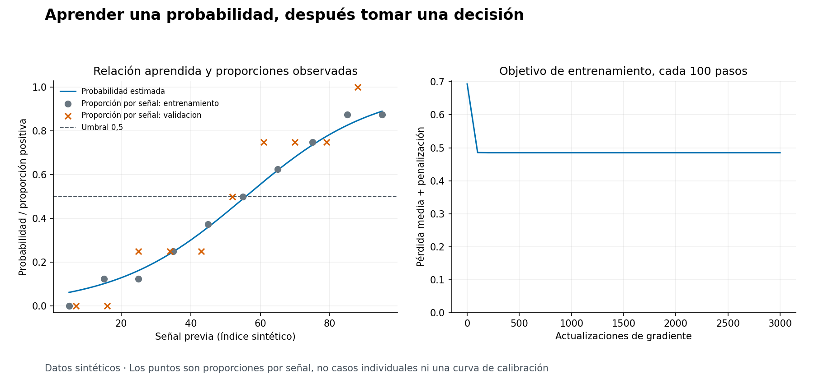
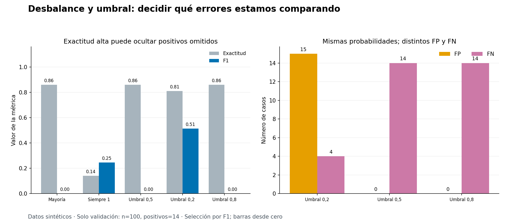
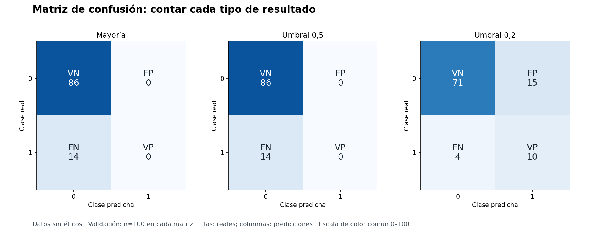

# Unidad 12 — Clasificación

[Índice del curso](../README.md) · [Anterior: regresión](../unidad11-regresion/README.md)

En la Unidad 11 aprendimos a predecir una cantidad. Ahora el objetivo es una categoría: **¿cómo aprender a distinguir clases y evaluar las consecuencias de convertir una probabilidad estimada en una decisión?**

Trabajaremos con una señal sintética anterior a una inspección y una etiqueta que indica si después se confirmó la necesidad de revisión. El primer laboratorio aprende una regresión logística. El segundo conserva el modelo y compara umbrales cuando hay pocos positivos. Veremos que una exactitud alta puede coexistir con la omisión de todos los casos de interés.

## Objetivos

Al terminar podrás:

- Definir una tarea binaria, sus entradas y su clase positiva.
- Distinguir puntuación, probabilidad estimada y clase predicha.
- Calcular una sigmoide y una decisión con umbral.
- Explicar la pérdida logarítmica y realizar un paso de gradiente.
- Ajustar la transformación de entrada solo con entrenamiento.
- Comparar un modelo aprendido con mayoría y una referencia siempre positiva.
- Interpretar matriz de confusión, exactitud, precisión, recobrado y F1.
- Reconocer efectos del desbalance y del umbral sobre los errores.
- Distinguir una salida entre 0 y 1 de una probabilidad bien calibrada.
- Documentar selección y cierre sin utilizar prueba para decidir.

## Antes de ejecutar

Necesitas funciones, listas y archivos de Python; vectores y gradientes de la [Unidad 3](../unidad03-matematica-aplicada/README.md); preparación de la [Unidad 8](../unidad08-preparacion-datos/README.md); y separación entre ajuste, selección y prueba de la [Unidad 10](../unidad10-flujo-lineas-base/README.md). La [Unidad 11](../unidad11-regresion/README.md) aporta la comparación con referencias y el análisis del alcance observado.

Desde la raíz del curso y con el entorno virtual activo:

```bash
python -m pip install -r unidad12-clasificacion/requirements.txt
python unidad12-clasificacion/ejemplos/01_aprender_logistica.py
python unidad12-clasificacion/ejemplos/02_comparar_umbrales.py
```

Entorno comprobado: Python 3.12.3, NumPy 2.2.6 y Matplotlib 3.10.8 en CPU. Reutilizamos las dependencias de la Unidad 9. Los ajustes y pruebas necesitan NumPy; los gráficos, Matplotlib. El generador usa biblioteca estándar. No se instala scikit-learn: consultamos su documentación conceptual, pero implementamos un ajuste pequeño para poder revisarlo. Tras instalar los requisitos, las prácticas funcionan sin Internet ni servicios externos.

Los seis CSV son **nuevos y sintéticos**. Consulta el [diccionario y generador](datos/README.md) y el [protocolo previo](datos/protocolo.md). Prueba y sus respuestas son públicas: esta unidad demuestra un procedimiento, no una evaluación externa ciega ni eficacia en equipos reales.

## 1. Qué significa predecir una clase

En clasificación binaria hay dos etiquetas posibles. Aquí:

- `1`: una inspección posterior confirmó que el caso requería revisión.
- `0`: no se confirmó esa necesidad según la etiqueta del escenario.

La clase positiva es **1** porque queremos contar qué casos de revisión recuperamos y cuáles omitimos. “Positiva” no significa buena, deseable ni verdadera por definición. Tampoco una predicción 0 garantiza ausencia de problemas.

Cada fila representa un caso sintético de inspección. `senal_previa` es un índice adimensional de 0 a 100 que declaramos disponible antes de decidir. `revision_confirmada` es el objetivo posterior. `caso_id` sirve para seguir filas, no para predecir. Los archivos no contienen fechas ni equipos: no permiten auditar disponibilidad temporal, separar grupos reales ni medir generalización al futuro.

Clasificar documentos por tema también sería clasificación; predecir su cantidad de páginas sería regresión. Con tres o más categorías mutuamente excluyentes hablaríamos de clasificación multiclase. Este código admite exclusivamente las etiquetas 0 y 1; no basta cambiar el CSV para convertirlo en un clasificador multiclase.

## 2. Tres objetos diferentes

La regresión logística binaria transforma una combinación lineal en una probabilidad estimada:

```text
z = (señal − centro) / escala
s = a + b × z
p = 1 / (1 + exp(−s))
clase = 1 si p >= umbral; 0 en caso contrario
```

| Objeto | Qué representa | Ejemplo |
|---|---|---|
| Puntuación s, también llamada logit | Salida lineal antes de transformar | 1 |
| Probabilidad estimada p | Estimación del modelo para la clase 1 | Aproximadamente 0,731 |
| Clase predicha | Decisión después de aplicar un umbral | 1 con umbral 0,5; 0 con umbral 0,8 |

La sigmoide envía puntuaciones negativas a valores menores que 0,5, cero a 0,5 y puntuaciones positivas a valores mayores que 0,5:

| s | p aproximada | Clase con umbral 0,5 |
|---:|---:|---:|
| −2 | 0,119 | 0 |
| 0 | 0,500 | 1 |
| 2 | 0,881 | 1 |

Usamos la convención `p >= umbral`: la igualdad produce clase 1. Cambiar el umbral no cambia p ni los parámetros. Pese a su nombre, la regresión logística se utiliza aquí para **clasificación**, como explica la [documentación de modelos lineales de scikit-learn](https://scikit-learn.org/stable/modules/linear_model.html#logistic-regression).

El coeficiente b describe cuánto cambia el logit por una unidad de z; no es un aumento constante de probabilidad ni un efecto causal. El intercepto corresponde a z = 0, es decir, a la señal media de entrenamiento. Si b es positivo, p aumenta al aumentar la entrada, pero la magnitud del cambio depende del punto de la curva.

Matemáticamente, la sigmoide de un número finito queda estrictamente entre 0 y 1. En punto flotante, valores extremos pueden redondearse a 0 o 1. Eso tampoco significa certeza sobre el mundo.

## 3. Qué aprende el modelo

La clasificación necesita una forma de penalizar probabilidades que contradicen las etiquetas. La pérdida logarítmica binaria por caso es:

```text
perdida = −y × ln(p) − (1 − y) × ln(1 − p)
```

Para una etiqueta real 1, predecir p = 0,8 cuesta `−ln(0,8) ≈ 0,223`; predecir p = 0,2 cuesta `−ln(0,2) ≈ 1,609`. Equivocarse con mucha confianza recibe una penalización mayor. Para y = 0 se intercambian los papeles de p y 1 − p.

Usamos logaritmo natural y promediamos sobre los casos. Una predicción constante 0,5 tiene pérdida `ln(2) ≈ 0,693`, cualquiera que sea la etiqueta. El ajuste no minimiza directamente el número de errores ni maximiza F1.

### Objetivo de entrenamiento

En esta implementación:

```text
J = promedio(perdida_logaritmica) + (lambda / 2) × b²
lambda = 0,01
```

La pequeña penalización L2 limita el crecimiento del coeficiente; no penalizamos el intercepto. Su valor está fijado para enseñar el procedimiento, no fue elegido con prueba. Esta decisión también evita perseguir coeficientes ilimitados cuando una muestra puede separarse perfectamente. La regularización no garantiza buena calibración ni buen rendimiento fuera de entrenamiento.

La relación entre logística, pérdida y penalización puede consultarse en la [formulación binaria oficial](https://scikit-learn.org/stable/modules/linear_model.html#binary-case). Nuestra lambda pertenece a la fórmula anterior: no debe confundirse sin conversión con el parámetro `C` de una biblioteca.

Para los parámetros a y b:

```text
gradiente_a = promedio(p − y)
gradiente_b = promedio((p − y) × z) + lambda × b
a_nuevo = a − tasa × gradiente_a
b_nuevo = b − tasa × gradiente_b
```

Ambos gradientes se calculan con los mismos parámetros anteriores. Partimos de `a = b = 0`, usamos tasa 0,2 y hacemos 3000 actualizaciones sobre todo entrenamiento. No hay azar, minibatches ni parada decidida con validación. Registramos el objetivo cada 100 pasos y la norma del gradiente final; una norma pequeña informa sobre el ajuste numérico, no sobre utilidad real.

### Un paso calculado a mano

Dos entradas de entrenamiento: `40, 60`; etiquetas: `0, 1`. Su centro es 50 y su desviación estándar poblacional es 10. Entonces z = `−1, 1`.

Con a = b = 0, ambas probabilidades son 0,5. Los errores p − y son `0,5; −0,5`:

```text
gradiente_a = (0,5 − 0,5) / 2 = 0
gradiente_b = (0,5 × (−1) + (−0,5) × 1) / 2 + 0,01 × 0 = −0,5
a_nuevo = 0
b_nuevo = 0 − 0,2 × (−0,5) = 0,1
```

Las nuevas probabilidades son aproximadamente 0,475021 y 0,524979. El objetivo penalizado baja de 0,693147 a 0,644447. Reproduce el cálculo y la diferencia entre probabilidad y umbral:

```bash
python unidad12-clasificacion/soluciones/03_paso_manual.py
```

### Cálculo numérico estable

El programa usa `exp(−logaddexp(0, −s))` para la sigmoide. Para la pérdida usa `logaddexp(0, −s)` cuando y = 1 y `logaddexp(0, s)` cuando y = 0. Así evita calcular directamente `exp(1000)` o tomar el logaritmo de una probabilidad redondeada a cero. No recorta silenciosamente la pérdida. Véase [NumPy 2.2: logaddexp](https://numpy.org/doc/2.2/reference/generated/numpy.logaddexp.html).

## 4. Un flujo sin filtración

El escalado aprende con entrenamiento su media y su desviación estándar **poblacional**, con `ddof=0`:

```text
centro = promedio(x_entrenamiento)
escala = raiz(promedio((x_entrenamiento − centro)²))
```

Validación, prueba y consultas reciben esos mismos parámetros. Una entrada constante no permite este escalado y se rechaza. El lector también rechaza faltantes: incorporar imputación sería otra decisión que habría que documentar y ajustar en el conjunto permitido.

| Etapa | Qué puede aprender o decidir |
|---|---|
| Entrenamiento | Centro, escala, coeficientes y clase/frecuencia mayoritaria |
| Validación | Elegir entre candidatos y umbrales prefijados por F1 |
| Prueba | Medir una sola vez el procedimiento elegido, sin reajuste ni reselección |

Los laboratorios comparan estas referencias:

- **Mayoría:** predice la clase más frecuente en entrenamiento; en empate elige 0. También conserva la frecuencia positiva como referencia probabilística constante. En empate, esa frecuencia vale 0,5, pero la regla de mayoría sigue el desempate a 0.
- **Siempre 1:** marca todos los casos. Ayuda a reconocer que recuperar todos los positivos no basta si se generan muchas falsas alertas. Es una regla de clase: no le atribuimos una probabilidad estimada ni una pérdida logarítmica.
- **Logística:** aprende una única curva con entrenamiento. Cada umbral define una regla de decisión que usa esa misma curva.

Para seleccionar exigimos ambas clases en entrenamiento y validación. Así F1 está definido para todos estos candidatos. No reintentamos particiones hasta obtener una puntuación favorable. Si un archivo nuevo no cumple el contrato, el programa pide revisar el diseño. Prueba puede tener una sola clase y conserva las métricas indefinidas como `null`.

## 5. Medir las decisiones

La matriz de confusión cuenta cada combinación. **Filas: clase real; columnas: clase predicha.**

| | Predicción 0 | Predicción 1 |
|---|---:|---:|
| Real 0 | Verdadero negativo (VN) | Falso positivo (FP) |
| Real 1 | Falso negativo (FN) | Verdadero positivo (VP) |

Un FP es una alerta que la etiqueta posterior no confirma. Un FN es un caso positivo que el modelo omitió. Sus consecuencias dependen de la aplicación: tiempo de revisión, capacidad disponible, demora y otros costos. El dataset no cuantifica esos costos.

```text
exactitud = (VP + VN) / n
precision = VP / (VP + FP)
recobrado = VP / (VP + FN)
F1 = 2 × VP / (2 × VP + FP + FN)
```

Precisión pregunta cuántas predicciones positivas eran correctas; recobrado, cuántos positivos reales se recuperaron. F1 combina ambas mediante su media armónica cuando están definidas. Su fórmula de conteos también permite obtener cero cuando hay positivos reales pero no se predice ninguno.

Si una división tiene denominador cero, la métrica correspondiente queda `no definida` en consola y `null` en JSON. No ocultamos la ausencia de predicciones positivas. Por ejemplo, con reales `0, 0` y predicciones `0, 0`, exactitud es 1 y precisión, recobrado y F1 quedan indefinidos bajo esta convención.

Elegimos **F1 de la clase 1** para comparar en estos ejercicios. No es una métrica universal: no utiliza VN y no expresa directamente costos monetarios ni capacidad operativa. Las unidades 16 y 17 profundizarán en validación, umbrales y decisiones. Aquí el criterio se fija antes de abrir prueba; no lo cambiamos porque otro resultado luzca mejor.

## 6. Laboratorio 1 — Aprender una regresión logística

El conjunto `equilibrado` tiene proporciones relativamente próximas entre clases, no un balance exacto: entrenamiento contiene 36 positivos de 80 casos; validación, 18 de 40. Se comparan mayoría, siempre 1 y logística con umbral 0,5.

```bash
python unidad12-clasificacion/ejemplos/01_aprender_logistica.py --salida resultados/unidad12/equilibrado-validacion --graficos
```

Fragmento de la salida comprobada:

```text
Logit: -0.306 + 1.530 * z
z = (señal - 50.000) / 28.723
candidato | exactitud | precisión | recobrado | F1 | FP | FN
mayoria | 0.550 | no definida | 0.000 | 0.000 | 0 | 18
siempre_1 | 0.450 | 0.450 | 1.000 | 0.621 | 22 | 0
logistica_050 | 0.800 | 0.812 | 0.722 | 0.765 | 3 | 5
Seleccionado por F1 de validación: logistica_050
Prueba reservada: no se leyó su archivo.
```

La logística recupera 13 de 18 positivos, produce tres FP y omite cinco positivos. Su F1 es `26/34 ≈ 0,765`; la exactitud es `32/40 = 0,8`. Supera ambas referencias por el criterio fijado sobre los mismos 40 casos.

La consola redondea a tres decimales. Los coeficientes y métricas sin redondear están en el JSON; la selección no utiliza los valores impresos. El ajuste termina con una norma de gradiente del orden de `1e-16` en el entorno probado, con pequeñas diferencias posibles entre plataformas.



Cada punto agrupa una señal repetida: ocho casos por punto de entrenamiento y cuatro por punto de validación. No son observaciones individuales, y **no es un diagrama de calibración**. Una proporción igual a cero o uno calculada con cuatro casos no demuestra certeza. El gráfico derecho resume el objetivo cada 100 actualizaciones; muestra progreso del ajuste, no evaluación de generalización.

El código principal [clasificacion.py](ejemplos/clasificacion.py) separa `ajustar_logistica`, `probabilidades`, `decidir`, `evaluar` y `seleccionar`. Los parámetros se ajustan antes de comparar; el predictor recibe únicamente señales. Las métricas de clase reutilizan la implementación de la Unidad 10.

### Experimenta: una consulta

```bash
python unidad12-clasificacion/ejemplos/01_aprender_logistica.py --senal 100
```

La salida incluye `p(1)=0.913; clase=1` y `fuera del rango de entrenamiento: sí`. Entrenamiento abarca de 5 a 95. La consulta respeta el dominio admitido de 0 a 100, pero excede lo observado: es extrapolación. No tiene etiqueta real, por lo que no se conoce su acierto ni error. Un valor 0,913 tampoco acredita 91,3 % de confiabilidad en una instalación real.

## 7. Laboratorio 2 — Desbalance y umbrales

Ahora entrenamiento tiene 25 positivos de 200 casos; validación tiene 14 de 100. Aprendemos otra logística para este dataset, con la misma configuración de ajuste. Sus parámetros se conservan al comparar umbrales 0,5; 0,2 y 0,8, además de las dos referencias.

```bash
python unidad12-clasificacion/ejemplos/02_comparar_umbrales.py --salida resultados/unidad12/desbalanceado-validacion --graficos
```

Fragmento de la salida:

```text
Logit: -2.823 + 1.665 * z
z = (señal - 50.000) / 28.831
candidato | exactitud | precisión | recobrado | F1 | FP | FN
mayoria | 0.860 | no definida | 0.000 | 0.000 | 0 | 14
siempre_1 | 0.140 | 0.140 | 1.000 | 0.246 | 86 | 0
logistica_050 | 0.860 | no definida | 0.000 | 0.000 | 0 | 14
logistica_020 | 0.810 | 0.400 | 0.714 | 0.513 | 15 | 4
logistica_080 | 0.860 | no definida | 0.000 | 0.000 | 0 | 14
Seleccionado por F1 de validación: logistica_020
Prueba reservada: no se leyó su archivo.
```

Mayoría consigue 86 % de exactitud y omite todos los positivos. Con umbrales 0,5 y 0,8 sucede lo mismo porque ninguna probabilidad de estos casos de validación los alcanza. Sus probabilidades sí varían entre casos, aunque sus decisiones sean todas cero.

El umbral 0,2 recupera diez positivos y omite cuatro; produce quince falsas alertas. Su precisión es `10/25 = 0,4`, su recobrado `10/14 ≈ 0,714` y su F1 `20/39 ≈ 0,513`. Gana por F1, aunque su exactitud baje a 81 %. Esta comparación no establece que quince falsas alertas sean aceptables en una operación real.





Las matrices comparten casos y escala de color. Siempre conviene revisar conteos junto a porcentajes: un cambio de pocos positivos afecta bastante las métricas en una muestra pequeña.

### Cambiar el umbral también es seleccionar

No se han entrenado tres curvas: las tres reglas logísticas comparten probabilidades y pérdida logarítmica. Solo cambia la decisión. El umbral forma parte del procedimiento final y se elige con validación. Ajustarlo después de ver prueba convertiría esa prueba en desarrollo. La [guía oficial sobre umbrales](https://scikit-learn.org/stable/modules/classification_threshold.html) distingue estimación de probabilidades y decisión, y advierte sobre reutilizar datos al ajustar el corte.

Al bajar el umbral sobre probabilidades fijas, el conjunto de casos marcados positivos solo puede aumentar o mantenerse. El recobrado no disminuye si hay positivos reales, pero la precisión **no tiene por qué variar de forma monótona**. Un umbral menor no garantiza mejorar F1.

No buscamos un “umbral óptimo” para cualquier situación: elegimos el mejor de **tres valores prefijados** y dos referencias, con este criterio y esta validación. No hacemos búsqueda exhaustiva, validación cruzada ni estimación de incertidumbre.

### Experimenta en una copia

```bash
python unidad12-clasificacion/datos/generar_datos.py --salida resultados/unidad12/datos-copia
python unidad12-clasificacion/ejemplos/02_comparar_umbrales.py --datos resultados/unidad12/datos-copia/desbalanceado
```

Comprueba primero que reproduce el resultado. Luego cambia una etiqueta de validación en la copia y documenta cuál: las métricas pueden cambiar, pero el modelo, centro y escala deben seguir iguales. Es una variante didáctica, no una corrección real verificada. No mezcles sus resultados con el cierre original ni abras prueba para decidir qué modificación conservar.

## 8. Probabilidad estimada no significa calibración demostrada

Un modelo está bien calibrado si, en grupos suficientemente numerosos de casos a los que asigna probabilidades cercanas a un valor, la proporción positiva observada es aproximadamente ese valor. Por ejemplo, alrededor de 80 % de positivos entre casos con p cercana a 0,8. Esta interpretación se desarrolla en la [documentación de calibración](https://scikit-learn.org/stable/modules/calibration.html).

La sigmoide acota la salida; no comprueba por sí misma esa correspondencia. Una buena exactitud o un buen F1 tampoco la garantizan. La pérdida logarítmica evalúa probabilidades, pero un único promedio no es una evaluación completa de calibración. En esta unidad no ajustamos calibradores ni afirmamos calibración poblacional.

Las etiquetas se construyen con una rejilla determinista y una función conocida. No son observaciones aleatorias independientes de una población real. Además, cambian las proporciones de positivos entre particiones por construcción. En otros contextos, cambios de prevalencia, equipos o forma de medir pueden alterar la calidad de las probabilidades y decisiones; habría que recoger evidencia apropiada.

## 9. Cierre y reproducción

Antes de cerrar, guarda protocolo, código, huellas de entrenamiento/validación, modelo, referencias y candidato —incluido su umbral—. Ejecuta **el laboratorio elegido** con `--evaluar-prueba`, hacia una carpeta nueva:

```bash
python unidad12-clasificacion/ejemplos/01_aprender_logistica.py --evaluar-prueba --salida resultados/unidad12/equilibrado-cierre
python unidad12-clasificacion/ejemplos/02_comparar_umbrales.py --evaluar-prueba --salida resultados/unidad12/desbalanceado-cierre
```

<details>
<summary>Resultados de referencia para comprobar los cierres</summary>

```text
Prueba final: n=40; solo logistica_050; sin reajuste
VP=12; VN=20; FP=4; FN=4; F1=0.750

Prueba final: n=100; solo logistica_020; sin reajuste
VP=8; VN=74; FP=17; FN=1; F1=0.471
```

En el segundo conjunto hay nueve positivos en prueba. Cinco casos tienen señal 1,5, inferior al mínimo de entrenamiento de 2,5; se conservan y se marcan fuera de rango. No se eliminan por conveniencia. Si estos resultados motivan un rediseño, habrá que declarar ese uso de prueba y conseguir una evaluación nueva apropiada.

</details>

Cada ejecución vuelve a ajustar desde cero con los archivos presentes. Comprueba que coincidan código, protocolo, huellas de desarrollo, modelo, referencias y selección entre la primera exportación y el cierre. No se reajusta con validación. El archivo de prueba se abre **después** de seleccionar y solo se evalúa al elegido.

El informe JSON conserva versiones, huellas SHA-256, configuración, coeficientes, transformación, evolución del objetivo, métricas y predicciones. Los CSV permiten seguir cada caso y su resultado VP/VN/FP/FN. La probabilidad de `siempre_1` queda vacía en CSV y como `null` en JSON; su pérdida logarítmica también queda `null` en las métricas del JSON. No son ceros. Las figuras muestran únicamente desarrollo, incluso si se pide cierre.

Las carpetas de salida deben ser nuevas; `--graficos` requiere `--salida`. La exportación no es transaccional: un fallo puede dejar archivos parciales. El JSON se escribe después de las tablas y antes de los gráficos; su presencia no acredita que la exportación gráfica esté completa. Las huellas identifican contenido, no autentican su procedencia ni guardan el commit automáticamente.

## 10. Errores frecuentes

| Error | Qué revisar |
|---|---|
| Interpretar 0 y 1 como cantidades que medir | Son etiquetas; la pregunta es categórica |
| Confundir logit con probabilidad | Aplicar y comprender la sigmoide |
| Interpretar b como cambio constante de p | b actúa sobre el logit de la entrada transformada |
| Calcular centro o escala con todos los datos | Ajustar únicamente con entrenamiento |
| Confundir pérdida de entrenamiento y F1 de selección | Cada etapa tiene un criterio explícito |
| Celebrar exactitud alta sin contar positivos | Matriz, prevalencia, precisión y recobrado |
| Presentar precisión indefinida como cero medido | Explicar el denominador y la convención |
| Ajustar el umbral después de mirar prueba | Considerarlo parte de la selección |
| Afirmar que un umbral menor siempre mejora F1 | Comparar errores sobre probabilidades fijas |
| Tratar una sigmoide como prueba de calibración | Evaluación probabilística adecuada y evidencia nueva |

## 11. Ejercicios

Resuelve antes de consultar las [soluciones razonadas](soluciones/README.md).

1. Define la tarea del curso: unidad, entrada, etiqueta, clase positiva y momento de predicción. Identifica una columna que sería filtración y una evidencia de disponibilidad que falta.
2. Para a = −1, b = 2 y z = 1, calcula logit y probabilidad. Decide con umbrales 0,5 y 0,8. ¿Qué cambia y qué permanece?
3. Con señales `40, 60`, etiquetas `0, 1` y parámetros iniciales cero, reproduce centro, escala, gradientes y un paso con tasa 0,2 y lambda 0,01.
4. Para y = 1, compara la pérdida de p = 0,8 y p = 0,2. Explica por qué bajar el objetivo de entrenamiento no demuestra buen rendimiento fuera de él.
5. Construye la matriz y las cuatro métricas para reales `[1, 1, 0, 0, 0]` y predicciones `[1, 0, 1, 0, 0]`. Declara orientación y clase positiva.
6. En 100 casos, 14 son positivos. Calcula los resultados de predecir siempre 0 y siempre 1. Explica por qué ni exactitud ni recobrado, aisladamente, resuelven la comparación.
7. Con `VP=10, VN=71, FP=15, FN=4`, calcula precisión, recobrado, F1 y exactitud. Relaciona el resultado con el umbral 0,2 del laboratorio y con el criterio de selección.
8. Probabilidades `[0,1; 0,4; 0,6; 0,9]` y reales `[0, 1, 0, 1]`: compara umbrales 0,5 y 0,3. ¿Deben cambiar las probabilidades o la pérdida logarítmica? ¿Un menor umbral garantiza mayor precisión?
9. Alguien afirma: “Predijo 0,8, así que tiene 80 % de certeza; como F1 es alto, está calibrado”. Explica qué afirmaciones no están justificadas y qué evidencia faltaría.
10. Redacta un cierre que preserve datos, modelo y umbral seleccionados. Explica qué harías si prueba contiene solo negativos o si sus resultados te inspiran cambiar el umbral.

## 12. Reto y verificación

Entrega un experimento con cálculo manual, matriz de confusión, referencias y cierre separado. Usa el [reto con rúbrica](reto.md) y la [plantilla](plantillas/informe_clasificacion.md). Los [recursos](recursos/README.md) conservan las tres figuras y las exportaciones de desarrollo.

```bash
python -m unittest discover -s unidad12-clasificacion/pruebas -v
python herramientas/verificar_curso.py
```

Las 28 pruebas cubren fórmulas manuales, estabilidad numérica, gradientes mediante diferencias finitas y comparación con un ajuste independiente por Newton. También verifican datos, separación de ajuste/selección/prueba, probabilidades invariantes al cambiar umbral, casos indefinidos, exportaciones y correspondencia de figuras con resultados. Estas comprobaciones no demuestran utilidad operativa ni calibración en una población real.

- [ ] Defino clases, entrada y momento de disponibilidad.
- [ ] Distingo logit, probabilidad estimada y decisión.
- [ ] Reproduzco una sigmoide, una pérdida y un paso de gradiente.
- [ ] Conservo el escalado aprendido con entrenamiento.
- [ ] Comparo referencias y modelo sobre los mismos casos.
- [ ] Interpreto los cuatro conteos y las métricas indefinidas.
- [ ] Explico el intercambio entre FP y FN al mover el umbral.
- [ ] Distingo probabilidad estimada, calibración y certeza.
- [ ] Cierro sin volver a elegir con prueba y documento límites.

La siguiente entrega prevista es la **Unidad 13 — Árboles y ensambles**, todavía pendiente de desarrollo. Introducirá decisiones por particiones y combinaciones de modelos, conservando el protocolo de evaluación.

## Referencias

Fuentes primarias consultadas el 9 de octubre de 2026. Los datos, implementación y ejercicios son elaboraciones educativas del curso.

- [Scikit-learn: regresión logística](https://scikit-learn.org/stable/modules/linear_model.html#logistic-regression).
- [Scikit-learn: selección del umbral](https://scikit-learn.org/stable/modules/classification_threshold.html).
- [Scikit-learn: calibración de probabilidades](https://scikit-learn.org/stable/modules/calibration.html).
- [NumPy 2.2: `logaddexp`](https://numpy.org/doc/2.2/reference/generated/numpy.logaddexp.html).

[Volver al índice](../README.md)
