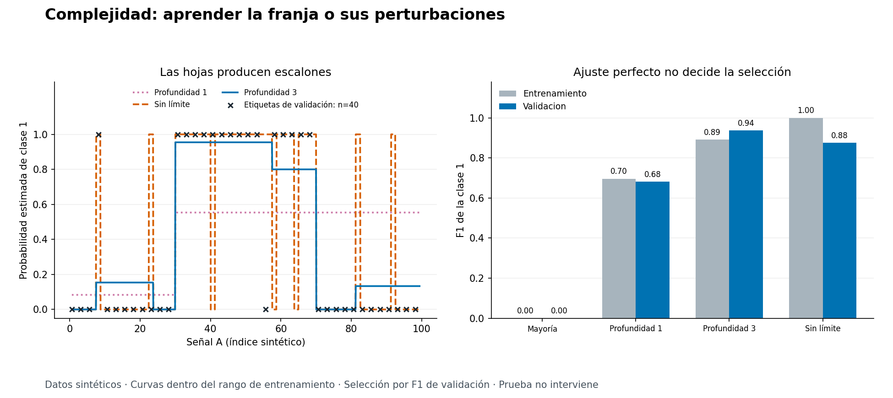
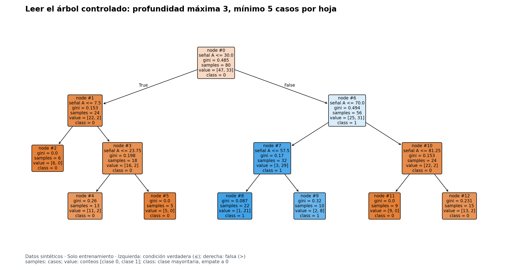
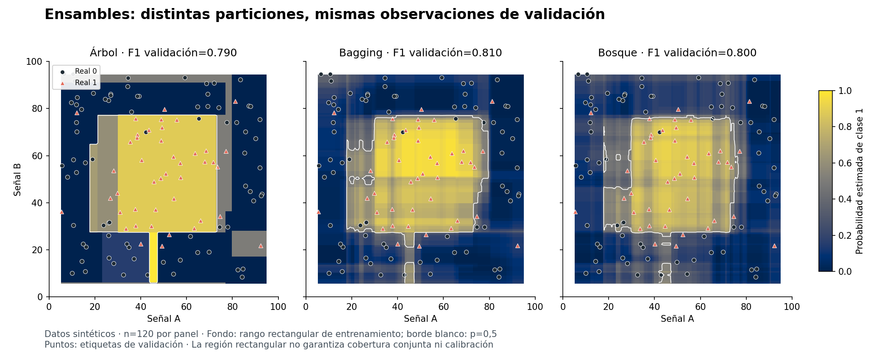

# Unidad 13 — Árboles y ensambles

[Índice del curso](../README.md) · [Anterior: clasificación](../unidad12-clasificacion/README.md)

**Pregunta guía:** ¿cómo aprende un modelo decisiones por condiciones y qué cambia al combinar varios árboles?

En la unidad anterior aprendiste una probabilidad mediante una función logística y separaste ajuste, selección y prueba. Ahora construirás decisiones por particiones: «si la señal es menor o igual que cierto valor, sigue por esta rama». Un árbol permite recorrer una predicción; combinar árboles puede reducir la dependencia de una sola partición, pero exige conservar el mismo cuidado al evaluar.

## Objetivos y preparación

Al terminar podrás:

- Recorrer un árbol, identificar nodos y hojas y calcular una probabilidad de hoja.
- Comparar cortes con impureza de Gini y distinguir ese criterio de F1 de validación.
- Relacionar profundidad y tamaño mínimo de hoja con complejidad y sobreajuste.
- Explicar bootstrap, bagging y bosque aleatorio, y diferenciarlos de boosting.
- Comparar modelos sobre los mismos casos y cerrar el experimento sin volver a elegir con prueba.
- Reconocer inestabilidad, límites de extrapolación y diferencia entre probabilidad estimada y calibración.

Prerrequisitos: listas, funciones y CSV de Python; proporciones de la [Unidad 4](../unidad04-probabilidad-estadistica/README.md); separación de datos de la [Unidad 10](../unidad10-flujo-lineas-base/README.md); métricas binarias de la [Unidad 12](../unidad12-clasificacion/README.md). Duración orientativa: 6–8 horas, incluido el reto.

Esta es la primera unidad que utiliza **scikit-learn**. Se comprobó con Python 3.12.3, scikit-learn 1.9.1, NumPy 2.2.6 y Matplotlib 3.10.8 en Linux. Requiere CPU, sin GPU, cuentas ni servicios de pago. La instalación inicial necesita Internet; los laboratorios funcionan después sin red.

Desde la raíz, con el entorno virtual de la Unidad 0 activo:

```bash
python -m pip install -r unidad13-arboles-ensambles/requirements.txt
python unidad13-arboles-ensambles/ejemplos/01_controlar_complejidad.py
python unidad13-arboles-ensambles/ejemplos/02_comparar_ensambles.py
```

Las dependencias transitivas están en el [entorno verificado](recursos/entorno-verificado.txt). Las versiones y semillas forman parte del experimento; no se promete identidad de resultados entre versiones diferentes.

## 1. El problema y los datos permitidos

Cada fila representa un caso sintético que podría necesitar revisión. Las entradas son señales adimensionales de 0 a 100; la clase positiva es `revision_confirmada = 1`. El escenario declara que las señales se conocen antes de decidir y que la confirmación llega después. Los CSV no contienen fechas ni equipos: esa disponibilidad es un **supuesto didáctico**, no una auditoría temporal o por grupos.

Se crearon dos conjuntos nuevos para esta unidad:

| Laboratorio | Entradas | Entrenamiento | Validación | Prueba | Propósito |
|---|---|---:|---:|---:|---|
| `franja` | `senal_a` | 80 | 40 | 40 | Comparar complejidad y recorrer un árbol |
| `region` | `senal_a`, `senal_b` | 180 | 120 | 120 | Comparar un árbol, bagging y bosque |

Identificador y etiqueta nunca entran en `X`. No se imputan valores ni se eliminan errores del modelo. Datos incompletos, señales no finitas o fuera de 0–100 y etiquetas distintas de 0/1 detienen la ejecución. Los detalles de generación y sus límites están en el [diccionario](datos/README.md); las decisiones del experimento, en el [protocolo `arboles-v1`](datos/protocolo.md).

## 2. Cómo leer un árbol

Un **nodo** contiene una pregunta sobre una entrada. En nuestros árboles numéricos, la rama izquierda representa `señal <= corte` y la derecha `señal > corte`. La **raíz** es el primer nodo, con profundidad 0. Una **hoja** termina el recorrido y produce una predicción.

Para un árbol de clasificación sin pesos, la probabilidad estimada de clase 1 en una hoja es:

```text
p(1 en la hoja) = casos de clase 1 que llegaron a la hoja / casos en esa hoja
```

Si una hoja contiene diez casos, ocho positivos y dos negativos, devuelve `p(1)=0,8` y clase 1. No significa que ocho de cada diez nuevos casos vayan a resultar positivos: esa frecuencia procede de entrenamiento y todavía requiere evaluación. Una hoja pura devuelve 0 o 1, sin certificar certeza ni calibración.

El árbol busca cortes en entrenamiento, sin conocer la regla usada para crear las etiquetas. Para cada nodo compara particiones permitidas y continúa en sus hijos. Es una búsqueda **local y voraz**: tomar un buen corte inmediato no garantiza el mejor árbol completo. La [documentación de árboles de scikit-learn](https://scikit-learn.org/stable/modules/tree.html) describe este aprendizaje y sus límites.

## 3. Elegir un corte con Gini

La impureza mide la mezcla de clases de un nodo. Con clases 0 y 1 y proporción positiva `p`:

```text
Gini = 1 − p(0)² − p(1)² = 2 × p × (1 − p)
```

Un nodo puro tiene Gini 0. Con mitad de cada clase, Gini es 0,5. **Gini no es la tasa de clasificación incorrecta**; ambos conceptos se calculan de manera diferente.

Considera ocho casos ordenados:

```text
señal:   1 2 3 4 5 6 7 8
clase:   0 0 0 0 1 1 1 1
```

La raíz tiene Gini 0,5. Para comparar un corte, ponderamos la impureza de sus dos hijos por sus tamaños:

```text
Gini después = (n_izquierda × Gini_izquierda + n_derecha × Gini_derecha) / n
reducción = Gini antes − Gini después
```

| Corte | Clases a la izquierda | Clases a la derecha | Gini después | Reducción |
|---|---|---|---:|---:|
| 2,5 | 00 | 001111 | 1/3 | 1/6 |
| 3,5 | 000 | 01111 | 0,2 | 0,3 |
| 4,5 | 0000 | 1111 | 0 | 0,5 |

En el primer corte, el hijo derecho tiene Gini `2 × (4/6) × (2/6) = 4/9`. Ponderarlo da `(2 × 0 + 6 × 4/9) / 8 = 1/3`. Promediar las dos impurezas sin sus tamaños favorecería comparaciones incorrectas.

La función `cortes_gini` de [arboles.py](ejemplos/arboles.py) enumera puntos medios entre valores distintos y descarta los que incumplen el mínimo por hoja. Es una referencia independiente de **un nodo y una entrada**, no otra implementación completa del algoritmo de árboles. Las pruebas comparan la impureza óptima con la obtenida por scikit-learn; distintos cortes pueden empatar.

## 4. Complejidad, ajuste y predicción

Un árbol sin límites puede crear hojas pequeñas que ajusten particularidades del entrenamiento. Dos controles de esta unidad son:

| Parámetro | Efecto | Lo que no garantiza |
|---|---|---|
| `max_depth` | Limita la profundidad máxima desde la raíz | Que el árbol alcance esa profundidad o generalice bien |
| `min_samples_leaf` | Exige un mínimo de casos por hoja durante la construcción | Que sus probabilidades estén calibradas |

Son restricciones al crecimiento. Aquí no se implementa una búsqueda de poda posterior ni se ajustan automáticamente todos los hiperparámetros.

La interfaz de scikit-learn distingue configuración, aprendizaje e inferencia. Este ejemplo mínimo puede ejecutarse en Python después de instalar las dependencias:

```python
from sklearn.tree import DecisionTreeClassifier

X = [[1], [2], [3], [4], [5], [6], [7], [8]]
y = [0, 0, 0, 0, 1, 1, 1, 1]
modelo = DecisionTreeClassifier(max_depth=1, random_state=13)
modelo.fit(X, y)                    # aprende los cortes solo con entrenamiento
print(modelo.predict([[4], [5]]))   # [0 1]
print(modelo.classes_)              # [0 1]: orden de las columnas de probabilidad
print(modelo.predict_proba([[5]]))  # [[0. 1.]]
```

`X` tiene una fila por caso y una columna por entrada; `y` contiene sus etiquetas. Una consulta de región tiene dos valores, siempre en orden `senal_a, senal_b`. `predict_proba` devuelve una columna por clase; el código localiza la correspondiente a 1 mediante `classes_`.

**Convención de empate:** estos clasificadores eligen la clase de mayor probabilidad; con clases `[0, 1]`, un empate exacto devuelve 0. En binario equivale a predecir 1 si `p(1) > 0,5`. La Unidad 12 usaba una regla propia `p >= umbral`; aquí se conserva deliberadamente la convención de la biblioteca, documentada en [DecisionTreeClassifier](https://scikit-learn.org/stable/modules/generated/sklearn.tree.DecisionTreeClassifier.html).

No se estandarizan las señales. En estos árboles, cambiar positivamente la escala y el origen de una variable conserva el orden y puede trasladar sus cortes; no se usa distancia euclídea para escogerlos. La implementación trabaja con precisión finita, por lo que esto no promete invariancia numérica ante cualquier transformación o magnitud extrema. Mantener las unidades originales facilita leer las condiciones.

## 5. Laboratorio 1 — Controlar la complejidad

El conjunto `franja` usa una señal, una región central positiva y algunas etiquetas invertidas por construcción. La tarea sigue siendo predecir las etiquetas publicadas. Conocer el generador no autoriza a borrar casos difíciles como si fueran errores de captura verificados.

Se fijan cuatro candidatos, en este orden:

| Candidato | Configuración | Profundidad obtenida | Hojas obtenidas |
|---|---|---:|---:|
| `mayoria` | Clase mayoritaria y frecuencia positiva de entrenamiento | — | — |
| `arbol_1` | Profundidad máxima 1; mínimo 1 por hoja | 1 | 2 |
| `arbol_3` | Profundidad máxima 3; mínimo 5 por hoja | 3 | 7 |
| `arbol_libre` | Sin límite de profundidad; mínimo 1 por hoja | 6 | 17 |

Todos los árboles usan Gini, el mejor corte y semilla 13. `arbol_3` cambia **dos** controles frente al árbol libre: este experimento no permite atribuir su resultado exclusivamente a la profundidad.

```bash
python unidad13-arboles-ensambles/ejemplos/01_controlar_complejidad.py --salida resultados/unidad13/franja-desarrollo --graficos
```

Salida de referencia, redondeada a tres decimales. Precisión, recobrado, FP y FN corresponden a validación:

```text
candidato | F1 entrenamiento | F1 validación | precisión | recobrado | FP | FN
mayoria | 0.000 | 0.000 | no definida | 0.000 | 0 | 16
arbol_1 | 0.697 | 0.682 | 0.536 | 0.938 | 13 | 1
arbol_3 | 0.892 | 0.938 | 0.938 | 0.938 | 1 | 1
arbol_libre | 1.000 | 0.875 | 0.875 | 0.875 | 2 | 2
Seleccionado por F1 de validación: arbol_3
Prueba reservada: no se leyó su archivo.
```



El árbol libre alcanza F1 perfecto en entrenamiento y pierde calidad en validación. El árbol de un solo corte deja muchos falsos positivos: una franja central necesita al menos dos límites. En este conjunto el árbol controlado da el mejor F1 de validación, **15 VP, 23 VN, 1 FP y 1 FN**. No es una prueba de que esa configuración sea mejor en todos los problemas.



Lee `samples` como cantidad de casos, `value` como conteos `[clase 0, clase 1]` y `class` como clase predicha. La raíz pregunta `senal_a <= 30`. Para una señal 60:

1. `60 > 30`: sigue a la derecha.
2. `60 <= 70`: sigue a la izquierda.
3. `60 > 57,5`: llega a la hoja con `value = [2, 8]`.
4. Su probabilidad es `8/10 = 0,8` y su clase es 1.

Una rama adicional puede cambiar la probabilidad aunque conserve la misma clase. El archivo de [reglas del árbol controlado](recursos/franja/reglas_arbol_3.txt) facilita recorrer sus condiciones; sus cortes se imprimen redondeados.

```bash
python unidad13-arboles-ensambles/ejemplos/01_controlar_complejidad.py --consulta 60
python unidad13-arboles-ensambles/ejemplos/01_controlar_complejidad.py --consulta 100
```

La segunda consulta produce `p(1)=0.133; clase=0` y marca que está fuera del rango de entrenamiento, cuyo máximo es 99,375. El árbol todavía asigna una hoja. Esa capacidad de devolver un número no demuestra fiabilidad fuera del rango.

## 6. Inestabilidad y árboles de regresión

```bash
python unidad13-arboles-ensambles/soluciones/03_corte_e_inestabilidad.py
```

El programa recupera el corte 4,5 del ejemplo manual. Después cambia **solo en memoria** la cuarta etiqueta de 0 a 1: el mejor corte pasa a 3,5 y la clase predicha para `x=4` cambia de 0 a 1. Esto muestra una sensibilidad posible de un árbol, sin demostrar que cualquier cambio pequeño vaya a alterar todas sus predicciones. No modifica CSV ni presenta la perturbación como una corrección verificada.

También ajusta un árbol de regresión de profundidad 1 a `x=[1,2,3,4]`, `y=[2,4,6,8]`. Con error cuadrático, una hoja devuelve la media de sus objetivos. El corte 2,5 deja medias 3 y 7. Tanto `x=4` como `x=10` reciben **7**: el árbol produce valores constantes por región y no prolonga la tendencia lineal hasta 20. Este ejemplo conecta con los límites de extrapolación de la [Unidad 11](../unidad11-regresion/README.md).

## 7. De un árbol a varios

**Bootstrap** significa extraer casos con reemplazo: cada extracción puede repetir un caso anterior. Una muestra de tamaño `n` contiene `n` extracciones, no necesariamente `n` casos distintos. Todas las extracciones de estos laboratorios proceden de entrenamiento.

**Bagging** ajusta varios modelos sobre muestras bootstrap y combina sus resultados. Puede reducir variabilidad si los errores no se repiten exactamente en todos los modelos. Promediar no elimina automáticamente sesgos compartidos ni garantiza mejorar una muestra de validación.

En `BaggingClassifier`, cuando los árboles proporcionan probabilidades, se **promedian probabilidades**. Con tres árboles que devuelven `0,2`, `0,6` y `0,6`, la media es `1,4/3 ≈ 0,467` y se predice 0. Votar únicamente por sus clases daría 1: son reglas diferentes. Esta conducta está descrita en [BaggingClassifier](https://scikit-learn.org/stable/modules/generated/sklearn.ensemble.BaggingClassifier.html).

Un **bosque aleatorio** agrega árboles con remuestreo y variación en las entradas candidatas de cada nodo. Nuestro bosque considera inicialmente una de las dos señales por corte; la biblioteca puede inspeccionar más si necesita encontrar una partición válida. También promedia probabilidades, según [RandomForestClassifier](https://scikit-learn.org/stable/modules/generated/sklearn.ensemble.RandomForestClassifier.html).

| Método | Cómo construye diversidad o aprendizaje | Combinación en esta unidad |
|---|---|---|
| Árbol único | Una secuencia de cortes aprendida con todo entrenamiento | Probabilidad de la hoja |
| Bagging | Muestras bootstrap; ambas entradas disponibles en cada árbol | Media de probabilidades de 31 árboles |
| Bosque aleatorio | Bootstrap y selección de entradas candidatas en cada nodo | Media de probabilidades de 31 árboles |
| Boosting, solo concepto | Añade modelos secuencialmente para reducir una pérdida; depende de la variante | No se implementa ni evalúa aquí |

Boosting no es otro nombre para promediar árboles independientes. En gradient boosting, cada etapa aprende a corregir el modelo acumulado siguiendo la pérdida. Su alcance se puede consultar en la [guía de ensambles](https://scikit-learn.org/stable/modules/ensemble.html). Esta unidad practica bagging y bosque, sin atribuirles el mecanismo de boosting.

## 8. Laboratorio 2 — Comparar ensambles

`region` tiene dos señales y una región central circular positiva con inversiones de etiqueta. Un árbol usa cortes alineados con los ejes; al combinar árboles se obtienen promedios de muchas particiones.

Se fijan mayoría, un árbol, bagging y bosque. Los árboles tienen profundidad máxima 6 y mínimo 2 por hoja. Los ensambles usan 31 árboles, 180 extracciones por muestra, semilla general 13 y `n_jobs=1`.

**Dos parámetros que se parecen pero actúan en lugares distintos:** `BaggingClassifier(max_features=1.0)` entrega todas las entradas a cada árbol, que a su vez considera ambas por nodo. `RandomForestClassifier(max_features=1)` usa el entero 1 para la cantidad candidata por nodo. En el bosque cada árbol conserva acceso a las dos señales a lo largo de sus distintos nodos.

```bash
python unidad13-arboles-ensambles/ejemplos/02_comparar_ensambles.py --salida resultados/unidad13/region-desarrollo --graficos
```

```text
candidato | F1 entrenamiento | F1 validación | precisión | recobrado | FP | FN
mayoria | 0.000 | 0.000 | no definida | 0.000 | 0 | 43
arbol | 0.870 | 0.790 | 0.842 | 0.744 | 6 | 11
bagging | 0.914 | 0.810 | 0.829 | 0.791 | 7 | 9
bosque | 0.913 | 0.800 | 0.865 | 0.744 | 5 | 11
Seleccionado por F1 de validación: bagging
Prueba reservada: no se leyó su archivo.
```



El color representa la probabilidad estimada de clase 1, con escala común. La línea blanca marca el nivel 0,5. Los puntos son los mismos 120 casos de validación en cada panel; círculos y triángulos distinguen etiquetas reales. El fondo se dibuja dentro del rectángulo definido por los mínimos y máximos de entrenamiento: **no demuestra que todas las combinaciones interiores estén bien representadas**.

Bagging obtiene 34 VP, 70 VN, 7 FP y 9 FN. Su F1 es `68/(68+7+9) = 0,809524`. El bosque tiene menos FP, pero más FN; el criterio previamente fijado selecciona bagging. La diferencia frente a 0,800 es pequeña y procede de una sola validación. No establece superioridad estadística, utilidad operativa ni que «más sofisticado» signifique «mejor».

El informe registra 180 extracciones por árbol y entre 102 y 121 casos distintos por muestra en esta ejecución. También guarda huellas de los índices, las semillas internas y la complejidad obtenida. Ambos ensambles aplican restricciones nominales parecidas, pero usan procedimientos de muestreo y aleatoriedad propios: no es una comparación que aísle un único factor manteniendo idénticos todos los demás.

## 9. Semillas y reproducción

La semilla de los modelos es 13. La generación de `region` usa otras tres semillas fijas, una por partición, con `Generator(PCG64(...))`. `franja` es una rejilla determinista. Cambiar `--semilla` **no regenera los CSV**.

```bash
python unidad13-arboles-ensambles/datos/generar_datos.py --salida resultados/unidad13/datos-copia
python unidad13-arboles-ensambles/ejemplos/02_comparar_ensambles.py --datos resultados/unidad13/datos-copia/region
python unidad13-arboles-ensambles/ejemplos/02_comparar_ensambles.py --semilla 29
```

La tercera ejecución es una variante separada. No pruebes semillas hasta elegir la que mejor salga y luego la presentes como si hubiera sido la única decisión previa. Una semilla permite repetir un procedimiento bajo el entorno declarado; no representa incertidumbre, independencia ni un intervalo de confianza. NumPy documenta las condiciones de sus [generadores aleatorios](https://numpy.org/doc/2.2/reference/random/generator.html).

## 10. Seleccionar y cerrar sin filtración

Se ajusta con entrenamiento, se selecciona por **mayor F1 de clase 1 en validación sin redondear** y, ante empate exacto, se conserva el primer candidato del orden publicado. Gini decide cortes dentro del ajuste; F1 compara candidatos fuera de entrenamiento. No son objetivos intercambiables.

Se informan exactitud, precisión, recobrado y F1. Si un denominador es cero, su métrica queda `null` en JSON y «no definida» en consola. Mayoría predice 0 en ambos laboratorios: su precisión es indefinida, mientras que recobrado y F1 son 0 porque hay positivos reales. Entrenamiento y validación requieren ambas clases para este protocolo; prueba puede contener solo una.

Antes de cerrar, conserva candidato, configuración, semilla, versiones, commit y huellas de desarrollo. Después ejecuta:

```bash
python unidad13-arboles-ensambles/ejemplos/01_controlar_complejidad.py --evaluar-prueba --salida resultados/unidad13/franja-cierre
python unidad13-arboles-ensambles/ejemplos/02_comparar_ensambles.py --evaluar-prueba --salida resultados/unidad13/region-cierre
```

El programa vuelve a ajustar con entrenamiento y a seleccionar con validación; solo **después** abre prueba. No incorpora validación al ajuste ni evalúa todos los candidatos en prueba. Comprueba que los campos de desarrollo coincidan con tu exportación previa.

| Cierre de referencia | Elegido previamente | VP | VN | FP | FN | F1 |
|---|---|---:|---:|---:|---:|---:|
| `franja`, 40 casos | `arbol_3` | 16 | 22 | 0 | 2 | 0,941 |
| `region`, 120 casos | `bagging` | 28 | 74 | 14 | 4 | 0,757 |

La caída de F1 de bagging no autoriza a sustituirlo por el bosque mirando prueba. Si los resultados motivan cambios, prueba ya influyó en desarrollo y hace falta otra evaluación apropiada. Hay un caso de prueba de `region` fuera de los rangos marginales de entrenamiento; esa marca no detecta todas las formas de falta de cobertura.

Los CSV, el generador y estos resultados son públicos. Demuestran la secuencia del programa, no una evaluación personal ciega ni rendimiento en equipos reales. Estos laboratorios tampoco prueban causalidad, calibración o estabilidad en otros periodos.

## 11. Qué conserva la exportación

`--salida` exige una carpeta nueva. Guarda:

- `informe.json`: protocolo, versiones, semilla, entradas, huellas SHA-256, rangos, parámetros, resúmenes de árboles, bootstrap, métricas y predicciones.
- `predicciones_entrenamiento.csv` y `predicciones_validacion.csv`: todos los candidatos sobre los mismos casos, con probabilidad, clase, resultado y marca fuera de rango.
- `predicciones_prueba.csv`: solo aparece al cerrar y contiene únicamente el elegido.
- `reglas_*.txt`: reglas de los árboles individuales, con cortes redondeados a tres decimales.
- PNG/SVG de desarrollo cuando se añade `--graficos`, incluso si también se pide cierre.

Los resúmenes y huellas de estructura **no son archivos de modelos listos para cargar**. Para obtener nuevas predicciones con esta implementación se repite el ajuste con el mismo código, entorno y datos. Las huellas ayudan a comparar ejecuciones; no sustituyen esos archivos ni el registro del commit.

La exportación escribe varios archivos y puede quedar parcial si hay un error; comprueba su integridad. El JSON se guarda antes de dibujar. Los [recursos publicados](recursos/README.md) contienen solo desarrollo, con `prueba: null`.

## 12. Ejercicios

Intenta resolverlos antes de consultar las [diez soluciones razonadas](soluciones/README.md).

1. Para el ejemplo de ocho casos, calcula Gini inicial, Gini ponderado y reducción del corte 2,5. Compáralo con 4,5.
2. Recorre el árbol controlado para señal 60. Explica su probabilidad, clase y qué significa `value`.
3. Usa la tabla de `franja` para justificar la selección. ¿Qué evidencia de sobreajuste observas y qué efecto no puede atribuirse solo a profundidad?
4. Explica el cambio de corte del programa de inestabilidad. ¿Por qué no se debe modificar el CSV original para mejorar la métrica?
5. Calcula qué devuelve una hoja de regresión con objetivos 6 y 8 para una consulta que cae en ella. ¿Por qué no extrapola la tendencia hasta 20?
6. Una muestra bootstrap de seis extracciones contiene índices `[0, 2, 2, 4, 0, 5]`. Cuenta casos distintos y ausentes. ¿Qué conjunto puede remuestrearse?
7. Combina probabilidades `0,2; 0,6; 0,6`. Compara con voto de clases y resuelve un empate exacto de probabilidad 0,5.
8. Explica la diferencia entre `max_features=1.0` en este bagging y `max_features=1` en este bosque. Contrasta con boosting.
9. Reconstruye precisión, recobrado y F1 de bagging en validación a partir de VP=34, FP=7 y FN=9. ¿Por qué el menor número de FP del bosque no basta para seleccionarlo?
10. Diseña una comprobación de separación cambiando solo etiquetas de prueba en una copia. Indica qué debería cambiar y qué debería conservarse, y qué no demuestra repetir una semilla.

## 13. Reto, verificación y cierre de la unidad

El [reto](reto.md) pide comparar candidatos y explicar una decisión con evidencia reproducible. Usa la [plantilla de informe](plantillas/informe_arboles.md), que incluye el registro previo al cierre.

```bash
python -m unittest discover -s unidad13-arboles-ensambles/pruebas -v
python herramientas/verificar_curso.py
```

Las **30 pruebas** verifican Gini y cortes contra cálculos independientes, condiciones de frontera, probabilidades y empates, bootstrap, promedio de ensambles, datos regenerables, separación entre ajuste/selección/prueba y correspondencia de figuras y exportaciones. No prueban utilidad en una población real.

Antes de continuar, deberías poder explicar un recorrido completo, calcular un corte ponderado, distinguir ajuste de selección, describir cómo se combinan probabilidades y justificar por qué una hoja pura o un bosque grande no certifican calidad fuera del conjunto observado.

La siguiente entrega prevista es la **Unidad 14 — Agrupamiento y detección de anomalías**, todavía pendiente de desarrollo: pasaremos a buscar estructura y casos inusuales sin tratar automáticamente los grupos como etiquetas verdaderas.
