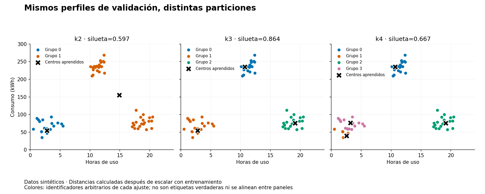
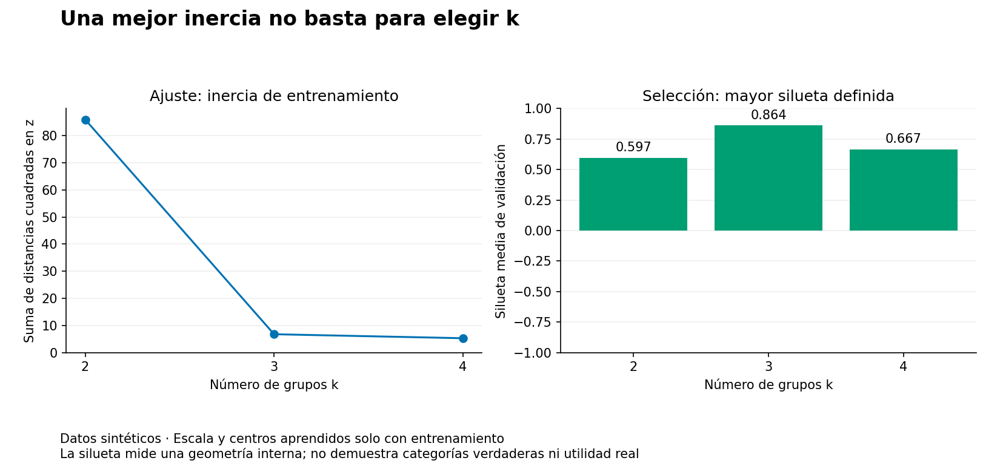
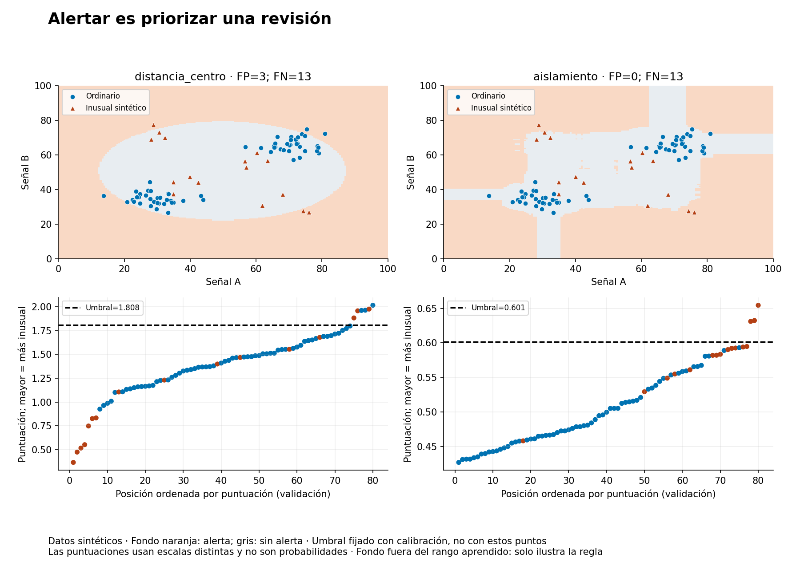

# Unidad 14 — Agrupamiento y detección de anomalías

[Índice](../README.md) · [Anterior: árboles y ensambles](../unidad13-arboles-ensambles/README.md)

**Pregunta guía:** ¿cómo encontrar grupos y casos inusuales sin confundirlos con categorías verdaderas o problemas confirmados?

Hasta ahora aprendiste a predecir un objetivo conocido. Aquí comenzarás con entradas sin etiquetas: agruparás perfiles y aprenderás una referencia de comportamiento ordinario. Evaluar sigue siendo necesario, aunque cambie el tipo de evidencia disponible.

## Objetivos y preparación

Al terminar podrás:

- Ejecutar una asignación y actualización de centros de K-means a mano.
- Explicar cómo la escala de las variables afecta la distancia.
- Comparar cantidad de grupos, cohesión, separación y estabilidad sin atribuirles significado automático.
- Distinguir agrupamiento, clasificación, anomalía y error de datos.
- Separar puntuación, umbral y alerta, y revisar falsos positivos y falsos negativos.
- Mantener entrenamiento, selección y prueba separados al asignar casos nuevos.

Prerrequisitos: distancia y media de las unidades [3](../unidad03-matematica-aplicada/README.md) y [4](../unidad04-probabilidad-estadistica/README.md), escalado de la [8](../unidad08-preparacion-datos/README.md), protocolo de la [10](../unidad10-flujo-lineas-base/README.md) y métricas y ensambles de las [12](../unidad12-clasificacion/README.md) y [13](../unidad13-arboles-ensambles/README.md). Duración orientativa: 6–8 horas con el reto.

Se reutilizan Python 3.12.3, scikit-learn 1.9.1, NumPy 2.2.6 y Matplotlib 3.10.8, comprobados en un entorno virtual limpio en Linux. No se añaden paquetes respecto de la Unidad 13. CPU suficiente; no se requieren GPU ni servicios externos. La instalación inicial necesita red; las prácticas posteriores son locales.

Desde la raíz del curso, con el entorno virtual activo:

```bash
python -m pip install -r unidad14-agrupamiento-anomalias/requirements.txt
python unidad14-agrupamiento-anomalias/ejemplos/01_agrupar_perfiles.py
python unidad14-agrupamiento-anomalias/ejemplos/02_detectar_anomalias.py
```

El [diccionario de datos](datos/README.md) explica los siete CSV nuevos. El [protocolo](datos/protocolo.md) fija las decisiones y los [recursos](recursos/README.md) permiten revisar las salidas publicadas.

## 1. Tres preguntas diferentes

| Tarea | Pregunta | Evidencia que no debes inventar |
|---|---|---|
| Clasificación | ¿Qué etiqueta conocida predice el modelo? | Una clase real sin etiquetas de referencia |
| Agrupamiento | ¿Qué casos quedan juntos con estas variables, escala y método? | Que los grupos sean categorías naturales o causas |
| Detección de anomalías | ¿Qué casos difieren de la referencia y conviene revisar? | Que una alerta confirme falla, fraude o peligro |

Un consumo elevado puede ser normal para una instalación grande. Un registro inusual puede ser un error de captura, una operación legítima rara o un cambio relevante. El modelo no resuelve por sí solo cuál explicación es correcta. Además, un problema frecuente podría parecer normal al detector.

Los identificadores de grupos —0, 1, 2— son arbitrarios. Si otra ejecución intercambia 0 y 2 pero mantiene juntos exactamente los mismos casos, la partición no cambió. Tampoco es correcto llamar «bajo riesgo» al grupo 0 sin evidencia externa.

## 2. Distancia y escala

Para dos entradas, la distancia euclídea entre un caso `x` y un centro `c` es:

```text
d(x,c) = sqrt((x1−c1)² + (x2−c2)²)
```

Sumar diferencias en horas y kWh sin declarar escala puede hacer que la variable con números mayores domine. Desde `(0 h, 0 kWh)`, el centro `(1 h, 20 kWh)` queda a `sqrt(401) ≈ 20,025`, mientras que `(4 h, 0 kWh)` queda a 4. Si expresas energía en MWh, el primer centro pasa a distancia aproximada 1 y cambia la asignación, aunque los casos físicos sean los mismos.

En los laboratorios usamos:

```text
z_j = (x_j − media_j de entrenamiento) / desviación_j de entrenamiento
```

La desviación usa divisor `n`, no `n−1`. `StandardScaler` conserva escala 1 para una columna constante y la centra en cero. Es una elección de geometría: cada variable se mide en unidades de su variabilidad de entrenamiento; no demuestra igual importancia para el problema. Los extremos pueden alterar media y desviación. La API se documenta en [StandardScaler](https://scikit-learn.org/stable/modules/generated/sklearn.preprocessing.StandardScaler.html).

Aprende esa transformación **solo con entrenamiento** y úsala sin reajustar en los otros conjuntos. Tampoco en aprendizaje no supervisado se debe incorporar automáticamente la distribución de los futuros casos al ajuste cuando la tarea es asignarlos después.

## 3. K-means: asignar y actualizar

K-means busca `k` centros y minimiza la suma de distancias cuadradas de los casos a su centro asignado, llamada **inercia**:

```text
inercia = suma_i ||z_i − centro_del_grupo_i||²
```

La idea del algoritmo de Lloyd alterna dos pasos:

1. Asignar cada caso al centro más cercano.
2. Actualizar cada centro con la media de los casos de su grupo.

Ejemplo de cuatro puntos, ya expresados en una escala común:

| Caso | Coordenadas | Centro inicial más cercano |
|---|---|---|
| A | (1, 1) | (1, 1) |
| B | (1, 3) | (1, 1) |
| C | (7, 7) | (9, 7) |
| D | (9, 7) | (9, 7) |

Los centros actualizados son `(1,2)` y `(8,7)`. La suma inicial es `0+4+4+0=8`; después es `1+1+1+1=4`. Reasignar estos cuatro puntos conserva los grupos. Ejecuta:

```bash
python unidad14-agrupamiento-anomalias/soluciones/03_paso_kmeans.py
```

El programa implementa **un paso didáctico**, no toda la biblioteca. Resuelve empates a favor del primer centro y rechaza grupos vacíos en vez de reinicializarlos. K-means completo depende de los centros iniciales y puede llegar a un mínimo local. Por eso fijamos `init="k-means++"`, `n_init=10`, `max_iter=300`, `tol=1e-4`, `algorithm="lloyd"` y semilla 14. Los diez reinicios se comparan por inercia de entrenamiento; no son diez evaluaciones de prueba. Consulta [KMeans](https://scikit-learn.org/stable/modules/generated/sklearn.cluster.KMeans.html).

Este ejemplo mínimo muestra la diferencia entre ajustar y asignar nuevos casos:

```python
from sklearn.cluster import KMeans
from sklearn.preprocessing import StandardScaler

X_entrenamiento = [[1, 1], [1, 3], [7, 7], [9, 7]]
escala = StandardScaler().fit(X_entrenamiento)
modelo = KMeans(n_clusters=2, n_init=10, random_state=14)
modelo.fit(escala.transform(X_entrenamiento))
grupo = modelo.predict(escala.transform([[2, 2]]))
print(grupo)  # El número identifica un centro; no es una clase verdadera.
```

En la práctica, el algoritmo favorece grupos compactos en su geometría. Una curva, densidades muy diferentes o variables poco relevantes pueden producir particiones poco útiles. Métodos por densidad, como DBSCAN, plantean otra definición de grupo y pueden marcar ruido, pero también requieren parámetros y supuestos. No se implementan aquí; la [guía de agrupamiento](https://scikit-learn.org/stable/modules/clustering.html) compara sus alcances.

## 4. Evaluar sin etiquetas verdaderas

Una inercia baja indica proximidad a los centros en la escala elegida. Aumentar `k` permite, en el óptimo, mantener o reducir ese costo; llevar `k` hasta un centro por caso no aporta necesariamente una explicación útil. Los ajustes locales de una implementación tampoco garantizan una curva siempre decreciente.

La **silueta** compara cohesión y separación entre los casos de una partición:

```text
a(i) = distancia media de i a los demás casos de su mismo grupo
b(i) = menor distancia media de i a los casos de cada otro grupo
s(i) = (b(i) − a(i)) / max(a(i), b(i))
```

Valores próximos a 1 indican mayor separación bajo esa distancia; próximos a 0, cercanía entre grupos; negativos, una asignación que parece menos próxima a su propio grupo. No se usan distancias a los centros en esta fórmula. Para el caso A del ejemplo: `a=2`, `b=(sqrt(72)+10)/2`, por lo que `s≈0,783612`.

Promediamos la silueta de todos los casos. Se requiere entre 2 y `n−1` grupos presentes; con uno solo o uno por caso se registra `null`. La biblioteca asigna silueta 0 a un caso que constituye un grupo de un solo miembro y a la situación degenerada con ambas distancias cero. Véase [silhouette_score](https://scikit-learn.org/stable/modules/generated/sklearn.metrics.silhouette_score.html).

La **estabilidad** responde otra pregunta: ¿cambia la partición al repetir el ajuste con otras inicializaciones? Aquí comparamos la asignación de los mismos casos de validación mediante el índice de Rand ajustado, **ARI**. ARI=1 significa misma partición aunque cambien los nombres de grupos; cerca de 0 indica el nivel esperado de acuerdo bajo el ajuste por azar del índice, y puede ser negativo. No es porcentaje de aciertos. Referencia: [adjusted_rand_score](https://scikit-learn.org/stable/modules/generated/sklearn.metrics.adjusted_rand_score.html).

No confundas las conclusiones: una partición puede ser estable y poco útil, o tener buena silueta solo porque las variables y la escala favorecen cierta forma. Entender los grupos requiere perfiles descriptivos, conocimiento del contexto y revisión de cobertura.

## 5. Laboratorio 1 — Agrupar perfiles y asignar casos nuevos

Cada caso sintético resume horas de uso y consumo diario. No se dispone de etiquetas de categoría, fechas ni equipos reales. Hay 90 casos de entrenamiento, 60 de validación y 60 de prueba. No se introducen las etiquetas latentes del generador en los archivos.

Se comparan `k=2,3,4` con los mismos parámetros y escalado. Ajustamos centros con entrenamiento; asignamos validación a esos centros, sin recalcularlos; seleccionamos la mayor silueta definida de validación. Un empate exacto favorece el menor `k`. Si ningún candidato tiene silueta definida, el experimento se detiene.

```bash
python unidad14-agrupamiento-anomalias/ejemplos/01_agrupar_perfiles.py --salida resultados/unidad14/grupos-desarrollo --graficos
```

```text
candidato | inercia entrenamiento | silueta validación | tamaños validación | ARI con semillas 29 y 47
k2 | 85.928 | 0.597 | [20, 40] | 1.000, 1.000
k3 | 6.763 | 0.864 | [20, 20, 20] | 1.000, 1.000
k4 | 5.291 | 0.667 | [20, 5, 20, 15] | 1.000, 1.000
Seleccionado por silueta de validación: k3
Prueba reservada: no se leyó su archivo.
```



Los centros del elegido, devueltos a unidades originales, son aproximadamente `(10,693 h; 235,155 kWh)`, `(2,807 h; 54,305 kWh)` y `(19,122 h; 75,412 kWh)`. Son medias aprendidas, no tres casos necesariamente existentes. Puedes describir diferencias de uso y consumo; no deducir eficiencia, tipo de instalación o causa de consumo solo con estas variables.



Cuatro grupos reducen la inercia y dividen una nube, pero la silueta de validación favorece tres. Para cada `k`, los ajustes con semillas 29 y 47 se comparan con el de semilla 14: los seis ARI son 1. Esa estabilidad no permite elegir por sí sola: también es estable `k=4`.

Este diagnóstico cambia la inicialización sobre **el mismo entrenamiento**; no remuestrea casos, no estudia otros periodos y no estima incertidumbre poblacional. Si se cambia `--semilla`, las referencias siguen siendo 29 y 47; una comparación con la misma semilla no aporta una repetición distinta.

## 6. Anomalías: de la puntuación a la revisión

El segundo laboratorio aprende de casos considerados ordinarios para evaluar otros nuevos. Esto se aproxima a **detección de novedad**: se espera una referencia de entrenamiento sin anomalías relevantes. Es distinto de buscar valores atípicos dentro de una muestra ya mezclada. En datos reales habría que justificar esa referencia; aquí lo declara el generador. La distinción aparece en la [guía de detección](https://scikit-learn.org/stable/modules/outlier_detection.html).

Comparamos tres procedimientos:

| Candidato | Puntuación | Limitación que se estudia |
|---|---|---|
| `sin_alertas` | Ninguna; siempre alerta 0 | No consume revisiones, pero omite todos los positivos |
| `distancia_centro` | `sqrt(z_a² + z_b²)` | Una media global puede caer entre dos modos ordinarios y no describirlos bien |
| `aislamiento` | `-IsolationForest.score_samples(z)` | Aislar con cortes aleatorios no captura necesariamente toda combinación inusual |

Isolation Forest construye particiones aleatorias: casos fáciles de aislar tienden a tener recorridos más cortos. Se usa un bosque de 64 árboles, muestras de 64 casos sin reemplazo, ambas variables disponibles, semilla 14 y `n_jobs=1`. Aunque también use árboles, su ajuste no minimiza Gini ni utiliza etiquetas. La [API de IsolationForest](https://scikit-learn.org/stable/modules/generated/sklearn.ensemble.IsolationForest.html) documenta que `score_samples` disminuye al aumentar lo inusual; invertimos el signo para que ambas puntuaciones tengan el sentido «mayor = más inusual».

**Las puntuaciones no son probabilidades**. Un 0,60 del bosque no significa 60 % de riesgo; tampoco se compara directamente con una distancia de 1,80. No llamamos a `predict` de Isolation Forest: aplicamos una regla de alerta propia, con un umbral que se fija por separado.

## 7. Fijar el umbral con un conjunto separado

Se utilizan cuatro particiones nuevas:

| Partición | Casos | Información usada | Función |
|---|---:|---|---|
| Entrenamiento | 120 | Dos señales, sin etiquetas | Ajustar escala y detector |
| Calibración del umbral | 60 | Dos señales, sin etiquetas; ordinarios por construcción | Fijar el umbral de cada puntuación |
| Validación | 80 | Señales y referencia sintética: 16 positivos | Comparar procedimientos ya fijados |
| Prueba | 80 | Señales y referencia sintética: 16 positivos | Cerrar con el elegido |

«Calibración» aquí significa **fijar el umbral**, no calibrar probabilidades. Se ordenan las 60 puntuaciones de ese conjunto y se toma la posición `ceil(0,95 × 60)=57`, contando desde 1. La regla es estricta:

```text
alerta = 1 si puntuación > umbral; en otro caso, 0
```

Con cinco puntuaciones `[1,2,3,4,5]` y `q=0,8`, la posición es 4, el umbral es 4 y solo 5 activa alerta. Con empates pueden quedar menos observaciones por encima del umbral. El código usa este estadístico de orden explícito, sin interpolación.

El 95 % se fijó para practicar una referencia de cola; no se buscó con las etiquetas de validación. En los datos publicados quedan tres alertas entre los 60 casos de calibración para cada detector. **No garantiza 5 % de alertas futuras, 5 % de falsos positivos ni una cuota operativa**. La distribución, la muestra y los empates pueden cambiar. Aquí no se construye una garantía estadística de cobertura.

Las referencias de validación sí se usan para seleccionar por F1. Por tanto, el **ajuste del detector es no supervisado**, pero la selección completa aprovecha etiquetas sintéticas. No se presenta todo el procedimiento como si nunca hubiera usado etiquetas.

## 8. Laboratorio 2 — Revisar alertas y omisiones

```bash
python unidad14-agrupamiento-anomalias/ejemplos/02_detectar_anomalias.py --salida resultados/unidad14/anomalias-desarrollo --graficos
```

```text
candidato | umbral | alertas calibración | precisión validación | recobrado | F1 | FP | FN
sin_alertas | no definida | 0 | no definida | 0.000 | 0.000 | 0 | 16
distancia_centro | 1.808 | 3 | 0.500 | 0.188 | 0.273 | 3 | 13
aislamiento | 0.601 | 3 | 1.000 | 0.188 | 0.316 | 0 | 13
Seleccionado por f1 de validación: aislamiento
Prueba reservada: no se leyó su archivo.
```

Se selecciona `aislamiento` por F1, sin redondear. Obtiene **3 VP, 64 VN, 0 FP y 13 FN**. Su precisión 1 se basa en solo tres alertas; el recobrado es `3/16=0,1875`. Quedar primero entre estos candidatos no lo convierte en un detector suficiente: omite la mayoría de los casos inusuales sintéticos.



El fondo naranja indica alerta y el gris ausencia de alerta. Los puntos distinguen la referencia sintética, no lo que el modelo conoce al ajustar. Abajo se ordenan puntuaciones de validación; el umbral proviene de calibración. Las escalas verticales son diferentes entre detectores. El fondo fuera de los rangos aprendidos solo ilustra lo que devuelve la regla; no acredita fiabilidad allí.

Ejemplos verificables en el CSV de validación:

- `anomalias-validacion-001`, señales `(57,01; 52,76)`, es inusual por construcción. El bosque da `0,594042`, por debajo de `0,601445`: es FN. La distancia al centro es solo `0,367582`, también FN.
- `anomalias-validacion-057`, señales `(80,86; 72,25)`, es ordinario. Su distancia `2,015155` supera `1,807755`: es FP de la referencia por distancia. El bosque no tiene FP en esta validación; no hace falta inventar uno para analizar errores.

La referencia por distancia omite casos cercanos al centro global, aunque esa zona no represente los modos ordinarios. El bosque también deja pasar varias combinaciones nuevas dentro de rangos marginales familiares. El gráfico ayuda a localizar esas omisiones; no identifica una causa real ni demuestra que cambiar un solo parámetro las resuelva.

Una continuación apropiada podría revisar variables, referencia ordinaria y capacidad de revisión. Cualquier nuevo umbral o detector sería otro procedimiento y necesitaría evaluación propia. No se cambia el protocolo después de mirar prueba para mejorar la cifra publicada.

## 9. Cierre y reproducción

Conserva el elegido, las versiones, el commit, los comandos, las huellas de desarrollo y los parámetros antes del cierre. Después:

```bash
python unidad14-agrupamiento-anomalias/ejemplos/01_agrupar_perfiles.py --evaluar-prueba --salida resultados/unidad14/grupos-cierre
python unidad14-agrupamiento-anomalias/ejemplos/02_detectar_anomalias.py --evaluar-prueba --salida resultados/unidad14/anomalias-cierre
```

Se repite ajuste y selección con sus conjuntos permitidos, y solo después se abre prueba para el elegido. No se reajustan escala, centros, bosque ni umbrales incorporando validación o prueba. Comprueba que el desarrollo coincida con la exportación anterior.

| Experimento | Elegido | Resultado de cierre |
|---|---|---|
| Grupos | `k3` | Silueta 0,853; tamaños `[20,20,20]` |
| Anomalías | `aislamiento` | VP=3, VN=64, FP=0, FN=13; F1=0,316 |

Los conteos de anomalías coinciden con los de validación en esta construcción, pero corresponden a otros casos y no son una garantía de estabilidad. La silueta de prueba sigue siendo una medida interna, no exactitud de clasificación. Ambos cierres son demostraciones sintéticas públicas; leer antes el generador o las respuestas impide describir el proceso personal como ciego.

Para regenerar datos y estudiar otra semilla en una variante separada:

```bash
python unidad14-agrupamiento-anomalias/datos/generar_datos.py --salida resultados/unidad14/datos-copia
python unidad14-agrupamiento-anomalias/ejemplos/01_agrupar_perfiles.py --datos resultados/unidad14/datos-copia/grupos
python unidad14-agrupamiento-anomalias/ejemplos/02_detectar_anomalias.py --semilla 29
```

Las siete semillas de datos son distintas de la semilla de modelos. Cambiar `--semilla` no modifica los CSV. Fijar una semilla no estima incertidumbre ni permite elegir la más favorable y ocultar las demás.

`--salida` exige una carpeta nueva. El JSON conserva fuentes, huellas, versiones, escalado, modelos o sus resúmenes, criterios y resultados. Los CSV contienen todos los candidatos de desarrollo y solo el elegido en prueba. Un grupo recibe distancia a su centro; una alerta recibe puntuación y umbral, no probabilidad. El identificador nunca es entrada del predictor.

Los centros y resúmenes no constituyen una persistencia completa de los estimadores. Para repetir consultas se vuelve a ejecutar el código con los mismos datos y entorno. Las figuras usan exclusivamente desarrollo. Una exportación puede quedar parcial ante un error de escritura o dibujo: comprueba sus archivos, no solo la existencia del JSON.

## 10. Ejercicios, reto y comprobación

Intenta resolver estos diez ejercicios antes de consultar las [soluciones razonadas](soluciones/README.md):

1. Calcula las asignaciones, los nuevos centros y la inercia del ejemplo de cuatro puntos.
2. Reproduce el cambio de centro más cercano al convertir kWh a MWh. Explica qué resuelve y qué no resuelve estandarizar.
3. Calcula la silueta del punto A y explica por qué no se calcula con distancias a centros.
4. Justifica `k3` frente a `k4`. ¿Qué aporta que ambos tengan ARI=1 y qué no demuestra?
5. Compara las particiones `[0,0,1,1]` y `[7,7,3,3]`. ¿Sirve contar igualdad literal de identificadores?
6. Explica qué diferencia una alerta, una etiqueta real y un error de captura. Da un ejemplo legítimo pero inusual.
7. Obtén el umbral de `[1,2,3,4,5]` con `q=0,8`, y el de `[1,2,2,2]` con `q=0,5`. Aplica la comparación estricta.
8. Calcula precisión, recobrado, F1 y exactitud de Isolation Forest en validación. Explica por qué la exactitud puede distraer aquí.
9. Analiza el FN `anomalias-validacion-001` y el FP por distancia `anomalias-validacion-057`. ¿Qué evidencia faltaría en un problema real?
10. Indica qué debe permanecer igual al cambiar solo etiquetas de prueba. ¿Es completamente no supervisada una selección que usa F1 de etiquetas sintéticas?

El [reto con rúbrica](reto.md) pide un informe reproducible de uno de los laboratorios. Usa la [plantilla](plantillas/informe_agrupamiento_anomalias.md).

```bash
python -m unittest discover -s unidad14-agrupamiento-anomalias/pruebas -v
python herramientas/verificar_curso.py
```

Las **30 pruebas** incluyen referencias independientes para Lloyd, inercia y silueta, invariancia de ARI a nombres, estadísticos de orden, signo de puntuaciones, separación de datos, regeneración y correspondencia de figuras y artefactos. Pasarlas no demuestra que existan grupos útiles o un detector operativo.

Puedes continuar cuando sepas explicar la geometría elegida, distinguir medida interna de evidencia externa, asignar un caso sin reajustar y reconstruir cómo una puntuación se convirtió en alerta.

Continúa en la [Unidad 15 — Características y reducción de dimensión](../unidad15-caracteristicas-dimension/README.md).
