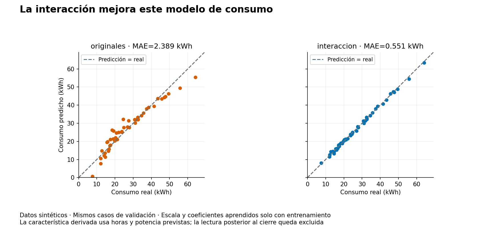
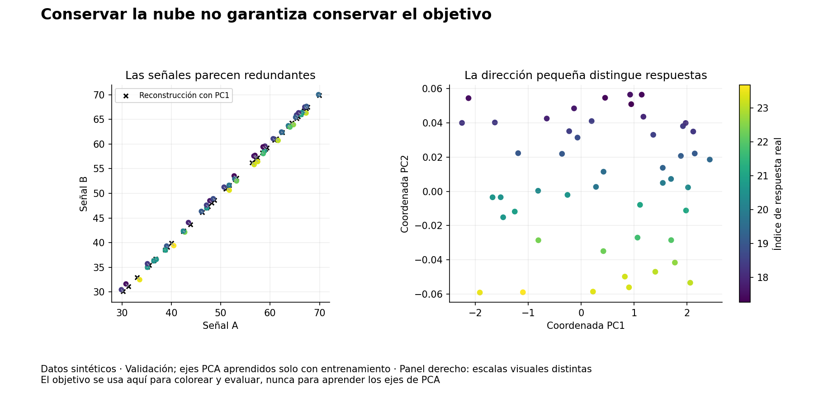
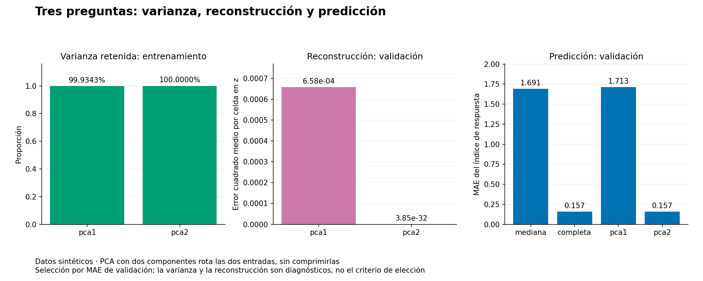

# Unidad 15 — Características y reducción de dimensión

[Índice del curso](../README.md) · [Anterior: agrupamiento y anomalías](../unidad14-agrupamiento-anomalias/README.md)

**Pregunta guía:** ¿cómo representar un caso con variables útiles y reducir dimensión sin perder información necesaria ni utilizar datos del futuro?

Un modelo aprende a partir de la representación que recibe. Cambiarla puede permitir que una regresión aprenda una interacción o puede eliminar una dirección necesaria para predecir. En esta unidad compararás esas dos situaciones con datos nuevos y un protocolo de evaluación explícito.

## Objetivos y preparación

Al terminar podrás:

- Distinguir una variable original, una característica derivada y una representación aprendida.
- Justificar qué información está disponible al predecir y excluir columnas posteriores.
- Construir una interacción con unidades y significado, sin confundir más columnas con más información.
- Calcular una proyección, reconstruir un caso y explicar qué descarta PCA.
- Diferenciar varianza retenida, error de reconstrucción y error de predicción.
- Ajustar escala, componentes y regresión solo con entrenamiento, y conservar el procedimiento al cerrar.

Prerrequisitos: vectores y proyecciones de la [Unidad 3](../unidad03-matematica-aplicada/README.md), preparación de la [8](../unidad08-preparacion-datos/README.md), evaluación de la [10](../unidad10-flujo-lineas-base/README.md), regresión de la [11](../unidad11-regresion/README.md) y escala y agrupamiento de la [14](../unidad14-agrupamiento-anomalias/README.md). Duración orientativa: 6–8 horas con el reto.

Se comprobó con Python 3.12.3, scikit-learn 1.9.1, NumPy 2.2.6, SciPy 1.18.1 y Matplotlib 3.10.8 en Linux. Se reutiliza el entorno verificado de las unidades anteriores, sin dependencias nuevas. CPU suficiente; sin GPU, cuentas ni servicios externos. La instalación inicial necesita Internet; después las prácticas son locales.

Desde la raíz, con el entorno virtual activo:

```bash
python -m pip install -r unidad15-caracteristicas-dimension/requirements.txt
python unidad15-caracteristicas-dimension/ejemplos/01_construir_caracteristicas.py
python unidad15-caracteristicas-dimension/ejemplos/02_comparar_pca.py
```

Consulta el [diccionario de datos](datos/README.md), el [protocolo](datos/protocolo.md) y los [recursos reproducibles](recursos/README.md).

## 1. Representar no es acumular columnas

Una **característica** es una cantidad que el modelo recibe para describir un caso. Puede proceder directamente de una observación, de una fórmula o de una transformación aprendida.

| Tipo | Ejemplo | Qué hay que justificar |
|---|---|---|
| Original | Horas previstas de funcionamiento | Significado, unidad y disponibilidad al decidir |
| Derivada por fórmula | Horas previstas × potencia prevista | Entradas permitidas, significado y dominio de la fórmula |
| Aprendida | Coordenadas en ejes de PCA | Conjunto que permitió aprender escala y ejes |
| Posterior excluida | Lectura del medidor al terminar el ciclo | No existía cuando se debía emitir la predicción |

La derivación determinista no crea información nueva respecto de sus entradas. Sí puede facilitar que **una familia de modelos** exprese una relación. Una regresión aditiva en horas y potencia no contiene automáticamente su producto; añadirlo cambia la función que puede ajustar.

Duplicar horas en minutos tampoco añade información. Si se incluyen `h` y `60h` en la misma regresión, sus coeficientes individuales no quedan identificados de manera única. Dos variables casi redundantes pueden dar coeficientes sensibles a perturbaciones. La correlación alta sugiere revisar la representación, pero no autoriza a eliminar una entrada sin evaluar qué se pierde.

Otras derivaciones requieren decisiones diferentes: una razón necesita tratar denominadores cero; una categoría no siempre admite distancias entre códigos enteros; una hora del día tiene estructura cíclica. Estos casos no se implementan aquí. Antes de aplicar una fórmula, define su significado y evita incorporar información que todavía no estaba disponible.

## 2. Una interacción con significado

En el primer laboratorio queremos predecir el consumo al terminar un ciclo, **antes de que empiece**, utilizando horas y potencia previstas. Una característica posible es:

```text
energia_nominal_kwh = horas_previstas × potencia_prevista_kw
```

Con 4 horas y 3 kW, el producto es 12 kWh. Es una energía nominal del plan; no es la medición final ni una garantía de consumo exacto.

El modelo aditivo tiene forma:

```text
predicción = b0 + b1 × horas + b2 × potencia
```

Al añadir la interacción:

```text
predicción = b0 + b1 × horas + b2 × potencia + b3 × horas × potencia
```

La segunda expresión sigue siendo lineal **en los coeficientes**; no es aditiva en las dos entradas originales. Al variar horas, su efecto depende también de potencia. No se añaden cuadrados ni todas las combinaciones polinómicas: solo el producto previamente justificado. La biblioteca ofrece [PolynomialFeatures](https://scikit-learn.org/stable/modules/generated/sklearn.preprocessing.PolynomialFeatures.html) para otras expansiones, pero aquí la fórmula se escribe explícitamente para poder auditarla.

El CSV contiene también `lectura_cierre_kwh`, una lectura posterior fuertemente relacionada con el objetivo. **Se excluye de todas las matrices predictivas**, junto con `caso_id` y `consumo_final_kwh`. Una buena puntuación obtenida con esa lectura no resolvería la predicción previa al ciclo. El escenario declara disponibilidad; al no tener fechas reales, no constituye una auditoría temporal de un sistema operativo.

## 3. Encadenar transformaciones y ajuste

El producto se calcula antes de estandarizar; así conserva su significado en kWh. Después, cada característica se centra y escala con media y desviación poblacional de entrenamiento. La regresión minimiza la suma de residuos cuadrados con intercepto, sin penalización. La referencia constante utiliza la mediana de entrenamiento.

Se utiliza `Pipeline` para encadenar los pasos que aprenden parámetros. En `fit`, escala, PCA si corresponde y regresión se ajustan con el mismo entrenamiento; en `predict`, solo se aplican los parámetros aprendidos. Esto facilita el uso correcto, pero llamar `fit` sobre todos los conjuntos seguiría siendo incorrecto. Referencias: [Pipeline](https://scikit-learn.org/stable/modules/generated/sklearn.pipeline.Pipeline.html) y [prevención de filtración](https://scikit-learn.org/stable/common_pitfalls.html).

Ejemplo pequeño y ejecutable, independiente de los CSV:

```python
import numpy as np
from sklearn.pipeline import Pipeline
from sklearn.preprocessing import StandardScaler
from sklearn.linear_model import LinearRegression

X = np.array([[2., 2.], [2., 4.], [4., 2.], [4., 4.]])
y = np.array([6.2, 9.4, 9.4, 15.8])
caracteristicas = np.column_stack((X, X[:, 0] * X[:, 1]))
modelo = Pipeline([("escala", StandardScaler()),
                   ("regresion", LinearRegression())])
modelo.fit(caracteristicas, y)
print(modelo.predict([[3., 3., 9.]]))  # [10.2]: h, potencia, producto
```

El orden de columnas de la consulta debe coincidir con el del ajuste. Los coeficientes guardados por nuestros laboratorios corresponden a las **características estandarizadas**, o a coordenadas PCA si las hay. No los multipliques directamente por horas o señales originales sin aplicar la transformación. El escalado usa divisor `n`; una columna constante tendría escala 1 en [StandardScaler](https://scikit-learn.org/stable/modules/generated/sklearn.preprocessing.StandardScaler.html).

El protocolo rechaza matrices originales o derivadas sin rango suficiente para identificar la regresión completa con intercepto. Es una restricción de estos experimentos: PCA sí puede trabajar con entradas redundantes si hay varianza útil. La documentación de [LinearRegression](https://scikit-learn.org/stable/modules/generated/sklearn.linear_model.LinearRegression.html) describe el ajuste por mínimos cuadrados y los diagnósticos de rango.

## 4. Laboratorio 1 — Comparar representaciones

Hay 96 casos de entrenamiento, 48 de validación y 48 de prueba, todos sintéticos. Comparamos `mediana`, `originales` e `interaccion`; todos reciben los mismos casos. Ninguno utiliza la lectura de cierre.

```bash
python unidad15-caracteristicas-dimension/ejemplos/01_construir_caracteristicas.py --salida resultados/unidad15/interaccion-desarrollo --graficos
```

```text
candidato | dimensión regresión | MAE entrenamiento | MAE validación | RMSE validación | R² validación
mediana | 0 | 8.975 | 10.072 | 12.754 | -0.024
originales | 2 | 1.931 | 2.389 | 3.290 | 0.932
interaccion | 3 | 0.441 | 0.551 | 0.637 | 0.997
Seleccionado por MAE de validación: interaccion
Prueba reservada: no se leyó su archivo.
```



La interacción mejora esta comparación porque el generador contiene una relación multiplicativa. Ese diseño facilita estudiar el mecanismo; no prueba que el producto siempre mejore datos reales. Se gana una característica para el modelo, sin obtener nuevas mediciones. Los coeficientes reflejan un ajuste conjunto y no son efectos causales demostrados.

MAE y RMSE están en kWh; R² es adimensional. Se selecciona por MAE, aunque la regresión se haya ajustado minimizando error cuadrático: objetivo de ajuste y criterio de selección tienen funciones diferentes. R² puede ser negativo; con objetivo constante o un único caso se registra `null`. No se recortan predicciones a cero: una regresión puede dar valores físicamente poco razonables, especialmente fuera de la cobertura aprendida.

## 5. PCA: aprender ejes y descartar direcciones

PCA, análisis de componentes principales, aprende direcciones ortogonales de mayor variación de las entradas. En nuestros modelos se aplica después de escalar. La clase `PCA` centra sus entradas, pero **no las estandariza automáticamente**. Se fija `svd_solver="full"` y `whiten=False`: no se usa un solver aleatorio ni se normaliza cada componente a varianza unidad. Referencia: [PCA](https://scikit-learn.org/stable/modules/generated/sklearn.decomposition.PCA.html).

Si `z` es un caso estandarizado, `m` la media que conserva PCA y `V` una matriz cuyas filas son los ejes retenidos:

```text
t = (z − m) × Vᵀ         # coordenadas en los ejes retenidos
z_reconstruido = t × V + m
x_reconstruido = z_reconstruido × escala + media_original
```

La última multiplicación es componente a componente. Conservar todas las direcciones permite reconstruir las entradas, salvo redondeo numérico. Conservar solo algunas elimina la parte perpendicular a ellas. Reducir de dos columnas a una significa una coordenada por caso, pero todavía hay que guardar medias, escalas y ejes: no elimina todos los costos de representación.

Un componente es una combinación de variables, no una variable original seleccionada. El signo del eje es arbitrario: cambiar `v` por `−v` cambia la coordenada de signo y conserva la reconstrucción. No atribuyas significado estable al signo sin revisar esa convención. PCA describe variación lineal; no encuentra automáticamente factores causales ni toda estructura no lineal. La [guía de descomposición](https://scikit-learn.org/stable/modules/decomposition.html) desarrolla esas diferencias.

## 6. Proyección manual antes del programa

Usa los puntos `(2,1)`, `(−2,−1)`, `(1,2)` y `(−1,−2)`. Para este ejemplo manual **solo centramos**, sin estandarizar. La media es `(0,0)` y la covarianza muestral, con divisor `n−1=3`, es:

```text
C = [[10/3, 8/3],
     [ 8/3,10/3]]
```

Una dirección principal es `v1=(1,1)/sqrt(2)`, con varianza 6. La dirección perpendicular `v2=(1,−1)/sqrt(2)` tiene varianza `2/3`. Puedes comprobar la primera multiplicando `C × v1 = 6 × v1`; no necesitas memorizar un algoritmo de autovectores.

Con un eje conservamos `6/(6+2/3)=0,9`, es decir, 90 % de la varianza. Para el primer punto:

```text
t1 = (2+1)/sqrt(2) = 3/sqrt(2)
reconstrucción = t1 × v1 = (1,5; 1,5)
residuo = (0,5; −0,5)
error cuadrado = 0,5² + (−0,5)² = 0,5
error cuadrado medio por celda = 0,5 / 2 = 0,25
```

Los cuatro casos tienen el mismo error en este ejemplo. Ejecuta:

```bash
python unidad15-caracteristicas-dimension/soluciones/03_proyectar_a_mano.py
```

El programa calcula autovectores de la covarianza con `numpy.linalg.eigh`, como referencia independiente de la SVD usada por scikit-learn. Las pruebas comparan proyecciones, permitiendo el cambio de signo. Si hay varianzas iguales, incluso varios ejes dentro de su subespacio pueden ser equivalentes.

En la biblioteca, `explained_variance_` también usa divisor `n−1`. No hay contradicción con la desviación poblacional del escalador, que usa `n`: son pasos diferentes. Las proporciones se obtienen dividiendo cada varianza por la varianza total del mismo ajuste.

## 7. Tres medidas para tres preguntas

| Medida | Pregunta | Se calcula aquí con |
|---|---|---|
| Varianza retenida | ¿Qué fracción de la variación de las entradas conserva la proyección? | Entrenamiento estandarizado |
| MSE de reconstrucción | ¿Cuánto difieren las entradas y su reconstrucción? | Cada conjunto, sin reajustar PCA |
| MAE predictivo | ¿Cuánto difiere el objetivo real de la predicción de la regresión? | Cada conjunto; validación decide el candidato |

El MSE de reconstrucción se promedia sobre **casos y columnas**. Se registra tanto en `z` como en las señales originales. En `z` es adimensional; en las señales originales tiene unidades de índice al cuadrado. No se mezcla con el MAE del objetivo ni se presentan como errores equivalentes.

PCA no consulta el objetivo para aprender sus ejes. Una dirección de poca varianza podría ser muy importante para predecir. Elegir «suficientes componentes para conservar 95 %» puede ser adecuado para cierta compresión, pero no certifica rendimiento predictivo. La cantidad de componentes es una decisión que debe evaluarse según la tarea.

## 8. Laboratorio 2 — Conservar varianza y perder predicción

Este conjunto contiene dos señales sintéticas casi iguales y un índice de respuesta. Cada señal se conoce antes de emitir la predicción; el índice se observa después, según el escenario declarado. Se crearon 96 casos de entrenamiento, 48 de validación y 48 de prueba.

Comparamos cuatro candidatos, sin cambiar la regresión final:

| Candidato | Representación para predecir | Dimensión |
|---|---|---:|
| `mediana` | Constante de entrenamiento | 0 |
| `completa` | Ambas señales estandarizadas | 2 |
| `pca1` | Primera coordenada PCA | 1 |
| `pca2` | Dos coordenadas PCA | 2 |

`pca2` es un control de rotación: **no comprime** dos entradas. Con regresión lineal sin penalización e intercepto, conserva el mismo espacio de funciones que `completa`, salvo precisión numérica.

```bash
python unidad15-caracteristicas-dimension/ejemplos/02_comparar_pca.py --salida resultados/unidad15/pca-desarrollo --graficos
```

```text
candidato | dimensión regresión | MAE entrenamiento | MAE validación | RMSE validación | R² validación
mediana | 0 | 1.743 | 1.691 | 1.957 | -0.009
completa | 2 | 0.167 | 0.157 | 0.197 | 0.990
pca1 | 1 | 1.745 | 1.713 | 1.979 | -0.032
pca2 | 2 | 0.167 | 0.157 | 0.197 | 0.990
pca1: varianza retenida entrenamiento=0.999343; MSE reconstrucción z validación=0.000658
pca2: varianza retenida entrenamiento=1.000000; MSE reconstrucción z validación=0.000000
Seleccionado por MAE de validación: completa
```



La variación dominante mueve ambas señales juntas; su pequeña diferencia contiene información sobre el objetivo. Al retener solo PC1 se conserva aproximadamente **99,9343 %** de la varianza, pero el MAE sube a 1,713, frente a 0,157 con ambas entradas. La mediana incluso resulta ligeramente mejor que `pca1` en esta validación.

El panel derecho amplía visualmente la dirección PC2: sus ejes tienen escalas distintas, explícitas en las marcas. Los colores muestran respuestas de validación para interpretar el resultado; **no se usaron para aprender los ejes**. Las señales parecen redundantes, pero aquí su diferencia es útil. El generador fue construido para enseñar ese contraste; no prueba que PCA suela perder información relevante en esa proporción.



Un MSE de reconstrucción pequeño y una nube visualmente parecida no garantizan buen MAE predictivo. El MSE de `pca2` es aproximadamente `3,85×10⁻³²` en validación: el cero de consola representa precisión numérica, no una promesa de reconstrucción exacta en cualquier sistema ni de predicción perfecta.

## 9. Selección, cierre y archivos

Ambos laboratorios minimizan MAE de validación. Se considera empate numérico cualquier candidato a no más de **1e−10 unidades del objetivo** del mínimo, y se elige el primero del orden publicado. Esta tolerancia absoluta evita elegir entre `completa` y `pca2` por diferencias de redondeo de una rotación equivalente. No es una prueba estadística ni el redondeo a tres decimales de consola.

Registra código, versiones, huellas, transformación y elegido antes de cerrar:

```bash
python unidad15-caracteristicas-dimension/ejemplos/01_construir_caracteristicas.py --evaluar-prueba --salida resultados/unidad15/interaccion-cierre
python unidad15-caracteristicas-dimension/ejemplos/02_comparar_pca.py --evaluar-prueba --salida resultados/unidad15/pca-cierre
```

| Experimento | Elegido previamente | MAE de prueba | RMSE | R² |
|---|---|---:|---:|---:|
| Interacción | `interaccion` | 0,429 kWh | 0,585 kWh | 0,998 |
| PCA | `completa` | 0,139 | 0,192 | 0,993 |

Cada ejecución repite el ajuste y la selección con entrenamiento y validación, y solo después abre prueba. No reajusta con validación ni compara todos los candidatos en prueba. Confirma que las huellas de desarrollo, parámetros y elección coincidan con el registro previo. Si prueba inspira cambios, debe reconocerse su uso en desarrollo y planearse una evaluación nueva.

Los archivos, el generador y las respuestas son públicos: enseñan el flujo del programa, no una evaluación personal ciega. No hay fechas ni equipos que acrediten separación temporal o por grupo. Tampoco estos resultados sintéticos demuestran utilidad o causalidad reales.

Para regenerar datos en otra carpeta:

```bash
python unidad15-caracteristicas-dimension/datos/generar_datos.py --salida resultados/unidad15/datos-copia
python unidad15-caracteristicas-dimension/ejemplos/02_comparar_pca.py --datos resultados/unidad15/datos-copia/pca
```

Los generadores usan semillas fijas. El ajuste no usa muestreo ni inicialización aleatoria: PCA realiza SVD completa y la regresión resuelve mínimos cuadrados. No se ofrece `--semilla` para cambiar un azar que estos ajustes no emplean. Aun así, versiones y plataformas pueden afectar detalles numéricos.

`--salida` requiere una carpeta nueva. Guarda JSON con escala, coeficientes, componentes, varianzas, métricas y representaciones; CSV con predicciones, residuos `real−predicción` y marca fuera de los rangos marginales de entrenamiento. Esa marca no prueba cobertura conjunta. Las coordenadas y reconstrucciones están en el JSON, en orden de entradas; para `completa`, las coordenadas son las señales estandarizadas, no componentes PCA.

La mediana no reconstruye entradas y registra métricas de reconstrucción `null`. La representación completa tiene reconstrucción identidad. Los informes no son una persistencia completa de estimadores: conserva código y datos para repetir el ajuste. Las figuras muestran solo desarrollo. Una exportación puede quedar parcial si falla la escritura o el dibujo; revisa todos sus archivos.

## 10. Ejercicios, reto y verificación

Resuelve antes de consultar las [diez soluciones razonadas](soluciones/README.md):

1. Para 4 horas y 3 kW, construye las características originales y la interacción. Explica su unidad y por qué no es consumo real.
2. Clasifica `caso_id`, horas, potencia, lectura de cierre y consumo final según su uso permitido al predecir antes del ciclo.
3. Explica por qué incluir horas y minutos no añade información y qué ocurre con la identificación de coeficientes.
4. Reconstruye la predicción del ejemplo pequeño para 3 horas y 3 kW. Distingue linealidad en coeficientes de aditividad en entradas.
5. Calcula media, covarianza y varianzas del ejemplo de cuatro puntos.
6. Proyecta `(2,1)` sobre `(1,1)/sqrt(2)`, reconstruye y calcula el error por celda. Repite el razonamiento al cambiar el signo del eje.
7. Explica qué significan los divisores `n` y `n−1` en los dos pasos y por qué el 90 % manual no mide predicción.
8. Compara los tres diagnósticos de `pca1`. ¿Por qué el 99,9343 % de varianza retenida no justifica seleccionarlo?
9. Justifica que `pca2` no comprime y explica por qué empata con `completa` bajo la regresión utilizada.
10. Diseña una comprobación que cambie solo el objetivo de prueba y otra que cambie la lectura posterior excluida. Indica qué debe permanecer igual y qué huellas cambiarían al editar archivos reales.

El [reto con rúbrica](reto.md) solicita un informe de uno de los laboratorios. Usa la [plantilla](plantillas/informe_representaciones.md).

```bash
python -m unittest discover -s unidad15-caracteristicas-dimension/pruebas -v
python herramientas/verificar_curso.py
```

Las **30 pruebas** comparan proyección y regresión con referencias independientes, verifican signos, reconstrucción, disponibilidad de columnas, separación de datos y coherencia de gráficos y exportaciones. Pasarlas no convierte estos ejemplos sintéticos en evidencia de rendimiento real.

Antes de continuar, deberías poder explicar qué recibe el modelo, dónde se aprendió cada transformación y por qué conservar varianza no basta para elegir una representación predictiva.

La siguiente entrega prevista es la **Unidad 16 — Validación y ajuste de hiperparámetros**, todavía pendiente de desarrollo.
