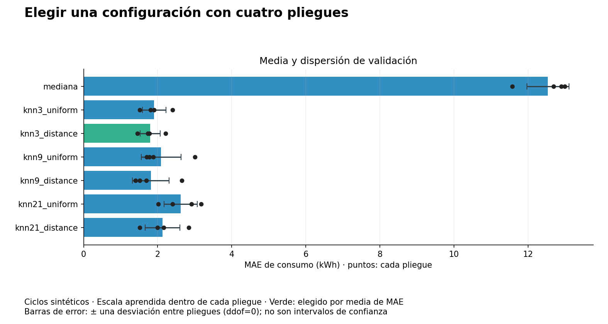
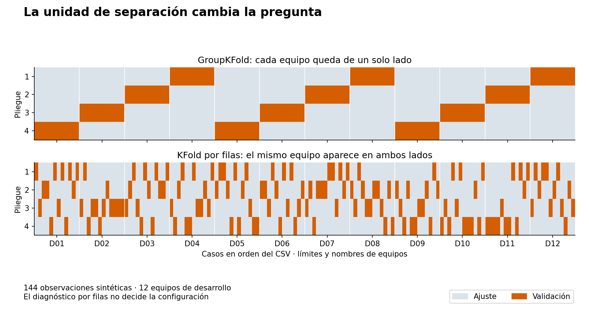
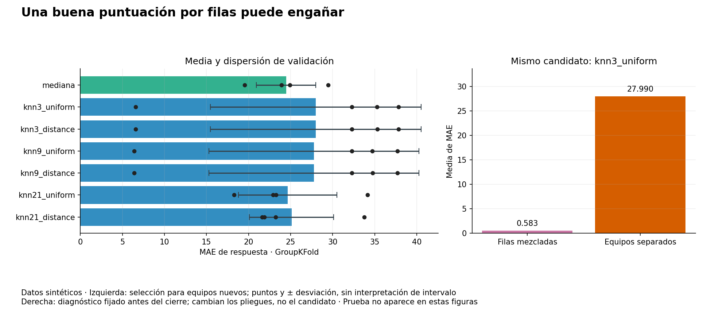

# Unidad 16 — Validación y ajuste de hiperparámetros

[Índice del curso](../README.md) · [Anterior: características y dimensión](../unidad15-caracteristicas-dimension/README.md)

**Pregunta guía:** ¿cómo elegir una configuración sin convertir la evaluación en una pista para mejorarla?

En las unidades anteriores reservamos entrenamiento, validación y prueba. Ahora dividiremos un conjunto de **desarrollo** en varios pliegues para comparar configuraciones. Después ajustaremos una instancia nueva de la elegida con todo desarrollo y abriremos prueba. Esta diferencia de protocolo se declara antes de ejecutar.

## Objetivos y preparación

Al terminar podrás:

- Distinguir parámetros aprendidos, hiperparámetros y decisiones del protocolo.
- Reconstruir índices de ajuste y validación, y elegir separación por casos, equipos o tiempo.
- Ajustar la preparación dentro de cada pliegue y reconocer filtración aunque no se utilice el objetivo.
- Comparar una rejilla pequeña con una referencia, calcular su presupuesto y aplicar un desempate declarado.
- Interpretar media, dispersión y predicciones fuera de pliegue sin prometer independencia estadística.
- Reajustar con desarrollo después de seleccionar y evaluar una sola alternativa en prueba.

Prerrequisitos: particiones y líneas base de la [Unidad 10](../unidad10-flujo-lineas-base/README.md), errores de [regresión](../unidad11-regresion/README.md), distancias y escala de [agrupamiento](../unidad14-agrupamiento-anomalias/README.md) y pipelines de la [Unidad 15](../unidad15-caracteristicas-dimension/README.md). Duración orientativa: 6–8 horas con el reto.

Se comprobó con Python 3.12.3, scikit-learn 1.9.1, NumPy 2.2.6, SciPy 1.18.1 y Matplotlib 3.10.8 en Linux, reutilizando el entorno de la entrega anterior. Sin dependencias nuevas, GPU, cuentas ni servicios externos. La instalación inicial requiere Internet; las prácticas posteriores son locales.

Desde la raíz, con el entorno virtual activo:

```bash
python -m pip install -r unidad16-validacion-hiperparametros/requirements.txt
python unidad16-validacion-hiperparametros/ejemplos/01_ajustar_con_cv.py
python unidad16-validacion-hiperparametros/ejemplos/02_validar_por_equipos.py
```

Consulta el [diccionario de datos](datos/README.md), el [protocolo previo](datos/protocolo.md) y los [recursos reproducibles](recursos/README.md).

## 1. Qué se aprende y qué se elige

| Elemento | Ejemplo | Cómo se obtiene aquí |
|---|---|---|
| Parámetro aprendido | Media y escala de una entrada; mediana del objetivo | Solo con las filas permitidas para ajustar |
| Estado aprendido | Casos y respuestas que conserva un predictor de vecinos | Con el entrenamiento de cada ajuste |
| Hiperparámetro | Número de vecinos, forma de ponderarlos | Se compara dentro de una rejilla declarada |
| Decisión del protocolo | Cuatro pliegues, separación por equipo, MAE | Se fija según la pregunta antes del cierre |

Buscar el mejor número de vecinos ya utiliza información de validación. Probar nuevas variables, semillas o familias hasta conseguir una puntuación deseada también es búsqueda, aunque se haga manualmente. La prueba final debe mantenerse fuera de esas decisiones.

Una búsqueda exhaustiva recorre una lista finita de combinaciones; no explora todos los modelos posibles. Añadir opciones aumenta costo y oportunidades de adaptar la elección a peculiaridades de desarrollo. La [guía de ajuste de hiperparámetros](https://scikit-learn.org/stable/modules/grid_search.html) distingue búsqueda en rejilla, aleatoria y otras estrategias. Aquí se implementa un bucle explícito para conservar cada ajuste y cada predicción.

## 2. Un predictor sencillo para observar el ajuste

Usaremos regresión por vecinos próximos, **KNN**. Después de estandarizar cada entrada, busca los `k` casos de entrenamiento más cercanos mediante distancia euclídea. Con `uniform`, predice la media de sus objetivos. Con `distance`, pondera por el inverso de la distancia. El número `k` de vecinos es distinto del número de pliegues de CV.

Por ejemplo, tres vecinos tienen respuestas `[10,20,40]` y distancias `[1,2,4]`:

```text
uniforme: (10+20+40)/3 = 23,333...
por distancia: (10/1+20/2+40/4)/(1+1/2+1/4) = 17,142857...
```

Si hay coincidencias exactas, la implementación de pesos por distancia promedia los objetivos de los vecinos seleccionados a distancia cero, excluyendo los alejados. Los empates en la frontera del vecino k pueden depender del orden de las filas; conservamos orden, datos y versiones. No se interpreta una cercanía geométrica como causalidad. Referencia: [KNeighborsRegressor](https://scikit-learn.org/stable/modules/generated/sklearn.neighbors.KNeighborsRegressor.html).

El modelo conserva observaciones para consultar después; no aprende una pendiente global. Valores pequeños de k producen estimaciones más locales; aumentarlo mezcla más casos. Ninguno es universalmente mejor. La escala decide cuánto influye cada entrada en la distancia, por eso se aprende dentro de cada ajuste.

Se comparan siete candidatos, en este orden: `mediana`, `knn3_uniform`, `knn3_distance`, `knn9_uniform`, `knn9_distance`, `knn21_uniform`, `knn21_distance`. La referencia usa la mediana del objetivo del entrenamiento permitido. Los otros seis son `StandardScaler → KNeighborsRegressor`, con búsqueda por fuerza bruta, distancia euclídea y un solo trabajo de cómputo.

## 3. Validación cruzada paso a paso

En cada uno de cuatro pliegues:

1. Se apartan las filas de validación de ese pliegue.
2. Se crea una instancia nueva del candidato.
3. Se ajustan escala y predictor con las filas restantes.
4. Se predicen las filas apartadas sin volver a ajustar.
5. Se guarda MAE, RMSE, sesgo, parámetros e identificadores.

Todos los candidatos reciben **las mismas particiones**. Cada caso valida exactamente una vez en estos dos laboratorios y participa en tres entrenamientos. El solapamiento entre entrenamientos es normal en CV; implica que las puntuaciones de los pliegues no son réplicas independientes. Consulta la [guía de validación cruzada](https://scikit-learn.org/stable/modules/cross_validation.html).

Ejemplo manual con objetivos `[0,2,4,6,8,10]`, tres pliegues y referencia mediana; índices desde cero:

| Pliegue | Índices de ajuste | Índices de validación | Mediana aprendida | MAE |
|---|---|---|---:|---:|
| 1 | 2,3,4,5 | 0,1 | 7 | 6 |
| 2 | 0,1,4,5 | 2,3 | 5 | 1 |
| 3 | 0,1,2,3 | 4,5 | 3 | 6 |

En el primer pliegue, errores absolutos `|0−7|=7` y `|2−7|=5`; MAE=6. La media de los tres MAE es `13/3=4,333...`. Si se hubiese calculado una mediana global de 5 antes de dividir, ya se habrían usado los objetivos apartados.

```bash
python unidad16-validacion-hiperparametros/soluciones/03_pliegues_a_mano.py
```

El programa muestra esa tabla, un ejemplo de filtración por escala y tres cortes temporales. Su conjunto de seis casos es independiente de la rejilla de los laboratorios, que necesita al menos 21 vecinos disponibles en cada entrenamiento.

## 4. La preparación también se valida

La secuencia correcta es `fit` de todo el pipeline con las filas de ajuste del pliegue y `predict` con las de validación. Estandarizar desarrollo completo antes de crear los pliegues permite que las filas apartadas influyan en las distancias. No hace falta usar sus etiquetas para filtrar información. La [guía de errores frecuentes](https://scikit-learn.org/stable/common_pitfalls.html) explica esta separación.

El ejemplo manual utiliza entrenamiento `X=[[0.,0.],[2.,10.],[4.,0.]]`, objetivos `[0.,20.,40.]` y consultas de validación `[[2.3,1.],[2.,1000.]]`, con punto decimal como en Python.

Con escala aprendida solo del entrenamiento, la primera consulta tiene como vecino más cercano `(4,0)` y predicción 40. Si se incorpora validación al escalador, el valor 1000 altera la escala del segundo eje: pasa a elegirse `(2,10)` y la predicción es 20. Ese segundo procedimiento está implementado **solo como contraejemplo identificado**, sin utilizarse para seleccionar ni evaluar los laboratorios. El cambio no implica que filtrar siempre mejore una métrica; muestra que información apartada modificó el procedimiento.

## 5. Laboratorio 1 — Ciclos independientes

Predecimos consumo antes de un ciclo usando horas y carga previstas. Hay 160 casos sintéticos de desarrollo y 64 de prueba, generados independientemente. No hay equipos repetidos ni orden temporal declarado. Se usa `KFold(n_splits=4, shuffle=True, random_state=16)`: cada ajuste tiene 120 casos y cada validación 40.

```bash
python unidad16-validacion-hiperparametros/ejemplos/01_ajustar_con_cv.py --salida resultados/unidad16/ciclos-desarrollo --graficos
```

Salida de desarrollo:

```text
candidato | MAE medio CV | desviación entre pliegues | MAE OOF
mediana | 12.538 | 0.569 | 12.538
knn3_uniform | 1.906 | 0.318 | 1.906
knn3_distance | 1.797 | 0.272 | 1.797
knn9_uniform | 2.092 | 0.535 | 2.092
knn9_distance | 1.816 | 0.493 | 1.816
knn21_uniform | 2.625 | 0.447 | 2.625
knn21_distance | 2.130 | 0.473 | 2.130
Seleccionado por MAE medio de CV: knn3_distance
Reajuste: 160 casos de desarrollo; ajustes totales: 29
Prueba reservada: no se leyó su archivo.
```



Se elige `knn3_distance` por el criterio declarado, pero 1,797 frente a 1,816 no demuestra una superioridad estadística estable. No se cambia a posteriori el criterio por la desviación, ni se afirma que ese k sea óptimo fuera de la rejilla. El costo de búsqueda es `7 candidatos × 4 pliegues=28` ajustes, más un reajuste con todo desarrollo: **29**. Predecir no cuenta como ajustar.

## 6. Media, dispersión y predicciones OOF

Para los MAE `m₁,...,m₄`, el informe guarda:

```text
media = suma(m_j)/4
desviación = sqrt(suma((m_j−media)²)/4)   # ddof=0
```

En el ejemplo manual de tres pliegues, la desviación es `sqrt(50)/3=2,357...`. Describe dispersión entre esos pliegues. No es error estándar ni intervalo de confianza: no debemos presentar `media ± desviación` como un intervalo que contenga el rendimiento verdadero con cierta probabilidad.

Una predicción **OOF** —fuera del pliegue de ajuste— procede del modelo que no se entrenó con ese caso. Los CSV reúnen esas predicciones, conservando el pliegue de origen. No son predicciones de un único modelo entrenado con todo desarrollo. Además, después de elegir el candidato con esas mismas puntuaciones, su OOF deja de ser una evaluación independiente de la selección completa.

El MAE OOF pondera cada caso igual; la media de MAE de pliegues pondera cada pliegue igual. Aquí coinciden porque los tamaños son iguales. Si un pliegue de un caso tiene MAE=2 y otro de tres casos MAE=8, la media por pliegue es 5, pero el MAE combinado es `(1×2+3×8)/4=6,5`. Define de antemano qué población y ponderación te interesan.

Seleccionamos la media de MAE entre pliegues. Empatan los candidatos a no más de `1e−10` unidades del mínimo global; gana el primero del orden publicado. Es una tolerancia numérica absoluta, no redondeo a tres decimales ni equivalencia estadística.

## 7. Laboratorio 2 — Generalizar a equipos nuevos

Cada uno de 12 equipos de desarrollo aporta 12 observaciones: 144 filas. Prueba contiene otros cuatro equipos, 48 filas. Dos señales previas describen cada observación; `equipo_id` organiza la separación y **no entra como característica**. Se predice una respuesta posterior adimensional.

Las señales de un equipo están muy cerca unas de otras y su respuesta es casi constante. El generador asigna esa respuesta base independientemente del centro de sus señales. Por tanto, reconocer un equipo conocido no implica poder anticipar la respuesta de uno nuevo. Es un escenario deliberado para examinar la validación, sin evidencia de sensores reales.

Se usa `GroupKFold(n_splits=4)`, sin barajar: nueve equipos ajustan y tres validan en cada pliegue, con 108 y 36 filas respectivamente. Nunca se comparte un equipo dentro del mismo pliegue. Referencia: [GroupKFold](https://scikit-learn.org/stable/modules/generated/sklearn.model_selection.GroupKFold.html).

```bash
python unidad16-validacion-hiperparametros/ejemplos/02_validar_por_equipos.py --salida resultados/unidad16/equipos-desarrollo --graficos
```

```text
candidato | MAE medio CV | desviación entre pliegues | MAE OOF
mediana | 24.460 | 3.527 | 24.460
knn3_uniform | 27.990 | 12.523 | 27.990
knn3_distance | 27.989 | 12.528 | 27.989
knn9_uniform | 27.777 | 12.486 | 27.777
knn9_distance | 27.786 | 12.488 | 27.786
knn21_uniform | 24.655 | 5.835 | 24.655
knn21_distance | 25.113 | 5.019 | 25.113
Seleccionado por MAE medio de CV: mediana
Reajuste: 144 casos de desarrollo; ajustes totales: 33
Diagnóstico fijo knn3_uniform: MAE por filas=0.583; MAE por equipos=27.990
```



El diagnóstico vuelve a evaluar **solo `knn3_uniform`, fijado previamente**, con cuatro pliegues aleatorios por filas. Se usa la misma preparación correcta dentro del pliegue, pero aparecen equipos conocidos en ambos lados. Su error muy pequeño responde a otra pregunta. No se utiliza para elegir el esquema de validación ni el candidato final. Añade cuatro ajustes: `28+1+4=33`.



La referencia mediana gana dentro de esta rejilla. No se retocan datos o candidatos para hacer ganar al modelo más elaborado. Una puntuación por filas podría ser pertinente para futuras observaciones de equipos conocidos si también se justifican tiempo y disponibilidad; aquí la pregunta explícita es sobre **equipos nuevos**. Separar por grupo resuelve la identidad compartida, pero no certifica representatividad de otros equipos o ausencia de cambios temporales.

Con tamaños desiguales de equipos, promediar MAE por pliegue no equivale en general a dar el mismo peso a cada equipo. Nuestros grupos tienen igual tamaño; no se presenta esa coincidencia como propiedad general de GroupKFold.

## 8. Cuando el orden temporal importa

| Uso previsto | Separación que debe justificarse |
|---|---|
| Casos independientes de la misma población | Pliegues aleatorios por caso |
| Nuevas personas, equipos o instituciones | Pliegues por la entidad correspondiente |
| Futuro a partir del pasado | Cortes cronológicos; revisar horizonte y disponibilidad de etiquetas |

Para 12 observaciones igualmente espaciadas y `TimeSeriesSplit(n_splits=3,test_size=2,gap=1)`, el ejemplo imprime:

```text
ajuste 0..4  | separación 5 | validación 6,7
ajuste 0..6  | separación 7 | validación 8,9
ajuste 0..8  | separación 9 | validación 10,11
```

Las primeras observaciones solo entrenan; no todas validan una vez en este esquema. `gap` cuenta filas excluidas al final del entrenamiento, no horas ni días automáticamente. Si una etiqueta tarda tres días en conocerse, hay que comprobar su disponibilidad para cada corte. Los laboratorios no implementan una evaluación temporal completa: este es un ejemplo de índices. Referencia: [TimeSeriesSplit](https://scikit-learn.org/stable/modules/generated/sklearn.model_selection.TimeSeriesSplit.html).

En clasificación, la estratificación puede ayudar a conservar proporciones de clases; no sustituye separación por persona ni por tiempo. Escoger un divisor por obtener mejor puntuación altera la pregunta evaluada.

## 9. Reajuste y cierre

El mejor modelo de un pliegue se entrenó con una fracción de desarrollo. Una vez fijada la configuración, ajustamos **una instancia nueva** con todo desarrollo. Se recalculan sus medias y escalas; en vecinos se conservan todos los casos de desarrollo. Si gana mediana, se calcula su constante con todos sus objetivos. La configuración se conserva; el estado aprendido puede cambiar.

Este protocolo difiere del cierre sin reajuste de las unidades 10–15. Ambos deben declararse por adelantado. Aquí el reajuste ocurre también en la ejecución común y nunca incluye prueba; no se promedian los cuatro modelos de CV.

Guarda primero el registro de desarrollo. Después ejecuta:

```bash
python unidad16-validacion-hiperparametros/ejemplos/01_ajustar_con_cv.py --evaluar-prueba --salida resultados/unidad16/ciclos-cierre
python unidad16-validacion-hiperparametros/ejemplos/02_validar_por_equipos.py --evaluar-prueba --salida resultados/unidad16/equipos-cierre
```

Cada comando repite CV y reajuste con los mismos datos; **solo después abre prueba** y evalúa al elegido. Compara huellas de desarrollo, código, versiones, índices, resultados CV, selección y reajuste con tu exportación anterior. Si no coinciden, investiga antes de presentar el cierre del mismo experimento.

Los resultados de cierre se publican en las [soluciones](soluciones/README.md). Conocerlos forma parte de esta demostración; no constituye una evaluación personal ciega. No reutilices estos conjuntos para nuevas búsquedas presentándolos luego como independientes. Si el resultado de prueba inspira cambios, reconoce su uso y prepara otra evaluación.

## 10. Relación con GridSearchCV y validación anidada

`GridSearchCV` automatiza el recorrido de configuraciones. Para un pipeline, un nombre como `vecinos__n_neighbors` identifica el hiperparámetro del paso `vecinos`. `scoring="neg_mean_absolute_error"` devuelve **MAE negativo** porque la búsqueda maximiza puntuaciones; hay que invertir su signo para informar el error. `refit=True` ajusta la configuración seleccionada con todos los datos entregados a `fit`, que deben ser desarrollo, no prueba. Referencia: [GridSearchCV](https://scikit-learn.org/stable/modules/generated/sklearn.model_selection.GridSearchCV.html).

Nuestros laboratorios usan un bucle explícito para guardar predicciones y escala de cada ajuste, incluir la mediana y aplicar el desempate numérico publicado. Las pruebas comparan los seis candidatos KNN con GridSearchCV sobre los mismos índices. No se presupone que cualquier configuración predeterminada de la biblioteca reproduzca nuestro protocolo.

Si se desea evaluar **todo el procedimiento de selección** mediante CV, la validación anidada coloca una búsqueda interna dentro de cada entrenamiento externo. El pliegue externo no participa en esa búsqueda. Cada ciclo externo puede escoger hiperparámetros distintos. Hacer una sola búsqueda global y evaluar después esa elección en los mismos pliegues no es anidar. Se presenta como extensión conceptual, no como ejecución adicional de estos laboratorios. Consulta el [ejemplo oficial de validación anidada](https://scikit-learn.org/stable/auto_examples/model_selection/plot_nested_cross_validation_iris.html).

Repetir CV permite estudiar sensibilidad a particiones, pero no crea observaciones independientes ni repara una separación incorrecta. No se ofrecen semillas alternativas para buscar la más favorable: la semilla 16 y el orden del generador quedan documentados.

## 11. Archivos, ejercicios y verificación

`--salida` exige una carpeta nueva. Guarda JSON con huellas, versiones, índices e identificadores de cada pliegue, parámetros, métricas, predicciones OOF, selección y resumen del reajuste. En cierre añade únicamente predicciones de prueba del elegido. Equipos exporta el diagnóstico por filas en un CSV distinto. Los gráficos muestran solo desarrollo. Una escritura fallida puede dejar una exportación parcial.

El resumen de KNN no serializa sus observaciones internas: conserva código, CSV, orden y versiones para repetir el ajuste. Los identificadores de filas son la clave para recuperar entradas desde el archivo fuente. `real−predicción` define el residuo; MAE, RMSE y sesgo usan la unidad del objetivo. No se calcula aquí R² ni intervalos de confianza.

Resuelve estos ejercicios antes de consultar las [diez soluciones razonadas](soluciones/README.md):

1. Clasifica media de escala, k de vecinos, número de pliegues y casos conservados como parámetros, estado o decisiones del protocolo.
2. Reproduce las dos predicciones de los vecinos con respuestas 10,20,40 y distancias 1,2,4.
3. Calcula medianas, MAE, media y desviación del ejemplo de seis casos.
4. Explica qué información indebida utiliza la escala global en el contraejemplo, aunque no haya etiquetas de validación.
5. Calcula los 29 ajustes de ciclos y los 33 de equipos. ¿Cuántos habría con 12 candidatos y cinco pliegues, más un reajuste?
6. Identifica los equipos de validación del primer pliegue de GroupKFold y contrástalos con sus equipos de ajuste. Interpreta el diagnóstico 0,583 frente a 27,990.
7. Reconstruye el MAE de un candidato desde su CSV OOF. Explica cuándo coincide con la media por pliegues y resuelve el ejemplo de tamaños 1 y 3.
8. Aplica el criterio a 1,797 y 1,816. Explica qué no permite concluir su diferencia y qué significan las barras de dispersión.
9. Describe qué cambia al reajustar y por qué cambiar solo objetivos de prueba no debe modificar CV, selección, reajuste ni predicciones.
10. Explica el primer corte temporal y dibuja en palabras un ciclo de validación anidada sin usar el conjunto externo para elegir.

El [reto con rúbrica](reto.md) solicita defender la validación de uno de los laboratorios. Usa la [plantilla](plantillas/informe_validacion.md).

```bash
python -m unittest discover -s unidad16-validacion-hiperparametros/pruebas -v
python herramientas/verificar_curso.py
```

Las **30 pruebas** verifican distancias y pesos con una referencia independiente, comparación con GridSearchCV, aislamiento de información, reajuste, datos y correspondencia de gráficos. No demuestran utilidad real de estas relaciones sintéticas.

Continúa en la [Unidad 17 — Métricas, umbrales y decisiones](../unidad17-metricas-decisiones/README.md).
