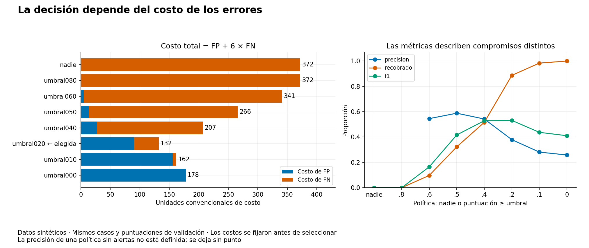
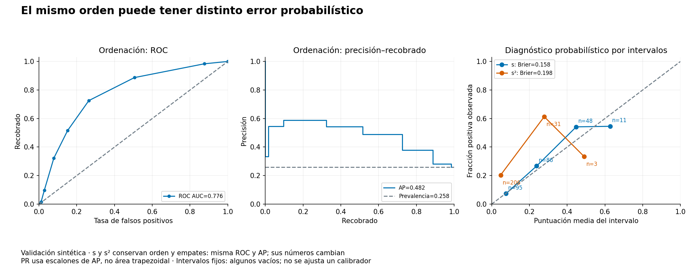
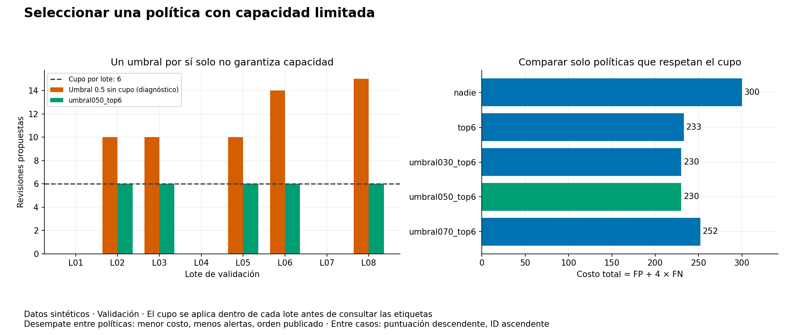

# Unidad 17 — Métricas, umbrales y decisiones

[Índice del curso](../README.md) · [Anterior: validación e hiperparámetros](../unidad16-validacion-hiperparametros/README.md)

**Pregunta guía:** ¿qué errores importa reducir y cómo convertir una puntuación en una decisión con consecuencias explícitas?

Una puntuación puede ordenar bien los casos y aun así no ser una probabilidad fiable. Un umbral puede recuperar más positivos y también producir más falsas alertas. Una política puede superar la capacidad de revisión aunque su métrica parezca buena. Esta unidad separa esas preguntas con dos laboratorios nuevos.

## Objetivos y preparación

Al terminar podrás:

- Definir clase positiva y reconstruir una matriz de confusión con sus denominadores.
- Distinguir ceros de métricas indefinidas y evaluar referencias simples.
- Elegir una política con costos de error declarados y respetar un cupo por lote.
- Interpretar ROC AUC, precisión–recobrado y AP, incluidos empates.
- Diferenciar ordenación, error probabilístico y calibración.
- Analizar sensibilidad a costos y prevalencia sin afirmar que cambió el predictor.
- Seleccionar en validación y cerrar con una sola política conservada.

Prerrequisitos: probabilidad de la [Unidad 4](../unidad04-probabilidad-estadistica/README.md), evaluación de la [10](../unidad10-flujo-lineas-base/README.md), clasificación y umbrales de la [12](../unidad12-clasificacion/README.md) y selección de la [16](../unidad16-validacion-hiperparametros/README.md). Duración orientativa: 6–8 horas con el reto.

Se comprobó con Python 3.12.3, NumPy 2.2.6, Matplotlib 3.10.8 y scikit-learn 1.9.1 en Linux, reutilizando el entorno anterior. Los laboratorios de texto usan biblioteca estándar; NumPy regenera datos, Matplotlib dibuja y scikit-learn sirve como referencia en las pruebas. Sin dependencias nuevas, GPU, cuentas ni servicios externos. Solo la instalación inicial requiere Internet.

Desde la raíz con el entorno virtual activo:

```bash
python -m pip install -r unidad17-metricas-decisiones/requirements.txt
python unidad17-metricas-decisiones/ejemplos/01_elegir_por_costos.py
python unidad17-metricas-decisiones/ejemplos/02_decidir_con_cupo.py
```

Consulta los [datos](datos/README.md), el [protocolo](datos/protocolo.md) y los [recursos](recursos/README.md).

## 1. Puntuación, etiqueta y acción

Cada caso representa una posible revisión. La clase positiva es `requiere_revision=1`, una necesidad conocida después según el escenario. La acción `decision=1` propone revisar. Tenemos etiquetas de **todos** los casos sintéticos, incluidos los no seleccionados; un sistema real que solo verificara los revisados tendría un problema adicional de observación de etiquetas.

Los CSV incluyen dos señales previas y una puntuación fija en `[0,1]`. El generador la calcula con una fórmula antes de generar la etiqueta, y la redondea para crear empates. No se entrena aquí un clasificador, no se recalculan sus puntuaciones al elegir umbral y no se ajusta un calibrador. Las señales documentan la procedencia; las políticas consumen la puntuación guardada.

| Objeto | Qué responde | Qué no garantiza |
|---|---|---|
| Puntuación | Qué casos reciben prioridad según la regla | Una probabilidad válida en una población real |
| Etiqueta | Qué casos necesitan revisión en el escenario | Que revisar cause una mejora determinada |
| Política | A quién se propone revisar | Que existan recursos o beneficios no incluidos en el protocolo |

## 2. Matriz de confusión y denominadores

| Real / decisión | Revisar: 1 | No revisar: 0 |
|---|---|---|
| Necesita revisión: 1 | Verdadero positivo, VP | Falso negativo, FN |
| No la necesita: 0 | Falso positivo, FP | Verdadero negativo, VN |

Para `n=VP+FP+FN+VN`:

```text
prevalencia = (VP+FN)/n
exactitud = (VP+VN)/n
precisión = VP/(VP+FP)          # entre las alertas, qué fracción es positiva
recobrado = VP/(VP+FN)          # entre los positivos, qué fracción se detecta
especificidad = VN/(VN+FP)
tasa de falsos positivos = FP/(VN+FP)
F1 = 2×VP/(2×VP+FP+FN)
```

Recobrado también se llama sensibilidad o recall. Precisión no es sinónimo de exactitud. F1 combina precisión y recobrado, pero no utiliza VN y no expresa automáticamente nuestros costos o restricciones. Consulta la [guía de métricas](https://scikit-learn.org/stable/modules/model_evaluation.html).

Si no hay alertas, precisión queda `null`; si no hay positivos reales, recobrado queda `null`; si no hay negativos, especificidad y tasa FP quedan `null`. F1 queda `null` solo si `2VP+FP+FN=0`. Por ejemplo, con positivos reales y ninguna alerta, F1 es **0**, aunque precisión no esté definida. No se reemplazan indiscriminadamente los valores indefinidos por cero.

En validación del primer laboratorio hay 62 positivos entre 240 casos: prevalencia 25,83 %. No revisar a nadie consigue `178/240=74,17 %` de exactitud y deja pasar los 62 positivos. Esa exactitud no resuelve la necesidad que motivó la decisión.

## 3. Calcular antes de programar

Toma etiquetas `[1,0,1,0]` y puntuaciones `[0.8,0.8,0.4,0.1]`. Con `puntuacion >= 0.8`, se revisan los dos primeros casos: VP=1, FP=1, FN=1 y VN=1. Precisión, recobrado, especificidad y F1 valen 0,5.

Si un FP cuesta 1 unidad y un FN cuesta 6:

```text
costo total = 1×FP + 6×FN = 7
costo medio por caso = 7/4 = 1,75
```

Con umbral 0,4 se incluyen tres casos: VP=2, FP=1, FN=0, VN=1 y costo=1. La comparación usa los mismos casos y puntuaciones. Ejecuta:

```bash
python unidad17-metricas-decisiones/soluciones/03_metricas_a_mano.py
```

También calcula ROC AUC por comparación de pares y resuelve un cupo con empate. Los cuatro casos son un ejemplo manual separado de los CSV.

## 4. Laboratorio 1 — Elegir por costos de error

Hay 240 casos de validación y 120 de prueba. Comparamos `nadie` y umbrales `0.8,0.6,0.5,0.4,0.2,0.1,0`, en ese orden. El umbral es inclusivo: `s>=t`. Umbral 0 revisa a todos, incluidas puntuaciones cero; `nadie` nunca revisa, incluso si hubiera una puntuación de 1.

El protocolo fija costo FP=1 y FN=6, con costo cero para las dos decisiones correctas. Son **unidades convencionales de error**, no precios reales ni un presupuesto completo. No incluyen un costo de revisión para cada VP, tiempos, beneficios de intervención o consecuencias causales. Se minimiza costo total de validación; en empate, menos alertas y después el orden publicado. Los costos son enteros y no se redondea para elegir.

```bash
python unidad17-metricas-decisiones/ejemplos/01_elegir_por_costos.py --salida resultados/unidad17/costos-desarrollo --graficos
```

```text
política | alertas | VP | FP | FN | precisión | recobrado | F1 | costo total
nadie | 0 | 0 | 0 | 62 | no definida | 0.000 | 0.000 | 372
umbral080 | 0 | 0 | 0 | 62 | no definida | 0.000 | 0.000 | 372
umbral060 | 11 | 6 | 5 | 56 | 0.545 | 0.097 | 0.164 | 341
umbral050 | 34 | 20 | 14 | 42 | 0.588 | 0.323 | 0.417 | 266
umbral040 | 59 | 32 | 27 | 30 | 0.542 | 0.516 | 0.529 | 207
umbral020 | 145 | 55 | 90 | 7 | 0.379 | 0.887 | 0.531 | 132
umbral010 | 217 | 61 | 156 | 1 | 0.281 | 0.984 | 0.437 | 162
umbral000 | 240 | 62 | 178 | 0 | 0.258 | 1.000 | 0.411 | 178
Seleccionada por costo de validación: umbral020
```



La política elegida detecta 55 de 62 positivos, pero genera 90 falsas alertas. Su precisión de 0,379 no se oculta: acepta ese compromiso según los costos declarados, sin demostrar que sea aceptable en otra organización. Umbral 0,1 recupera seis positivos adicionales, pero añade 66 FP: ahorrar `6×6=36` en FN no compensa esas 66 unidades. Las líneas del panel derecho unen políticas discretas; no representan distancias uniformes entre los umbrales numéricos.

La [guía de ajuste de umbrales](https://scikit-learn.org/stable/modules/classification_threshold.html) distingue la puntuación del predictor y la acción. Ajustar un umbral también selecciona una configuración: requiere datos de desarrollo y evaluación posterior separada.

### Sensibilidad al costo, sin cambiar puntuaciones

Recalculando solo `FP + costo_FN×FN` con los conteos anteriores:

| Costo FN hipotético, FP=1 | Elegida en esa comparación | Costo mínimo |
|---:|---|---:|
| 1 | `umbral050` | 56 |
| 6, protocolo oficial | `umbral020` | 132 |
| 12 | `umbral010` | 168 |

No mejoró el modelo ni cambiaron sus curvas: cambió el objetivo de decisión. Las variantes son análisis de sensibilidad de validación, no nuevas elecciones con prueba.

Si `p` fuera una probabilidad adecuada para la población de uso, con esos costos y sin capacidad limitada, el costo esperado de alertar sería `C_FP×(1−p)` y el de no alertar `C_FN×p`. Alertar resulta conveniente cuando `p >= C_FP/(C_FP+C_FN)`, con la igualdad resuelta según la convención elegida. Para 1 y 6, el corte sería `1/7≈0,143`. Esta derivación supone probabilidades y costos correctos, decisiones correctas sin costo y ausencia de restricciones; no certifica ese valor para cualquier puntuación. Aquí se selecciona empíricamente entre umbrales fijos, no se declara calibración perfecta.

## 5. Ordenar: ROC AUC, precisión–recobrado y AP

Para construir las curvas, se recorren **todos los valores distintos de la puntuación**, de mayor a menor, y se añaden juntos los casos empatados. Estos puntos de diagnóstico no amplían la lista de políticas candidatas. El punto inicial no alerta a nadie.

ROC compara tasa FP en el eje horizontal con recobrado en el vertical. Su área trapezoidal equivale, en el caso binario, a la fracción de pares positivo–negativo correctamente ordenados, contando medio acierto por empate. En el ejemplo de cuatro casos hay cuatro pares: dos victorias, un empate y una derrota; AUC=`(2+0,5)/4=0,625`. No significa 62,5 % de exactitud ni especifica un umbral. Referencia: [ROC](https://scikit-learn.org/stable/modules/generated/sklearn.metrics.roc_curve.html).

La curva precisión–recobrado muestra otro compromiso. **AP**, precisión promedio, suma incrementos de recobrado ponderados por la precisión tras cada bloque:

```text
AP = suma((recobrado_j − recobrado_anterior) × precision_j)
```

En el ejemplo, el bloque 0,8 aporta `0,5×0,5=0,25`; el bloque 0,4 aporta `0,5×2/3=1/3`; el bloque 0,1 no aumenta recobrado. AP=`7/12≈0,583333`. No se calcula como área trapezoidal de PR. La figura usa escalones que corresponden a esta suma. Referencias: [AP](https://scikit-learn.org/stable/modules/generated/sklearn.metrics.average_precision_score.html) y [curva PR](https://scikit-learn.org/stable/modules/generated/sklearn.metrics.precision_recall_curve.html).

Para dibujar PR se añade el extremo convencional recobrado=0, precisión=1. No convierte en definida la precisión de una política que no alerta. En nuestros informes, ROC AUC es `null` si falta alguna clase; AP es `null` si no hay positivos. Con todos los casos positivos AP vale 1, aunque ROC AUC siga indefinida. La biblioteca puede usar otra convención para AP sin positivos; aquí la ausencia queda explícita.

En costos, ROC AUC=0,776 y AP=0,482. La prevalencia observada, 0,258, aparece como referencia horizontal en PR; no se identifica AP de cada clasificación aleatoria finita con ese número exacto. Ninguna de estas áreas incorpora nuestro costo de error ni un cupo operativo.

## 6. Probabilidad y calibración

El diagnóstico de Brier para una puntuación interpretada como probabilidad binaria es:

```text
Brier = promedio((puntuacion − etiqueta)²)
```

Menor es mejor bajo esta pérdida; con etiquetas y puntuaciones en `[0,1]` está entre 0 y 1. En los cuatro casos manuales: `(0,04+0,64+0,36+0,01)/4=0,2625`. Un menor Brier no demuestra por sí solo mejor calibración: también interviene cuánto distingue los casos. Referencia: [Brier](https://scikit-learn.org/stable/modules/generated/sklearn.metrics.brier_score_loss.html).

Una puntuación calibrada debería corresponder a frecuencias observadas: entre casos comparables con probabilidad cercana a 0,2, esperaríamos aproximadamente 20 % de positivos en muchas observaciones. Agrupamos puntuaciones en intervalos fijos `[0,.2),[.2,.4),[.4,.6),[.6,.8),[.8,1]`; cada grupo informa cantidad, puntuación media y fracción positiva. Los vacíos conservan `n=0` y medias `null`. Con pocos casos, las diferencias visuales pueden deberse a variación muestral; aquí no se estiman intervalos de confianza. Consulta la [guía de calibración](https://scikit-learn.org/stable/modules/calibration.html).



Como contraste fijado previamente, se sustituyen las puntuaciones por `s²` solo en el diagnóstico. En `[0,1]` conserva orden y empates de estos datos: misma ROC AUC=0,776 y AP=0,482. Brier cambia de 0,158 a 0,198. Los intervalos contienen grupos distintos al transformar las puntuaciones; no se comparan como si fueran los mismos subconjuntos. No se eligió la transformación para mejorar un resultado ni se entrenó un calibrador. Las líneas entre puntos de fiabilidad orientan la vista, sin definir una curva aprendida.

Conservar orden tampoco conserva decisiones al mantener el mismo umbral numérico: para reproducir `s>=t` con `s²`, habría que usar `s²>=t²`. La selección oficial utiliza siempre la puntuación original.

## 7. Prevalencia y población

Suponiendo que recobrado `r` y tasa FP `f` permanecieran constantes al cambiar la prevalencia a `π`:

```text
precision_hipotetica = r×π / (r×π + f×(1−π))
```

Por ejemplo, con `r=0,8` y `f=0,1`, una prevalencia de 5 % da precisión `0,04/(0,04+0,095)≈0,296`; con 50 % da `0,4/(0,4+0,05)≈0,889`. El mismo par de tasas puede implicar cargas de falsas alertas muy distintas. El JSON calcula escenarios de 5 %, 20 % y 50 % usando las tasas de la política elegida en validación.

Es un ejercicio condicional, no una garantía de transporte a otra población. Cambios de equipos, calidad de medición o composición pueden modificar también las tasas; con cupos, la competencia entre casos del lote puede alterarlas. No se usa esta proyección hipotética para elegir otra política. Si falta un denominador o alguna tasa, se registra `null`.

## 8. Laboratorio 2 — Decidir con un cupo por lote

Hay ocho lotes de validación y cuatro de prueba, con 30 casos cada uno. Se pueden revisar **como máximo seis por lote**, con todos sus casos disponibles antes de decidir. Un lote no es una secuencia temporal auditada ni un equipo; es la unidad de asignación de capacidad. Los cupos no utilizados no se transfieren a otros lotes.

Las políticas candidatas son:

| Política | Regla aplicada dentro de cada lote |
|---|---|
| `nadie` | No revisar |
| `top6` | Hasta seis puntuaciones más altas, incluso bajas |
| `umbral030_top6` | Elegibles con s≥0,3; revisar hasta seis |
| `umbral050_top6` | Elegibles con s≥0,5; revisar hasta seis |
| `umbral070_top6` | Elegibles con s≥0,7; revisar hasta seis |

Primero se filtra por umbral; luego se ordena por puntuación descendente e ID ascendente y se recorta al cupo. La decisión no consulta etiquetas. El ID solo resuelve empates de forma reproducible: no prueba prioridad legítima ni equidad en un sistema real. La misma puntuación puede revisarse en un lote y quedar fuera en otro por sus competidores; esta política no equivale a un único umbral global.

Los costos declarados son FP=1 y FN=4. Se utiliza el mismo criterio: costo total, menos alertas, orden publicado. Todas las candidatas respetan el cupo por construcción, incluso con nuevos lotes. El umbral 0,5 **sin cupo** se evalúa aparte como diagnóstico y nunca participa en la selección.

```bash
python unidad17-metricas-decisiones/ejemplos/02_decidir_con_cupo.py --salida resultados/unidad17/capacidad-desarrollo --graficos
```

```text
política | alertas | VP | FP | FN | precisión | recobrado | F1 | costo total
nadie | 0 | 0 | 0 | 75 | no definida | 0.000 | 0.000 | 300
top6 | 48 | 23 | 25 | 52 | 0.479 | 0.307 | 0.374 | 233
umbral030_top6 | 45 | 23 | 22 | 52 | 0.511 | 0.307 | 0.383 | 230
umbral050_top6 | 30 | 20 | 10 | 55 | 0.667 | 0.267 | 0.381 | 230
umbral070_top6 | 22 | 14 | 8 | 61 | 0.636 | 0.187 | 0.289 | 252
Seleccionada por costo de validación: umbral050_top6
Umbral 0.5 sin cupo: 5 de 8 lotes exceden la capacidad.
```



El empate entre umbrales 0,3 y 0,5 se resuelve con 30 frente a 45 alertas. El segundo genera 12 FP menos y tres FN más: `−12+4×3=0`, por eso conserva el costo. Su F1 es ligeramente menor, pero F1 no era el objetivo de selección. La política elegida todavía omite **55 de 75 positivos** de validación. Respetar capacidad y ganar en una lista finita no la convierte en una solución satisfactoria.

Las métricas globales se calculan sumando conteos de todos los casos; los resultados por lote también quedan en el informe. No se promedian precisiones por lote, que pueden tener denominadores distintos o ser indefinidas. Las curvas de diagnóstico de este escenario agrupan todas las puntuaciones; no evalúan por sí mismas la asignación restringida dentro de cada lote.

## 9. Selección, cierre y reproducción

Guarda configuración, huellas, código, costos, desempates y elegido antes de cerrar. Luego ejecuta:

```bash
python unidad17-metricas-decisiones/ejemplos/01_elegir_por_costos.py --evaluar-prueba --salida resultados/unidad17/costos-cierre
python unidad17-metricas-decisiones/ejemplos/02_decidir_con_cupo.py --evaluar-prueba --salida resultados/unidad17/capacidad-cierre
```

La ejecución repite la selección sobre validación y **solo después abre prueba**, donde aplica exclusivamente la política elegida. No entrena ni reajusta un predictor; a diferencia de la Unidad 16, el objeto seleccionado es una regla de decisión sobre puntuaciones fijas. Compara el resultado de desarrollo y la huella de validación con tu registro anterior. Los resultados de cierre están en las [soluciones](soluciones/README.md).

El cupo sí ordena puntuaciones de todos los casos del nuevo lote: eso forma parte del uso previsto. No utiliza sus etiquetas para decidir, ni elige otra política por sus métricas. Si solo llegaran casos uno a uno, sería necesario definir una política distinta y evaluarla para esa situación.

La opción `--salida` exige una carpeta nueva y exporta JSON con parámetros, conteos, métricas, puntos de curvas e intervalos, además de CSV con decisiones por caso. Capacidad guarda el diagnóstico sin cupo separado; el CSV de prueba contiene solo al elegido. Las figuras muestran validación, incluso al exportar un cierre. Una escritura fallida puede dejar una salida parcial. Código y comandos no se guardan automáticamente en el informe.

```bash
python unidad17-metricas-decisiones/datos/generar_datos.py --salida resultados/unidad17/datos-copia
python unidad17-metricas-decisiones/ejemplos/02_decidir_con_cupo.py --datos resultados/unidad17/datos-copia/capacidad
```

Las semillas pertenecen al generador; no se emplea azar al decidir o evaluar. Los archivos, fórmulas y resultados son públicos. Demuestran un procedimiento, sin ser una evaluación personal ciega ni evidencia de beneficio real. Si prueba inspira modificaciones, reconoce su uso y prepara una evaluación nueva.

## 10. Ejercicios, reto y comprobación

Resuelve antes de consultar las [diez soluciones razonadas](soluciones/README.md):

1. Define clase positiva, acción y los cuatro resultados posibles; calcula la exactitud de no revisar a nadie en el laboratorio de costos.
2. Reconstruye la matriz, precisión, recobrado, F1 y costo de los cuatro casos manuales con umbrales 0,8 y 0,4.
3. Explica qué queda indefinido sin alertas, sin positivos y sin negativos. ¿Cuándo F1 es cero y cuándo es `null`?
4. Justifica umbral 0,2 frente a 0,1 con los costos oficiales; recalcula la elección cuando FN cuesta 1 y cuando cuesta 12.
5. Enumera los cuatro pares positivo–negativo del ejemplo y calcula ROC AUC, contando correctamente el empate.
6. Calcula AP por bloques y explica por qué no es el área trapezoidal de PR ni una precisión en un umbral único.
7. Calcula Brier manual, compara s y s², y explica qué umbral transformado conserva las decisiones originales.
8. Aplica la fórmula de precisión con recobrado 0,8, tasa FP 0,1 y prevalencias 5 % y 50 %. Explicita el supuesto que permite hacerlo.
9. Reconstruye un lote en la frontera del cupo y justifica el empate entre las políticas 0,3 y 0,5 por costo y número de alertas.
10. Indica qué debe conservarse al cambiar solo etiquetas de prueba, y explica por qué las puntuaciones del lote sí pueden participar en la asignación.

El [reto con rúbrica](reto.md) solicita justificar una política y reconstruir decisiones desde sus datos. Usa la [plantilla](plantillas/informe_decisiones.md).

```bash
python -m unittest discover -s unidad17-metricas-decisiones/pruebas -v
python herramientas/verificar_curso.py
```

Las **30 pruebas** incluyen cálculos manuales y referencias de biblioteca, empates, valores indefinidos, sensibilidad a costos, capacidad por lote, separación de información y coherencia de artefactos. No sustituyen una evaluación de utilidad y consecuencias reales.

La siguiente entrega prevista es la **Unidad 18 — Interpretabilidad y responsabilidad**, todavía pendiente de desarrollo.
