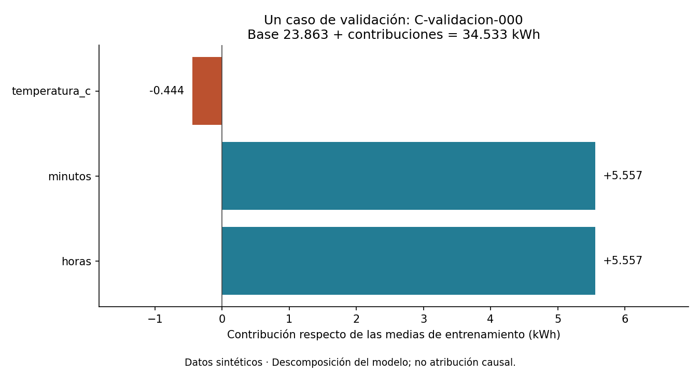
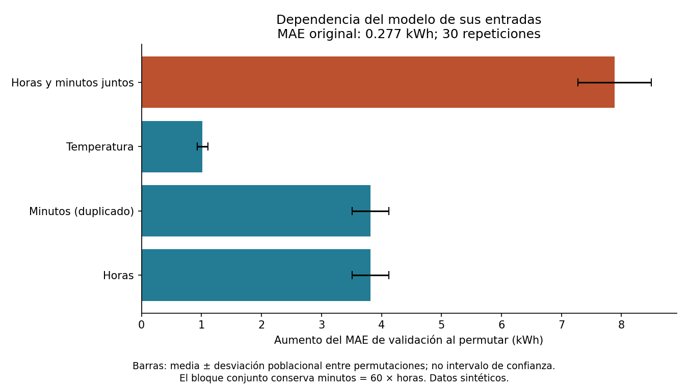
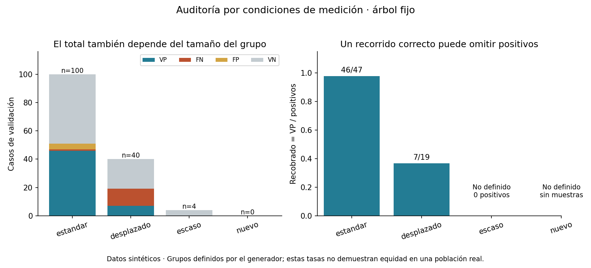

# Unidad 18 — Interpretabilidad y responsabilidad

[Índice del curso](../README.md) · [Anterior: métricas, umbrales y decisiones](../unidad17-metricas-decisiones/README.md)

**Pregunta guía:** ¿cómo explicar una predicción, comprobar los límites de esa explicación y documentar responsabilidades antes de usar un modelo?

Un modelo puede acertar en promedio y fallar sistemáticamente bajo ciertas condiciones. También puede producir una explicación perfectamente fiel a sus cálculos y dar una respuesta equivocada. En esta unidad reconstruirás esos cálculos y relacionarás los errores con decisiones concretas sobre su uso.

## 1. Lo que aprenderás

Al terminar podrás:

- Distinguir una explicación local, una descripción global y una afirmación causal.
- Reconstruir una predicción lineal con una referencia explícita, y recorrer un árbol hasta su hoja.
- Calcular importancia por permutación sin reajustar el modelo, usando una métrica y una partición declaradas.
- Reconocer cómo la redundancia permite predicciones iguales con atribuciones distintas.
- Comparar errores por grupos con sus denominadores y reconocer dónde no hay evidencia suficiente.
- Escribir una ficha de modelo con usos, límites, responsables, supervisión y respuesta a errores.

**Prerrequisitos:** regresión, estandarización, árboles, separación de datos y matriz de confusión de las unidades 10–17. Duración orientativa: 5–7 horas, incluyendo el reto. Solo CPU; sin cuentas, servicios externos ni descarga de modelos.

## 2. Preparar y ejecutar

Desde la raíz del repositorio, activa tu entorno virtual. Si todavía no lo tienes:

```bash
python3 -m venv .venv
# En Windows: py -m venv .venv
source .venv/bin/activate
# En PowerShell: .venv\Scripts\Activate.ps1
python -m pip install -r unidad18-interpretabilidad-responsabilidad/requirements.txt
python unidad18-interpretabilidad-responsabilidad/soluciones/03_explicar_a_mano.py
python unidad18-interpretabilidad-responsabilidad/ejemplos/01_explicar_consumo.py
python unidad18-interpretabilidad-responsabilidad/ejemplos/02_auditar_alertas.py
```

Se comprobó con Python 3.12.3, NumPy 2.2.6, SciPy 1.18.1, scikit-learn 1.9.1 y Matplotlib 3.10.8, reutilizando el entorno de las unidades anteriores. No se añadieron dependencias. El [registro completo](../unidad13-arboles-ensambles/recursos/entorno-verificado.txt) corresponde a ese conjunto de versiones; no es un requisito de GPU.

Para guardar resultados usa carpetas **nuevas**:

```bash
python unidad18-interpretabilidad-responsabilidad/ejemplos/01_explicar_consumo.py --salida resultados/u18-consumo --graficos
python unidad18-interpretabilidad-responsabilidad/ejemplos/02_auditar_alertas.py --salida resultados/u18-alertas --graficos
```

Se exportan JSON, predicciones CSV y figuras PNG/SVG. `--graficos` requiere `--salida`. Puedes pasar una carpeta de datos alternativa con `--datos`; su esquema debe respetar la [documentación de los datos](datos/README.md). Los archivos de prueba no se leen en estas ejecuciones.

## 3. Tres preguntas distintas

| Pregunta | Alcance | Evidencia que vamos a construir |
|---|---|---|
| ¿Cómo obtuvo este modelo esta predicción? | Local: un caso concreto | Suma de contribuciones o recorrido de reglas |
| ¿De qué entradas depende su rendimiento en estas filas? | Global sobre una muestra y métrica | Aumento del MAE al permutar |
| ¿Qué ocurriría en el mundo si cambiáramos una condición? | Causal: efecto de una intervención | Estos modelos y explicaciones no bastan para establecerlo |

Una explicación **fiel** reproduce el comportamiento del modelo. Su **comprensibilidad** depende de quién necesita usarla. Su **utilidad** exige que ayude a una tarea concreta. Ninguna de esas propiedades garantiza exactitud predictiva o un uso adecuado. Dar una fórmula es útil para una auditoría técnica; para una persona que revisa alertas también hacen falta el significado de la señal, los fallos conocidos y una forma de corregirlos.

Los generadores de esta unidad sí tienen ecuaciones conocidas porque nosotros las definimos. Eso permite demostrar un mecanismo sintético. No convierte los coeficientes aprendidos en efectos causales de un edificio o sensor real.

## 4. Reconstrucción lineal a mano

Después de estandarizar cada entrada con **entrenamiento**:

```text
z_j = (x_j − media_j) / escala_j
predicción = b + Σ beta_j × z_j
contribución_j = beta_j × z_j
```

La referencia es el vector de medias de entrenamiento: allí todas las z valen cero y la predicción es `b`. Las contribuciones se expresan en unidades del objetivo; aquí, kWh. Una contribución negativa baja la predicción respecto de esa referencia; no representa por sí sola un error o un ahorro causal.

Ejemplo: `b=10`, `beta=[3,3,1]`, `z=[1,1,-1]`. La suma es `10+3+3−1=15`. Si las dos primeras entradas estandarizadas siempre son iguales, `beta=[6,0,1]` produce también 15. De hecho, ambas fórmulas coinciden para **todos** los casos que cumplen `z0=z1`. Cambia el reparto de contribuciones; se conserva la predicción.

Este es un problema de identificación de coeficientes. El modelo solo observa la suma de los efectos de las dos columnas redundantes. El ajuste elegido por mínimos cuadrados da una solución, pero la tabla no identifica una responsabilidad causal única por columna.

Para expresar la ecuación en unidades originales:

```text
coef_original_j = beta_j / escala_j
intercepto_original = b − Σ coef_original_j × media_j
predicción = intercepto_original + Σ coef_original_j × x_j
```

Comparar directamente un coeficiente por hora con otro por minuto confunde las unidades. Estandarizar facilita ciertas comparaciones, pero no elimina redundancia, interacciones ni diferencias de distribución. Consulta el [ejemplo oficial sobre interpretación de coeficientes](https://scikit-learn.org/stable/auto_examples/inspection/plot_linear_model_coefficient_interpretation.html).

## 5. Laboratorio 1 — Explicar un consumo

Los CSV contienen ciclos ficticios con horas de operación, su conversión exacta a minutos, temperatura y consumo. Entrenamiento tiene 160 casos; validación y prueba, 80 cada una. El duplicado es deliberado para estudiar interpretabilidad; no se recomienda conservar conversiones redundantes sin una razón en un proyecto real.

Antes de abrir validación fijamos `StandardScaler + LinearRegression`, con intercepto. La referencia predictiva es la media del consumo de entrenamiento. **No hay selección de hiperparámetros ni de columnas en esta unidad.** El caso local es el menor ID de validación, elegido sin mirar sus errores.

Resultados de desarrollo:

| Medida | Resultado |
|---|---:|
| MAE de la media de entrenamiento | 5,893 kWh |
| MAE del modelo lineal | 0,277 kWh |
| Rango de la matriz estandarizada, con tres columnas | 2 |
| Predicción para C-validacion-000 | 34,533 kWh |

El caso tiene `[8,5922 h; 515,532 min; 23,225 °C]`. Su explicación es aproximadamente `23,862638 + 5,557260 + 5,557260 − 0,444406 = 34,532752 kWh`. El informe conserva más cifras que la consola.



Los coeficientes originales son aproximadamente `[1,510145 kWh/h; 0,025169 kWh/min; 0,196526 kWh/°C]`. Al sustituir `minutos=60×horas`, la pendiente efectiva respecto de horas es `1,510145 + 60×0,025169 ≈ 3,020290`. El coeficiente aislado de horas no describe todo el cambio del modelo cuando horas y minutos se actualizan coherentemente.

### Importancia por permutación

Congela el modelo. Calcula el MAE original en validación. Reordena una columna entre esas mismas filas, predice otra vez y calcula:

```text
Delta_r = MAE con la columna permutada en repetición r − MAE original
importancia = media de los Delta_r
```

Un valor positivo indica deterioro según MAE; cero, ausencia de cambio en ese experimento; un valor negativo es posible si la perturbación reduce el error. No se fuerza a cero. No mide una propiedad intrínseca de la variable ni suma necesariamente el rendimiento total. Esta convención de pérdida equivale a usar una puntuación `−MAE` en el [algoritmo oficial de permutación](https://scikit-learn.org/stable/modules/permutation_importance.html).

Implementamos 30 repeticiones con PCG64, semilla 1818. Se reutiliza el mismo orden de filas para cada bloque en una repetición; en un bloque conjunto, las columnas se mueven juntas. No se usa `fit`, no se permutan etiquetas y no se tocan los CSV originales. La desviación se calcula con `ddof=0` y describe variación entre estas permutaciones; **no es un intervalo de confianza**, ni incluye incertidumbre del ajuste o de nuevas poblaciones.

| Bloque permutado | Aumento medio de MAE | Desviación entre repeticiones |
|---|---:|---:|
| Horas | 3,814 kWh | 0,307 kWh |
| Minutos | 3,814 kWh | 0,307 kWh |
| Temperatura | 1,017 kWh | 0,090 kWh |
| Horas y minutos juntos | 7,882 kWh | 0,611 kWh |



Permutar solo horas produce pares incoherentes como pocas horas y muchos minutos: evalúa el modelo fuera de la relación exacta de los datos. Además, permanece una copia de la señal. Permutar ambas juntas conserva esa relación y retira simultáneamente la correspondencia de las dos con el objetivo. No esperamos que las importancias individuales sumen la conjunta: intervienen la función de pérdida y las dependencias.

El bloque conjunto corrige esta incoherencia particular. No resuelve automáticamente dependencias con otras columnas, ni identifica efectos causales. Una importancia pequeña tampoco justifica eliminar una entrada sin realizar un nuevo experimento de desarrollo y evaluar el cambio.

**Experimenta:** en una copia, cambia solo la semilla de permutación. Comprueba que varíen los deltas, pero no los coeficientes ni las predicciones originales. Luego redistribuye `+5` y `−5` entre los dos coeficientes estandarizados duplicados: comprueba las mismas predicciones sobre entradas coherentes y distintas contribuciones. Identifica cuándo esa igualdad deja de cumplirse.

## 6. Laboratorio 2 — Explicar un árbol y auditar sus errores

Un generador produce una señal latente entre 0 y 1 y una etiqueta `requiere_revision=1` cuando esa señal alcanza 0,55. El modelo recibe una **lectura**, que incluye ruido; en el grupo `desplazado` se resta además 0,30 antes de recortar a `[0,1]`. La señal latente no se exporta como entrada.

Fijamos un árbol con profundidad máxima 2, al menos 8 muestras por hoja y semilla 18. Solo utiliza `lectura`; ni `grupo`, ni ID, ni etiqueta participan en la predicción. La referencia es la clase mayoritaria de entrenamiento. Ambas se ajustan antes de leer validación.

### Del nodo a la hoja

El caso `A-validacion-desplazado-000` tiene lectura 0. El recorrido guardado es:

```text
nodo 0: 0 <= 0,550354987… → nodo 1
nodo 1: 0 <= 0,295959994… → hoja 2
hoja 2: 92 casos de entrenamiento; 1 positivo, 91 negativos
fracción positiva = 1/92 ≈ 0,010870 → clase 0
```

La clase es la de mayor proporción en la hoja; ante empate, scikit-learn elige la primera clase en su orden, aquí 0. La frecuencia de una hoja no garantiza una probabilidad calibrada en cada grupo. La ruta muestra qué reglas se aplicaron, pero no la causa del estado real del sensor.

El código conserva los umbrales completos. Convierte la entrada a `float32`, como la biblioteca, y luego compara su valor con el umbral de precisión doble. Así evita que redondear la frontera cambie la rama. Las pruebas comprueban puntos a ambos lados de cada corte y contrastan con `apply` y `decision_path`. Véase la [documentación de estructura del árbol](https://scikit-learn.org/stable/auto_examples/tree/plot_unveil_tree_structure.html).

### Un promedio puede ocultar errores

En validación, el árbol tiene exactitud 0,882 y recobrado global `53/66=0,803`; la mayoría tiene exactitud 0,542 y recobrado 0. Ese promedio no describe por igual todas las condiciones:

| Grupo sintético | n | Positivos | VP | FN | FP | Recobrado | Tasa FP |
|---|---:|---:|---:|---:|---:|---:|---:|
| estandar | 100 | 47 | 46 | 1 | 4 | 46/47 = 0,979 | 4/53 = 0,075 |
| desplazado | 40 | 19 | 7 | 12 | 0 | 7/19 = 0,368 | 0/21 = 0 |
| escaso | 4 | 0 | 0 | 0 | 0 | No definido | 0/4 = 0 |
| nuevo | 0 | 0 | 0 | 0 | 0 | No definido | No definida |



- `Recobrado = VP/(VP+FN)`: necesita positivos. Cero significa que se omitieron todos los positivos observados; sin positivos no se puede medir.
- `Tasa FP = FP/(FP+VN)`: necesita negativos. Una tasa observada cero no demuestra ausencia de riesgo futuro.
- `Fracción de la muestra = n_grupo/n_total`: muestra representación, no probabilidad de cobertura de una población desconocida. Aquí todos los casos válidos reciben una clase; no existe abstención ni un filtro de casos por confianza.
- `nuevo` es una categoría prevista sin filas en estos CSV, incluida para hacer visible la falta de cobertura. No tiene métricas de rendimiento. `escaso` tiene cuatro filas pero no evidencia sobre positivos.

El recobrado global se pondera por **número de positivos**, no por tamaño total de grupo: `(46+7)/(47+19)`. La media simple de 0,979 y 0,368 sería otro resumen y contestaría otra pregunta. Explicita siempre qué se está promediando.

Una diferencia es una señal para investigar: puede involucrar calidad de medición, etiquetas, prevalencia, selección de la muestra, condiciones de uso o decisiones del modelo. Estos grupos son condiciones sintéticas de sensores; no representan grupos demográficos. La brecha aislada no establece equidad o discriminación en una población real. Omitir una columna de grupo tampoco garantiza resultados comparables: las otras entradas pueden reflejar esas condiciones.

**Experimenta:** cambia solo las etiquetas `grupo` en una copia válida, conservando lectura y objetivo. Las predicciones deben mantenerse; cambia a quién se atribuyen los errores. Esto muestra que una auditoría depende también de la calidad de su información de grupos. No presentes ese cambio de nombres como una mejora del modelo.

## 7. Responsabilidad como decisiones verificables

Una ficha de modelo conecta la evaluación con el uso. El trabajo [Model Cards for Model Reporting](https://arxiv.org/abs/1810.03993) propone documentar, entre otros aspectos, propósito, evaluación desagregada y limitaciones. Aquí lo aplicamos con una [ficha completa del árbol](recursos/ficha_alertas.md) y una [plantilla para tu entrega](plantillas/ficha_modelo.md).

Para el árbol de esta práctica, decidir «apto para un ejercicio, evidencia insuficiente para alertas operativas» es una conclusión válida. Documentar una limitación sin asociarle una acción deja incompleta la revisión. Ejemplo: ante los 12 FN del grupo desplazado, investigar la medición y obtener más evidencia por condición antes de pensar en una implantación. Cualquier cambio del sensor, de entradas o del árbol inaugura otra versión que necesita evaluación.

La revisión humana debe definir quién revisa, con qué información, en cuánto tiempo y con qué capacidad de corregir. Si la persona solo ve alertas positivas, no puede descubrir sistemáticamente los falsos negativos: hacen falta verificaciones de casos no alertados y etiquetas posteriores. «Supervisión humana» sin acceso a esa evidencia ni autoridad para detener el sistema es una promesa vacía.

El análisis de impacto del reto conecta personas o procesos afectados, posibles daños, evidencia, mitigaciones y límites de cada mitigación. En un proyecto real habría que examinar procedencia, permisos, privacidad, representatividad y calidad de etiquetas. Los datos sintéticos de esta unidad no contienen datos personales y no resuelven esas preguntas para otro conjunto.

## 8. Separar explicación, modificación y cierre

El [protocolo completo](datos/protocolo.md) fija modelos, casos locales, bloques de permutación y grupos. Validación se usa para estudiar comportamiento. Si sus explicaciones orientaran cambios, seguiría siendo desarrollo; no sería una evaluación independiente de esos cambios.

Cuando hayas terminado el análisis, puedes reproducir el cierre didáctico:

```bash
python unidad18-interpretabilidad-responsabilidad/ejemplos/01_explicar_consumo.py --evaluar-prueba --salida resultados/u18-consumo-cierre
python unidad18-interpretabilidad-responsabilidad/ejemplos/02_auditar_alertas.py --evaluar-prueba --salida resultados/u18-alertas-cierre
```

Prueba se abre **después** del ajuste y los diagnósticos. No se reajusta, no se recalculan importancias sobre prueba y no se escoge otra versión. El MAE del consumo es 0,379 kWh. El árbol obtiene VP=37, VN=65, FP=0 y FN=12; en desplazado detecta apenas 3 de 14 positivos. La precisión global de 1 no cancela esas omisiones.

Los resultados publicados son una demostración conocida. Si modificas el modelo a partir de ellos, esta prueba ya no sirve como cierre independiente para esa modificación: necesitas reservar nueva evidencia. Las figuras usan únicamente desarrollo, incluso si el informe incluye cierre. Repetir un comando reproduce una evaluación; no crea muestras independientes adicionales.

## 9. Cómo está organizado el código

| Archivo | Responsabilidad |
|---|---|
| [interpretacion.py](ejemplos/interpretacion.py) | Lectura estricta, ajuste, explicaciones, permutación, grupos y exportación |
| [interfaz.py](ejemplos/interfaz.py) | Argumentos y resúmenes legibles |
| [figuras.py](ejemplos/figuras.py) | Tres figuras con los datos de desarrollo del informe |
| [generar_datos.py](datos/generar_datos.py) | Seis CSV reproducibles en una carpeta nueva |
| [03_explicar_a_mano.py](soluciones/03_explicar_a_mano.py) | Descomposición y comparación de denominadores sin dependencias |
| [test_interpretacion.py](pruebas/test_interpretacion.py) | Referencias matemáticas, casos límite y separación de información |

Los JSON guardan versiones, huellas SHA-256, parámetros aprendidos, predicciones, métricas, recorrido local y todos los deltas de permutación. En consumo, `base` de la explicación es la predicción en las medias de entrada; `linea_base_validacion` evalúa un predictor constante. Coinciden numéricamente en su valor de referencia aquí por mínimos cuadrados con intercepto, pero son conceptos distintos. Consulta la [guía de recursos](recursos/README.md).

## 10. Ejercicios y reto

Resuelve antes de consultar las [diez soluciones razonadas](soluciones/README.md):

1. Clasifica las tres preguntas: reconstruir un caso, aumentar MAE al permutar y reducir consumo real al cambiar una condición. ¿Qué evidencia falta para la tercera?
2. Calcula el ejemplo `b=10`, `beta=[3,3,1]`, `z=[1,1,-1]` y su alternativa `[6,0,1]`. ¿Cuándo dejan de ser equivalentes?
3. Con `media=[2,120]`, `escala=[1,60]`, `beta=[3,3]` y `b=10`, convierte a unidades originales y evalúa `[3,180]`.
4. Reconstruye C-validacion-000 y la pendiente efectiva de horas; explica por qué no basta el coeficiente aislado de horas.
5. Con MAE original 0,4 y MAE permutados `[0,7; 0,9; 0,5]`, calcula deltas, media y desviación poblacional. ¿Qué significaría un delta negativo?
6. Explica qué rompe una permutación individual y qué preserva el bloque de horas y minutos. ¿La suma individual debe coincidir con la conjunta?
7. Reconstruye el recorrido local del árbol, su frecuencia positiva y su clase. ¿Qué afirmación no permite esa frecuencia?
8. Calcula recobrado para A con VP=8 y FN=2 y B con VP=1 y FN=1, su media simple y su recobrado conjunto. Distingue cero de no definido.
9. Interpreta `escaso`, `nuevo` y `desplazado`; explica por qué excluir `grupo` de las entradas no elimina la necesidad de auditarlo.
10. Escribe una respuesta a un falso negativo y a una nueva condición de medición: quién actúa, qué conserva, qué revisa y qué evidencia necesita antes de otra versión.

El [reto con rúbrica](reto.md) cierra el bloque de aprendizaje automático: integra explicaciones, una ficha de modelo y un análisis de impacto con decisiones justificadas.

```bash
python -m unittest discover -s unidad18-interpretabilidad-responsabilidad/pruebas -v
python herramientas/verificar_curso.py
```

Las **30 pruebas** contrastan mínimos cuadrados independientes, reconstrucciones, permutaciones, rutas y fronteras del árbol, agregación de métricas, invariancia del ajuste, regeneración y coherencia de los recursos. No sustituyen una auditoría de un sistema real.

Antes de avanzar, comprueba que puedes explicar una predicción sin convertirla en una afirmación causal, señalar dónde faltan datos y justificar una decisión de uso. Continúa con la [Unidad 19 — Redes neuronales](../unidad19-redes-neuronales/README.md).
