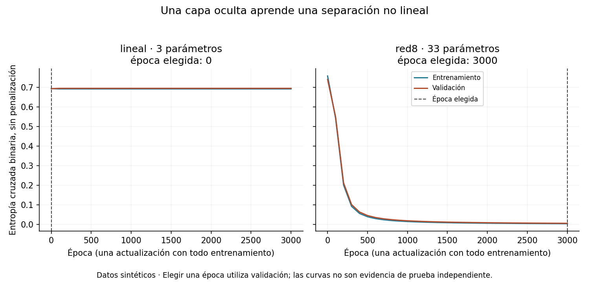
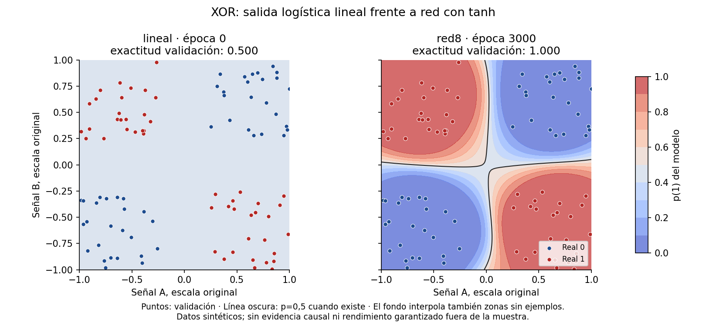
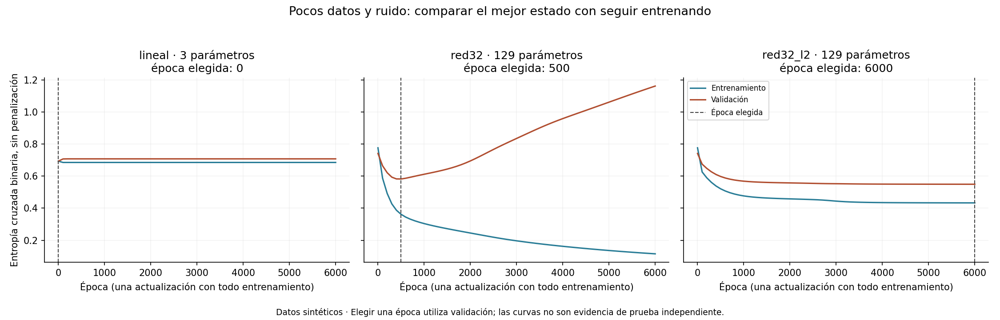

# Unidad 19 — Redes neuronales

[Índice del curso](../README.md) · [Anterior: interpretabilidad y responsabilidad](../unidad18-interpretabilidad-responsabilidad/README.md)

**Pregunta guía:** ¿cómo aprende una red neuronal pequeña y cómo comprobar que sus capas y gradientes producen el comportamiento esperado?

Una recta no puede separar cualquier patrón. Una red puede transformar las entradas antes de decidir, pero esa flexibilidad también le permite ajustarse al ruido. Construiremos una red pequeña con NumPy, seguiremos un paso de aprendizaje a mano y comprobaremos su implementación antes de interpretar los resultados.

## 1. Objetivos y preparación

Al terminar podrás:

- Relacionar pesos, sesgos, capas y activaciones con operaciones sobre matrices.
- Explicar qué aporta una transformación no lineal y qué ocurre si se elimina.
- Calcular propagación hacia delante, pérdida, gradientes y una actualización simultánea.
- Verificar retropropagación con diferencias finitas y manejar logits extremos sin `log(0)`.
- Comparar una referencia constante, una clasificación lineal y una red con un protocolo común.
- Elegir una época con validación y reconocer sobreajuste sin utilizar prueba para corregirlo.

**Prerrequisitos:** vectores y matrices de la Unidad 3, derivadas y gradiente de las unidades 11–12, estandarización y separación de datos de las unidades 15–16 y límites de interpretación de la Unidad 18. Duración orientativa: 6–8 horas con ejercicios y reto. Los laboratorios usan CPU, datos pequeños y paquetes ya introducidos; no requieren GPU, cuenta, API ni descarga de modelos.

Desde la raíz del repositorio, activa tu entorno virtual. Si necesitas crearlo:

```bash
python3 -m venv .venv
# En Windows: py -m venv .venv
source .venv/bin/activate
# En PowerShell: .venv\Scripts\Activate.ps1
python -m pip install -r unidad19-redes-neuronales/requirements.txt
python unidad19-redes-neuronales/soluciones/03_retropropagar_a_mano.py
python unidad19-redes-neuronales/ejemplos/01_aprender_xor.py
python unidad19-redes-neuronales/ejemplos/02_controlar_sobreajuste.py
```

Se comprobó reutilizando Python 3.12.3, NumPy 2.2.6 y Matplotlib 3.10.8 del [entorno compartido](../unidad13-arboles-ensambles/recursos/entorno-verificado.txt). scikit-learn 1.9.1 se utiliza como referencia en una prueba de pérdida; el entrenamiento de esta unidad está implementado con NumPy. No se añadieron dependencias. PyTorch se introducirá en la Unidad 20.

## 2. De la regresión logística a una capa oculta

Una «neurona» de este ejercicio calcula una suma ponderada y aplica una función. Es una unidad matemática; no reproduce una neurona biológica.

En regresión logística: `s = x·w + b`, `p = sigmoide(s)`. El valor `s`, antes de la sigmoide, se llama **logit**. Con umbral 0,5, la frontera corresponde a `s=0`: una recta para dos entradas, salvo el caso constante degenerado.

Nuestra red transforma primero las entradas:

```text
A = X W1 + b1
H = tanh(A)
s = H W2 + b2
p = sigmoide(s)
```

Cada fila es un caso. Los sesgos se suman a todas las filas mediante broadcasting. Con n casos, d entradas y h unidades ocultas:

| Objeto | Forma en el código | Significado |
|---|---|---|
| X | (n,d) | Entradas estandarizadas |
| W1 | (d,h) | Pesos de entrada a la capa oculta |
| b1 | (h,) | Un sesgo por unidad oculta |
| A, H | (n,h) | Valores antes y después de tanh |
| W2 | (h,) | Pesos hacia una salida binaria |
| b2 | (1,) | Un sesgo de salida |
| s, p, y | (n,) | Logits, probabilidades y etiquetas |

`tanh` lleva los valores al intervalo (−1,1) en aritmética exacta; numéricamente puede redondear a los extremos. Su derivada es `1−tanh(a)²`. La sigmoide de salida permite expresar p(1); una salida entre 0 y 1 no garantiza calibración.

Sin tanh, las dos capas se reducen a:

```text
(X W1 + b1) W2 + b2 = X (W1 W2) + (b1 W2 + b2)
```

La frontera seguiría siendo lineal. Aumentar el número de matrices sin introducir una no linealidad no resuelve ese límite. El [panorama oficial de redes multicapa](https://scikit-learn.org/stable/modules/neural_networks_supervised.html) describe este tipo de modelo y sus diferencias respecto de un clasificador lineal.

Para d=2, el número de parámetros de la red es `2h+h+h+1=4h+1`: 33 con h=8 y 129 con h=32. Tener más parámetros no implica aprender una regla más útil. La regresión logística sin capa oculta tiene 3.

## 3. Pérdida estable y objetivo de entrenamiento

Usamos entropía cruzada binaria, **BCE**, con logaritmo natural y promedio por caso:

```text
BCE = −media[y log(p) + (1−y) log(1−p)]
```

No la calculamos aplicando logaritmos a probabilidades redondeadas. Desde logits:

```text
si y=1: pérdida del caso = log(1 + exp(−s))
si y=0: pérdida del caso = log(1 + exp(s))
```

`np.logaddexp(0, ±s)` calcula estas expresiones de forma estable. Por ejemplo, para `s=1000`, la pérdida es aproximadamente cero si y=1 y aproximadamente 1000 si y=0; no hay que evaluar `exp(1000)` directamente. La [documentación de logaddexp](https://numpy.org/doc/2.2/reference/generated/numpy.logaddexp.html) explica la operación. La sigmoide se evalúa como `exp(−logaddexp(0,−s))`.

Una variante agrega penalización L2:

```text
J = BCE + lambda/2 × (suma(W1²) + suma(W2²))
```

No penalizamos sesgos. En la referencia lineal se penalizaría W con la misma convención. La BCE ya está promediada por n; aquí **no** dividimos nuevamente la penalización entre n. Otras bibliotecas pueden usar convenciones diferentes.

El gradiente actualiza parámetros para reducir **J de entrenamiento**. La selección compara **BCE de validación sin penalización**, para evaluar el error predictivo con la misma medida en todos los candidatos. Mezclar una curva penalizada con otra sin penalización produciría una comparación distinta.

## 4. Retropropagación: la regla de la cadena

Propagar hacia atrás significa reutilizar cantidades calculadas hacia delante para obtener derivadas. No es otro modelo ni una búsqueda de causas.

Para toda la matriz del lote:

```text
D = (p − y) / n                              # (n,)
gW2 = H.T @ D + lambda × W2                  # (h,)
gb2 = suma(D)                               # un escalar, guardado como (1,)
G = D[:, None] × W2[None, :] × (1 − H²)      # (n,h)
gW1 = X.T @ G + lambda × W1                  # (d,h)
gb1 = suma de G por filas                    # (h,)
```

`@` representa producto matricial; `×` en esas expresiones es multiplicación elemento a elemento con las dimensiones indicadas. El factor `1/n` aparece una sola vez, en D. La combinación de sigmoide y BCE produce la derivada sencilla `p−y` respecto del logit.

Después de calcular **todos** los gradientes con el estado anterior:

```text
parametro_nuevo = parametro_anterior − tasa × gradiente
```

No actualices W2 antes de usar su valor anterior para calcular G: mezclar estados cambia el algoritmo. La **retropropagación calcula derivadas**; el **descenso por gradiente realiza la actualización**. Una tasa excesiva puede aumentar la pérdida o volver inestable el ajuste; no hay una garantía de descenso con cualquier tasa.

### Un paso que puedes comprobar a mano

Usa un caso `x=[1,−1]`, y=1, tasa=0,1 y lambda=0:

```text
W1 = [[0,5; −0,5], [0,5; −0,5]]
b1 = [0; 0]
W2 = [1; −1]
b2 = 0
```

En esta notación los puntos y coma separan elementos; las comas decimales no son sintaxis de Python. Cada unidad oculta recibe 0, de modo que H=[0,0], s=0, p=0,5 y BCE=ln(2)≈0,693147. Entonces D=−0,5:

```text
gW2 = [0; 0]                 gb2 = −0,5
G = [−0,5; 0,5]
gW1 = [[−0,5; 0,5], [0,5; −0,5]]
gb1 = [−0,5; 0,5]
```

Tras actualizar:

```text
W1 = [[0,55; −0,55], [0,45; −0,45]]
b1 = [0,05; −0,05]
W2 = [1; −1]                 b2 = 0,05
```

Ahora A=[0,15; −0,15], `s=2×tanh(0,15)+0,05≈0,347770`, p≈0,586077 y BCE≈0,534305. La pérdida de este caso bajó. Eso verifica un paso particular, no demuestra que cualquier actualización o conjunto se comporte igual. El [programa manual](soluciones/03_retropropagar_a_mano.py) usa solamente `math` y se contrasta con la implementación vectorizada.

### Comprobar derivadas sin confiar en el código

Para un parámetro theta, aproxima:

```text
dJ/dtheta ≈ [J(theta+epsilon) − J(theta−epsilon)] / (2×epsilon)
```

Las pruebas usan epsilon=1e−5, un objetivo escalar independiente y cada elemento de W1, b1, W2 y b2, tanto con L2 como sin ella; también verifican la referencia lineal. Si falla, revisa signos, promedios y dimensiones antes de ajustar hiperparámetros. Epsilon demasiado pequeño introduce cancelación; demasiado grande aproxima mal la derivada. La comprobación cuesta dos evaluaciones por parámetro: es una herramienta de depuración, no el método de entrenamiento.

## 5. Inicialización, escala y presupuesto

Las medias y desviaciones poblacionales se calculan con entrenamiento. El mismo escalado se aplica a validación y prueba. Este protocolo exige que cada entrada varíe en entrenamiento; una columna constante provoca un error explicativo.

Los pesos de una red se inicializan con PCG64, semilla 19: W1 normal con desviación `1/sqrt(d)`, luego W2 normal con desviación `1/sqrt(h)`; los sesgos empiezan en cero. Las dos redes de 32 unidades parten de los mismos pesos para comparar el efecto de L2. La referencia logística empieza con pesos y sesgo cero; allí no hay varias unidades ocultas cuya simetría deba romperse.

Inicializar **toda** una red oculta en cero impide que sus unidades aprendan características diferentes; en esta arquitectura, W2 y las activaciones cero bloquean inicialmente sus gradientes, y solo podría cambiar el sesgo de salida. Pesos demasiado grandes también pueden saturar tanh, haciendo `1−H²` muy pequeño. Consulta la [operación tanh de NumPy](https://numpy.org/doc/2.2/reference/generated/numpy.tanh.html).

Usamos descenso con el lote completo: cada época realiza una actualización a partir de todos los casos de entrenamiento. Una época no equivale a una actualización cuando se usan minilotes; aquí sí porque solo hay un lote. Tasa fija 0,15; presupuesto de 3000 épocas en XOR y 6000 en ruido. No hay Adam, momentum, dropout ni búsqueda de semillas en estos programas.

Se registra la época 0, después cada 100 actualizaciones y al final. La época 0 es el estado inicial, una opción válida si entrenar no mejora validación. Se copia el estado con menor BCE de validación; no basta conservar una referencia a un diccionario que se seguirá modificando.

**No se detiene físicamente el entrenamiento** al hallar un buen estado: se ejecuta el presupuesto completo para mostrar las curvas y luego se restaura el mejor estado registrado. Es selección de un punto de entrenamiento; una parada temprana que ahorrara trabajo necesitaría además una regla de detención, como paciencia, definida de antemano.

## 6. Laboratorio 1 — Una separación XOR

Cada fila tiene dos señales sintéticas en [−1,1]. Los signos diferentes forman la clase positiva, y signos iguales la negativa: una versión continua de XOR. Se muestrean cuatro cuadrantes equilibrados, dejando un margen de 0,25 respecto de los ejes. Hay 192 casos de entrenamiento, 96 de validación y 96 de prueba; consulta [datos y generación](datos/README.md).

La imposibilidad de separar el patrón XOR completo con una recta puede verse en cuatro vértices: si (1,−1) y (−1,1) deben tener logit >=0, sumarlos exige b>=0. Si (1,1) y (−1,−1) deben tener logit <0, sumarlos exige b<0. Las dos condiciones son incompatibles.

Se comparan prevalencia de entrenamiento, regresión logística y una red de ocho unidades ocultas. Umbral fijo `p>=0,5` para la clase 1; el criterio de selección es BCE, no exactitud.

| Candidato | Parámetros libres | Época elegida | BCE entrenamiento | BCE validación | Exactitud validación |
|---|---:|---:|---:|---:|---:|
| prevalencia | 1 | 0 | 0,6931 | 0,6931 | 0,500 |
| lineal | 3 | 0 | 0,6931 | 0,6931 | 0,500 |
| red8 | 33 | 3000 | 0,0043 | 0,0063 | 1,000 |

El modelo constante estima p como la proporción positiva de entrenamiento. Aunque se representa con dos pesos fijos en cero y un sesgo, solo estima **un** valor. La referencia lineal se entrenó durante todo el presupuesto; su mejor época registrada fue la 0, por lo que se conserva ese estado, no el último.





Las ocho activaciones permiten una frontera no lineal. Los puntos son casos de validación; el fondo es la respuesta del modelo en una malla. **El centro y las franjas próximas a los ejes no contienen ejemplos de este generador**. Un color en esa zona no certifica su rendimiento. La probabilidad constante de la referencia es 0,5, así que predice 1 por la convención inclusiva del umbral; no hay una recta de separación única que dibujar en ese estado.

**Experimenta:** calcula en una copia la composición de dos capas sin tanh y conviértela en una sola ecuación lineal. Comprueba que las predicciones coinciden. No uses el cierre para decidir si una nueva arquitectura es mejor.

## 7. Laboratorio 2 — Pocos datos y ruido

Se generan puntos uniformes en el cuadrado [−1,1]². La etiqueta inicial es 1 dentro de `senal_a² + senal_b² < 0,55`. Luego cada etiqueta se invierte de forma independiente con probabilidad 0,15, en **todas** las particiones. Entrenamiento tiene 64 filas; validación y prueba, 160 cada una. Ese 15 % es la probabilidad del generador, no un porcentaje exacto impuesto en cada CSV.

Comparamos prevalencia, regresión logística, una red de 32 unidades sin L2 y la misma arquitectura con lambda=0,02. Cambiar de 8 a 32 unidades entre laboratorios no es una comparación controlada de anchos: también cambian los datos. El experimento controlado de este laboratorio compara la penalización, manteniendo arquitectura, inicialización y presupuesto.

| Candidato | Época elegida | BCE entrenamiento | BCE validación | Exactitud validación |
|---|---:|---:|---:|---:|
| prevalencia | 0 | 0,6931 | 0,6931 | 0,494 |
| lineal | 0 | 0,6931 | 0,6931 | 0,494 |
| red32 | 500 | 0,3618 | 0,5820 | 0,706 |
| red32_l2 | 6000 | 0,4329 | 0,5492 | 0,769 |



La red sin L2 llega al final con BCE de entrenamiento 0,1152 y BCE de validación 1,1615. Ajusta mejor entrenamiento mientras empeora validación: este es el patrón de sobreajuste que queremos reconocer. El estado publicado para predecir con ese candidato es el de la época 500, no ese estado final.

Se elige `red32_l2`, época 6000, por su menor BCE de validación entre las opciones declaradas. Su objetivo penalizado de entrenamiento es 0,5796, distinto de la BCE de 0,4329. Que la mejor época coincida con el límite del presupuesto **no demuestra convergencia, optimalidad global ni que más épocas mejorarían generalización**.

Una arquitectura con 129 parámetros y 64 filas tiene mucha flexibilidad, pero contar parámetros no demuestra por sí solo sobreajuste: aquí lo evidencian las curvas. Tampoco L2 garantiza mejorar todos los problemas; esta conclusión depende del conjunto, la semilla y las configuraciones probadas. La muestra de validación participa en la elección y su cifra tiene optimismo de selección.

**Experimenta:** modifica una copia del experimento para probar otra tasa o ancho, cambia el nombre del protocolo y registra la comparación con validación. Si estudias semillas, publica también los resultados desfavorables y su dispersión; no conserves solo la mejor semilla como si fuera rendimiento típico. Reserva datos nuevos para el cierre de una modificación orientada por los resultados públicos.

## 8. Protocolo, exportación y cierre

El [protocolo detallado](datos/protocolo.md) fija candidatos y presupuestos. Dentro de cada candidato se elige la primera época registrada cuya BCE mejora la mejor previa en más de 1e−12. Después se comparan candidatos con la misma tolerancia, conservando el orden declarado ante empate: prevalencia, lineal, red8 para XOR; prevalencia, lineal, red32, red32_l2 para ruido. No se reajusta con validación tras elegir.

```bash
python unidad19-redes-neuronales/ejemplos/01_aprender_xor.py --salida resultados/u19-xor --graficos
python unidad19-redes-neuronales/ejemplos/02_controlar_sobreajuste.py --salida resultados/u19-ruido --graficos
```

Las carpetas deben ser nuevas. `--datos` permite usar otra carpeta que contenga entrenamiento.csv, validacion.csv y, para cierre, prueba.csv con el mismo esquema. `--graficos` requiere `--salida`. Los [recursos publicados](recursos/README.md) guardan solo desarrollo: `prueba=null` y sin lectura ni huella de ese archivo.

El cierre se solicita cuando termines la selección:

```bash
python unidad19-redes-neuronales/ejemplos/01_aprender_xor.py --evaluar-prueba --salida resultados/u19-xor-cierre
python unidad19-redes-neuronales/ejemplos/02_controlar_sobreajuste.py --evaluar-prueba --salida resultados/u19-ruido-cierre
```

Solo se evalúa el candidato y la época ya elegidos. No se calculan gradientes de prueba, no se comparan todos los candidatos allí y no se cambia el umbral. Las cifras del cierre didáctico están en las [soluciones](soluciones/README.md); no son evidencia independiente para mejoras diseñadas después de conocerlas. Las figuras continúan mostrando desarrollo aunque un informe incluya prueba.

## 9. Leer el código y documentar sus límites

| Archivo | Qué conviene seguir |
|---|---|
| [redes.py](ejemplos/redes.py) | `adelante`, `objetivo_gradiente`, `entrenar`, `seleccionar` y separación de prueba |
| [interfaz.py](ejemplos/interfaz.py) | Comandos, errores y resúmenes |
| [figuras.py](ejemplos/figuras.py) | Curvas y malla desde el informe, sin leer prueba |
| [generador](datos/generar_datos.py) | Datos, inversión de etiquetas y semillas |
| [pruebas](pruebas/test_redes.py) | Referencias escalares, gradientes y aislamiento de información |

Distingue `parametros` —el mejor estado registrado de cada candidato— de `parametros_finales`, guardados para estudiar el último paso. `historial` contiene BCE de ambas particiones, objetivo penalizado de entrenamiento y norma de su gradiente. Un gradiente pequeño del objetivo no garantiza un buen rendimiento predictivo; la referencia lineal del laboratorio ruidoso termina con un gradiente casi cero y sigue sin resolver la estructura circular.

Las activaciones ocultas no son categorías con significado asignado de antemano. Permutar unidades ocultas y sus conexiones correspondientes conserva la función. Una frontera visible tampoco explica causalmente el fenómeno. Completa la [ficha de la práctica](plantillas/informe_red.md) y consulta el [ejemplo de límites](recursos/ficha_red.md): uso didáctico, datos ficticios, dependencia de escala y distribución, y revisión necesaria antes de una aplicación real.

## 10. Ejercicios, reto y comprobación

Resuelve antes de consultar las [diez soluciones razonadas](soluciones/README.md):

1. Para n=5, d=2 y h=3, escribe todas las formas de la propagación y cuenta los parámetros. ¿Por qué b1 no tiene cinco sesgos?
2. Reduce dos capas afines sin activación a una sola y explica la contradicción de una frontera lineal para los cuatro vértices XOR.
3. Reproduce el paso manual completo y distingue retropropagación de actualización.
4. Calcula el gradiente de BCE respecto de s cuando p=0,8 e y=0, primero para un caso y luego como contribución a un lote de cuatro. Explica el caso p=0,8, y=1.
5. Calcula la penalización y su gradiente para W=[2,−1] y lambda=0,1. ¿Se divide por n en esta convención? ¿Se penaliza el sesgo?
6. Explica por qué una red completamente inicializada en cero puede quedar bloqueada y por qué no ocurre el mismo problema de simetría oculta en la referencia logística.
7. Compara evaluar BCE desde logits con calcular `log(sigmoide(1000))` y `log(1−sigmoide(1000))`. ¿Qué debe conservar una comprobación por diferencias finitas?
8. Con épocas [0,100,200,300], BCE de entrenamiento [0,70;0,50;0,35;0,20] y validación [0,72;0,54;0,55;0,62], elige estado y describe cómo guardarlo. ¿Qué información se usó para elegir?
9. Interpreta el último estado y el estado elegido de red32; explica por qué BCE y exactitud pueden ordenar candidatos de forma distinta y cuál es el criterio de esta unidad.
10. Diseña un cambio de arquitectura o tasa y describe qué puedes decidir con validación, qué queda para prueba y qué afirmaciones no permiten los datos sintéticos.

El [reto con rúbrica](reto.md) pide una red verificable, comparación con referencia y ficha de límites.

```bash
python -m unittest discover -s unidad19-redes-neuronales/pruebas -v
python herramientas/verificar_curso.py
```

Las **32 pruebas** incluyen forward escalar, retropropagación manual, diferencias finitas de todos los parámetros, estabilidad, penalización, selección y copias de estados, separación de datos, regeneración y figuras. Comprobar derivadas no demuestra utilidad en una población real.

Antes de avanzar, comprueba que puedes reconstruir un paso, justificar una forma matricial y distinguir mejor ajuste de mejor generalización. La siguiente entrega prevista es la **Unidad 20 — Aprendizaje profundo con PyTorch**, todavía pendiente de desarrollo.
