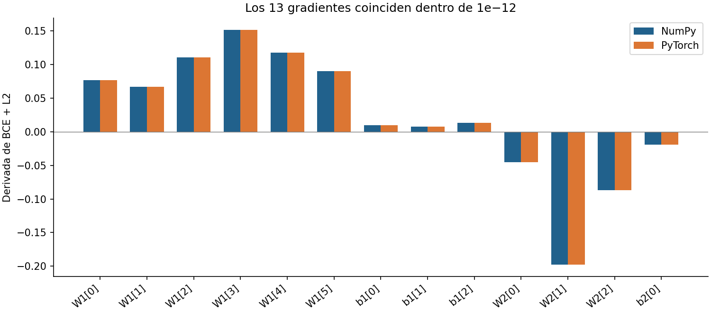
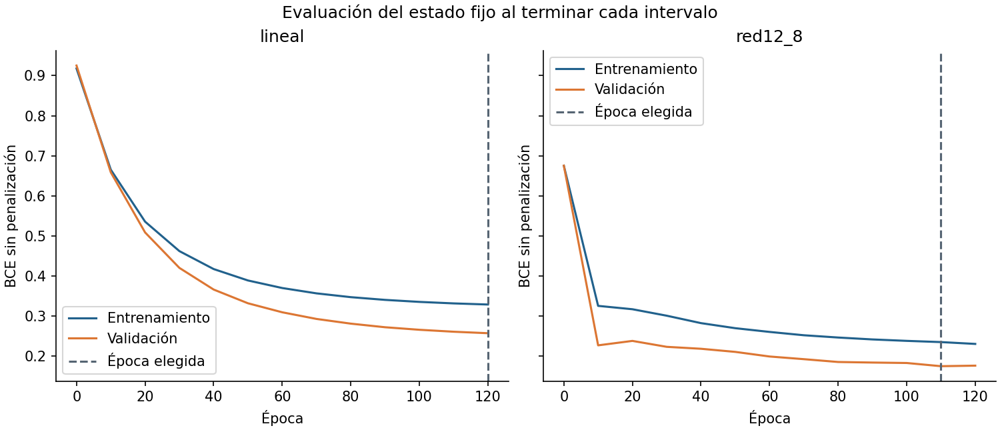
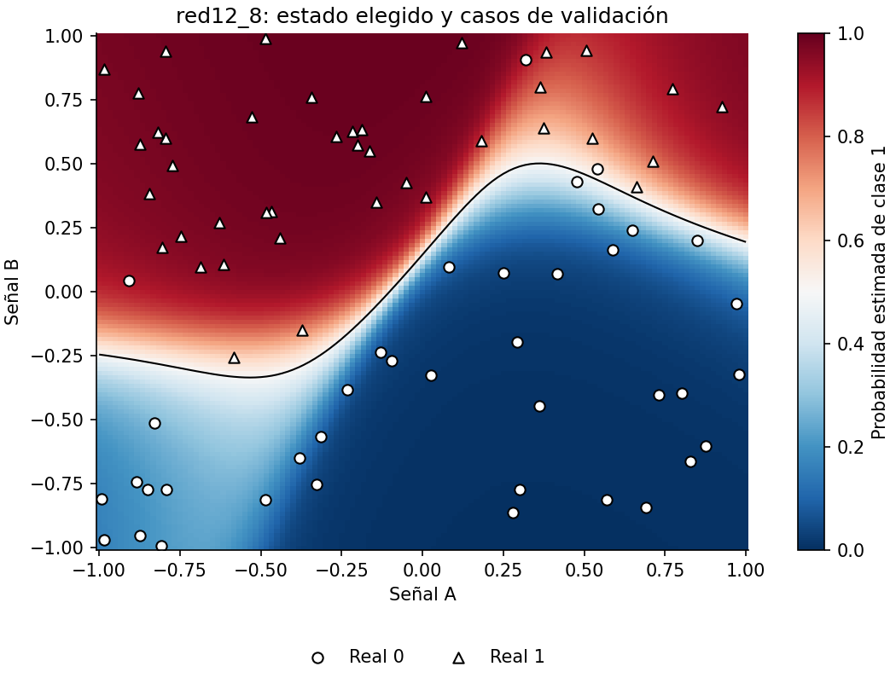

# Unidad 20 — Aprendizaje profundo con PyTorch

[Índice del curso](../README.md) · [Unidad anterior: redes neuronales](../unidad19-redes-neuronales/README.md)

**Pregunta guía:** ¿cómo trasladar una red verificable a PyTorch y organizar un entrenamiento reproducible con tensores, autograd y evaluación separada?

En la unidad anterior calculaste las derivadas. Ahora una biblioteca registrará las operaciones y aplicará la regla de la cadena. Tú sigues siendo responsable de las formas, la pérdida, los datos permitidos y la interpretación. Primero comprobaremos la traducción con una referencia NumPy; después entrenaremos con minilotes sobre datos nuevos.

## 1. Qué aprenderás y qué necesitas

Al terminar podrás:

- Identificar forma, tipo, dispositivo y propiedad de memoria de un tensor.
- Traducir una red a `nn.Module` y comprobar sus salidas, gradientes y actualización.
- Explicar las funciones distintas de `zero_grad`, `backward`, `step`, `train`, `eval` y `no_grad`.
- Preparar `TensorDataset` y `DataLoader`, contar épocas y actualizaciones y promediar pérdidas correctamente.
- Elegir un estado con validación, guardarlo junto con su preparación y verificar su recarga.

Prerrequisitos: funciones y clases básicas de Python, arrays NumPy y [propagación, BCE y retropropagación de la Unidad 19](../unidad19-redes-neuronales/README.md). Tiempo orientativo: 4–6 horas incluyendo ejercicios; el entrenamiento de estas redes pequeñas tarda segundos en el entorno comprobado.

## 2. Instalación comprobada en CPU

Desde la raíz del repositorio, con Python 3.12 en Linux x86_64:

```bash
python3 -m venv .venv
source .venv/bin/activate
python -m pip install -r unidad20-pytorch/requirements.txt
python -m pip install -r unidad20-pytorch/requirements-cpu.txt
python -c "import torch; print(torch.__version__); print(torch.ones(2).device)"
```

Salida comprobada el **10 de octubre de 2026**: `2.14.1+cpu` y `cpu`, con Python 3.12.3, NumPy 2.2.6 y Matplotlib 3.10.8. Se creó un entorno virtual limpio; `pip check` no encontró incompatibilidades. El [registro completo](recursos/entorno-verificado.txt) incluye dependencias transitivas. El primer archivo comparte los paquetes anteriores; el segundo instala PyTorch desde su índice oficial de CPU. **Son dos comandos de instalación.**

La rueda de PyTorch descargada ocupa aproximadamente 196 MB; el entorno completo del curso ocupa alrededor de 1,3 GB instalado, sin contar cachés. Necesitas Internet para instalar; los ejemplos funcionan después sin red, modelos descargados, cuentas, GPU ni servicios de pago. La biblioteca es mucho mayor que estos datos y redes.

Esta combinación se comprobó en Linux x86_64. Para otro sistema o arquitectura, consulta el [selector oficial de instalación](https://pytorch.org/get-started/locally/), elige la opción apropiada sin acelerador y registra lo que realmente instalaste; el archivo CPU no promete compatibilidad universal. No mezcles paquetes de otro entorno para resolver un error de importación.

## 3. Tensores: cuatro preguntas antes de operar

Un tensor contiene valores organizados en ejes. En estos laboratorios, `X` tiene forma `(n, 2)`: cada fila es un caso y cada columna una señal. Un tensor no conoce por sí mismo el significado de esos ejes.

```python
import numpy as np
import torch

a = np.array([[1., 2.], [3., 4.]], dtype=np.float64)
compartido = torch.from_numpy(a)
x = torch.tensor(a, dtype=torch.float32, device="cpu")
print(x.shape, x.dtype, x.device, x.requires_grad)
# torch.Size([2, 2]) torch.float32 cpu False
```

| Pregunta | Decisión en la práctica |
|---|---|
| ¿Qué representa cada eje? | Casos y señales; orden fijo `senal_a`, `senal_b` |
| ¿Qué tipo numérico usa? | `float64` para contrastar derivadas; `float32` para entrenar |
| ¿En qué dispositivo vive? | CPU tanto para entradas como para parámetros |
| ¿Comparte memoria? | `from_numpy` comparte el array; `tensor` copia sus valores |

Si cambias `a[0, 0]`, cambia `compartido`, pero no `x`. `detach()` separa del grafo de derivadas y sigue compartiendo almacenamiento; `detach().clone()` produce una copia independiente. Para pasar un resultado a NumPy usamos `tensor.detach().cpu().numpy()`; ese array también puede compartir la memoria del tensor en CPU. Consulta [tensores y conversión](https://docs.pytorch.org/tutorials/beginner/basics/tensorqs_tutorial.html).

`x @ w` es multiplicación matricial; `x * w` multiplica elemento a elemento y puede expandir ejes por *broadcasting*. Una pérdida entre formas `(n, 1)` y `(n,)` puede ser rechazada o, en otras operaciones, producir una matriz no deseada. Por eso nuestra salida usa `squeeze(-1)`: quita solo el último eje de tamaño uno y conserva el lote cuando n=1. Las etiquetas para BCE son números de punto flotante de la misma forma que los logits.

## 4. Laboratorio 1: comprobar la traducción

**Antes de ejecutar:** si ambos programas tienen los mismos parámetros y operaciones, ¿qué debería cambiar por usar una biblioteca diferente?

```bash
python unidad20-pytorch/ejemplos/01_comprobar_equivalencia.py
```

El [caso de seis filas](datos/equivalencia.json) comprueba operaciones, sin separar entrenamiento y prueba: **no es un experimento de generalización**. Se reutiliza el código NumPy de la unidad anterior, no sus datos de cierre.

La red es `2 → 3 → 1`, con tanh entre capas:

```text
H = tanh(X W1 + b1)
s = H W2 + b2
J = media(BCE desde logits) + lambda/2 · (suma(W1²) + suma(W2²))
```

Aquí lambda=0,05, tasa SGD=0,1 y semilla NumPy=20. Hay `2·3 + 3 + 3·1 + 1 = 13` parámetros. No se penalizan sesgos ni se divide otra vez la penalización por n. `nn.Linear` almacena pesos como `(salidas, entradas)` y aplica `X @ weight.T + bias`; por tanto copiamos `W1.T`, y convertimos W2 en una fila. Véase [Linear](https://docs.pytorch.org/docs/2.14/generated/torch.nn.Linear.html).

[`equivalencia.py`](ejemplos/equivalencia.py) copia exactamente el estado inicial, calcula BCE con L2 explícita, ejecuta `backward()` y compara los 13 gradientes con la referencia antes de aplicar un paso SGD. Ambos programas usan `float64`.

```text
Error máximo logits: 1.110e-16
Error máximo objetivo: 0.000e+00
Error máximo gradientes: 2.776e-17
Error máximo parametros_tras_paso: 1.301e-18
Equivalencia comprobada: tolerancia=1e-12; 13 parámetros; float64; CPU.
```

El objetivo común es 0,8699601426. Esas pequeñas diferencias son compatibles con el redondeo; no exigimos igualdad bit a bit entre NumPy y PyTorch. Las pruebas añaden un cálculo escalar de forward y diferencias finitas, para no limitarse a comparar dos implementaciones que pudieran compartir un error.



Los índices de W1 en la figura corresponden a su matriz aplanada por filas. La coincidencia comprueba este caso y esta actualización; no demuestra que cualquier arquitectura, tipo o dispositivo produzca el mismo resultado.

**Experimenta:** en una copia del JSON, usa L2=0 y vuelve a contrastar ambas implementaciones con `--datos ruta/a/tu_caso.json`. Después cambia solo una de las implementaciones. Explica por qué una diferencia real debe fallar aunque el programa todavía pueda producir una predicción. No ajustes la tolerancia para esconder una transposición incorrecta.

## 5. Autograd calcula; el optimizador actualiza

Sea `L(w) = (3w−1)²/2`. Para w=2: L=12,5 y `dL/dw = (3w−1)·3 = 15`. Con tasa 0,1, un paso SGD da w=0,5 y L=0,125.

```bash
python unidad20-pytorch/soluciones/03_acumular_gradientes.py
```

```text
Gradiente primero=15; acumulado=30; tras limpiar=15
Peso tras SGD=0.500; pérdida=12.500 -> 0.125
```

`requires_grad=True` permite construir un grafo de operaciones diferenciables. `backward()` recorre ese grafo y **acumula** en `.grad` de los parámetros hoja. No los actualiza. El ejemplo vuelve a calcular el forward antes del segundo backward, pero conserva `.grad`: por eso obtiene 30. Los datos intermedios necesarios del grafo anterior normalmente se liberan tras backward; reconstruir el forward no limpia los gradientes. Véase [autograd](https://docs.pytorch.org/tutorials/beginner/basics/autogradqs_tutorial.html).

El ciclo por minilote es:

```python
optimizador.zero_grad(set_to_none=True)  # descarta el gradiente anterior
logits = modelo(x_lote)                 # nuevo grafo
perdida = torch.nn.functional.binary_cross_entropy_with_logits(logits, y_lote)
perdida.backward()                      # calcula gradientes
optimizador.step()                      # cambia parámetros
```

No conviertas la pérdida a `.item()` antes de backward: obtendrías un número de Python sin grafo. Usa `.item()` para registrar un escalar. No apliques sigmoide antes de `BCEWithLogitsLoss`: esta pérdida recibe logits e integra el cálculo estable; la sigmoide se usa al presentar probabilidades. [Documentación de la pérdida](https://docs.pytorch.org/docs/2.14/generated/torch.nn.BCEWithLogitsLoss.html).

SGD usa directamente la dirección del gradiente. El segundo laboratorio usa Adam: mantiene promedios móviles del gradiente y de su cuadrado, corrige su sesgo inicial y adapta el tamaño del paso por parámetro. Fijamos tasa=0,01, betas=(0,9; 0,999), epsilon=1e−8 y `weight_decay=0`. Su estado incluye más que los pesos de la red. Aquí no comparamos optimizadores ni afirmamos que Adam siempre sea mejor. [Algoritmo y parámetros de Adam](https://docs.pytorch.org/docs/2.14/generated/torch.optim.Adam.html).

## 6. Module y modos de trabajo

[`Red`](ejemplos/pytorch_curso.py) hereda de `nn.Module`, llama a `super().__init__()` y registra sus capas en `nn.Sequential`. Eso permite obtener los parámetros con `parameters()` y su estado con `state_dict()`. `forward` define cómo usar las capas; llamar `modelo(x)` ejecuta esa propagación.

| Operación | Efecto |
|---|---|
| `modelo.train()` | Activa el modo de entrenamiento de los módulos |
| `modelo.eval()` | Activa el modo de evaluación; equivale a `train(False)` |
| `with torch.no_grad():` | Desactiva el registro de nuevas operaciones para autograd dentro del bloque |
| `zero_grad(...)` | Limpia gradientes; no cambia pesos ni el modo |

`eval()` no desactiva las derivadas; `no_grad()` no cambia el modo del modelo. Se usan juntos para evaluar. Esta red contiene Linear y Tanh, cuyo forward no cambia con train/eval. Dropout y BatchNorm sí distinguen modos; un pequeño test con Dropout demuestra la diferencia, pero ninguno forma parte del predictor de esta unidad. No añadas Dropout para intentar explicar una diferencia que estos ejemplos no producen.

## 7. Laboratorio 2: aprender con minilotes

**Pregunta:** con el mismo presupuesto, ¿qué estado predice mejor los casos de validación de una frontera curva con etiquetas aleatorias?

```bash
python unidad20-pytorch/ejemplos/02_entrenar_minilotes.py
```

Los [datos documentados](datos/README.md) contienen 150 casos de entrenamiento, 80 de validación y 80 reservados para cierre, generados con semillas distintas. Son dos señales adimensionales y un objetivo binario sintético. No corresponden a personas, equipos o diagnósticos reales. La probabilidad generadora es suave; incluso con sus señales conocidas hay incertidumbre en las etiquetas.

Se ajustan media y desviación poblacional **solo con entrenamiento**. `TensorDataset` agrupa entradas, etiquetas e índices; `DataLoader` baraja casos y entrega lotes de 32, con `drop_last=False` y `num_workers=0`. Cada época contiene tamaños `[32, 32, 32, 32, 22]`: cinco actualizaciones y 150 casos. En 120 épocas hay 600 actualizaciones por candidato entrenado.

Los tres candidatos se fijaron antes del cierre:

| Candidato | Modelo | Parámetros libres | Ajuste |
|---|---|---:|---|
| prevalencia | Probabilidad constante calculada con entrenamiento | 1 | Fórmula, sin Adam |
| lineal | `Linear(2, 1)` | 3 | 120 épocas |
| red12_8 | `Linear(2,12) → Tanh → Linear(12,8) → Tanh → Linear(8,1)` | 149 | 120 épocas |

Para reutilizar la inferencia, la constante se guarda como una capa lineal con dos pesos fijados en cero y un sesgo igual al logit de la prevalencia; sus tres valores almacenados contienen solo un parámetro libre. La red tiene `(2·12+12)+(12·8+8)+(8·1+1)=149` parámetros.

La inicialización usa los valores predeterminados de `nn.Linear` con semilla 20. Cada candidato tiene un generador de orden propio con semilla 2020: reciben las mismas permutaciones de filas, pero el orden cambia entre épocas. El generador no se reinicia al empezar cada época. El informe guarda todos los índices de la primera, las huellas de las demás y los tamaños de cada lote. Las arquitecturas tienen diferentes dimensiones y pesos iniciales; no se afirma que tengan un estado inicial equivalente.

Al evaluar, fijamos el estado y sumamos las pérdidas de todos los casos, dividiendo por su número. Promediar sin ponderar las medias de cinco lotes daría demasiado peso al último, que tiene 22 casos. Además, la curva describe un **estado fijo** al final del intervalo: no es un promedio de pérdidas de entrenamiento calculadas mientras cambiaban los pesos. [DataLoader](https://docs.pytorch.org/docs/2.14/data.html).

### Elegir y conservar el estado

Se evalúa en épocas 0, 10, …, 120. Dentro de cada candidato se conserva la primera época registrada que mejora la mejor BCE de validación en más de 1e−8. Después se comparan candidatos por la misma métrica y tolerancia, con desempate por orden de la tabla. La clasificación usa un umbral fijo de 0,5; no se optimiza en prueba.

```text
candidato | parámetros libres | época elegida | BCE entrenamiento | BCE validación | exactitud validación
prevalencia | 1 | 0 | 0.6917 | 0.6959 | 0.487
lineal | 3 | 120 | 0.3291 | 0.2575 | 0.925
red12_8 | 149 | 110 | 0.2354 | 0.1752 | 0.963
Seleccionado por BCE de validación: red12_8; época=110
```



En red12_8, el estado final alcanza BCE de entrenamiento 0,2308 y validación 0,1766; elegimos la época 110, aunque el ajuste de entrenamiento siga mejorando. El entrenamiento no se detiene anticipadamente: se agota el presupuesto y después se restaura el mejor estado registrado. No sabemos si una época no registrada habría sido mejor.

Validación tiene aquí menor pérdida que entrenamiento. Eso puede ocurrir por variación muestral y dificultad de los casos; no demuestra filtración por sí solo ni garantiza ausencia de ella. Esta muestra de validación ha influido en la selección y su resultado es optimista como estimación del candidato elegido. La exactitud 0,9625 corresponde a 77 de 80 casos: tres falsos positivos y ningún falso negativo en esa muestra.



La línea negra marca p=0,5; los símbolos muestran etiquetas reales sintéticas, no predicciones. El color es una salida estimada, no una garantía de calibración. Una frontera curva aprendida tampoco es una explicación causal.

## 8. Exportar y volver a cargar

```bash
python unidad20-pytorch/ejemplos/01_comprobar_equivalencia.py --salida resultados/u20-equivalencia --graficos
python unidad20-pytorch/ejemplos/02_entrenar_minilotes.py --salida resultados/u20-minilotes --graficos
```

Las carpetas deben ser nuevas. `--graficos` requiere `--salida`. El segundo comando guarda informe JSON, predicciones CSV, `modelo.pt` y `recarga.json`, además de dos figuras PNG/SVG. `--datos` acepta una carpeta con el esquema documentado. Los [recursos publicados](recursos/README.md) conservan los informes de desarrollo y estados legibles; el archivo binario se genera localmente.

No basta `mejor = modelo.state_dict()`: sus tensores referencian almacenamiento del modelo y pueden cambiar durante el entrenamiento. `copiar_estado` aplica `detach().cpu().clone()` a cada tensor. Conservamos estado inicial, elegido y final para examinar qué sucedió. La guía de [guardado y carga](https://docs.pytorch.org/tutorials/beginner/saving_loading_models.html) explica esta distinción.

El archivo incluye identificador de arquitectura, época, orden de entradas, media, escala y `state_dict`. La carga usa `map_location="cpu"`, `weights_only=True`, valida metadatos, formas, tipos y valores finitos, y aplica `load_state_dict(strict=True)` y `eval()`. Solo carga archivos propios y de procedencia conocida: `weights_only=True` limita la deserialización, no convierte cualquier archivo desconocido en seguro. [Contrato de torch.load](https://docs.pytorch.org/docs/2.14/generated/torch.load.html).

Para recuperar el modelo que acabas de generar, desde la raíz:

```python
import sys
sys.path.insert(0, "unidad20-pytorch/ejemplos")
from pytorch_curso import cargar_modelo, evaluar, referencia

modelo, escala = cargar_modelo("resultados/u20-minilotes/modelo.pt")
filas, _ = referencia.leer_csv("unidad20-pytorch/datos/minilotes/validacion.csv")
resultado = evaluar(filas, escala, modelo)
print(resultado["metricas"]["bce"])
```

La exportación ya hace esa comprobación y obtuvo **error máximo en logits=0,0** en el entorno comprobado. Esto verifica inferencia después de recargar. **No permite reanudar exactamente el entrenamiento:** faltan el estado de Adam, los generadores aleatorios, el punto del recorrido de datos y la configuración necesaria para continuarlo. La huella del archivo verifica sus bytes; no se exige que dos serializaciones creen bytes idénticos.

## 9. Cierre, reproducibilidad y experimentos

Una vez terminada la selección:

```bash
python unidad20-pytorch/ejemplos/02_entrenar_minilotes.py --evaluar-prueba --salida resultados/u20-minilotes-cierre
```

Ese comando repite el protocolo de desarrollo y solo después abre prueba. Evalúa una vez al candidato y estado seleccionados, sin reajuste ni cambio de umbral. Los resultados públicos del cierre están en las [soluciones](soluciones/README.md); una modificación diseñada después de verlos necesita un cierre nuevo para ofrecer evidencia independiente.

Se fijan semillas, un hilo de cómputo PyTorch y algoritmos deterministas para esta ruta CPU. Esto facilita repetir un experimento en el mismo entorno. No garantiza igualdad entre versiones, plataformas o aceleradores. El [documento oficial de reproducibilidad](https://docs.pytorch.org/docs/2.14/notes/randomness.html) expone esas limitaciones. Registra versiones y conserva los datos y el protocolo, además de una semilla.

**Experimenta con desarrollo:**

1. En una copia de `entrenar`, cambia lote=32 por lote=50 manteniendo 120 épocas. Predice el nuevo número de pasos y registra que cambiaste también el presupuesto de actualizaciones.
2. Cambia `cada=10` por `cada=1`. Compara los estados elegidos; no llames a esto una mejora independiente porque usa la misma validación más veces.
3. Explora semillas de inicialización fijadas de antemano y publica todos los resultados de validación. No presentes la mejor semilla como comportamiento típico.

Los cambios del cuerpo de `entrenar` deben reflejarse en la configuración exportada; los parámetros experimentales no son opciones de la CLI oficial. Conserva el informe de referencia y usa carpetas nuevas. El [reto](reto.md) propone documentar un experimento sin reutilizar el cierre conocido.

## 10. Errores frecuentes, ejercicios y comprobación

| Error | Cómo reconocerlo o corregirlo |
|---|---|
| Comparar redes inicializadas por separado | Copiar los mismos pesos antes de pedir equivalencia |
| Mezclar float64 y float32 sin intención | Revisar tipos de entradas y parámetros |
| Pasar probabilidades a una pérdida que espera logits | Quitar la sigmoide previa a BCEWithLogitsLoss |
| Olvidar `zero_grad` | Los gradientes se acumulan entre lotes |
| Usar `no_grad` durante el entrenamiento | La pérdida deja de tener el grafo necesario |
| Guardar solo el último estado | Puede diferir del elegido con validación |
| Guardar pesos sin el orden de columnas o la escala | La misma red recibiría entradas con otro significado |
| Afirmar que 600 pasos son 600 épocas | Contar cuántos minilotes componen cada recorrido |

Resuelve antes de consultar las [diez soluciones](soluciones/README.md):

1. Escribe las formas de X, los pesos PyTorch y la salida en la red 2→3→1 para seis casos. Cuenta parámetros y explica la transposición respecto de NumPy.
2. Predice qué cambia al modificar un array tras `from_numpy` y tras `tensor`. ¿`detach()` produce una copia independiente?
3. Reproduce el ejemplo escalar: pérdida, derivada, dos backward sin limpiar y un paso SGD correcto.
4. ¿Por qué BCE recibe logits y etiquetas float de igual forma? Calcula pérdida y derivada para s=0, y=1, primero individual y después como contribución a una media de cuatro casos.
5. Un lote de dos casos tiene pérdida media 0,2 y otro de uno tiene 0,8. Calcula la media por caso y explica el error de promediar ambas medias sin ponderar.
6. Con 150 casos y lotes de 32, cuenta tamaños, pasos por época y pasos en 120 épocas. Repite con lote=50 y con `drop_last=True`, manteniendo lote=32.
7. Explica por qué `eval()` permite backward y `no_grad()` no activa automáticamente el modo de evaluación. ¿Cambia el forward de la red utilizada?
8. Con pérdidas de validación 0,50; 0,40; 0,42 en épocas 0,10,20, elige estado y explica por qué `state_dict()` sin copia no basta para conservarlo.
9. Compara el estado elegido y final de red12_8. ¿Qué datos usa cada decisión? ¿Es esta selección una parada anticipada del cómputo?
10. Enumera lo necesario para inferencia y para reanudar Adam. Diseña una comprobación de recarga y explica qué no demuestra.

```bash
python -m unittest discover -s unidad20-pytorch/pruebas -v
python herramientas/verificar_curso.py
```

Las **34 pruebas** cubren referencias matemáticas, acumulación, memoria y modos, lotes parciales, repetibilidad, separación, regeneración, recarga y correspondencia de figuras y artefactos. El verificador común requiere las dos instalaciones indicadas en esta unidad.

Antes de avanzar, completa la [plantilla de informe](plantillas/informe_pytorch.md) y compara su alcance con la [ficha de ejemplo](recursos/ficha_modelo.md). Debes poder explicar un paso de actualización, reconstruir el número de lotes y recuperar el estado elegido. La siguiente entrega prevista es la **Unidad 21 — Visión por computador**, pendiente de desarrollo.
