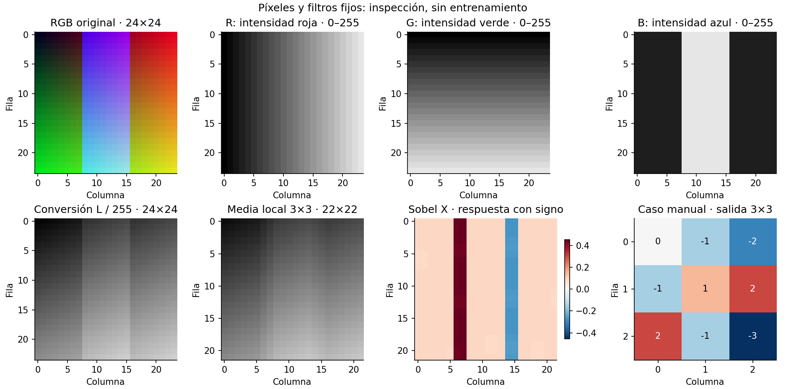
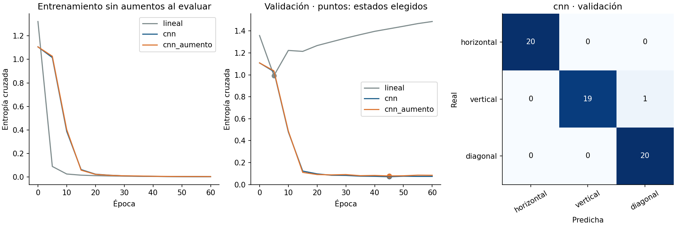
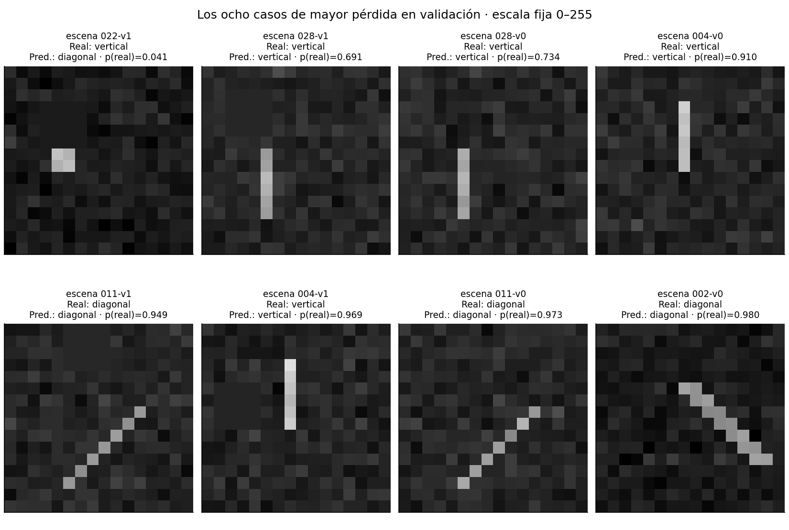

# Unidad 21 — Visión por computador

[Índice del curso](../README.md) · [Unidad anterior: PyTorch](../unidad20-pytorch/README.md)

**Pregunta guía:** ¿cómo representar imágenes, construir una línea base y entrenar una red pequeña para visión con una evaluación que controle la procedencia de las imágenes?

Una imagen digital contiene números. Convertirlos en un tensor es el comienzo: todavía debemos conservar el significado de sus ejes, elegir una tarea y decidir cómo comprobar el resultado. Esta unidad parte de filtros que puedes calcular a mano y termina con una CNN pequeña que clasifica trazos sintéticos.

## 1. Objetivos y entorno

Al terminar podrás:

- Leer una imagen y distinguir tamaño, canales, tipo, rango y orden de ejes.
- Calcular una respuesta de correlación cruzada y explicar paso, relleno y campo receptivo.
- Seguir las formas y contar los parámetros de una CNN.
- Separar escenas y sus variantes, ajustar la preparación con entrenamiento y aplicar aumentos solo donde corresponde.
- Comparar referencias, analizar una matriz multiclase e inspeccionar errores sin cambiar el protocolo de cierre.
- Guardar y recuperar el modelo elegido con su preparación y orden de clases.

Prerrequisitos: [tensores, autograd, minilotes y estados de la Unidad 20](../unidad20-pytorch/README.md), arrays NumPy y funciones de Python. Tiempo orientativo: 4–6 horas con ejercicios. Los ejemplos usan CPU y sus imágenes ya están incluidas.

Desde la raíz del repositorio, con un entorno virtual activo:

```bash
python -m pip install -r unidad21-vision-computador/requirements.txt
python -m pip install -r unidad21-vision-computador/requirements-cpu.txt
python unidad21-vision-computador/ejemplos/01_explorar_pixeles.py
python unidad21-vision-computador/ejemplos/02_clasificar_trazos.py
```

Se comprobó el **10 de octubre de 2026** reutilizando el [entorno registrado en la Unidad 20](../unidad20-pytorch/recursos/entorno-verificado.txt): Python 3.12.3, PyTorch 2.14.1+cpu, NumPy 2.2.6, Matplotlib 3.10.8 y Pillow 12.3.0. Pillow ya estaba instalado como dependencia de Matplotlib; ahora se declara directamente. No se añadieron paquetes ni se instaló torchvision.

Las 241 imágenes PNG incluidas ocupan en conjunto unos 73 KB de contenido comprimido; el sistema de archivos puede ocupar más. El entorno completo anterior ocupa aproximadamente 1,3 GB. La instalación inicial necesita Internet; las prácticas posteriores no descargan imágenes, pesos o modelos ni requieren cuentas, GPU o servicios de pago. Los comandos CPU se probaron en Linux x86_64 con Python 3.12; para otro sistema, sigue las [indicaciones de instalación de la Unidad 20](../unidad20-pytorch/README.md).

## 2. Qué tarea estamos resolviendo

| Tarea | Resultado habitual | ¿Se implementa aquí? |
|---|---|---|
| Clasificación | Una clase o distribución por imagen | Sí: horizontal, vertical o diagonal |
| Detección | Clases y posiciones de objetos, por ejemplo cajas | No |
| Segmentación | Una clase por píxel o región | No |

Un buen clasificador no produce automáticamente cajas o máscaras. Nuestro problema es reconocer la orientación de **un trazo** en una imagen de 16×16, con ruido y una posible oclusión. No es reconocimiento de escritura, inspección industrial ni análisis de fotografías reales. Una segunda imagen RGB de 24×24 se usa solo para comprender canales y filtros.

## 3. De PNG a tensor

Una imagen en modo `L` de Pillow tiene un canal de valores de 8 bits; en modo `RGB` tiene tres, en orden rojo, verde y azul. Los archivos pueden contener otros modos, transparencias o metadatos: el lector de esta práctica exige explícitamente los formatos previstos. [Modos y bandas en Pillow](https://pillow.readthedocs.io/en/stable/handbook/concepts.html).

```python
from PIL import Image
import numpy as np
import torch

with Image.open("unidad21-vision-computador/datos/colores.png") as imagen:
    rgb = np.array(imagen)  # (alto, ancho, canales): HWC
x = torch.tensor(rgb, dtype=torch.float32).permute(2, 0, 1).unsqueeze(0)/255
print(x.shape)  # torch.Size([1, 3, 24, 24]): NCHW
```

`permute` intercambia ejes; `reshape` no reemplaza ese intercambio, porque reorganizaría los valores con otro significado. N es número de imágenes, C canales, H alto y W ancho. El clasificador recibirá `(N,1,16,16)`; la imagen RGB de demostración no entra en ese modelo.

Un valor uint8 representa una intensidad entre 0 y 255. Convertir a float y dividir por 255 lo lleva a [0,1]. Eso no es todavía estandarizar: el laboratorio aprende después una media y una desviación globales del único canal usando **todos los píxeles de entrenamiento**, y aplica esos mismos valores a validación y prueba.

La conversión RGB→L combina aproximadamente `0,299R + 0,587G + 0,114B`, con redondeo entero. Se pierde información cromática: dos colores distintos pueden producir el mismo gris. Los canales individuales de la figura se muestran en gris para leer su intensidad, no porque el canal rojo se haya convertido en otro color.

Al visualizar PNG en gris mantenemos `vmin=0, vmax=255`; para imágenes divididas por 255, usamos [0,1]. Si cada panel ajustara su escala automáticamente, ruido oscuro podría parecer tan brillante como un trazo. `interpolation="nearest"` permite ver los píxeles sin suavizarlos. No interpretes una visualización de un tensor estandarizado como si todavía tuviera intensidades entre 0 y 1.

## 4. Laboratorio 1: píxeles y filtros fijos

**Antes de ejecutar:** ¿qué canal cambia de izquierda a derecha, cuál de arriba abajo y cuál contiene una franja?

```bash
python unidad21-vision-computador/ejemplos/01_explorar_pixeles.py --salida resultados/u21-filtros --graficos
```

El [programa](ejemplos/01_explorar_pixeles.py) lee el RGB, obtiene L y aplica dos filtros de 3×3 sin relleno: una media local y Sobel X. La media suaviza diferencias locales; Sobel X responde a cambios en la dirección de las columnas. Su respuesta tiene signo, por lo que se muestra con una escala divergente centrada en cero. No se recortan las respuestas negativas como si fueran intensidades PNG.

La media usa nueve pesos iguales a 1/9. Sobel X usa `[[−1,0,1],[−2,0,2],[−1,0,1]]`, sin factor adicional de escala. El informe conserva ambos kernels y las versiones de las bibliotecas.



El borde ascendente de la franja azul contribuye a una respuesta positiva y el descendente a una negativa. El gradiente rojo añade una contribución. Es una inspección de operaciones; estos filtros se fijaron a mano y no fueron aprendidos ni son un clasificador.

### Un filtro que puedes reconstruir

Usaremos la operación que `Conv2d` llama convolución y que matemáticamente es **correlación cruzada**: desliza el filtro sin invertirlo. Para una entrada de un canal, sin sesgo:

```text
salida[f,c] = suma sobre i,j de imagen[f+i,c+j] · kernel[i,j]

X = [[1,2,0,1],     K = [[1, 0],
     [0,1,3,2],          [0,-1]]
     [2,1,0,1],
     [1,0,2,3]]
```

La primera celda es `1·1 + 2·0 + 0·0 + 1·(−1) = 0`. Desliza una columna: `2·1 + 0·0 + 1·0 + 3·(−1) = −1`. Con paso 1 y sin relleno obtenemos:

```text
[[ 0, -1, -2],
 [-1,  1,  2],
 [ 2, -1, -3]]
```

```bash
python unidad21-vision-computador/soluciones/03_correlacion_a_mano.py
```

La referencia de [`filtros.py`](ejemplos/filtros.py) usa bucles y sumas de productos. Se contrasta con `torch.nn.functional.conv2d` en float64: error máximo=0,0. Una convolución matemática invertiría el filtro en ambos ejes; aquí ese cambio altera los signos y no debe introducirse al traducir el cálculo. [Definición de Conv2d](https://docs.pytorch.org/docs/2.14/generated/torch.nn.Conv2d.html).

### Paso, relleno y resolución

Para dilatación 1, una dimensión espacial tiene tamaño:

```text
salida = floor((entrada + 2·relleno − tamaño_kernel) / paso) + 1
```

Con entrada 24, kernel 3, paso 1 y relleno 0 obtenemos 22; con relleno 1, 24. El relleno añade valores fuera de la imagen —ceros en nuestros ejemplos— y cambia el comportamiento en los bordes. Un paso de 2 salta posiciones y reduce resolución. Reducir no equivale a conservar todos los detalles.

**Experimenta:** aplica `correlacion2d` a una matriz constante con relleno 0 y luego 1. Explica por qué el borde puede producir respuestas aunque el interior sea uniforme. Invierte K en ambos ejes y comprueba que el caso manual ya no coincide con el original.

## 5. De filtros fijos a una CNN

Una capa convolucional aprende los valores de sus filtros y los comparte entre posiciones espaciales. Con varios canales de entrada, cada filtro suma contribuciones de todos ellos. El número de parámetros de `Conv2d(Cin,Cout,k)` con sesgo es `Cout·Cin·k² + Cout`: no crece con el número de posiciones de la imagen.

La CNN de [`vision.py`](ejemplos/vision.py) tiene esta secuencia:

| Operación | Forma de salida | Parámetros |
|---|---|---:|
| Entrada | N×1×16×16 | 0 |
| Conv2d(1,4,3,padding=1) + ReLU | N×4×16×16 | 40 |
| MaxPool2d(2) | N×4×8×8 | 0 |
| Conv2d(4,8,3,padding=1) + ReLU | N×8×8×8 | 296 |
| AdaptiveAvgPool2d(1) | N×8×1×1 | 0 |
| Flatten + Linear(8,3) | N×3 | 27 |
| **Total** | Tres logits por imagen | **363** |

ReLU devuelve `max(0,x)`. MaxPool conserva el máximo de cada ventana 2×2 con paso 2; no aprende pesos. La media global posterior resume cada uno de los ocho mapas en un número. Esta reducción descarta ubicación precisa; por eso esta arquitectura no produce una localización del trazo. [MaxPool2d](https://docs.pytorch.org/docs/2.14/generated/torch.nn.MaxPool2d.html).

El **campo receptivo teórico** describe qué región de entrada puede afectar a una activación. En el interior: la primera convolución ve 3×3; el pool combina dos posiciones adyacentes y llega a 4×4; la segunda convolución combina posiciones separadas por dos píxeles originales y llega a 8×8. La media final combina posiciones de todo el mapa. El campo efectivo aprendido puede concentrarse en parte de esa región.

Compartir filtros favorece reconocer patrones locales en distintas posiciones. No garantiza invariancia perfecta a traslaciones: el relleno, el paso del pool, los bordes y el resumen final importan. Tampoco hace que un mapa aprendido sea automáticamente un detector semántico interpretable.

## 6. Tres clases, tres logits

Para una imagen, el modelo devuelve tres puntuaciones s, una por clase. Softmax produce `p_k = exp(s_k) / suma_j exp(s_j)`. La entropía cruzada de la clase real y es `−log(p_y)` y la pérdida de un lote es su media. En el cálculo estable se resta el máximo antes de exponenciar.

Ejemplo: logits `[0, log(2), 0]` producen probabilidades `[0,25; 0,50; 0,25]`. Si la etiqueta es vertical —índice 1—, la pérdida es log(2)≈0,693147. Obtener la clase correcta no hace que la pérdida sea cero: la confianza también interviene.

```python
logits = modelo(x_lote)                   # float32, forma (N,3)
perdida = torch.nn.functional.cross_entropy(logits, y_lote)
# y_lote: int64, forma (N,), valores 0, 1 o 2
```

No se aplica softmax antes de esta función: recibe logits. Las probabilidades se calculan al presentar resultados. Esto difiere de la BCE binaria anterior, que recibía una puntuación por caso y etiquetas float. La predicción usa `argmax`; si empatan las puntuaciones, se conserva la primera clase en el orden horizontal, vertical, diagonal. [CrossEntropyLoss](https://docs.pytorch.org/docs/2.14/generated/torch.nn.CrossEntropyLoss.html).

## 7. Laboratorio 2: clasificar escenas nuevas

**Antes de ejecutar:** ¿una red con más parámetros tiene necesariamente mejor comportamiento fuera del entrenamiento?

```bash
python unidad21-vision-computador/ejemplos/02_clasificar_trazos.py
```

El [generador y diccionario](datos/README.md) documentan 240 imágenes de 16×16: 120 de entrenamiento, 60 de validación y 60 reservadas para prueba. Hay tres clases, equilibradas dentro de cada partición. Cada **escena original genera dos vistas** con textura compartida y ruido distinto; la segunda incorpora una oclusión 4×4. Por tanto, 60 imágenes de validación proceden de 30 escenas, no de 60 escenas independientes.

Se separan escenas antes de generar sus vistas. El lector comprueba IDs, pertenencia a escena, huellas del PNG y huellas de sus píxeles; rechaza duplicados exactos incluso si cambia el nombre del archivo. Estas comprobaciones no detectan por sí solas todas las imágenes casi iguales de una colección real: allí necesitaríamos conocer sesiones, objetos, pacientes, cámaras o procedencia, según el problema.

Los modelos solo reciben píxeles. El nombre de archivo, ID, escena y clase del manifiesto no entran como características. La preparación aprende media=0,1612087674 y desviación poblacional=0,1500248133 de las intensidades de entrenamiento divididas por 255. No se redimensiona ni convierte de modo silenciosamente: los PNG del clasificador deben ser L y 16×16.

### Comparación fijada antes del cierre

| Candidato | Modelo | Parámetros libres | Aumento |
|---|---|---:|---|
| prevalencia | Probabilidad de cada clase en entrenamiento | 2 | Ninguno |
| lineal | Imagen aplanada: Linear(256,3) | 771 | Ninguno |
| cnn | CNN descrita arriba | 363 | Ninguno |
| cnn_aumento | La misma CNN | 363 | Reflejo horizontal con probabilidad 0,5 durante entrenamiento |

La referencia tiene tres probabilidades cuya suma es uno: dos grados de libertad; se guarda como tres logits constantes. Aquí las probabilidades son iguales, así que el desempate clasifica todo como horizontal. El modelo lineal tiene `256·3+3=771` parámetros y no comparte conexiones espaciales.

Los tres modelos entrenables usan Adam, tasa 0,01, betas=(0,9;0,999), epsilon=1e−8, sin weight decay, lotes de 24 y 60 épocas. Son cinco minilotes por época y 300 actualizaciones por candidato. Se fijan las semillas: modelo=21, orden=2100 y aumentos=2121. Las dos CNN parten de pesos idénticos y reciben el mismo orden de imágenes; un generador separado controla el reflejo. Se usa un hilo PyTorch y algoritmos deterministas en CPU.

Se registran épocas 0,5,…,60. Se conserva el primer estado registrado que reduce la mejor CE de validación en más de 1e−7; después se comparan candidatos con ese criterio y desempate por orden de la tabla. El entrenamiento agota el presupuesto; conservar una época anterior no significa que se haya detenido allí. El [protocolo](datos/protocolo.md) conserva las decisiones y su alcance.

```text
candidato | parámetros libres | época | CE entrenamiento | CE validación | exactitud | macro F1
prevalencia | 2 | 0 | 1.0986 | 1.0986 | 0.333 | 0.167
lineal | 771 | 5 | 0.0899 | 0.9929 | 0.617 | 0.621
cnn | 363 | 45 | 0.0042 | 0.0707 | 0.983 | 0.983
cnn_aumento | 363 | 45 | 0.0051 | 0.0781 | 0.983 | 0.983
Seleccionado por CE de validación: cnn; época=45
```



El modelo lineal reduce su pérdida de entrenamiento hasta 0,0030 en la época 60, mientras su pérdida de validación sube a 1,4859: ajustar mejor estas imágenes no basta para generalizar. Se conserva la época 5 para ese candidato. La CNN elegida tiene menos parámetros y una estructura apropiada para patrones locales; esta comparación no demuestra que menos parámetros siempre sea mejor.

La CNN sin aumento termina con CE de validación 0,0737 y conserva la época 45, con 0,0707. La CNN con aumento obtiene la misma exactitud, pero una CE mayor. No se cambió el criterio para hacer ganar al aumento ni se afirma que nunca ayude: estos son los resultados de un protocolo y una semilla concretos.

## 8. Aumentos, métricas y errores visibles

Un aumento aplica una transformación a una imagen de entrenamiento. Debe ser compatible con la etiqueta: un reflejo horizontal conserva horizontal y vertical; una diagonal cambia de inclinación, pero ambas inclinaciones pertenecen aquí a la clase diagonal. Una rotación de 90° intercambia horizontal y vertical: **no puede conservar sin más la etiqueta**. Un recorte u oclusión también puede borrar la evidencia necesaria para reconocerla.

Solo `cnn_aumento` recibe reflejos durante los pasos de entrenamiento: hubo 3609 imágenes reflejadas entre 7200 presentaciones. No se crean nuevos casos independientes ni se mezclan particiones. Al calcular las curvas, incluso la pérdida de entrenamiento se mide sobre imágenes originales sin aumentos y con un estado fijo. Validación, prueba y recarga nunca aplican el reflejo aleatorio.

La matriz tiene **filas reales y columnas predichas**. Para la CNN seleccionada:

| Real / Predicha | Horizontal | Vertical | Diagonal |
|---|---:|---:|---:|
| Horizontal | 20 | 0 | 0 |
| Vertical | 0 | 19 | 1 |
| Diagonal | 0 | 0 | 20 |

Hay 59 aciertos entre 60 vistas. Recobrado vertical=19/20=0,95; precisión diagonal=20/21≈0,9524. Calculamos precisión, recobrado y F1 por clase tratando cada clase frente a las demás; **macro F1** es la media aritmética de los tres F1. La referencia constante tiene exactitud 1/3 y macro F1=1/6, porque solo acierta la clase horizontal.

Cuando no hay predicciones de una clase, su precisión se registra como `null`; sin casos reales, su recobrado sería `null`. Para F1 se usa `2TP/(reales+predichos)`, con valor convencional 0 si ese denominador es cero. Macro F1 incluye siempre las tres clases. La selección se hace por CE, no por F1 ni por exactitud.



La galería ordena por menor probabilidad asignada a la clase real y desempata por ID. Incluye errores y aciertos difíciles, sin elegir imágenes por apariencia. En `escena 022-v1`, una oclusión deja un pequeño bloque donde antes había un trazo vertical; el modelo predice diagonal y asigna aproximadamente 0,041 a la clase real.

La etiqueta describe **la escena original**. Si la vista pierde casi toda la orientación, puede no contener información suficiente para recuperarla con confianza. Esto exige revisar el diseño de adquisición y la definición de la tarea antes de prometer resolverlo con una red mayor. No cambiamos la etiqueta después de observar el error. El ruido, la oclusión y el posible uso de una decisión de abstención son límites para analizar, no una evaluación operativa ya completada.

Las métricas resumen vistas correlacionadas de 30 escenas. No calculamos un intervalo suponiendo 60 observaciones independientes ni extrapolamos ese 98,3 % a fotografías reales. La galería usa validación, que ya orientó la elección.

## 9. Exportación, recarga y cierre

```bash
python unidad21-vision-computador/ejemplos/02_clasificar_trazos.py --salida resultados/u21-trazos --graficos
```

Las carpetas deben ser nuevas; `--graficos` requiere `--salida`. El comando exporta informe JSON, predicciones por candidato en CSV, dos figuras PNG/SVG, un archivo local `modelo.pt` y `recarga.json`. `--datos` permite indicar otra carpeta con los manifiestos e imágenes del mismo esquema.

El [informe publicado](recursos/trazos/informe.json) incluye configuración, preparación, huellas de los archivos leídos, pesos iniciales/elegidos/finales, curvas y píxeles de validación para reconstruir las figuras. No contiene imágenes ni resultados de prueba. Las [exportaciones publicadas](recursos/README.md) mantienen `prueba=null`; el archivo binario se genera localmente y está excluido del control de versiones.

El modelo guardado incluye arquitectura, estado elegido, orden de clases, resolución, modo L, divisor 255, media y escala. La carga usa `weights_only=True`, `map_location="cpu"` y validación de forma, valores y metadatos; restaura en modo evaluación. Usa archivos propios o de procedencia conocida, como en la unidad anterior.

Para recuperar lo que acabas de generar, desde la raíz:

```python
import sys
sys.path.insert(0, "unidad21-vision-computador/ejemplos")
from vision import cargar_modelo, leer_particion, evaluar

modelo, preparacion = cargar_modelo("resultados/u21-trazos/modelo.pt")
validacion = leer_particion("unidad21-vision-computador/datos", "validacion")
resultado = evaluar(validacion, preparacion, modelo)
print(resultado["metricas"]["ce"])
```

La exportación comprueba esta recarga sobre las mismas 60 imágenes y obtuvo error máximo en logits=0,0 en el entorno probado. Guardar solo pesos sin preparación u orden de clases permitiría producir resultados con otro significado. Este artefacto sirve para inferencia; no incluye los estados de Adam y de los generadores necesarios para reanudar exactamente el entrenamiento.

Después de terminar el desarrollo:

```bash
python unidad21-vision-computador/ejemplos/02_clasificar_trazos.py --evaluar-prueba --salida resultados/u21-trazos-cierre
```

Solo después de elegir candidato y época se leen el manifiesto y las imágenes de prueba. No se reajusta con validación ni se comparan alternativas allí. Los resultados didácticos están en las [soluciones](soluciones/README.md); una variante diseñada después de conocerlos necesita otro cierre para aportar evidencia independiente.

Las semillas facilitan repetir este entorno CPU. No garantizan igualdad entre versiones, hardware o bibliotecas. Conserva los datos, el generador, sus huellas y las versiones, además de la semilla. La [ficha completada](recursos/ficha_modelo.md) distingue reproducibilidad de recarga y utilidad predictiva.

## 10. Practicar y comprobar

**Experimenta con desarrollo:**

1. Dibuja una cuadrícula 4×4, calcula el filtro manual y cambia paso o relleno; predice primero la forma de salida.
2. En una copia de la práctica, cambia el ancho de una convolución. Cuenta los parámetros antes de ejecutar y registra la configuración real junto al resultado.
3. Examina juntas las dos vistas de una escena difícil. Describe la información que cambió y si sigue siendo razonable pedir la clase original. Conserva el protocolo publicado como referencia.

| Error frecuente | Corrección |
|---|---|
| Confundir HWC con NCHW | Intercambiar ejes explícitamente y comprobar una coordenada |
| Trabajar con uint8 al entrenar | Convertir a float y documentar escala y normalización |
| Repartir vistas de una escena entre particiones | Separar primero por escena/procedencia |
| Normalizar cada partición con sus propios parámetros | Ajustar solo con entrenamiento |
| Aplicar una rotación que cambia la clase | Redefinir la transformación o actualizar su etiqueta justificadamente |
| Usar softmax antes de CrossEntropyLoss | Entregar logits y etiquetas int64 |
| Mostrar tensores estandarizados como intensidades | Recuperar la escala original o etiquetar claramente la transformación |
| Leer una matriz sin orientación ni soporte | Identificar filas, columnas y cantidad real de cada clase |

Resuelve antes de consultar las [diez soluciones razonadas](soluciones/README.md):

1. Una imagen RGB tiene 24×24 píxeles. Escribe HWC y NCHW para un lote de cinco; cuenta valores y explica por qué reshape no reemplaza permute.
2. Calcula las dos primeras celdas del caso manual y la salida completa. ¿Qué cambia al invertir el kernel en ambos ejes?
3. Calcula la resolución con H=16, k=3, paso=1, relleno=1; después con paso=2. ¿Qué hace MaxPool2d(2) sobre [[1,4],[3,2]]?
4. Cuenta los parámetros de ambas convoluciones, el clasificador final y el modelo lineal. Explica qué se comparte entre posiciones.
5. Deriva los campos receptivos 3×3, 4×4 y 8×8 y explica por qué el resumen global no proporciona una caja del objeto.
6. Calcula softmax y CE para logits [0,log(2),0] con etiqueta 1. ¿Qué forma y tipo debe tener la etiqueta de un lote?
7. Justifica el reflejo horizontal y rechaza una rotación de 90° con etiquetas sin cambiar. ¿Por qué aumentar no duplica el número de escenas independientes?
8. Reconstruye exactitud, recobrado vertical, precisión diagonal y macro F1 de la matriz de validación. Explica los valores indefinidos de la referencia constante.
9. Compara la época elegida y final del modelo lineal, y las dos CNN. ¿Demuestra este experimento que el aumento no sirve?
10. Explica qué guardar para inferencia y cómo comprobar la recarga. Ante una oclusión que borra orientación, ¿qué revisarías antes de cambiar el modelo?

El [reto evaluable](reto.md) pide una comparación reproducible y una auditoría visual con [plantilla](plantillas/informe_vision.md).

```bash
python -m unittest discover -s unidad21-vision-computador/pruebas -v
python herramientas/verificar_curso.py
```

Las **36 pruebas** incluyen cálculo manual, comparación con Conv2d, gradiente de filtro, preparación, separación por escena y píxeles, aumentos, métricas, recarga, regeneración y correspondencia de figuras. Ninguna comprobación técnica convierte estos trazos en evidencia sobre imágenes reales.

Antes de avanzar, comprueba que puedes seguir las formas de la CNN, explicar un error visible y recuperar el estado elegido. La siguiente entrega prevista es la **Unidad 22 — Procesamiento de lenguaje natural**, pendiente de desarrollo.
