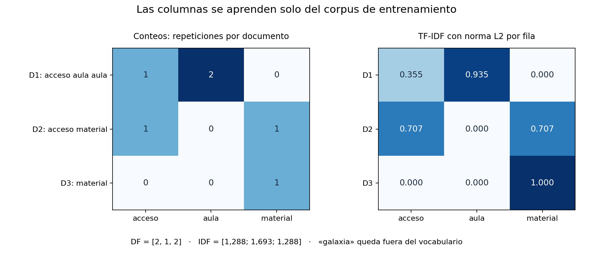
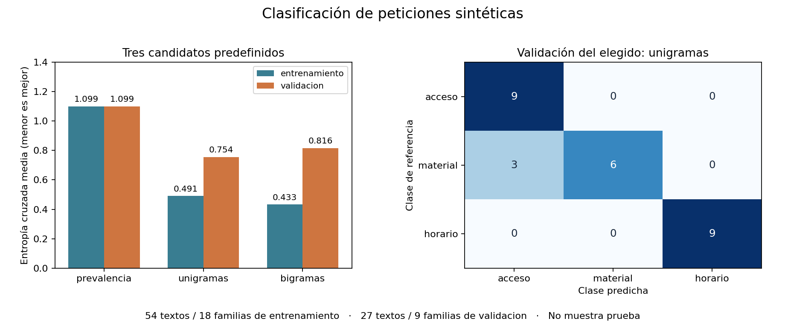
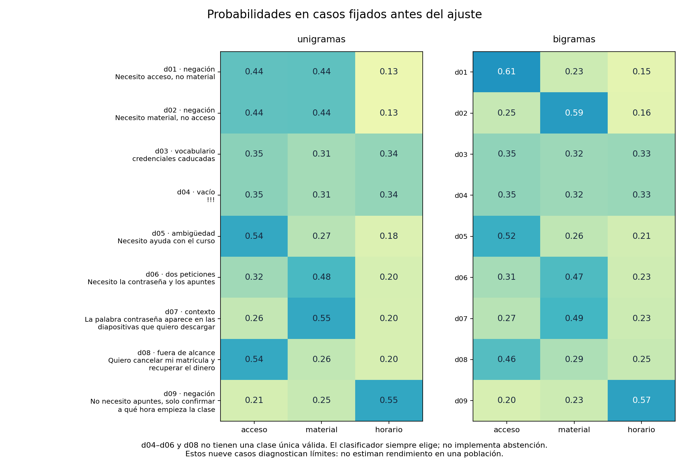

# Unidad 22 — Procesamiento de lenguaje natural

[Índice del curso](../README.md) · [Anterior: visión por computador](../unidad21-vision-computador/README.md)

**Pregunta guía:** ¿cómo convertir texto en números útiles y evaluar un clasificador sin que vocabulario, duplicados o plantillas filtren información de evaluación?

Un mensaje como «Puedo ingresar, pero necesito los apuntes» contiene palabras sobre acceso y material. El objetivo es reconocer qué se está pidiendo. Esta unidad construye una representación verificable, compara clasificadores y examina casos en los que sus respuestas dejan de ser fiables.

## Objetivos y prerrequisitos

Al terminar podrás explicar tokens, vocabulario, conteos, TF-IDF y bigramas; calcular una representación pequeña; separar familias antes de crear variantes; ajustar preparación solo con entrenamiento; comparar una referencia y dos representaciones; y recuperar un modelo con su preparación completa.

Necesitas Python básico, vectores de la [Unidad 3](../unidad03-matematica-aplicada/README.md), clasificación de la [Unidad 12](../unidad12-clasificacion/README.md) y separación de datos de las [unidades 10](../unidad10-flujo-lineas-base/README.md) y [16](../unidad16-validacion-hiperparametros/README.md). Conviene recordar las limitaciones de las métricas y fichas de las unidades [17](../unidad17-metricas-decisiones/README.md) y [18](../unidad18-interpretabilidad-responsabilidad/README.md).

Aunque este tema pertenece al bloque de aplicaciones del aprendizaje profundo, primero necesitamos una referencia textual sencilla. Una red añade decisiones y costo que este corpus pequeño no justifica. No se descargan modelos, no se usa GPU ni se envían textos a un servicio.

## 1. Tres tareas distintas sobre lenguaje

| Tarea | Entrada | Salida posible |
|---|---|---|
| Clasificación | «¿A qué hora empieza la clase?» | `horario` |
| Extracción | «La clase será el viernes a las 10» | Fragmentos «viernes» y «10» |
| Generación | Petición de explicar un concepto | Una secuencia nueva de texto |

Aquí implementaremos **clasificación de una sola etiqueta**: acceso, material u horario. No extraemos fechas ni producimos respuestas. Una salida `horario` no resuelve cuándo será la clase.

«Necesito la contraseña y los apuntes» pide dos cosas. «Necesito ayuda» no especifica cuál. Estos casos muestran que también hay que revisar la definición del problema: mejorar exactitud dentro de tres clases no garantiza que el catálogo cubra cada mensaje.

## 2. Texto, normalización y tokens

El texto llega como caracteres Unicode. Algunas letras acentuadas pueden tener distintas secuencias de código visualmente equivalentes. Aplicamos `casefold()` y normalización NFC, después extraemos secuencias de letras o de números. La [documentación de Unicode en Python](https://docs.python.org/3.12/library/unicodedata.html#unicodedata.normalize) explica las formas de normalización.

```text
«¡NO puedo entrar a la sesión 2!»
→ [no, puedo, entrar, a, la, sesión, 2]
```

La función [tokens](ejemplos/texto_curso.py) conserva palabras de una letra, tildes y negaciones. Separa signos y guiones; descarta emojis. `si` y `sí` siguen siendo distintos. No convierte plurales en singular ni verbos en su lema. Su sencillez facilita comprobarla, pero elimina información: una pregunta y una afirmación con las mismas palabras pueden quedar iguales.

Un token es una unidad elegida por el procedimiento, no necesariamente una palabra en cualquier idioma. Otros sistemas trabajan con fragmentos de palabra o bytes. Esta unidad usa tokens próximos a palabras del español; no presenta su regex como un segmentador universal.

Eliminar «no» como palabra supuestamente irrelevante dañaría nuestra tarea. Tampoco quitamos tildes automáticamente: las decisiones de preparación deben conservar distinciones útiles y comprobarse con datos apropiados.

## 3. Del vocabulario a TF-IDF: ejemplo manual

Usaremos tres documentos de entrenamiento:

```text
D1 = acceso aula aula
D2 = acceso material
D3 = material
```

El vocabulario ordenado es `[acceso, aula, material]`. Cada columna siempre representa el mismo término, aunque no aparezca en un documento. La matriz de conteos es:

```text
       acceso  aula  material
D1        1      2      0
D2        1      0      1
D3        0      0      1
```

La bolsa de palabras conserva frecuencias y pierde orden. La frecuencia documental `df(t)` cuenta cuántos documentos contienen el término, no sus repeticiones: aquí `[2, 1, 2]`.

Fijamos la variante suavizada de IDF y la norma L2 usada en el laboratorio:

```text
idf(t) = ln((1 + N) / (1 + df(t))) + 1
v(d,t) = conteo(d,t) × idf(t)
x(d)   = v(d) / sqrt(sum_t v(d,t)²), si la norma no es cero
```

Con `N=3`, IDF es `[1,287682; 1,693147; 1,287682]`. Para D1, el vector previo a normalizar es `[1,287682; 3,386294; 0]`; después resulta `[0,355432; 0,934702; 0]`. Su norma es uno. Esta convención coincide con la [ponderación TF-IDF documentada por scikit-learn](https://scikit-learn.org/stable/modules/feature_extraction.html).

TF-IDF no mide comprensión ni garantiza que una palabra rara sea relevante. Repondera conteos según un corpus concreto. Si el corpus cambia, pueden cambiar columnas e IDF, por eso no deben reajustarse con evaluación.

¿Qué ocurre con «aula galaxia»? `galaxia` no está en el vocabulario y se ignora; el vector es `[0, 1, 0]`. Con solo «galaxia» queda `[0, 0, 0]`. No creamos automáticamente una columna `<UNK>`: ese sería otro diseño. Un documento vacío tras tokenizar también queda en cero.



## 4. Entorno y laboratorio 1

Desde la raíz del repositorio, con el entorno virtual activo:

```bash
python -m pip install -r unidad22-lenguaje-natural/requirements.txt
python unidad22-lenguaje-natural/ejemplos/01_representar_textos.py
python unidad22-lenguaje-natural/soluciones/03_tfidf_a_mano.py
```

Se comprobó en Linux, Python 3.12.3, NumPy 2.2.6, scikit-learn 1.9.1 y Matplotlib 3.10.8, reutilizando el [entorno CPU de la Unidad 20](../unidad20-pytorch/recursos/entorno-verificado.txt). No se añadieron paquetes. Para esta unidad basta su archivo de requisitos; PyTorch sigue siendo necesario para ejecutar el verificador de todo el curso. La instalación inicial puede requerir Internet; las prácticas posteriores funcionan sin red.

Salida principal:

```text
Vocabulario: acceso, aula, material
Frecuencias documentales: [2, 1, 2]
IDF: 1.287682, 1.693147, 1.287682
TF-IDF manual y biblioteca: error máximo < 1e-12
Consulta aula galaxia: [0.0, 1.0, 0.0]
Solo desconocidas: [0.0, 0.0, 0.0]
```

[El laboratorio](ejemplos/01_representar_textos.py) cuenta con `Counter`, calcula IDF y normaliza con NumPy; contrasta el resultado con `TfidfVectorizer`. La [solución escalar](soluciones/03_tfidf_a_mano.py) reconstruye D1 con `math`, sin ajustar un estimador.

Para exportar el informe y la figura en PNG/SVG, usa una carpeta nueva:

```bash
python unidad22-lenguaje-natural/ejemplos/01_representar_textos.py --salida resultados/u22-representacion --graficos
```

**Experimenta:** calcula qué cambia si D1 contiene diez veces «aula». Su conteo cambia, pero su frecuencia documental sigue siendo uno. Después cambia «aula» por una palabra nueva en la consulta, sin volver a ejecutar `fit`: explica las columnas que quedan en cero.

## 5. Partir documentos antes de producir variantes

El conjunto principal tiene **108 textos sintéticos de 36 familias**, con tres variantes por familia. Una plantilla como «Busco los apuntes y las lecturas de {tema}» genera mensajes sobre robótica, programación y estadística. Repartir estas variantes por filas permitiría evaluar una frase casi vista durante el ajuste.

Por eso asignamos primero 18 familias a entrenamiento, 9 a validación y 9 a prueba, y luego sustituimos el tema: 54/27/27 textos. Las tres clases están equilibradas en cada partición. El [generador y esquema](datos/README.md) documentan autoría y huellas; el [protocolo](datos/protocolo.md) fija preparación, candidatos y selección.

Todos los textos proceden del mismo proceso de redacción. La separación de familias reduce una filtración concreta; no demuestra independencia entre estilos ni representa mensajes reales. Los ID contienen la clase como metadato: usarlos como entrada revelaría la respuesta. El programa usa únicamente texto para predecir.

## 6. Laboratorio 2: referencia y clasificación

```bash
python unidad22-lenguaje-natural/ejemplos/02_clasificar_mensajes.py
python unidad22-lenguaje-natural/ejemplos/02_clasificar_mensajes.py --salida resultados/u22-mensajes --graficos
```

Se comparan prevalencia, unigramas con TF-IDF y unigramas más bigramas con TF-IDF. Un bigrama es un par consecutivo: «no acceso» y «no material» son características distintas. No representa por sí solo el alcance de una negación distante.

La referencia asigna las frecuencias de entrenamiento; aquí cada clase recibe 1/3. Los dos modelos textuales usan regresión logística multinomial: calculan `z_k = w_k · x + b_k` y `p_k = exp(z_k) / sum_j exp(z_j)`. Se resta el máximo logit antes de exponenciar para evitar desbordamiento, sin cambiar las probabilidades. La clase predicha es el mayor valor; un empate exacto conserva el primer índice en acceso/material/horario.

El ajuste usa penalización L2 y `C=1`; se mantienen constantes el resto de decisiones y el criterio CE. En la API probada se expresa L2 con `l1_ratio=0`; `lbfgs` admite las tres clases. La [referencia de LogisticRegression](https://scikit-learn.org/stable/modules/generated/sklearn.linear_model.LogisticRegression.html) detalla estos parámetros. No se han calibrado las probabilidades para uso real.

| Candidato | Columnas | CE entrenamiento | CE validación | Exactitud validación | Macro F1 |
|---|---:|---:|---:|---:|---:|
| prevalencia | 0 | 1,0986 | 1,0986 | 0,333 | 0,167 |
| unigramas | 71 | 0,4906 | **0,7544** | 0,889 | 0,886 |
| bigramas | 191 | 0,4327 | 0,8159 | 0,778 | 0,775 |

Se eligen **unigramas por menor CE de validación**. Si dos candidatos difieren en menos de `1e-9`, se conserva el anterior en el orden de la tabla. CE evalúa la probabilidad asignada a la clase real; exactitud solo evalúa la clase ganadora. Se informa macro F1 como media de las tres clases. Si nunca se predice una clase, su precisión no está definida y el JSON conserva `null`; F1 usa cero cuando su denominador es cero.

La matriz de validación tiene filas reales y columnas predichas, ambas en orden acceso/material/horario:

```text
[[9, 0, 0],
 [3, 6, 0],
 [0, 0, 9]]
```

Los tres errores corresponden a una familia: «Puedo ingresar a {tema}, pero necesito los apuntes». El modelo asigna acceso aunque la petición pendiente es material. Son tres variantes de un mismo fallo, no tres tipos independientes de error. La precisión de acceso es 9/12 y el recobrado de material es 6/9.

Los bigramas reducen la pérdida de entrenamiento y empeoran la de validación en este experimento. Añaden 120 columnas, pero no aportan aquí mejor evaluación global. Eso no demuestra que el orden sea inútil: hay poca diversidad de familias, y la representación más amplia tiene otro comportamiento con la misma regularización.



## 7. Leer el código y controlar la filtración

En [texto_curso.py](ejemplos/texto_curso.py), `leer_particion` verifica campos y huellas; `validar_separacion` detecta familias compartidas, ID repetidos y textos que se vuelven idénticos tras tokenizar. No detecta toda similitud semántica.

`ajustar` recibe solo entrenamiento. Ejecuta `fit_transform` del vectorizador y `fit` del clasificador; guarda el estado aprendido. `transformar` aplica ese estado fijo a cualquier texto nuevo. La [API del vectorizador](https://scikit-learn.org/stable/modules/generated/sklearn.feature_extraction.text.TfidfVectorizer.html) permite vocabulario e IDF aprendidos; nuestros contrastes verifican la reproducción numérica. El ajuste usa matrices dispersas y la inferencia didáctica una matriz densa pequeña.

`seleccionar` mira exclusivamente CE de validación. `ejecutar_experimento` calcula después los diagnósticos y solo abre prueba si se solicita. No basta con ocultar las etiquetas: aprender vocabulario o IDF de todos los textos también modifica la preparación usando evaluación. Este principio y el uso de pipelines dentro de validación cruzada se explican en la [guía sobre filtración](https://scikit-learn.org/stable/common_pitfalls.html#data-leakage).

**Experimenta:** en una copia de validación añade una palabra inventada. Debe cambiar su proporción de tokens desconocidos, pero no aparecer en el vocabulario ni modificar IDF o coeficientes. Una modificación de validación sí puede cambiar la selección, porque esa es su función; no debe cambiar el ajuste de cada candidato.

## 8. Diagnósticos: negación, desconocidos y contexto



El [archivo de nueve casos](datos/diagnosticos.json) se definió antes del ajuste. Sus casos no deciden el candidato y no se promedian como si fueran una muestra de población. d01/d02 son cercanos al entrenamiento y permiten observar un mecanismo:

- «Necesito acceso, no material» y «Necesito material, no acceso» producen exactamente el mismo vector de unigramas. Ningún clasificador que reciba solo ese vector puede distinguirlas. Los bigramas distinguen aquí ambos casos, pero no ganaron en validación.
- «credenciales caducadas» tiene solo tokens desconocidos; su vector es cero, igual que «!!!». El modelo elige acceso en ambos porque quedan únicamente los sesgos. Que el primero coincida con la referencia es accidental respecto al contenido: no ha aprendido esos sinónimos.
- Una petición vaga, dos peticiones simultáneas y una solicitud de devolución no encajan en una sola clase del catálogo. Se conserva `clase=null` y se muestra la salida forzada del modelo. No hay una cuarta clase ni abstención implementada.
- Mencionar «contraseña» dentro de una petición de diapositivas requiere atender al contexto. Acertar ese ejemplo no demuestra comprensión general del lenguaje.

Los valores de la figura se redondean a dos decimales. d01 muestra acceso y material cerca de 0,44, pero no son un empate exacto; el mayor sin redondear es material. El JSON conserva precisión suficiente para comprobarlo.

Una aplicación necesitaría una política para pedir aclaración o derivar a revisión. Definir un umbral después de ver prueba y medirlo en esa misma prueba no daría una evaluación nueva. La [ficha de límites](recursos/ficha_modelo.md) delimita lo que este laboratorio permite afirmar.

## 9. Recarga y cierre

La exportación guarda `modelo.json` con clases, tokenizador versionado, vocabulario ordenado, IDF, coeficientes y sesgos. Guardar únicamente pesos perdería el significado de las columnas. `cargar_modelo` comprueba formato, formas y valores; la recarga conserva probabilidades de validación y diagnósticos con **error máximo 0,0** en el entorno comprobado. No se guarda un estado de optimización para reanudar ajuste.

Para predecir con el archivo ya publicado, desde la raíz en Bash:

```bash
python - <<'PY'
import sys
sys.path.insert(0, "unidad22-lenguaje-natural/ejemplos")
from texto_curso import CLASES, cargar_modelo, predecir
estado = cargar_modelo("unidad22-lenguaje-natural/recursos/mensajes/modelo.json")
probabilidades = predecir(["¿Cuál es el horario de la clase?"], estado)[0]
print(dict(zip(CLASES, probabilidades)))
PY
```

Cuando el criterio y el modelo ya están fijados:

```bash
python unidad22-lenguaje-natural/ejemplos/02_clasificar_mensajes.py --evaluar-prueba
```

El cierre evalúa solo unigramas, sin reajuste: **CE=0,6682, exactitud=1,000 y macro F1=1,000** en 27 textos de 9 familias. La matriz es diagonal con nueve casos por clase. Este cierre no contiene errores de clase, pero sí incertidumbre probabilística; tampoco cubre la diversidad de mensajes reales ni elimina los fallos de validación y diagnósticos. El resultado público ya no sirve como prueba independiente para elegir mejoras posteriores.

Los [recursos reproducibles](recursos/README.md) enlazan informes, predicciones, estado y figuras; el [resumen del cierre](recursos/mensajes/cierre.json) conserva sus métricas y huellas.

## 10. Ejercicios, reto y comprobación

Resuelve antes de abrir las [soluciones razonadas](soluciones/README.md):

1. Distingue clasificar, extraer y generar ante un mensaje sobre una fecha. ¿Cuál implementamos?
2. Tokeniza «¡NO sé si la sesión 2 cambió!» y explica qué se pierde y qué se conserva.
3. Calcula conteos, df, IDF y TF-IDF de D1. ¿Qué pasa si repites «aula» diez veces?
4. Predice los vectores de «aula galaxia» y «galaxia». ¿Existe una columna `<UNK>`?
5. Demuestra la colisión entre d01 y d02. Da dos bigramas que la rompan y una limitación que permanezca.
6. Explica por qué se separan 36 familias antes de crear 108 textos. ¿Basta esto para afirmar generalización a personas nuevas?
7. Identifica tres filtraciones posibles: ID con clase, vocabulario global y variantes repartidas por filas. Corrige cada una.
8. Reconstruye exactitud, precisión de acceso, recobrado de material y macro F1 de validación. Explica la elección por CE.
9. Interpreta d03 y d04, y decide qué referencia asignar a d06. ¿Cómo diseñarías una política de aclaración sin usar prueba para ajustarla?
10. Enumera el estado necesario para recargar, distingue inferencia de reanudar entrenamiento y explica qué permite afirmar el cierre perfecto.

El [reto](reto.md) pide reproducir, auditar y diseñar una evaluación nueva. Usa la [plantilla de informe](plantillas/informe_lenguaje.md).

```bash
python -m unittest discover -s unidad22-lenguaje-natural/pruebas -v
python herramientas/verificar_curso.py
```

Las **38 pruebas** contrastan cálculos con referencias escalares y biblioteca, Unicode, duplicados, familias, invariancia de ajuste y selección, vector cero, métricas, regeneración, persistencia y figuras. El verificador común necesita también las dependencias anteriores indicadas en el [índice](../README.md).

Antes de avanzar, comprueba que puedes calcular un vector, explicar el error de una familia y recargar el clasificador sin reaprender vocabulario. La siguiente entrega prevista es la **Unidad 23 — Series temporales y sensores**, pendiente de desarrollo.
