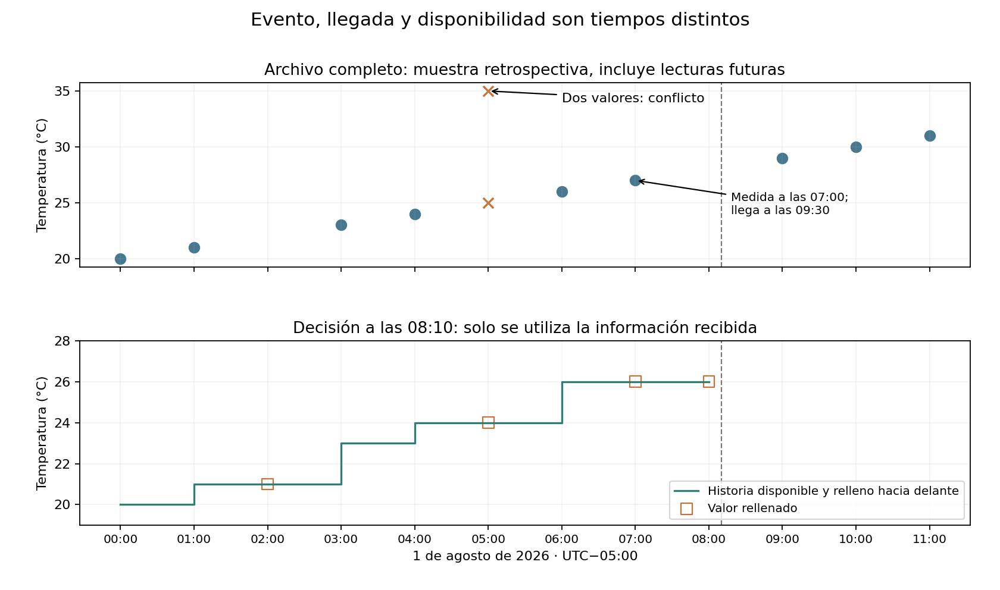
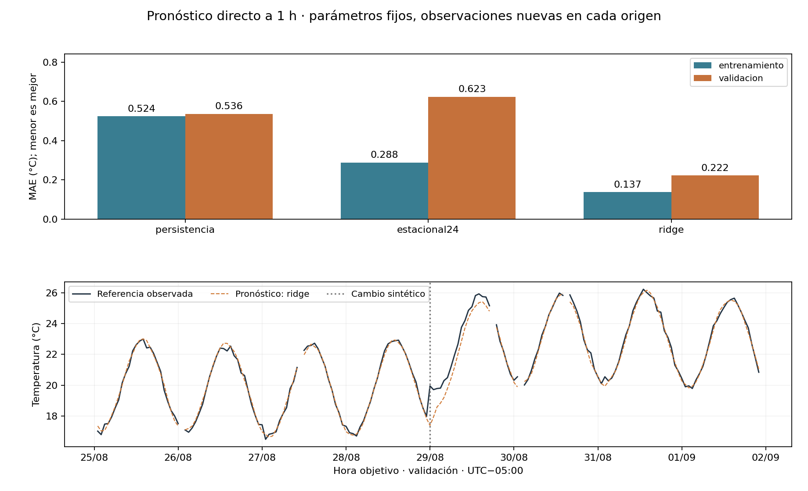
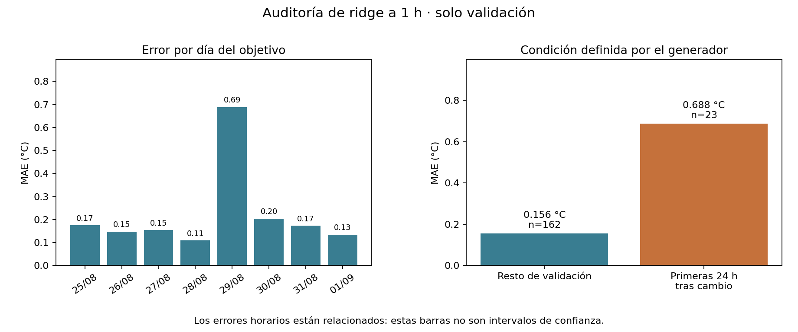

# Unidad 23 — Series temporales y sensores

[Índice](../README.md) · [Anterior: procesamiento de lenguaje natural](../unidad22-lenguaje-natural/README.md)

**Pregunta guía:** ¿cómo pronosticar una lectura usando solo la información disponible cuando se toma la decisión?

Un sensor puede medir a las 07:00 y entregar el dato a las 09:30. Ordenar por fecha no basta para reconstruir lo que sabíamos a las 08:10. Esta unidad convierte esa diferencia en un protocolo comprobable, compara pronósticos sencillos y examina sus errores cuando cambia el comportamiento de la serie.

## Objetivos y preparación

Al terminar podrás distinguir evento, llegada y decisión; construir rezagos y ventanas sin futuro; separar bloques temporales; comparar persistencia, estacionalidad y regresión; explicar cobertura y cambios de nivel; y recuperar un predictor con su preparación.

Necesitas Python básico y los conceptos de [preparación de datos](../unidad08-preparacion-datos/README.md), [regresión](../unidad11-regresion/README.md), [validación](../unidad16-validacion-hiperparametros/README.md) y [métricas](../unidad17-metricas-decisiones/README.md). La [Unidad 7](../unidad07-obtencion-datos/README.md) introdujo disponibilidad; aquí la aplicamos en cada origen de pronóstico.

Desde la raíz del repositorio, con el entorno virtual activo:

```bash
python -m pip install -r unidad23-series-temporales/requirements.txt
python unidad23-series-temporales/ejemplos/01_auditar_tiempo.py
python unidad23-series-temporales/ejemplos/02_pronosticar_sensor.py
```

Se comprobó en Linux con Python 3.12.3, NumPy 2.2.6, scikit-learn 1.9.1 y Matplotlib 3.10.8, reutilizando el [entorno registrado de la Unidad 20](../unidad20-pytorch/recursos/entorno-verificado.txt), sin paquetes nuevos. Estas prácticas funcionan en CPU y sin red después de instalar; no necesitan PyTorch. El verificador de todo el curso sí requiere las dependencias anteriores.

## 1. Qué cambia cuando el orden importa

Una serie temporal relaciona valores con instantes: `y(t)`. Su **frecuencia** describe la separación prevista entre mediciones. Aquí esperamos una lectura cada hora; si falta la de las 11:00, las filas de las 10:00 y 12:00 están separadas por dos horas, aunque sean vecinas en el CSV.

Una **tendencia** es una variación sostenida del nivel; la **estacionalidad** es un patrón que se repite con un periodo, como un ciclo diario. Un cambio brusco de nivel puede romper las relaciones aprendidas. El ruido representa variaciones no explicadas por ese patrón. Observar un patrón en una serie corta no garantiza que se mantenga.

Las mediciones cercanas suelen estar relacionadas. Mezclar filas al azar puede colocar futuro en entrenamiento y pasado en evaluación, contestando una pregunta distinta de la operación real. Tampoco debemos tratar todos los errores horarios como observaciones independientes al calcular incertidumbre.

| Tarea | Pregunta | Salida |
|---|---|---|
| Pronóstico | ¿Qué temperatura se medirá más adelante? | Valor futuro estimado |
| Detección de cambios o anomalías | ¿Lo observado ahora difiere de lo esperado? | Alerta o puntuación |
| Clasificación de secuencias | ¿A qué estado corresponde esta ventana? | Etiqueta |

Implementaremos pronóstico. Las marcas de cambio que aparecen en las figuras provienen del generador sintético; el programa no descubre esos cambios automáticamente.

## 2. Cuatro tiempos que debes separar

| Concepto | En esta unidad |
|---|---|
| Evento | Medición en la hora entera `t` |
| Disponibilidad | Hora de llegada declarada en el registro |
| Decisión | Emisión del pronóstico en `t + 10 minutos` |
| Objetivo | Medición que ocurrirá en `t + h` horas |

Se prueban **horizontes nominales h=1 y h=6**, contados desde la hora de origen. Como decidimos diez minutos después, la anticipación efectiva es **50 minutos o 5 horas 50 minutos**. Por ejemplo: origen 08:00, decisión 08:10, objetivo 09:00 o 14:00.

Las fechas incluyen el offset UTC−05:00 durante el periodo ficticio del experimento. Se comparan instantes conscientes de zona horaria, como explica la [documentación de datetime](https://docs.python.org/3.12/library/datetime.html). No se mezclan fechas sin zona con fechas que sí la tienen. Para datos de otra región o con cambios de horario, habría que documentar y resolver esas reglas antes de crear la rejilla.

## 3. Laboratorio 1: reconstruir qué se sabía

La [muestra manual](datos/muestra.csv) contiene 13 filas para 12 horas previstas. Tiene un duplicado exacto, un hueco, una temperatura vacía, un conflicto y una lectura atrasada. El [laboratorio](ejemplos/01_auditar_tiempo.py) muestra:

```text
Filas=13; duplicados exactos=1; horas en conflicto=1
Historia a las 08:10: [20.0, 21.0, 21.0, 23.0, 24.0, 24.0, 26.0, 26.0, 26.0]
Media de tres horas disponible a las 08:10: 26.0 °C
Lectura de las 07:00: llega a las 09:30; no se usa a las 08:10.
```

Primero quitamos el duplicado exacto; no promediamos silenciosamente los valores contradictorios de las 05:00. Después reconstruimos la historia disponible a las 08:10. La lectura de las 07:00 todavía no llegó y la de las 08:00 está vacía. Ambas posiciones se rellenan con 26 °C, la última observación utilizable de las 06:00.

El relleno es una decisión sobre las **entradas**, no una medición recuperada. Se conserva una marca que indica qué posiciones fueron rellenadas. La media disponible de las horas 06, 07 y 08 es `(26+26+26)/3=26`.

A las 10:10 ya se recibió la lectura de las 07:00. Puede incorporarse a una nueva historia para una decisión posterior. No debe reescribir lo que se utilizó a las 08:10. El código filtra por llegada antes de resolver conflictos y rellenar: una contradicción futura tampoco borra retroactivamente un dato que antes era válido.



El panel superior es retrospectivo y contiene futuro respecto a las 08:10. Solo el inferior representa la información permitida en esa decisión. Para exportar:

```bash
python unidad23-series-temporales/ejemplos/01_auditar_tiempo.py --salida resultados/u23-auditoria --graficos
```

**Experimenta:** cambia la hora de llegada de una lectura en una copia de los datos. Explica desde qué decisión puede incorporarse. El valor de una hora futura nunca debe aparecer en una ventana anterior, aunque el archivo completo ya esté en disco.

## 4. Rezagos y ventanas: cálculo manual

Un **rezago** recupera una posición anterior de la rejilla. En el origen `t`, `y(t−1)` corresponde a una hora antes. Una media de 24 posiciones termina en `t` y comienza en `t−23`; no contiene `t+1`.

Considera `[10, 12, 14, 16]`, con origen en índice 2 y objetivo en índice 3. Las lecturas 10, 12 y 14 ya están disponibles:

```text
Media causal de tres posiciones = (10+12+14)/3 = 12
Persistencia para el próximo valor = 14
Referencia estacional de periodo 2 = y(3−2) = 12
```

Si el futuro cambia de 16 a 100, esas entradas y predicciones siguen iguales. Una media centrada en el origen usaría `(12+14+100)/3=42`: contiene el objetivo futuro y no puede utilizarse para emitir ese pronóstico.

```bash
python unidad23-series-temporales/soluciones/03_ventana_a_mano.py
```

No es suficiente llamar «ventana» a una característica: hay que indicar qué instantes abarca y cuándo llegaron sus valores. El [ejemplo oficial de características rezagadas](https://scikit-learn.org/stable/auto_examples/applications/plot_time_series_lagged_features.html) también compara evaluaciones que respetan o mezclan el tiempo; aquí añadimos explícitamente la disponibilidad de cada lectura.

## 5. Serie principal y separación temporal

El conjunto nuevo representa **40 días de un sensor ficticio**: 960 posiciones horarias y 954 filas originales, con huecos, vacíos, un duplicado y un conflicto. La [ficha de datos](datos/README.md) documenta fórmula, semilla, tiempos, unidades y condiciones de uso. Tiene un ciclo diario, una tendencia pequeña, una oscilación semanal y dos cambios de nivel. No describe el clima real.

| Bloque | Posiciones | Uso |
|---|---|---|
| entrenamiento | 0–575; 1–24 de agosto | Aprender escalas y coeficientes |
| validación | 576–767; 25 de agosto–1 de septiembre | Elegir un candidato por horizonte |
| prueba | 768–959; 2–9 de septiembre | Evaluar únicamente el elegido |

Tanto origen como objetivo deben quedar dentro del mismo bloque. Para h=6 se omiten los últimos seis orígenes de cada bloque; para h=1, el último. De otro modo, un objetivo cruzaría a la etapa siguiente. Las primeras 23 horas de entrenamiento tampoco tienen una ventana completa de 24 posiciones.

Antes de la primera decisión de validación se exige que los objetivos de entrenamiento ya estén recibidos. Antes de la primera decisión de prueba se exige lo mismo para los objetivos usados al seleccionar. Las lecturas atrasadas de horas 575 y 767 se excluyen de esos objetivos: llegan treinta minutos después de comenzar el bloque siguiente, mientras que la primera decisión ocurre a los diez minutos.

El [protocolo](datos/protocolo.md) se fija antes de ejecutar la selección. No hay mezcla aleatoria, ni ajuste de un rellenador global mirando toda la serie, ni elección de parámetros con prueba.

## 6. Laboratorio 2: tres maneras de pronosticar

```bash
python unidad23-series-temporales/ejemplos/02_pronosticar_sensor.py
python unidad23-series-temporales/ejemplos/02_pronosticar_sensor.py --horizonte 6
```

**Persistencia:** repetir la última posición preparada `ỹ(t)`. **Estacional24:** usar `ỹ(t+h−24)`, la misma hora del día anterior. Para h=1 es t−23; para h=6 es t−18. Copiar siempre t−24 estaría desalineado con la hora objetivo. Ambas referencias se relacionan con los [métodos ingenuo y estacional de pronóstico](https://otexts.com/fpp3/simple-methods.html); la tilde aquí indica nuestra preparación con disponibilidad y relleno.

**Ridge:** aprender una combinación de ocho características, en este orden:

| Entrada | Información utilizada |
|---|---|
| actual | Valor preparado en t |
| anterior | Valor preparado en t−1 |
| estacional24 | Valor preparado en t+h−24 |
| media24 | Promedio preparado de t−23 a t |
| seno y coseno de hora objetivo | Calendario de t+h, conocido antes de predecir |
| fracción rellenada | Proporción de las 24 posiciones sin observación utilizable al decidir |
| edad_h | Horas desde la última observación utilizable |

Conocer la hora futura es legítimo; conocer la temperatura futura no. Las marcas de cambio del generador y sus parámetros físicos no se entregan como entradas.

Se estandarizan las columnas con entrenamiento y se ajusta `Ridge(alpha=1, solver="svd")`, con intercepto. Su objetivo es minimizar `sum_i (y_i−b−z_i·w)² + alpha·sum_j w_j²`; el intercepto no se penaliza. Esta es la convención de [Ridge en la versión probada](https://scikit-learn.org/stable/modules/generated/sklearn.linear_model.Ridge.html). No se buscan otros valores de alpha. Se ajusta un estado separado para cada horizonte.

El [código común](ejemplos/series_curso.py) separa lectura, observaciones disponibles, historia, características, conjuntos evaluables, ajuste, selección e inferencia. La función `pronosticar` puede recibir solo historia: no necesita que el objetivo ya exista. Los conjuntos de evaluación sí necesitan una referencia válida; **sus objetivos no se imputan**.

Si no hay 24 posiciones preparables o el último valor utilizable tiene más de tres horas de antigüedad, se omite ese origen. Este límite se definió para el ejercicio; no se afirma que sea apropiado para un sensor real. En estos datos las exclusiones se deben a historia inicial, objetivos ausentes, vacíos, conflictivos o tardíos y fronteras del bloque.

## 7. Resultados de validación y cobertura

MAE es el promedio del error absoluto, en °C. RMSE da mayor peso a errores grandes; sesgo es el promedio de `predicción−real`, así que un valor negativo indica subestimación media. Se selecciona por **menor MAE de validación**; si la mejora no supera `1e-12`, se mantiene el candidato anterior en el orden persistencia → estacional24 → ridge.

| Horizonte | Candidato | MAE entrenamiento | MAE validación | RMSE validación |
|---|---|---:|---:|---:|
| 1 h | persistencia | 0,5238 | 0,5357 | 0,6233 |
| 1 h | estacional24 | 0,2877 | 0,6232 | 1,0840 |
| 1 h | ridge | 0,1371 | **0,2222** | 0,3677 |
| 6 h | persistencia | 2,6990 | 2,6327 | 2,9474 |
| 6 h | estacional24 | 0,2860 | 0,6314 | 1,0971 |
| 6 h | ridge | 0,1599 | **0,3710** | 0,6436 |

Se elige Ridge en ambos casos, con estados distintos. A una hora hay 546 ejemplos de entrenamiento y 185 de validación. A seis horas, 541 y 180. Los candidatos de cada horizonte usan los mismos casos; los dos horizontes no tienen exactamente el mismo conjunto de objetivos. La diferencia entre sus métricas no es una comparación emparejada perfecta.

Para h=1, validación excluye dos objetivos sin registro, dos vacíos, uno en conflicto, uno aún no recibido al seleccionar y un origen cuyo objetivo cruza el bloque: `192−2−2−1−1−1=185`. El informe conserva todos los motivos, incluidos ceros implícitos por ausencia de una categoría. Tener menos errores porque se omitieron los casos difíciles requeriría revisar también esa cobertura.



La curva muestra orígenes sucesivos y las horas objetivo. Las líneas se interrumpen donde no hay un caso evaluable; no se dibujan lecturas inventadas para rellenar esos objetivos. Se usan escalas en °C y el mismo conjunto para referencia y predicción.

## 8. Error global y cambios de nivel

En las primeras 24 horas tras el cambio de validación, h=1 tiene MAE **0,6877 °C**, frente a 0,1561 en el resto. Para h=6, el error pasa de 0,2187 a **1,4102 °C**. Son 23 objetivos evaluables en esa ventana, porque una hora tiene conflicto.



Una cifra global baja oculta el periodo de adaptación al cambio. El modelo no conoce el salto antes de observarlo; en decisiones posteriores recibe nuevas lecturas, pero sus coeficientes permanecen fijos. La marca del salto es una referencia sintética para auditoría, no una alarma producida por un detector.

**Experimenta:** inspecciona la primera predicción cuyo objetivo queda después del salto y localiza su origen. Después inspecciona otra emitida cuando el cambio ya se observó. Distingue actualizar las entradas con datos nuevos de volver a entrenar parámetros.

## 9. Orígenes sucesivos no significa pronóstico recursivo

Para una predicción con origen 10:00 y h=6, el objetivo es 16:00 y solo se usa información recibida hasta 10:10. Para otra con origen 11:00 pueden utilizarse lecturas recibidas hasta 11:10. Esa segunda predicción tiene otra hora objetivo y legítimamente dispone de más información.

No simulamos seis horas de futuro desde el comienzo del bloque alimentando las salidas anteriores del modelo. Eso sería un protocolo recursivo y necesitaría otro código y evaluación. Por la misma razón, una lectura anterior de prueba puede ser una entrada legítima para una predicción posterior de prueba, aunque ninguna lectura futura de esa decisión esté permitida.

## 10. Guardar, recargar y cerrar

```bash
python unidad23-series-temporales/ejemplos/02_pronosticar_sensor.py --salida resultados/u23-h1 --graficos
python unidad23-series-temporales/ejemplos/02_pronosticar_sensor.py --horizonte 6 --salida resultados/u23-h6
```

Usa carpetas nuevas. Se exportan informes, CSV de predicciones y un JSON con horizonte, inicio de rejilla, reloj, reglas de preparación, orden de entradas, medias, escalas, coeficientes e intercepto. La recarga reproduce tanto la matriz de validación como una consulta reconstruida desde registros: **error máximo 0,0 °C** en el entorno comprobado.

Para probar inferencia sin aportar la lectura objetivo, desde la raíz en Bash:

```bash
python - <<'PY'
import sys
sys.path.insert(0, "unidad23-series-temporales/ejemplos")
from series_curso import leer_archivo, agrupar, cargar_modelo, pronosticar
estado = cargar_modelo("unidad23-series-temporales/recursos/h1/modelo.json")
archivo = leer_archivo("unidad23-series-temporales/datos/entrenamiento.csv")
archivo["registros"] = [r for r in archivo["registros"] if r["hora"] <= 100]
print(pronosticar(agrupar(archivo), 100, estado))
PY
```

Ese origen pertenece a entrenamiento y sirve para comprobar funcionamiento, no para evaluar generalización. El archivo de modelo no sustituye la historia reciente del sensor ni almacena un servicio que vaya recibiendo datos.

Con el criterio ya fijado, el cierre abre prueba después de seleccionar y evalúa solo el estado elegido, sin reajuste:

```bash
python unidad23-series-temporales/ejemplos/02_pronosticar_sensor.py --evaluar-prueba
python unidad23-series-temporales/ejemplos/02_pronosticar_sensor.py --horizonte 6 --evaluar-prueba
```

| Horizonte | Casos de cierre | MAE (°C) | RMSE (°C) | MAE primeras 24 h tras cambio |
|---|---:|---:|---:|---:|
| 1 h | 186 | 0,1942 | 0,2696 | 0,3298 |
| 6 h | 181 | 0,2743 | 0,3882 | 0,4926 |

Los [recursos](recursos/README.md) separan desarrollo y resúmenes de cierre. Estos números describen una trayectoria sintética, no fiabilidad en una instalación. El cierre público deja de ser independiente para elegir mejoras posteriores. La [ficha del predictor](recursos/ficha_modelo.md) recoge las restricciones de uso.

## 11. Ejercicios y reto

Resuelve antes de consultar las [soluciones](soluciones/README.md):

1. Distingue pronóstico, detección y clasificación de secuencias. Identifica frecuencia, tendencia y estacionalidad en el generador.
2. Para origen 08:00, decide qué dato tardío puede usarse a las 08:10 y calcula la anticipación efectiva de h=1 y h=6.
3. Reconstruye la historia manual a las 08:10 y su media de tres horas. Explica el conflicto de las 05:00.
4. Demuestra que cambiar el futuro a 100 no modifica la media causal, pero sí una media centrada.
5. Con y(t)=t, origen 30 y h=6, calcula las ocho características sin faltantes. ¿Por qué la referencia estacional usa la hora 12?
6. Explica las exclusiones por frontera y por llegada de objetivos. Reconstruye los 185 casos de validación a una hora.
7. Justifica por qué las escalas se aprenden solo de entrenamiento y por qué la hora futura sí es una entrada permitida.
8. Reconstruye MAE, RMSE y sesgo para reales `[1,2,3]` y predicciones `[2,1,5]`. ¿Qué oculta el MAE global ante el salto?
9. Diferencia orígenes sucesivos de un pronóstico recursivo. Explica cuándo una lectura previa de prueba puede utilizarse.
10. Enumera lo necesario para recargar el predictor y propone una evaluación con datos nuevos que pueda refutar su utilidad.

El [reto con rúbrica](reto.md) usa una [plantilla de informe](plantillas/informe_series.md) y pide justificar tiempos, cobertura y límites, además del resultado numérico.

```bash
python -m unittest discover -s unidad23-series-temporales/pruebas -v
python herramientas/verificar_curso.py
```

Las **41 pruebas** cubren relojes, conflictos recibidos después, futuro inaccesible, rezagos, objetivos no imputados, cortes, referencia matricial de Ridge, métricas, regeneración, recarga y correspondencia de figuras. La comprobación común necesita el entorno completo indicado en el [índice](../README.md).

Antes de avanzar, comprueba que puedes dibujar origen, decisión y objetivo, detectar una ventana que usa futuro y explicar un fallo durante un cambio. Continúa con la [Unidad 24 — Introducción a recomendación y aprendizaje por refuerzo](../unidad24-recomendacion-refuerzo/README.md), que contiene dos prácticas diferenciadas.
