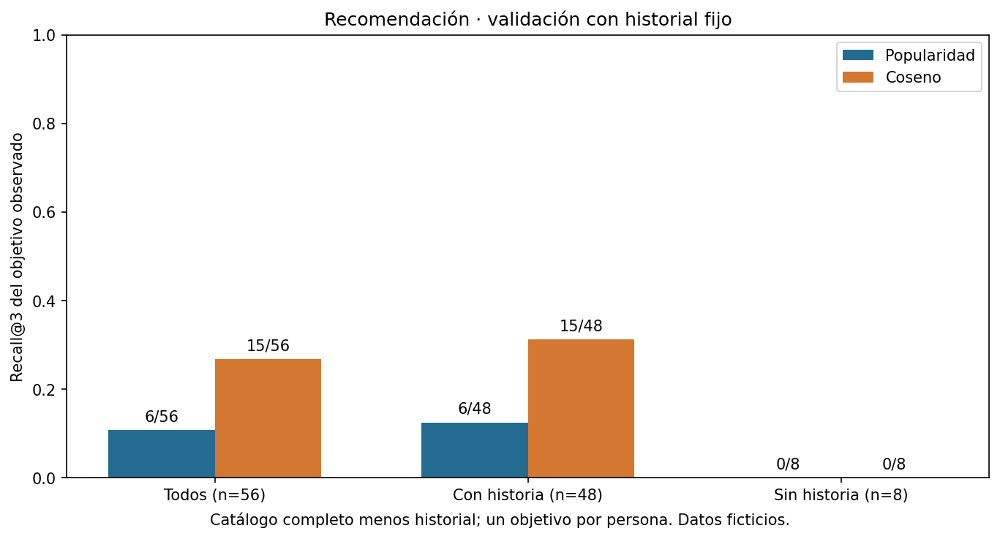
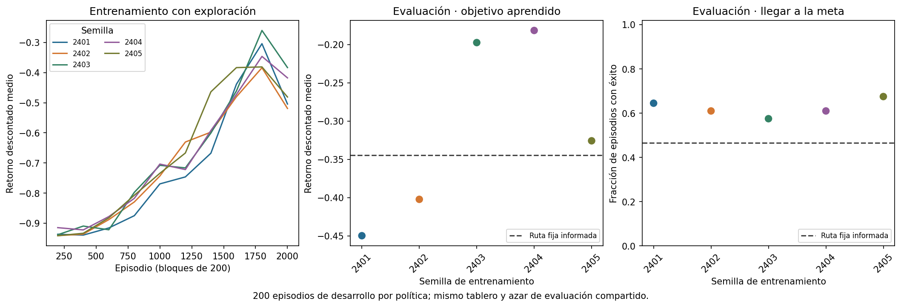
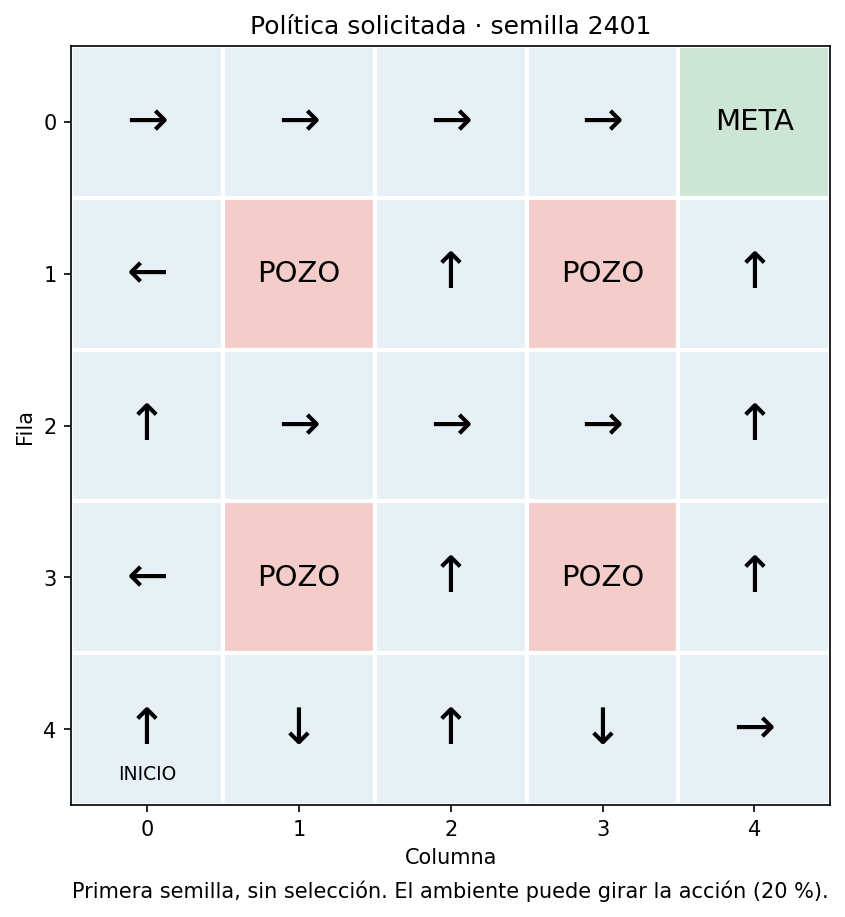

# Unidad 24 — Introducción a recomendación y aprendizaje por refuerzo

[Índice del curso](../README.md) · [Anterior: series temporales](../unidad23-series-temporales/README.md)

Un catálogo educativo necesita ordenar recursos para cada persona. Un agente simulado necesita decidir movimientos que conduzcan a una meta. En el primer caso evaluamos una lista con interacciones observadas; en el segundo, las acciones cambian las experiencias futuras. Esta unidad contiene **dos prácticas independientes**. No construye un recomendador que experimente con personas mediante refuerzo.

**Pregunta guía:** ¿qué significa mejorar respecto a una referencia y qué información permite comprobarlo en cada problema?

## Objetivos y preparación

Al terminar podrás:

- Construir un ranking sencillo con popularidad y similitudes entre elementos, excluyendo la historia conocida.
- Calcular Recall@K y NDCG@K con un objetivo observado y explicar sus límites.
- Distinguir usuarios nuevos, elementos nuevos y ausencia de evidencia de interés.
- Identificar estado, acción, transición, recompensa, política y retorno.
- Ejecutar una actualización Q, separar exploración de evaluación y tratar correctamente terminales y cortes.
- Comparar varias semillas sin escoger la más favorable y recargar estados para un cierre sin reajuste.

Prerrequisitos: vectores y matrices de la [Unidad 3](../unidad03-matematica-aplicada/README.md), estados y acciones de la [Unidad 5](../unidad05-busqueda-heuristicas/README.md), separación y evaluación de las [unidades 16](../unidad16-validacion-hiperparametros/README.md) y [17](../unidad17-metricas-decisiones/README.md). Tiempo orientativo: dos sesiones de 2–3 horas, más el reto.

Desde la raíz del repositorio, con el entorno virtual activo:

```bash
python -m pip install -r unidad24-recomendacion-refuerzo/requirements.txt
python unidad24-recomendacion-refuerzo/soluciones/03_calcular_a_mano.py
```

Se comprobaron Python 3.12.3, NumPy 2.2.6 y Matplotlib 3.10.8 reutilizando el entorno registrado en la [Unidad 20](../unidad20-pytorch/recursos/entorno-verificado.txt). Esta unidad solo necesita las dos bibliotecas de su [archivo de requisitos](requirements.txt): CPU, sin PyTorch, Gymnasium, descargas de modelos ni servicios. El generador de datos usa la biblioteca estándar. Las prácticas pequeñas no necesitan GPU.

## 1. Recomendación: ordenar candidatos

Predecir una valoración de 1 a 5 y recomendar tres elementos son tareas distintas. Un ranking necesita un conjunto de candidatos, una puntuación para ordenarlos y una regla de desempate. La puntuación no tiene que ser una probabilidad ni una valoración interpretable.

Usaremos interacciones implícitas ficticias: «esta persona abrió este recurso». No sabemos si aprendió, si quedó satisfecha, cuánto vio o qué otros recursos le habrían gustado. Un cero en la matriz significa **interacción no observada**, no «no le gusta».

Un recomendador basado en contenido usaría características del recurso, como su tema o texto. Aquí usamos **filtrado colaborativo entre elementos**: recursos abiertos por personas en común tendrán mayor similitud. Los temas del catálogo solo ayudan a explicar la construcción sintética; no entran al cálculo.

Sea X una matriz usuario×elemento, con 1 si existe una interacción de entrenamiento y 0 si no. Dos columnas i y j tienen similitud:

```text
sim(i,j) = producto_escalar(X[:,i], X[:,j]) / (norma_i × norma_j)
puntuación(u,i) = suma de sim(i,j) para cada j del historial de u
```

Si una norma es cero, fijamos la similitud en cero. La diagonal se anula y los elementos ya vistos se excluyen de los candidatos. No recortamos vecinos en este ejemplo. Dos columnas A=(1,1,0) y B=(1,0,1) comparten una persona: producto=1, normas=√2 y similitud=0,5. La idea de relacionar elementos por patrones de interacción se desarrolla en el trabajo de [Sarwar y colaboradores](https://grouplens.org/site-content/uploads/Item-Based-WWW-2001.pdf); nuestra práctica es una adaptación binaria pequeña, no una reproducción de sus experimentos de valoraciones.

**Referencia de popularidad:** ordenar por número de usuarios de entrenamiento que abrieron el recurso. Para ambas opciones se desempata por popularidad descendente y luego ID ascendente. Una persona sin historia recibe popularidad. Un elemento sin interacciones tiene similitud cero: el método no puede deducir su contenido.

## 2. Qué medimos en una lista

Hay exactamente un objetivo observado por persona y partición. Para una lista de tres:

```text
Recall@3 = 1 si el objetivo observado está en la lista; 0 en otro caso.
NDCG@3 = 1/log2(posición + 1) si aparece; 0 si no aparece.
```

La posición empieza en 1. Con lista `[B,C,D]` y objetivo C: Recall@3=1 y NDCG@3≈0,630930. El ranking ideal colocaría el único objetivo en primer lugar, de modo que su DCG ideal vale 1. Si hubiera varios objetivos, cambiarían tanto el denominador de recall como el DCG ideal: esta función no implementa ese caso general.

Promediamos por usuario, dando el mismo peso a cada uno. Con un único objetivo, Recall@3 coincide con HitRate@3. Una precisión calculada solo con esa etiqueta no podría superar 1/3; no describe la relevancia desconocida de los otros recursos. La cobertura es el número de elementos distintos recomendados dividido entre los 26 del catálogo. Más cobertura tampoco garantiza más utilidad.

No muestreamos «negativos»: ordenamos todo el catálogo disponible menos la historia de entrenamiento. Esto conserva 22 candidatos por usuario conocido y 26 por usuario nuevo. La evaluación sigue siendo incompleta: las interacciones observadas dependen de lo que se mostró y de las oportunidades de acceso. No demuestra que recomendar la lista cause más aprendizaje.

## 3. Laboratorio A — Recomendar recursos ficticios

Lee primero la [procedencia](datos/README.md) y el [protocolo fijado](datos/protocolo.md). Los datos contienen 26 recursos y 56 usuarios ficticios, con 192 interacciones de entrenamiento, 56 de validación y 56 de prueba. Hay ocho usuarios sin historia y un elemento nuevo I26. Los cortes son por fecha global; no mezclamos interacciones futuras en la matriz.

Antes de ejecutar, anticipa qué ocurrirá con los usuarios nuevos y con I26:

```bash
python unidad24-recomendacion-refuerzo/ejemplos/01_recomendar_recursos.py
python unidad24-recomendacion-refuerzo/ejemplos/01_recomendar_recursos.py --salida resultados/u24/recomendacion --graficos
```

El [código común](ejemplos/recomendacion_curso.py) sigue cuatro pasos: `ajustar` construye la matriz solo con entrenamiento; `recomendar` obtiene candidatos y puntúa; `evaluar` compara listas y objetivos; `seleccionar` elige por Recall@3 de validación. Un empate favorece popularidad. El programa normal no abre el CSV de prueba.

Resultados comprobados de validación:

| Método | Aciertos / usuarios | Recall@3 | NDCG@3 | Cobertura |
|---|---:|---:|---:|---:|
| Popularidad | 6/56 | 0,1071 | 0,0738 | 7/26 |
| Coseno | 15/56 | 0,2679 | 0,2105 | 23/26 |



Coseno gana globalmente, pero los 15 aciertos pertenecen a los 48 usuarios con historia. **Ambos métodos obtienen 0/8 entre usuarios nuevos**. Además, ninguno recupera los dos objetivos I26 de validación. El desempate por popularidad ayuda a definir la salida, no resuelve el arranque en frío. Consulta las listas y fallos por usuario en el [informe completo](recursos/recomendacion/informe.json).

El estado guarda catálogo ordenado, historiales, popularidad, similitudes, reglas y método seleccionado. La recarga comprueba todas las listas de validación, incluidos los usuarios nuevos. No guarda una supuesta preferencia real de las personas.

Después de escribir tu interpretación de validación, abre el cierre con **el estado ya guardado**:

```bash
python unidad24-recomendacion-refuerzo/ejemplos/01_recomendar_recursos.py --evaluar-prueba --modelo resultados/u24/recomendacion/modelo.json --salida resultados/u24/recomendacion
```

El [cierre publicado](recursos/recomendacion/cierre.json) obtiene 14/56 aciertos, Recall@3=0,25 y NDCG@3=0,2034. Los ocho usuarios nuevos siguen con cero aciertos. No se reajusta con validación: el historial sigue siendo el del 1–4 de septiembre. Un recurso observado el día 5 continúa siendo candidato en la evaluación del día 6. Esta pregunta de historial fijo difiere de un sistema que actualiza recomendaciones diariamente; cambiarla requiere otro protocolo.

### Experimenta A

- Con el estado de desarrollo, calcula manualmente una recomendación de U01 y otra de un usuario desconocido. Explica el desempate.
- Cambia K solo en una copia de tu experimento y compara cobertura y recall de validación. No presentes ese K como fijado antes de observar resultados.
- Diseña una referencia basada en los temas para I26. Primero necesitarías metadatos informativos: la etiqueta «nuevo» no explica contenido. No uses objetivos de evaluación para inventarlos.

## 4. Refuerzo: aprender de consecuencias

En aprendizaje supervisado disponíamos de pares entrada–respuesta. Aquí el agente selecciona una acción, observa una consecuencia y recibe una recompensa. Sus acciones influyen en qué estados visitará. Una recompensa inmediata puede ser pobre aunque prepare un buen resultado posterior.

| Concepto | En esta práctica |
|---|---|
| Estado s | Posición (fila, columna), codificada como `5*fila + columna` |
| Acción a | Solicitar arriba, derecha, abajo o izquierda |
| Transición | Moverse, girar al azar, o quedarse si choca con un borde |
| Recompensa r | +1 en meta, −1 en pozo, −0,04 en otros pasos |
| Política π | Regla para elegir una acción en cada estado |
| Episodio | Desde inicio hasta meta, pozo o límite externo |
| Retorno G | Suma de recompensas futuras, aquí con descuento γ=0,95 |

Para recompensas r₁, r₂, …, el retorno desde inicio es `G = r₁ + γ*r₂ + γ²*r₃ + …`. Cada paso de retraso reduce el peso de lo que llega después. El informe también conserva la suma sin descuento, para distinguir objetivos. La tasa de éxito cuenta metas y no mide duración ni costo.

El simulador tiene un tablero fijo:

```text
. . . . M
. P . P .
. . . . .
. P . P .
I . . . .
```

I=inicio, M=meta, P=pozo. Desde una casilla no terminal se ejecuta la acción pedida con probabilidad 0,8; se gira 90° a la izquierda con 0,1 y a la derecha con 0,1. Un borde conserva la posición. La posición es suficiente para describir la transición y recompensa del siguiente paso: el entorno es estacionario y cumple aquí la propiedad de Markov. El mapa y las recompensas los definimos nosotros; el agente aprende una tabla a partir de transiciones, sin usar un planificador del mapa.

La referencia sí conoce el tablero: sube hasta la fila superior y después avanza a la derecha. Es sencilla, pero el ruido puede desviarla a un pozo. El episodio termina al entrar en meta o pozo y no añade el costo −0,04 a esa recompensa terminal.

## 5. Q-learning, paso a paso

Q(s,a) aproxima el retorno esperado de tomar a en s y continuar con buenas decisiones. Inicializamos las 25×4 entradas en cero. Tras observar `(s,a,r,siguiente)`:

```text
objetivo = r + γ * máximo_a Q(siguiente,a)    si no es terminal
objetivo = r                                si es terminal
Q(s,a) ← Q(s,a) + α * (objetivo - Q(s,a))
```

α controla cuánto cambia la estimación en cada paso. Para un ejemplo manual distinto del entrenamiento completo: Q=0,2, r=−0,04, máximo siguiente=0,8, α=0,5 y γ=0,9. El objetivo es 0,68 y el nuevo Q=0,44. Si la transición acaba en pozo con r=−1, el objetivo es −1 y el nuevo Q=−0,4, cualquiera que sea el valor de la fila terminal.

Durante entrenamiento, una política ε-greedy elige una acción uniforme con probabilidad ε; en otro caso elige una de las de Q máximo. Esto permite explorar acciones todavía poco conocidas. Q-learning usa el máximo en el objetivo incluso si la siguiente acción exploratoria fuera otra: aprende una política distinta de la conducta exploratoria, por eso se describe como *off-policy*. El artículo original de [Watkins y Dayan](https://www.gatsby.ucl.ac.uk/~dayan/papers/cjch.pdf) estudia su convergencia bajo condiciones específicas. Nuestro presupuesto finito, α constante y cinco semillas **no constituyen una demostración de optimalidad**.

El límite de 60 pasos es un **corte externo**, no una muerte ni una meta del problema subyacente. Al cortar, detenemos la simulación del episodio, pero la última actualización conserva el valor futuro. La evaluación solo suma recompensas hasta el corte y reporta truncamientos. Esta distinción coincide con la explicación de [terminales y truncamientos de Gymnasium](https://gymnasium.farama.org/tutorials/gymnasium_basics/handling_time_limits/), aunque nuestro código no usa esa biblioteca. Si el plazo fuera parte de la tarea, habría que representar el tiempo restante en el estado y definir el terminal correspondiente.

## 6. Laboratorio B — Aprender una política simulada

Predice si una mayor tasa de éxito implica necesariamente mayor retorno. Después ejecuta:

```bash
python unidad24-recomendacion-refuerzo/ejemplos/02_aprender_politica.py
python unidad24-recomendacion-refuerzo/ejemplos/02_aprender_politica.py --salida resultados/u24/refuerzo --graficos
```

El [módulo de refuerzo](ejemplos/refuerzo_curso.py) separa `transicion`, `valor_actualizado`, `entrenar` y `evaluar`. Cada una de las semillas 2401–2405 entrena 2000 episodios con α=0,15 y γ=0,95. ε baja linealmente de 1 a 0,05 durante 1500 episodios; permanece en 0,05 hasta el final. Ambiente y exploración usan generadores separados. No elegimos la mejor época ni descartamos semillas. El consumo observado fue de 21628 a 23468 transiciones por entrenamiento, por debajo del máximo de 120000.

En evaluación, las acciones toman el primer máximo de Q, sin ε ni actualizaciones. Se mantiene el ruido de transición. Todas las políticas usan los mismos 200 valores de semilla de desarrollo (30000–30199); no por ello recorren las mismas casillas. Semilla y versión fijadas permiten repetir esta práctica, no prometen resultados idénticos con cualquier versión futura.

| Política | Éxito en desarrollo | Retorno descontado | Pozo | Truncamiento |
|---|---:|---:|---:|---:|
| Ruta fija | 0,465 | −0,3445 | 0,535 | 0 |
| Q, semilla 2401 | 0,645 | −0,4499 | 0,320 | 0,035 |
| Q, semilla 2402 | 0,610 | −0,4023 | 0,390 | 0 |
| Q, semilla 2403 | 0,575 | −0,1975 | 0,415 | 0,010 |
| Q, semilla 2404 | 0,610 | −0,1817 | 0,385 | 0,005 |
| Q, semilla 2405 | 0,675 | −0,3258 | 0,325 | 0 |



La media entre entrenamientos es éxito 0,623 y retorno −0,3114, con desviaciones poblacionales 0,0341 y 0,1072. **Dos semillas empeoran el objetivo de retorno frente a la ruta fija**, aunque llegan más veces a la meta. Las políticas Q usan en promedio 15,907 pasos por episodio frente a 6,8 de la referencia; ese promedio incluye fracasos y cortes, no solo rutas exitosas. No interpretes la dispersión entre cinco tablas como un intervalo de confianza.



Las flechas representan acciones solicitadas, no movimientos garantizados. En (1,0), por ejemplo, la semilla 2401 pide izquierda: suele quedarse contra el borde y solo avanza con algún giro. Ese comportamiento reduce ciertas exposiciones al pozo, pero acumula costo y retraso. El dibujo muestra la primera semilla por protocolo, sin seleccionarla por resultados. La curva de la izquierda corresponde al entrenamiento con exploración; no debe leerse como rendimiento de una política fija.

El estado JSON conserva las cinco tablas, orden de acciones, mapa, ruido, recompensas y configuración. La recarga verifica igualdad de tablas y de todos los episodios de desarrollo. Para el cierre:

```bash
python unidad24-recomendacion-refuerzo/ejemplos/02_aprender_politica.py --evaluar-prueba --modelo resultados/u24/refuerzo/modelo.json --salida resultados/u24/refuerzo
```

El [cierre publicado](recursos/refuerzo/cierre.json) usa semillas 40000–40199, sin volver a entrenar. La ruta fija obtiene éxito 0,520 y retorno −0,2737. Las cinco tablas promedian éxito 0,635 y retorno **−0,2969**, con desviaciones 0,0751 y 0,0689. Por tanto, la mejora media de retorno observada en desarrollo **no se conserva en cierre**. No se cambian recompensas, semillas ni presupuesto para ocultarlo. Este experimento no acredita una política óptima, seguridad en un robot ni generalización a tableros nuevos.

### Experimenta B

- Reproduce con `transicion` una acción sin giro, un giro y un choque contra el borde.
- En una copia del experimento, evalúa la ruta fija con `prob_giro=0`: llega en ocho pasos, suma 0,72 sin descuento y tiene retorno descontado aproximado 0,4570. Esto cambia el ambiente, no mejora el agente entrenado.
- Diseña un nuevo protocolo para α decreciente o más episodios. Usa otras semillas de desarrollo y reserva otro cierre antes de calcular resultados. No reutilices el cierre publicado para seleccionar cambios.

## 7. Errores frecuentes

| Error | Consecuencia y corrección |
|---|---|
| Incluir validación en la similitud | El objetivo ayuda a construir su propia recomendación; ajustar solo con entrenamiento |
| Tratar recursos no abiertos como rechazo comprobado | Confunde ausencia de evidencia con preferencia negativa; declarar observación incompleta |
| Eliminar del cierre recursos vistos en validación sin cambiar el protocolo | Cambia candidatos y pregunta; mantener historial fijo o rediseñar explícitamente |
| Usar éxito como único criterio de refuerzo | Oculta costo, retraso y cortes; informar también el retorno que se aprende |
| Anular el valor futuro en todo final de bucle | Confunde truncamiento con terminal; usar la condición del entorno |
| Evaluar con ε o actualizaciones | Mezcla aprendizaje con medición; mantener tablas fijas |
| Publicar solo la mejor semilla | Oculta variabilidad; conservar las cinco y sus episodios |
| Concluir que el curso ya terminó | Esta unidad cierra un bloque, no las 36 unidades previstas |

## 8. Ejercicios, reto y comprobación

1. Distingue predecir una valoración y ordenar tres candidatos. ¿Qué expresa un cero en X?
2. Calcula el coseno de A=(1,1,0) y B=(1,0,1). ¿Qué harías con C=(0,0,0)?
3. Para lista `[B,C,D]`, calcula Recall@3 y NDCG@3 con objetivos B, C, D y E.
4. Explica el fallo en usuarios nuevos e I26. ¿Qué información adicional sería útil?
5. Reconstruye las candidaturas de U01 en validación y cierre. ¿Por qué no agregamos el objetivo del día 5 al historial?
6. Define estado, acción, recompensa y retorno en el tablero. ¿Qué cambia al golpear un borde?
7. Reproduce las actualizaciones Q=0,44 y Q=−0,4 del ejemplo manual.
8. Explica cómo actualizarías al llegar al paso 60 sin terminal y cómo cambiaría una tarea con plazo propio.
9. Compara éxito y retorno para la semilla 2401 y la ruta fija. ¿Cuál cumple mejor cada criterio?
10. Redacta una conclusión que incluya el cierre de ambos laboratorios y una limitación distinta para cada uno.

Consulta las [soluciones razonadas](soluciones/README.md) después de intentarlo. El [reto](reto.md) incluye una rúbrica de 100 puntos; usa la [plantilla de informe](plantillas/informe_aplicaciones.md) y contrasta con las [fichas completadas](recursos/fichas.md).

```bash
python -m unittest discover -s unidad24-recomendacion-refuerzo/pruebas -v
python herramientas/verificar_curso.py
```

Las 44 pruebas contrastan coseno con conjuntos de usuarios, métricas manuales, candidatos, cortes y datos regenerados; transiciones, actualización Q, truncamiento, azar, evaluación sin aprendizaje y recarga. El verificador general requiere el entorno completo explicado en el [índice](../README.md).

Antes de continuar, comprueba que puedes explicar un fallo de arranque en frío, reconstruir una actualización Q y rechazar la afirmación «mayor éxito siempre significa mejor política». La siguiente unidad prevista es la **25 — Transformers y modelos generativos**, pendiente de desarrollo.
