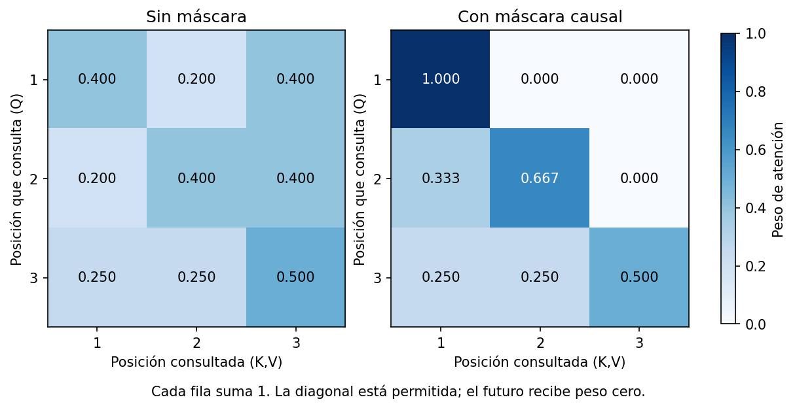
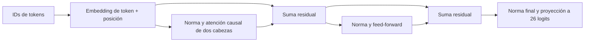
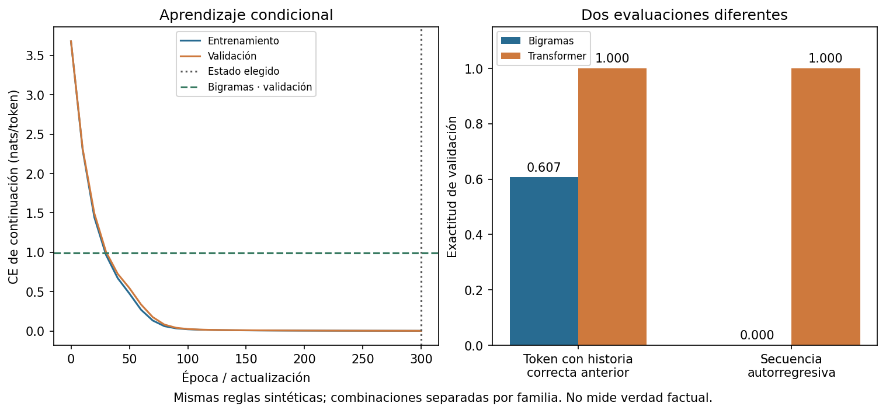
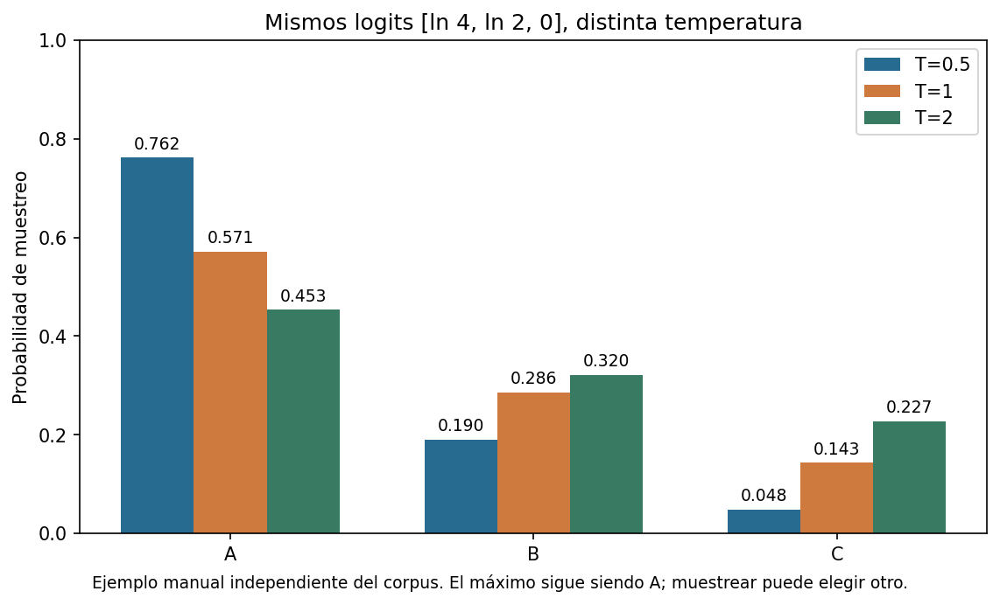

# Unidad 25 — Transformers y modelos generativos

[Índice](../README.md) · [Anterior: recomendación y refuerzo](../unidad24-recomendacion-refuerzo/README.md)

Un generador de texto elige un token, lo añade al contexto y vuelve a predecir. Para estudiar ese proceso sin descargar un gran modelo, construiremos un transformer pequeño que completa instrucciones de un lenguaje artificial. Antes calcularemos una atención a mano y comprobaremos que ninguna posición puede consultar el futuro.

**Pregunta guía:** ¿cómo transforma el contexto en predicciones un transformer y qué podemos concluir cuando sus continuaciones parecen correctas?

## Objetivos y preparación

Al terminar podrás:

- Distinguir token, embedding, posición, atención, arquitectura, entrenamiento y decodificación.
- Calcular una atención escalada, aplicar su máscara y leer las dimensiones de una implementación.
- Entrenar un generador condicional pequeño frente a una referencia de bigramas.
- Separar la evaluación con historia correcta de la generación autorregresiva.
- Interpretar entropía cruzada, perplejidad, coincidencia exacta, temperatura y criterios de parada.
- Recargar un modelo completo y explicar por qué seguir una plantilla no demuestra conocimiento factual.

Prerrequisitos: [redes neuronales](../unidad19-redes-neuronales/README.md), [PyTorch](../unidad20-pytorch/README.md), [lenguaje natural](../unidad22-lenguaje-natural/README.md) y criterios de separación de la [Unidad 16](../unidad16-validacion-hiperparametros/README.md). Tiempo orientativo: 5–7 horas con ejercicios, más el reto.

Desde la raíz del repositorio, con un entorno virtual activo:

```bash
python -m pip install -r unidad25-transformers-generativos/requirements.txt
python -m pip install -r unidad25-transformers-generativos/requirements-cpu.txt
```

Se comprobaron Python 3.12.3, NumPy 2.2.6, Matplotlib 3.10.8 y PyTorch 2.14.1+cpu, reutilizando el [entorno de la Unidad 20](../unidad20-pytorch/recursos/entorno-verificado.txt), sin paquetes nuevos. La instalación inicial de PyTorch necesita Internet y espacio en disco; después, los ejemplos trabajan en CPU sin red, cuentas, claves, servicios ni modelos descargables. La ruta CPU indicada se verificó en Linux x86_64; no presupone compatibilidad idéntica con cualquier plataforma.

## 1. Tres decisiones distintas

| Decisión | Pregunta | Elección de esta unidad |
|---|---|---|
| Arquitectura | ¿Qué operaciones producen las puntuaciones? | Un bloque transformer causal con dos cabezas |
| Objetivo de entrenamiento | ¿Qué error se reduce al aprender? | Entropía cruzada del siguiente token de la continuación |
| Decodificación | ¿Cómo elegimos un token al usar el modelo? | Máximo codicioso o muestreo con temperatura |

Cambiar temperatura no reentrena pesos. Un transformer también puede usarse para clasificación u otras tareas, y existen modelos generativos que no son transformers. Aquí «generativo» significa construir una secuencia según distribuciones aprendidas; no garantiza que el contenido sea verdadero, nuevo o útil.

El trabajo [Attention Is All You Need](https://arxiv.org/abs/1706.03762) presentó una arquitectura con encoder y decoder. Un encoder representa una entrada; un decoder genera una salida y puede consultar representaciones del encoder. Nuestra simplificación usa solo un bloque causal de tipo decoder, sin atención cruzada ni encoder separado. No reproduce la arquitectura, escala ni resultados del artículo.

## 2. Tokens, embeddings y posiciones

Un token es una unidad del vocabulario. En esta práctica dividimos por espacios: `agua norte bajo .` contiene cuatro tokens; `bajo.` sería otro token. No convertimos mayúsculas ni usamos subpalabras. El vocabulario se ajusta exclusivamente con entrenamiento y tiene 26 entradas, incluidas:

- `BOS`: inicio de documento.
- `EOS`: fin de documento, que sí debe aprender a predecir.
- `PAD`: relleno para igualar longitudes del lote; no es un objetivo.
- `UNK`: palabra fuera del vocabulario. Sustituirla por este ID pierde su identidad.

Los IDs no expresan cercanía semántica. Un embedding es una fila aprendida de una tabla de números; aquí tiene dimensión 32. Se suma un vector de posición aprendido para distinguir dónde aparece cada token. Solo disponemos de 24 posiciones: el programa rechaza entradas más largas, sin recortar silenciosamente.

Nuestro corpus enseña a copiar campos dentro de dos plantillas. Por ejemplo:

```text
Prefijo:      tema agua zona norte nivel bajo formato breve salida
Continuación: agua norte bajo .
```

La combinación tema–zona–nivel define una familia. Sus versiones breve y detallada permanecen en la misma partición. Hay 32/8/8 familias, equivalentes a 64/16/16 documentos de entrenamiento, validación y prueba. Las reglas son comunes a las tres particiones: evaluamos combinaciones reservadas dentro de una misma gramática, no transferencia a lenguaje libre. Consulta la [procedencia](datos/README.md) y el [protocolo](datos/protocolo.md).

## 3. Atención: una mezcla dependiente del contexto

Una posición produce una consulta Q; las posiciones disponibles ofrecen claves K y valores V. El producto de consulta y clave determina pesos, y esos pesos mezclan valores:

```text
puntuaciones = Q @ K.T / sqrt(d_cabeza)
pesos = softmax(puntuaciones + máscara, por fila)
contexto = pesos @ V
```

La máscara añade −infinito a posiciones futuras antes de softmax, de modo que reciben peso cero. Cada fila permitida suma uno. La posición actual sí puede consultarse: su salida predice el **siguiente** token. No equivale a mirar la respuesta futura. La máscara de relleno también excluye las claves PAD.

### Ejemplo manual de tres posiciones

Elegimos matrices para que el cálculo sea legible; no proceden de un modelo entrenado:

```text
Q = sqrt(2) × [[1,0], [0,1], [1,1]]
K = ln(2)   × [[1,0], [0,1], [1,1]]
V =            [[2,0], [0,2], [2,2]]
```

Para la segunda posición, las puntuaciones escaladas son `[0, ln(2), ln(2)]`. La tercera es futura y queda prohibida. Los exponentes permitidos son `[1,2,0]`, sus pesos `[1/3,2/3,0]` y la salida es `(1/3)[2,0]+(2/3)[0,2]=[2/3,4/3]`. La primera posición solo puede usar V₁; la tercera obtiene pesos `[1/4,1/4,1/2]` y salida `[1.5, 1.5]`, con punto decimal como en Python.

## 4. Laboratorio A — Comprobar causalidad

Predice qué salidas anteriores cambiarían al sustituir V₃ por `[100,−100]`. Después ejecuta:

```bash
python unidad25-transformers-generativos/ejemplos/01_entender_atencion.py
python unidad25-transformers-generativos/ejemplos/01_entender_atencion.py --salida resultados/u25/atencion --graficos
python unidad25-transformers-generativos/soluciones/03_atencion_y_temperatura.py
```

[atencion.py](ejemplos/atencion.py) calcula pesos y salidas con NumPy float64. Se contrasta tanto con el cálculo manual como con [`scaled_dot_product_attention`](https://docs.pytorch.org/docs/2.14/generated/torch.nn.functional.scaled_dot_product_attention.html) de PyTorch, con `is_causal=True` y `dropout_p=0`. El error máximo es menor que 1e−12.



Cambiar el valor futuro modifica las salidas anteriores en **0** con máscara y hasta **40,8** sin ella. No basta con comprobar el tamaño del tensor: hay que verificar esta dependencia. Las pruebas también cambian un sufijo de tokens del transformer completo y comprueban que sus logits anteriores permanecen iguales; los gradientes desde una salida anterior hacia embeddings de posiciones futuras son cero.

En un modelo entrenado, un peso de atención indica una contribución a esa mezcla interna. No es por sí solo una explicación causal de una respuesta ni una medida de verdad de la palabra atendida.

### Experimenta A

- Reconstruye la primera y tercera filas a mano.
- En una copia, elimina el factor `sqrt(d_cabeza)` y observa cómo cambian los pesos; no lo confundas con cambiar la máscara.
- Cambia únicamente un valor futuro y comprueba las dos primeras salidas. Luego cambia un valor pasado: esa modificación sí puede afectar posiciones posteriores.

## 5. Del mecanismo al bloque transformer

El modelo del [segundo laboratorio](ejemplos/transformer_curso.py) aprende las proyecciones Q, K y V. Sus dos cabezas usan subespacios de 16 dimensiones; cada una mezcla valores y ambas salidas se concatenan y proyectan a dimensión 32. Una red feed-forward actúa por posición, con tamaño 32→64→32 y GELU. Las conexiones residuales suman la entrada de cada subcapa con su transformación; LayerNorm normaliza las características de cada posición. En nuestra variante se aplica antes de cada subcapa, más una normalización final.



Las dimensiones ayudan a detectar errores:

| Tensor | Forma con lote B y longitud T |
|---|---|
| IDs | B×T |
| Embeddings y salidas del bloque | B×T×32 |
| Q, K, V por cabeza | B×2×T×16 |
| Puntuaciones y pesos de atención | B×2×T×T |
| Logits de siguiente token | B×T×26 |

Hay **11066 parámetros**. No compartimos pesos de embedding y salida, ni usamos dropout. El tamaño de la matriz de atención crece con T² por cabeza; duplicar contexto cuadruplica sus celdas, aunque no todo el costo del modelo sea esa matriz. Esta implementación prioriza visibilidad del cálculo, sin caché KV ni optimizaciones de inferencia.

## 6. Objetivo y referencia

Desplazamos entradas y objetivos una posición. Para una secuencia muy corta:

```text
Secuencia: BOS ... salida agua norte bajo . EOS
Entrada:   BOS ... salida agua norte bajo .
Objetivo:      ...        agua norte bajo . EOS
```

El prefijo lo proporciona la tarea. La pérdida empieza en la salida del token `salida`, que debe predecir `agua`, y termina al predecir EOS. Las predicciones internas de los demás tokens del prefijo y de PAD quedan fuera de la pérdida. Tampoco se mezclan documentos en una misma secuencia.

Con *teacher forcing* cada posición recibe la historia correcta anterior. La máscara impide ver su objetivo o lo que lo sigue. Por eso se pueden calcular en paralelo las predicciones de las posiciones de un documento durante entrenamiento, aunque la generación necesite construir la continuación paso a paso.

**Entropía cruzada (CE):** media de `−ln(probabilidad del token correcto)` sobre todos los objetivos válidos. Si la probabilidad es 2/3, la pérdida es 0,405465 nats. **Perplejidad:** `exp(CE)`; en ese ejemplo vale 1,5. Es interpretable solo con vocabulario, tokenización, objetivos y conjunto de evaluación comparables. No es un porcentaje de error ni de verdad.

La [función de pérdida de PyTorch](https://docs.pytorch.org/docs/2.14/generated/torch.nn.CrossEntropyLoss.html) recibe logits e índices de clase; el código selecciona las posiciones válidas antes de llamarla. Son 448 objetivos en entrenamiento y 112 en cada evaluación. Los documentos detallados aportan nueve objetivos frente a cinco de los breves: esta CE pondera tokens, no documentos por igual.

**Referencia de bigramas:** aprende `P(siguiente | token anterior)` contando las mismas transiciones objetivo, con suavizado aditivo 0,1 sobre las 26 salidas posibles. Solo recuerda un token. Tras `salida` no puede recuperar el tema, zona o formato que estaban antes. No impone restricciones de gramática; comparte vocabulario y criterios de parada con el transformer.

## 7. Laboratorio B — Aprender y generar continuaciones

Antes de ejecutar, lee qué se fijó en el [protocolo](datos/protocolo.md): modelo, semilla 2501, 300 épocas, un lote completo por época, Adam con lr=0,003 y recorte de norma de gradiente a 1. Son 300 actualizaciones. Se evalúa época 0 y cada diez; se conserva el estado con menor CE de validación, con desempate por época anterior. Luego se compara con bigramas por la misma CE; empate favorece la referencia.

```bash
python unidad25-transformers-generativos/ejemplos/02_generar_secuencias.py
python unidad25-transformers-generativos/ejemplos/02_generar_secuencias.py --salida resultados/u25/generacion --graficos
```

El programa normal no abre prueba. Resultados comprobados:

| Método | CE entrenamiento | CE validación | Perplejidad validación | Exactitud por token | Continuaciones exactas |
|---|---:|---:|---:|---:|---:|
| Bigramas | 0,9180 | 0,9881 | 2,6861 | 0,6071 | 0/16 |
| Transformer, época 300 | 0,002606 | 0,002818 | 1,002822 | 1,0000 | 16/16 |



La referencia puede acertar conectores y EOS con historia correcta y, aun así, generar una continuación equivocada. Para el primer prefijo breve de validación, que pide `energia norte medio .`, genera `informe aire en este con nivel alto .`: cambia formato y campos. Una secuencia gramatical no necesariamente cumple la instrucción.

En este corpus fácil el transformer acierta todas las continuaciones de validación. El [informe completo](recursos/generacion/informe.json) conserva ambos candidatos, generaciones, errores y diagnósticos. No se seleccionó por el ejemplo más vistoso. El estado elegido está [guardado en JSON](recursos/generacion/modelo.json) con vocabulario, preparación, arquitectura y parámetros. Una huella de los logits tomados del modelo en memoria permite comprobar igualdad exacta después de recargar, además de comparar métricas y generaciones. El JSON no contiene Adam y no permite reanudar exactamente el entrenamiento.

Después de interpretar validación, abre el cierre desde el estado guardado:

```bash
python unidad25-transformers-generativos/ejemplos/02_generar_secuencias.py --evaluar-prueba --modelo resultados/u25/generacion/modelo.json --salida resultados/u25/generacion
```

El [cierre publicado](recursos/generacion/cierre.json) conserva la misma huella del modelo: CE=0,002820, perplejidad=1,002824 y 16/16 continuaciones exactas en ocho familias reservadas, sin reajuste. Esas familias siguen las mismas reglas artificiales. Un sistema programado con las dos plantillas resolvería esta tarea directamente; entrenar sirve aquí para observar el mecanismo, no para justificar una red frente a reglas conocidas.

## 8. Decodificar: elegir y detenerse

En generación se recibe únicamente el prefijo. Se obtiene el último vector de logits, se elige un token, se añade a la historia y se repite. Cada error pasa a formar parte del contexto siguiente; el evaluador no introduce el token correcto para corregirlo.

- **Codicioso:** primer máximo del vector de logits. Es determinista con el mismo estado y entrada; una elección local no garantiza la secuencia global más probable.
- **Muestreo:** `softmax(logits / temperatura)`, seguido de una extracción de esa distribución. T>0. Subir T aplana las probabilidades; bajarla concentra masa en los máximos. No añade conocimiento ni garantiza creatividad o corrección.
- **Parada:** EOS, máximo de tokens nuevos, contexto agotado o emisión inválida de PAD/BOS. Los especiales inválidos se muestran como fallo; UNK también queda visible si se emite. Ningún corte se interpreta automáticamente como continuación completa.



Con logits `[ln(4), ln(2), 0]`, T=1 da probabilidades `[4/7,2/7,1/7]`; T=2 da pesos proporcionales a `[2,√2,1]`. El máximo sigue siendo el primero. La figura es un cálculo independiente del modelo entrenado. No hace falta observar textos distintos en cada par de muestras para que las probabilidades hayan cambiado.

Prueba el estado publicado, sin entrenamiento:

```bash
python unidad25-transformers-generativos/ejemplos/probar_generador.py
python unidad25-transformers-generativos/ejemplos/probar_generador.py --metodo muestreo --temperatura 1.3 --semilla 2502
python unidad25-transformers-generativos/ejemplos/probar_generador.py --max-nuevos 2
python unidad25-transformers-generativos/ejemplos/probar_generador.py --prefijo "tema oceano zona norte nivel bajo formato breve salida"
```

Para usar tu estado, añade `--modelo resultados/u25/generacion/modelo.json`. `--salida resultados/u25/muestra.json` conserva texto, parámetros de decodificación, motivo de parada y huella del modelo.

Los diagnósticos fijados comparan codicioso y muestreo con T=0,7 y T=1,3, reiniciando la semilla 2502 por caso. Aquí producen el mismo texto en cada caso: las distribuciones aprendidas son concentradas. No se buscaron semillas para fabricar diversidad. Ante `oceano`, la palabra se convierte en UNK y el modelo escribe **`suelo norte bajo .`**. Ante el prefijo incompleto `tema agua zona`, devuelve **`.`** y EOS. Se conservan ambos fallos; el modelo no declara por sí mismo que perdió información o recibió un formato distinto.

### Experimenta B

- Reproduce el corte con dos tokens nuevos y contrástalo con EOS.
- Escribe una palabra desconocida o cambia el uso de mayúsculas. Inspecciona `desconocidos_prefijo` antes de interpretar la respuesta.
- Cambia temperatura y semilla en un experimento exploratorio, conservando todos los resultados. No uses esas muestras para seleccionar de nuevo el estado tras abrir prueba.
- Propón un conjunto nuevo con reglas distintas o instrucciones incompletas y declara qué medirías. La coincidencia exacta de plantillas no evalúa conocimiento del mundo.

## 9. Límites y errores frecuentes

| Confusión | Corrección |
|---|---|
| «Un token siempre es una palabra» | Depende del tokenizador; aquí usamos espacios por simplicidad |
| «La diagonal de atención filtra la respuesta» | La posición actual predice la siguiente; importan el desplazamiento y la máscara |
| «PAD y EOS son intercambiables» | PAD rellena y se excluye; EOS es un objetivo de parada |
| «Alta exactitud por token asegura buenas secuencias» | Durante generación se usan errores propios; evaluar la secuencia completa |
| «Menor perplejidad demuestra verdad» | Mide probabilidad de tokens bajo un protocolo; no contrasta hechos |
| «Cambiar temperatura corrige desconocidos» | Modifica muestreo; no recupera información perdida en UNK |
| «16/16 demuestra comprensión general» | Son ocho familias de una gramática pequeña compartida con entrenamiento |
| «Repetir la semilla basta siempre» | Versiones, operaciones y plataforma también influyen; registrar el entorno |

El modelo no accede a documentos ni herramientas. No responde preguntas abiertas ni verifica afirmaciones. Fluidez, cumplimiento de una consigna, memorización y verdad son propiedades diferentes. La separación por familias evita compartir una combinación completa, pero no evita aprender las plantillas comunes; eso es precisamente el alcance de la práctica.

## 10. Ejercicios, reto y revisión

1. Distingue arquitectura, objetivo de entrenamiento y decodificación usando esta práctica.
2. Tokeniza `agua norte bajo .` y `Agua norte bajo.`. ¿Qué IDs serán desconocidos?
3. Reconstruye la segunda y tercera filas de atención y sus salidas.
4. Explica por qué se permite la diagonal al predecir siguiente token y qué falla sin máscara.
5. Calcula la forma de los pesos para B=16, dos cabezas y T=18. ¿Qué ocurre con sus celdas al duplicar T?
6. Marca los objetivos de pérdida de una instrucción breve y explica los 448 objetivos de entrenamiento.
7. Calcula CE y perplejidad de un token con probabilidad 2/3. ¿Por qué no compararlas entre tokenizaciones distintas sin más contexto?
8. Explica cómo bigramas acierta 60,71 % de tokens de validación y ninguna continuación completa.
9. Calcula probabilidades para `[ln(4),ln(2),0]` con T=1 y T=2; distingue muestreo y codicioso.
10. Interpreta los casos `oceano`, prefijo incompleto y corte de dos tokens, junto con el cierre 16/16.

Consulta las [soluciones](soluciones/README.md) después de intentarlo. El [reto](reto.md) tiene rúbrica de 100 puntos y [plantilla de informe](plantillas/informe_generativo.md). La [ficha completada](recursos/ficha_modelo.md) delimita el uso del modelo.

```bash
python -m unittest discover -s unidad25-transformers-generativos/pruebas -v
python herramientas/verificar_curso.py
```

Las **46 pruebas** cubren referencias manuales y de biblioteca, máscaras, dimensiones, gradientes causales, corpus y vocabulario, objetivos, bigramas, selección, temperatura, parada, generación sin aprendizaje y persistencia. El verificador general requiere el entorno acumulado indicado en el [índice](../README.md).

Antes de avanzar, comprueba que puedes detectar atención al futuro, explicar una diferencia entre teacher forcing y generación, y rechazar una conclusión de verdad basada solo en perplejidad. La siguiente unidad prevista es la **26 — Inferencia local y servicios: Ollama y APIs**, pendiente de desarrollo.
