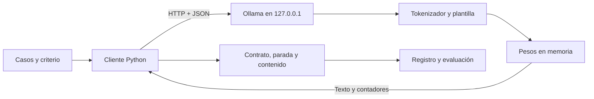
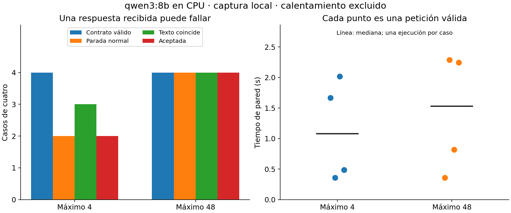

# Unidad 26 — Inferencia local y servicios: Ollama y APIs

[Índice del curso](../README.md) · [Unidad anterior](../unidad25-transformers-generativos/README.md) · [Datos y protocolo](datos/README.md) · [Soluciones](soluciones/README.md) · [Reto](reto.md)

## Pregunta central

¿Cómo ejecutar un modelo existente, medir su respuesta y manejar fallos sin confundir una petición exitosa con una respuesta correcta?

En la unidad anterior entrenaste un transformer pequeño. Ahora usarás pesos ya entrenados a través de un servicio. Aprenderás a distinguir cliente, servidor y modelo; comprobar una respuesta HTTP; medir recursos y conservar errores. El laboratorio principal incluye una **captura real de Ollama en CPU**. Puede analizarse sin instalar Ollama ni tener una clave de API.

## Al terminar podrás

1. Explicar qué cambia entre entrenamiento e inferencia, y entre servicio local y remoto.
2. Construir una solicitud JSON con parámetros explícitos e interpretar su respuesta.
3. Separar errores de conexión, de contrato, truncamiento y error de contenido.
4. Medir latencia y velocidad sin confundir unidades ni excluir silenciosamente los fallos.
5. Registrar modelo, versión, contexto, límites, casos y condiciones de ejecución.
6. Elegir una ruta acorde con memoria, datos, costos y necesidad de reproducibilidad.

Prerrequisitos: Python, JSON, funciones, excepciones y generación de la [Unidad 25](../unidad25-transformers-generativos/README.md). Dedicación orientativa: 4–6 horas más instalación opcional. La ruta básica usa **Python 3.12 y su biblioteca estándar**. Solo las figuras requieren Matplotlib y NumPy, ya usados en el curso.

## 1. Pesos, proceso y petición

**Entrenar** ajusta parámetros con datos y una función de pérdida. **Inferir** aplica parámetros existentes a entradas nuevas. El estado de conversación o una caché puede cambiar durante la inferencia; eso no significa que los pesos se estén entrenando.

Un archivo de pesos no escucha peticiones HTTP. Un **servidor** carga esos pesos, tokeniza entradas, genera salidas y responde. El **cliente** prepara la petición y valida lo recibido. Una **API** es el contrato que permite comunicarlos; también puede funcionar dentro de tu equipo.



| Aspecto | Pesos locales con Ollama | API remota |
|---|---|---|
| Dónde se calcula | Equipo que ejecuta el servidor | Infraestructura del proveedor |
| Preparación | Servidor, descarga y memoria suficientes | Cuenta, conectividad, modelo habilitado y credencial |
| Recursos | RAM/VRAM, disco, tiempo y electricidad propios | Límites, latencia de red y cargos según el servicio |
| Control | Versión, pesos y configuración registrados | Parámetros expuestos, revisiones y políticas del proveedor |
| Datos | Revisar logs, permisos y configuración local | Revisar datos enviados, retención y acceso |

Esta tabla describe las rutas del laboratorio. Un endpoint local puede actuar como puente a la nube: la dirección `localhost` por sí sola no demuestra ejecución local. Aquí se exige un modelo instalado y se comprueban sus metadatos. La [documentación de Ollama](https://docs.ollama.com/faq) distingue modelos locales y cloud. No se expone el servidor a la red.

## 2. La anatomía de una llamada

En una URL, `127.0.0.1` es el propio equipo, `11434` es el puerto y `/api/generate` es la ruta. `POST` envía una petición con cuerpo; `GET` consulta, por ejemplo, la versión. La cabecera `Content-Type: application/json` describe el formato. El estado HTTP y el cuerpo son piezas distintas.

Una petición mínima para un modelo **ya instalado**:

```json
{
  "model": "qwen3:8b",
  "prompt": "Calcula 17 + 25. Responde solo el número.",
  "stream": false,
  "think": false,
  "options": {"num_predict": 48, "num_ctx": 1024, "num_gpu": 0}
}
```

El [cliente del curso](ejemplos/servicios.py) completa los parámetros del experimento. `stream=false` solicita un objeto completo; con streaming habría que procesar fragmentos y posibles fallos a mitad de la transmisión. Aquí no se implementa streaming. `think=false` corresponde al modelo probado; otros modelos o versiones pueden admitir controles diferentes. Consulta la [API de generación](https://docs.ollama.com/api/generate).

No se necesita un SDK para entender HTTP: usamos `urllib.request`, `json` y excepciones de Python. Un SDK puede simplificar un proyecto mayor, pero sus propiedades auxiliares no siempre aparecen igual en el JSON recibido por HTTP.

Tres preguntas separadas:

1. **Transporte:** ¿hubo respuesta HTTP satisfactoria y JSON legible?
2. **Contrato y parada:** ¿están los campos esperados y la generación terminó normalmente?
3. **Contenido:** ¿cumple el criterio que fijamos para este caso?

`done=true` significa que la generación terminó, incluso si agotó su límite. En la captura, `done_reason="length"` identifica ese corte. Nuestro criterio exige `stop` y coincidencia exacta después de quitar espacios exteriores. Una respuesta puede cumplir el contrato, estar finalizada y ser incorrecta.

## 3. Límites, recursos y unidades

El contexto contiene tokens de entrada, plantilla y generación. Los tokens no equivalen a palabras: cuatro palabras pueden necesitar más de cuatro tokens. `num_ctx` configura una ventana; no mide lo utilizado ni amplía mágicamente lo aprendido por el modelo. `num_predict` limita salida. Semilla y temperatura quedan registradas; temperatura cero no garantiza igualdad entre plataformas. Consulta los [parámetros de Ollama](https://docs.ollama.com/modelfile).

La memoria incluye pesos, caché de atención y buffers de ejecución. Una aproximación solo para pesos es:

```text
bytes ideales ≈ número de parámetros × bits por parámetro / 8
8 000 000 000 × 4 / 8 = 4 000 000 000 bytes = 4 GB ≈ 3,73 GiB
```

La cuantización usa representaciones de menor precisión, pero tiene metadatos y puede mezclar precisiones. El cálculo no predice el tamaño exacto del archivo ni la RAM necesaria. Un contexto mayor y más solicitudes concurrentes pueden necesitar más memoria.

En esta máquina ya estaban instalados Ollama 0.34.2 y `qwen3:8b`, cuantización Q4_K_M, 8,2B parámetros según sus metadatos. Los archivos del modelo suman **5 225 388 164 bytes**. Tras la evaluación, `/api/ps` informó **5 481 126 952 bytes**, `size_vram=0` y contexto 1024. No es una medición del pico de RAM ni un requisito mínimo universal. Se utilizaron cuatro hilos CPU en un Ryzen 7 6800H, sin descargar pesos ni instalar paquetes nuevos. Véase la [ficha](recursos/ficha_servicio.md).

La latencia de pared abarca lo que espera el cliente: carga, preparación, generación, comunicación y otras demoras. Las duraciones de Ollama están expresadas en nanosegundos. Para 20 tokens generados en 2 000 000 000 ns:

```text
velocidad de decodificación = 20 / 2 = 10 tokens/s
si el cliente esperó 3 s: velocidad extremo a extremo = 20 / 3 ≈ 6,67 tokens/s
```

Esta práctica no mide tiempo al primer token. El calentamiento se registra aparte y no se usa como una estimación rigurosa de arranque en frío. La caché afecta las peticiones repetidas. No compares velocidades entre modelos como si compartieran tokenizador, contexto y hardware.

## 4. Laboratorio A — Respuestas y fallos sin conexión

Desde la raíz del repositorio:

```bash
python unidad26-inferencia-servicios/ejemplos/01_manejar_respuestas.py
python unidad26-inferencia-servicios/soluciones/03_medir_a_mano.py
```

El primer programa usa un **doble de transporte**, una función que devuelve bytes o produce errores controlados. No abre sockets, no levanta un servidor y no ejecuta un modelo. Pasa esas respuestas por el mismo lector HTTP/JSON y por los adaptadores del cliente real.

Hay doce escenarios: contenido correcto e incorrecto, salida truncada, `done=false`, HTML inesperado, HTTP 404 y 429, timeout, servidor ausente y tres respuestas remotas. Solo dos cumplen el criterio. Los casos artificiales no miden la calidad ni la latencia de ningún modelo.

| Situación | Qué hacer en esta práctica |
|---|---|
| `conexion` | Revisar servidor local, puerto y permisos de red |
| `http_404` local | Comprobar nombre y presencia del modelo con `ollama list` |
| `http_401` / `http_403` remoto | Revisar credencial y permisos sin imprimir la clave |
| `http_429` | Revisar cuota/límite y la documentación del servicio; no repetir en bucle |
| `timeout` | Conservar el intento; el servidor podría seguir trabajando |
| `json_invalido` | Revisar endpoint o intermediario; HTML no es el contrato esperado |
| `contrato_invalido` | Revisar campos, modo streaming y versión |
| `length` / `incomplete` | Conservar la salida parcial y revisar el presupuesto de tokens |

El timeout de `urllib` limita operaciones bloqueantes de socket, **no es un plazo absoluto de toda la llamada**. El cliente no reintenta automáticamente: un reintento puede duplicar trabajo y cargos. Limita la respuesta a 1 MiB, rechaza destinos no previstos y redirecciones, y no vuelca cuerpos de error ni cabeceras. Son decisiones didácticas acotadas; no constituyen un cliente de producción. [Referencia de Python](https://docs.python.org/3.12/library/urllib.request.html).

## 5. Laboratorio B — Analizar una ejecución real

Lee primero el [protocolo fijado](datos/protocolo.md). Los cuatro [casos propios](datos/casos.json) cubren suma, extracción, copia y dato ausente. Cada caso se ejecutó una vez con máximo 4 y otra con máximo 48 tokens, alternando el orden. El resto de parámetros fue constante. No se entrenó ni se seleccionó un modelo.

```bash
python unidad26-inferencia-servicios/ejemplos/02_evaluar_inferencia.py
python unidad26-inferencia-servicios/ejemplos/02_evaluar_inferencia.py --salida resultados/u26/analisis
```

Estos comandos **analizan el registro publicado sin usar la red**. Recalculan métricas desde las respuestas, comprueban huellas de casos/protocolo y verifican orden y solicitudes. No generan respuestas nuevas. Las huellas detectan inconsistencias; no certifican autenticidad frente a alguien que modifique todos los archivos.

| Máximo de tokens | Contratos válidos | Finalizadas con `stop` | Texto coincide | Aceptadas | Mediana de pared |
|---|---:|---:|---:|---:|---:|
| 4 | 4/4 | 2/4 | 3/4 | 2/4 | 1,078 s |
| 48 | 4/4 | 4/4 | 4/4 | 4/4 | 1,532 s |

La copia de cuatro palabras quedó como `energia agua su` con límite 4. En el caso ausente, el texto fue `NO_DISPONIBLE` en ambas condiciones, pero con límite 4 terminó por `length`; el criterio no lo acepta. No se cambia esa regla tras ver el texto. El límite 48 es un máximo, no una orden de producir 48 tokens.



La mediana usa los cuatro contratos válidos de cada condición; un fallo seguiría contando entre las cuatro solicitudes, pero se informaría fuera de esa mediana con su código. La figura conserva cada latencia. Cuatro casos públicos, una ejecución por caso y diferencias de caché no permiten estimar calidad general ni rendimiento estable.

Para regenerar la figura, con las dependencias gráficas existentes del curso:

```bash
python -m pip install -r unidad26-inferencia-servicios/requirements-graficos.txt
python unidad26-inferencia-servicios/ejemplos/02_evaluar_inferencia.py --salida resultados/u26/figuras --graficos
```

### Ejecutar de nuevo en tu equipo — opcional

Consulta la [instalación oficial de Ollama](https://docs.ollama.com/quickstart) para tu sistema. Necesitas el servidor y los pesos; instalar el cliente Python no reemplaza ninguno de ellos. Revisa espacio, RAM disponible, licencia y [tamaño del modelo](https://ollama.com/library/qwen3:8b). La etiqueta puede cambiar: compara el digest con la ficha publicada.

```bash
ollama --version
ollama list
```

Si el servidor no está activo, `ollama serve` lo inicia; déjalo en una terminal separada. Si falta el modelo y tu equipo tiene recursos suficientes, `ollama pull qwen3:8b` descarga aproximadamente 5,2 GB en la variante documentada. Revisa antes su [ficha y licencia del editor](https://huggingface.co/Qwen/Qwen3-8B). Estos pasos de instalación/descarga **no se ejecutaron en esta entrega**, porque el entorno ya estaba preparado.

```bash
python unidad26-inferencia-servicios/ejemplos/02_evaluar_inferencia.py --en-vivo --salida resultados/u26/mi-ejecucion
```

Usa una carpeta nueva: el programa evita sobrescribir un registro existente. Guarda el calentamiento y cada intento antes de continuar, y comprueba el inventario al finalizar. El argumento `--modelo` permite otro modelo local instalado; registra el cambio y no esperes los mismos resultados. Si tu equipo no tiene memoria suficiente, completa el análisis de la captura; no se exige descargar un modelo. El script no inicia, instala ni detiene servidores. El modelo puede permanecer cargado hasta cinco minutos sin actividad por `keep_alive`.

## 6. Extensión opcional — Una API remota

El ejemplo [probar_api_remota.py](ejemplos/probar_api_remota.py) realiza una petición de texto a **Responses de OpenAI** con uno de nuestros casos. Usa un endpoint HTTPS fijo, `store=false`, máximo 256 tokens y ningún reintento. El modelo se elige explícitamente mediante `OPENAI_MODEL`; debe estar disponible para tu cuenta y admitir Responses. Revisa su documentación, límites y [tarifas actuales](https://developers.openai.com/api/docs/pricing) antes de ejecutar. No se presupone que una cuenta o suscripción habilite cualquier API.

**Estado de comprobación:** construcción de petición, lectura de respuestas, rechazo, salida incompleta y errores verificados sin red. No se realizó una llamada remota real ni se pagó un servicio para preparar esta unidad. La compatibilidad concreta del modelo elegido deberá comprobarse al ejecutarlo.

En Bash, introduce los valores fuera del código y sin pegar la clave en el historial:

```bash
read -r -p 'Modelo habilitado para Responses: ' OPENAI_MODEL
read -r -s -p 'Clave de API (no se mostrará): ' OPENAI_API_KEY
export OPENAI_MODEL OPENAI_API_KEY
python unidad26-inferencia-servicios/ejemplos/probar_api_remota.py --caso suma
unset OPENAI_API_KEY
```

La [plantilla de configuración](.env.example) enumera variables, pero el programa no carga `.env` automáticamente. No subas claves, capturas de cabeceras ni datos privados. `store=false` controla almacenamiento de la respuesta; no equivale por sí solo a ausencia de toda retención. Consulta los [controles de datos del proveedor](https://developers.openai.com/api/docs/guides/your-data).

En el JSON HTTP, `output` puede comenzar con un elemento de razonamiento. El adaptador recorre los mensajes y sus partes `output_text`; conserva estado y rechazo. No supone que el primer elemento sea texto. Esa diferencia está explicada en la [guía de generación](https://developers.openai.com/api/docs/guides/text). Un `max_output_tokens` pequeño puede producir estado `incomplete` y poco o ningún texto visible cuando el modelo usa tokens de razonamiento: revisa la [guía de razonamiento](https://developers.openai.com/api/docs/guides/reasoning). No aumentes el presupuesto automáticamente.

Para practicar el costo sin usar una tarifa real:

```text
costo simplificado = tokens_entrada × precio_entrada / 1 000 000
                  + tokens_salida  × precio_salida  / 1 000 000
```

Con precios ficticios de 2 y 8 unidades monetarias por millón, 1000 tokens de entrada y 200 de salida cuestan 0,0036. Un presupuesto real debe considerar el modelo, categoría de tokens, caché, herramientas y condiciones aplicables; utiliza los contadores de uso y la factura, no palabras estimadas. Esta unidad no compara proveedores ni mide calidad remota.

## 7. Ejercicios y cierre

1. Dibuja dónde viven pesos, servidor y cliente. Explica por qué una API puede ser local.
2. Calcula memoria ideal para 8B parámetros a 4 y 16 bits. Explica qué falta.
3. Con 20 tokens en 2 s de decodificación y 3 s de pared, calcula ambas velocidades.
4. Clasifica: HTTP 200 con HTML; JSON válido con `43`; JSON con `42` y `length`.
5. Explica por qué el caso ausente coincide pero no se acepta con límite 4.
6. Recalcula a mano la mediana de cada condición desde el registro, sin usar su resumen.
7. Sustituye una respuesta por un timeout en una copia en memoria: ¿qué denominadores cambian?
8. Explica qué protege una variable de entorno, qué accesos todavía podrían leer la clave y por qué se bloquean redirecciones.
9. Recorre una respuesta remota cuyo primer elemento sea razonamiento y el segundo texto. Decide qué hacer con `incomplete` y `refusal`.
10. Calcula el costo ficticio, enumera los límites del experimento y diseña una comprobación adicional antes de ofrecer el servicio a otras personas.

Consulta las [diez soluciones](soluciones/README.md) después de intentarlo. Completa el [reto de 100 puntos](reto.md) usando la [plantilla](plantillas/informe_inferencia.md) y la [ficha de referencia](recursos/ficha_servicio.md).

```bash
python -m unittest discover -s unidad26-inferencia-servicios/pruebas -v
python herramientas/verificar_curso.py
```

Las **43 pruebas** de esta unidad funcionan con biblioteca estándar y sin red. La verificación general requiere las dependencias acumuladas del [índice](../README.md); no inicia Ollama ni llama a la API remota. Antes de avanzar, comprueba que puedes rechazar una respuesta truncada aunque parezca correcta y distinguir un registro real de una simulación. La siguiente unidad prevista es la **27 — Prompts, salidas estructuradas y evaluación**, pendiente de desarrollo.
