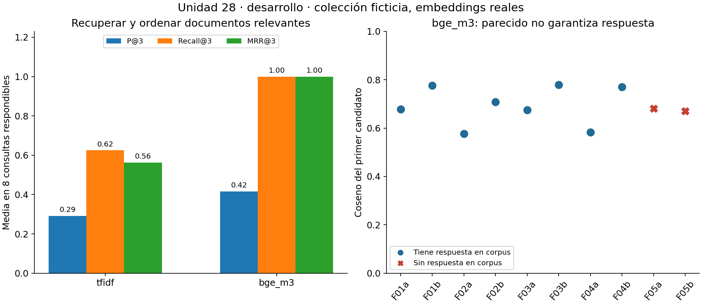
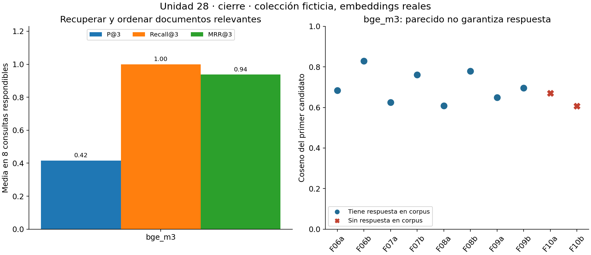

# Unidad 28 — Embeddings y búsqueda semántica

[Índice del curso](../README.md) · [Unidad anterior](../unidad27-prompts-evaluacion/README.md)

**Pregunta guía:** ¿cómo encontrar documentos que respondan a una consulta aunque no usen las mismas palabras, y cómo comprobar que realmente sirven?

Una persona pregunta «No recuerdo mi clave para entrar a clase». El documento habla de «restablecer acceso» y «contraseña del aula virtual». La coincidencia de palabras puede ser insuficiente. Un embedding aprendido puede acercar esas expresiones; también puede acercar dos instrucciones que realizan operaciones opuestas. Por eso esta unidad combina representación, recuperación y evaluación.

Trabajaremos con 20 documentos ficticios propios, 20 consultas por familias y embeddings **reales** de BGE-M3 obtenidos en CPU. La ruta principal reutiliza los vectores publicados y funciona sin Internet, Ollama ni descargas. El pequeño ejemplo de dos dimensiones se identifica por separado como artificial. No se generan respuestas con un modelo de lenguaje; esa integración corresponde a RAG en la Unidad 29.

## Objetivos y preparación

Al terminar podrás:

1. Calcular producto punto, norma y similitud coseno, reconociendo el caso del vector nulo.
2. Distinguir TF-IDF de un embedding aprendido y explicar por qué dos espacios vectoriales no se mezclan.
3. Construir y consultar un índice pequeño con orden y desempates reproducibles.
4. Evaluar P@k, Recall@k, Hit@k y MRR@k sobre juicios de relevancia definidos previamente.
5. Congelar una elección antes del cierre y detectar candidatos que no contienen una respuesta.
6. Recargar un índice y comprobar su correspondencia con corpus, modelo y preparación.

Prerrequisitos: listas, diccionarios y JSON de Python; vectores de la [Unidad 3](../unidad03-matematica-aplicada/README.md); TF-IDF de la [Unidad 22](../unidad22-lenguaje-natural/README.md); servicios locales de la [Unidad 26](../unidad26-inferencia-servicios/README.md) y evaluación de la [Unidad 27](../unidad27-prompts-evaluacion/README.md).

Tiempo orientativo: 4–6 horas para lectura, laboratorios y ejercicios; el reto requiere trabajo adicional. No es una estimación de tiempo de descarga.

## 1. Un texto representado por números

Un vector de dimensión d contiene d coordenadas: `v = [v1, ..., vd]`. En TF-IDF cada posición corresponde a un término del vocabulario. En un embedding denso, las coordenadas son características aprendidas; no suele ser válido llamar a una «temperatura» o «educación». El significado útil aparece en relaciones entre vectores dentro del mismo modelo.

Un codificador transforma un texto en un vector de longitud fija. La tokenización y la forma de combinar representaciones internas pertenecen al modelo. Aquí Ollama realiza esa inferencia y devuelve un vector por entrada; no promediamos nosotros tokens ni entrenamos el codificador.

| Aspecto | TF-IDF de esta práctica | BGE-M3 denso de esta práctica |
|---|---|---|
| Coordenadas | Términos observados en corpus | 1024 valores aprendidos |
| Información que se ajusta aquí | Vocabulario e IDF del corpus | Ningún peso del modelo |
| Coincidencia útil | Palabras compartidas y su frecuencia | Relaciones aprendidas entre expresiones |
| Costo inicial | Contar términos | Descargar/cargar pesos y hacer inferencia, o usar captura |
| Límite típico | Paráfrasis y vocabulario desconocido | Negaciones, códigos, operaciones próximas y datos ausentes |

El modelo tiene entrenamiento previo; los documentos del curso no lo entrenan. **Indexar** significa representar y organizar documentos. **Reindexar** vuelve a calcular esas representaciones cuando cambian los textos, el modelo o su preparación. Ninguna de esas acciones actualiza por sí misma los pesos neuronales.

## 2. Producto punto, norma y coseno

Para vectores de la misma dimensión:

```text
producto(q, d) = suma_i q_i * d_i
norma(q) = sqrt(suma_i q_i²)
coseno(q, d) = producto(q, d) / (norma(q) * norma(d))
```

Con `q=[1,0]`, `a=[3,4]`, `b=[10,0]`: `q·a=3`, `||a||=5`, coseno(q,a)=0,6; `q·b=10`, `||b||=10`, coseno(q,b)=1. Multiplicar `a` por diez aumenta el producto a 30, pero mantiene su dirección y coseno 0,6. El producto bruto podría cambiar el orden por longitud.

La normalización L2 divide cada coordenada por la norma. Si ambos vectores tienen norma 1, el producto punto equivale al coseno. En este ejemplo `[3,4]` pasa a `[0.6,0.8]`. Los valores del coseno están entre −1 y 1, salvo pequeñas desviaciones numéricas: 1 misma dirección, 0 ortogonalidad, −1 dirección opuesta. No son probabilidades de relevancia.

El vector `[0,0]` tiene norma cero: su coseno no está definido. Para TF-IDF adoptamos el convenio explícito de devolver puntuaciones cero si una consulta no contiene términos conocidos. Es una ausencia de señal léxica; el empate posterior por ID no constituye evidencia. Un embedding denso nulo, con dimensión equivocada, booleanos o coordenadas no finitas se rechaza.

### Laboratorio 1 — Geometría antes de lenguaje

Desde la raíz del repositorio:

```bash
python unidad28-embeddings-busqueda/ejemplos/01_entender_vectores.py
python unidad28-embeddings-busqueda/ejemplos/01_entender_vectores.py --salida resultados/u28-geometria
```

Salida principal:

```text
Vectores artificiales: cos(q,a)=0.600; cos(q,b)=1.000; opuesto=-1.000
Multiplicar a por 10 cambia el producto, pero conserva el coseno.
Vector cero: coseno indefinido; no asignar confianza cero.
```

Lee [el programa](ejemplos/01_entender_vectores.py) y localiza `normalizar`, `producto` y `coseno` en [busqueda.py](ejemplos/busqueda.py). Predice qué ocurre al cambiar `b` por `[-10,0]` antes de probarlo en una copia. No interpretes las dos coordenadas como un modelo lingüístico real.

## 3. Colección, consultas y relevancia

Los [datos documentados](datos/README.md) incluyen textos completos cortos sobre un aula ficticia: acceso, biblioteca, estación meteorológica, sensores y trámites. Cada documento tiene `id`, `titulo` y `texto`. Indexamos exactamente `titulo + "\n" + texto`; el ID permite volver a la fuente y no se incluye en la representación.

Cada consulta tiene `id`, `familia`, `texto`, `relevantes` y `razon`. Solo `texto` llega al recuperador. Los juicios y razones se usan después para evaluar. Relevante significa que el documento permite resolver la intención **específica**, no que comparte tema. Por ejemplo, describir dónde solicitar una contraseña no revela la contraseña exacta.

| Partición | Familias | Consultas | Respondibles | Sin respuesta |
|---|---|---:|---:|---:|
| Desarrollo | F01–F05 | 10 | 8 | 2 |
| Cierre | F06–F10 | 10 | 8 | 2 |

Las dos formulaciones de una intención permanecen juntas. El corpus completo está disponible desde el comienzo, como en un buscador de documentos ya existentes; no se retiran los documentos que luego responderán al cierre. Se evalúan **consultas nuevas sobre corpus conocido**, no generalización a colecciones nuevas.

D02 y D03 son dos versiones que responden sobre sincronización; D06 y D07 responden sobre reemplazo de pilas. Cada documento relevante basta por sí solo. Se conserva esta redundancia para estudiar varios relevantes; en una aplicación podría convenir agrupar versiones antes de ofrecer resultados. Todos los textos y juicios son propios y ficticios, no una muestra de solicitudes reales ni una evaluación independiente por varias personas.

El [protocolo](datos/protocolo.md) fija candidatos, k=3, preparación, desempates, métricas, selección y cierre antes de la inferencia. Publicar el cierre permite aprender y comprobar el programa; si luego ajustas usando esos resultados, necesitarás un nuevo cierre para evaluar esa nueva elección.

## 4. Construir el índice y recuperar

La referencia TF-IDF usa NFC, minúsculas mediante `casefold`, tokens Unicode de letras/dígitos y sin eliminación de palabras frecuentes. Los guiones y subrayados separan términos: `S-31` se convierte en `s`, `31`. Para N documentos y df(t) documentos que contienen t:

```text
idf(t) = 1 + ln((1 + N) / (1 + df(t)))
peso(t,d) = frecuencia_cruda(t,d) * idf(t)
```

Se normaliza cada fila; las consultas reutilizan vocabulario e IDF sin ajustarlos. Es una referencia sencilla con configuración fija, no la mejor búsqueda léxica posible. BM25, n-gramas o un tratamiento de códigos podrían cambiar la comparación. La formulación se contrasta con [TF-IDF de scikit-learn](https://scikit-learn.org/stable/modules/feature_extraction.html#tfidf-term-weighting) en una prueba independiente.

BGE-M3 es un codificador multilingüe con salida densa de 1024 dimensiones. Su ficha indica que no requiere instrucciones añadidas a las consultas; usamos texto original sin prefijos. Esta práctica utiliza solo la salida densa, no sus modos disperso o multivector. La licencia declarada es MIT. [Ficha y uso del modelo](https://huggingface.co/BAAI/bge-m3)

El índice guarda el orden de IDs, ambas matrices normalizadas, estado TF-IDF y configuración del espacio. La búsqueda calcula un producto por documento, ordena por puntuación descendente y desempata por ID ascendente. **No redondea antes de ordenar**. Costo de calcular similitudes: O(N·d); ordenar todos los candidatos añade O(N·log N). Con 20 documentos, una búsqueda exacta es suficiente y facilita auditar cada resultado.

Un índice aproximado puede reducir costo para colecciones grandes, pero añade parámetros y posibles vecinos omitidos. Una base vectorial puede gestionar persistencia, filtros y actualizaciones; no determina por sí sola la relevancia ni mejora el embedding. No hacen falta esos servicios para esta práctica.

Aunque dos modelos devuelvan 1024 números, sus ejes pueden ser incompatibles. También cambian representaciones por versión, prefijos o preparación. El código comprueba digest y configuración antes de mezclar vectores. Cambiar el corpus exige reconstruir estado y evaluar de nuevo; cambiar el modelo exige regenerar también consultas.

## 5. Evaluar un ranking

Sea R el conjunto de documentos relevantes para una consulta y Lk sus primeros k candidatos:

```text
P@k = |R ∩ Lk| / k
Recall@k = |R ∩ Lk| / |R|
Hit@k = 1 si hay algún relevante en Lk; 0 en caso contrario
RR@k = 1 / posición del primer relevante, o 0 si no aparece en Lk
MRR@k = media de RR@k entre las consultas incluidas
```

Para relevantes `{A,C}` y ranking `[B,C,D]`, k=3: P@3=1/3, Recall@3=1/2, Hit@3=1 y RR@3=1/2. Una segunda consulta respondible sin aciertos tiene RR=0; el MRR de ambas es 0,25. Comprueba el cálculo con [la solución manual](soluciones/03_metricas_recuperacion.py):

```bash
python unidad28-embeddings-busqueda/soluciones/03_metricas_recuperacion.py
```

El resumen usa medias por consulta **respondible** y cuenta también familias con Hit@3 en ambas formulaciones. Las familias tienen el mismo número de consultas: promediar primero dentro de cada familia daría aquí la misma media. Eso no convierte las dos paráfrasis en observaciones independientes para calcular incertidumbre.

Si R está vacío, Recall no está definido. En esta unidad se excluye toda esa consulta del resumen de ranking y se guardan sus métricas como `null`; P@k sí podría definirse como cero, pero optamos por informar este escenario por separado. Se cuenta cuántas preguntas sin respuesta reciben candidatos y se muestra su puntuación máxima. No se ocultan esas preguntas ni se las registra como aciertos.

Más k suele aumentar o conservar el recall y puede reducir precisión, además de dar más texto irrelevante al paso siguiente. Las métricas sirven a preguntas distintas: MRR observa dónde aparece la primera evidencia; Recall mide cuánta se recupera. Para otras tareas puede importar relevancia gradual y nDCG. [Referencia de evaluación de recuperación](https://nlp.stanford.edu/IR-book/html/htmledition/evaluation-of-ranked-retrieval-results-1.html)

## 6. Laboratorio 2 — Comparación y cierre

Estos comandos usan biblioteca estándar de Python y no llaman al modelo:

```bash
python unidad28-embeddings-busqueda/ejemplos/02_comparar_busquedas.py
python unidad28-embeddings-busqueda/ejemplos/02_comparar_busquedas.py --salida resultados/u28-desarrollo
python unidad28-embeddings-busqueda/ejemplos/02_comparar_busquedas.py --fase cierre --indice resultados/u28-desarrollo/indice.json --seleccion resultados/u28-desarrollo/seleccion.json --salida resultados/u28-cierre
```

El primer recorrido verifica las capturas, construye el índice, compara ambos métodos en desarrollo y elige mayor MRR@3; un empate favorecería TF-IDF. Guarda índice y selección, los recarga y comprueba que coinciden. El cierre vuelve a comprobarlos contra desarrollo y evalúa solo el método elegido.

| Fase y método | P@3 | Recall@3 | Hit@3 | MRR@3 | Familias con Hit completo |
|---|---:|---:|---:|---:|---:|
| Desarrollo: TF-IDF | 0,2917 | 0,6250 | 0,6250 | 0,5625 | 1/4 |
| Desarrollo: BGE-M3 | 0,4167 | 1,0000 | 1,0000 | 1,0000 | 4/4 |
| Cierre: BGE-M3 congelado | 0,4167 | 1,0000 | 1,0000 | 0,9375 | 4/4 |

P@3=0,4167 no contradice Recall=1. Hay seis consultas respondibles con un documento relevante y dos con dos: como se devuelven tres por consulta, recuperar todos suma 10 relevantes entre 24 posiciones. La tabla no demuestra superioridad universal del modelo: solo compara dos configuraciones sobre esta colección pequeña y escrita para enseñar el procedimiento.



Tres observaciones de desarrollo:

- F01a, «No recuerdo mi clave…»: TF-IDF coloca primero el reloj del aula (D12) y no recupera D01 en top-3; BGE-M3 sí coloca D01 primero.
- F02a: BGE-M3 obtiene un primer candidato relevante con coseno 0,5773.
- F05a pregunta por una contraseña exacta ausente. D18 obtiene 0,6809: **una similitud mayor que la del caso respondible anterior**. Un umbral único no separa perfectamente estos casos observados.



En F07a, «llevarme las lecturas… ¿cómo las saco?», BGE-M3 coloca **importación D16** primero (0,6258) y **exportación D08** segundo (0,6187). Encuentra la fuente correcta, pero la precede con una instrucción de sentido opuesto. Por eso MRR cae a `(7 + 1/2)/8 = 0,9375`, aunque Recall@3 permanezca en 1. No se modifica el modelo ni el protocolo al observarlo.

Las dos preguntas sin respuesta de cada fase reciben candidatos, 2/2. En cierre, F10a obtiene D19 con 0,6697 aunque ese documento no contiene el precio pedido. Son candidatos para revisar, no respuestas aceptadas. No hay política de abstención automática en el código. Si incorporas una, selecciona y evalúa sus errores con datos adecuados, sin usar cierre para escoger el umbral.

### Explorar consultas y fuentes

```bash
python unidad28-embeddings-busqueda/ejemplos/buscar.py --consulta-id F01a
python unidad28-embeddings-busqueda/ejemplos/buscar.py --consulta-id F05a
python unidad28-embeddings-busqueda/ejemplos/buscar.py --consulta-id F01a --metodo tfidf
python unidad28-embeddings-busqueda/ejemplos/buscar.py --texto "zxqv" --metodo tfidf
```

Las consultas por ID usan solo desarrollo y vectores guardados. La última produce un vector léxico nulo; observa el aviso y los empates. El programa imprime ID, puntuación y texto completo para contrastar evidencia. Una consulta nueva en BGE-M3 necesita inferencia real y el mismo modelo/versiones del índice:

```bash
python unidad28-embeddings-busqueda/ejemplos/buscar.py --texto "¿Cómo recupero mi acceso al aula?" --en-vivo
```

### Figuras y requisitos

La ruta de texto no añade paquetes. Para gráficos se reutilizan NumPy 2.2.6 y Matplotlib 3.10.8 del curso:

```bash
python -m pip install -r unidad28-embeddings-busqueda/requirements-graficos.txt
python unidad28-embeddings-busqueda/ejemplos/02_comparar_busquedas.py --salida resultados/u28-desarrollo --graficos
python unidad28-embeddings-busqueda/ejemplos/02_comparar_busquedas.py --fase cierre --salida resultados/u28-cierre --graficos
```

## 7. Repetir la inferencia local, opcional

La captura publicada utilizó Python 3.12.3, Ollama 0.34.2, `bge-m3:567m`, GGUF F16, 566,70 millones de parámetros, CPU, cuatro hilos y contexto solicitado de 2048 tokens. Se verificó la licencia MIT declarada y la identidad del modelo. Pesos instalados: 1.157.672.605 bytes (aproximadamente 1,16 GB decimales). El registro del servidor indica 1.218.969.598 bytes cargados y cero bytes de VRAM; esto **no mide pico de RAM** ni constituye un requisito mínimo universal.

La [distribución de Ollama](https://ollama.com/library/bge-m3) documenta la descarga del modelo. La [API `/api/embed`](https://docs.ollama.com/api/embed) admite una entrada de texto y devuelve `embeddings`; fijamos `truncate=false` para recibir un error si excede contexto, en vez de cortar silenciosamente. Nuestro cliente limita además cada entrada a 2000 caracteres y cada respuesta a 1 MiB. Caracteres y tokens no equivalen.

Con Ollama instalado y su servicio local iniciado, la siguiente descarga requiere conexión y espacio. Las inferencias posteriores usan `127.0.0.1`; no hay claves ni APIs pagadas. El programa nunca descarga automáticamente:

```bash
ollama pull bge-m3:567m
python unidad28-embeddings-busqueda/ejemplos/02_comparar_busquedas.py --en-vivo --salida resultados/u28-nueva-captura-desarrollo
python unidad28-embeddings-busqueda/ejemplos/02_comparar_busquedas.py --fase cierre --en-vivo --registro-desarrollo resultados/u28-nueva-captura-desarrollo/registro.json --indice resultados/u28-nueva-captura-desarrollo/indice.json --seleccion resultados/u28-nueva-captura-desarrollo/seleccion.json --salida resultados/u28-nueva-captura-cierre
```

La carpeta de captura debe estar nueva o vacía. Hay 30 llamadas de desarrollo (20 documentos y diez consultas), diez de cierre y un calentamiento por fase: 42 solicitudes en la evidencia publicada. Si en otra ejecución ganase TF-IDF, no se necesitan embeddings de cierre: ejecutar ese cierre **sin `--en-vivo`** y pasando su índice, selección y registro de desarrollo. El programa impide capturar un cierre denso para una elección léxica.

Cada intento se guarda antes de validarlo. Un fallo deja un registro parcial, que el análisis rechaza; no se borran fallos para reportar una ejecución completa. No hay reintentos automáticos. El timeout de socket es 120 s, no un presupuesto total garantizado de todo el experimento.

La etiqueta descargable puede cambiar. El digest completo está en la [ficha](recursos/ficha_recuperacion.md); una versión distinta exige un nuevo experimento, no mezclar consultas nuevas con el índice viejo. Para reanalizar una captura nueva usa `--registro ruta/registro.json` en desarrollo y las tres rutas de desarrollo más `--registro` del cierre cuando corresponda. Repetir inferencia puede producir pequeñas diferencias; reproducir los rankings guardados no es repetir el cómputo neuronal.

## 8. Persistencia, límites y siguiente paso

El [índice JSON](recursos/desarrollo/indice.json) contiene ambas representaciones; la [selección](recursos/desarrollo/seleccion.json) identifica cuál usar en cierre. Se comprueban huellas del corpus, protocolo, configuración, núcleo de búsqueda y captura de desarrollo, además del modelo. El orden de IDs y filas importa: desplazar una fila puede atribuir un vector a una fuente equivocada.

Las huellas son controles de consistencia, no firmas de autenticidad. Tampoco sustituyen revisar juicios, detectar documentos obsoletos o comprobar permisos. Para usar un corpus real habría que definir procedencia, versiones, acceso y una política de actualización. Si fragmentas documentos, necesitarás IDs de fragmento, vínculo al documento y evaluación apropiada; aquí cada texto corto es la unidad completa de recuperación.

Revisa la [ficha de recuperación](recursos/ficha_recuperacion.md), los [diez ejercicios](ejercicios.md), sus [soluciones](soluciones/README.md) y el [reto](reto.md). Registra tus decisiones con la [plantilla de informe](plantillas/informe_recuperacion.md).

## Verificación y cierre de la unidad

Con el entorno numérico compartido del curso, incluidas las dependencias de la Unidad 21, ejecuta:

```bash
python -m unittest discover -s unidad28-embeddings-busqueda/pruebas -v
python herramientas/verificar_curso.py
```

Las **48 pruebas** comprueban geometría, equivalencia con scikit-learn, métricas, familias, capturas, incompatibilidades, selección, huellas y recarga. No llaman a Ollama. Las dos figuras se derivan de los informes JSON; sus versiones [SVG de desarrollo](recursos/desarrollo/recuperacion.svg) y [SVG de cierre](recursos/cierre/recuperacion.svg) permiten ampliar etiquetas. Las fuentes externas se consultaron el 10 de octubre de 2026; sus enlaces y condiciones pueden cambiar.

Antes de avanzar, explica por qué F07a tiene Recall@3=1 y RR@3=0,5, y por qué D19 no demuestra el precio de un curso. La siguiente unidad prevista es la **29 — RAG con documentos**, pendiente de desarrollo.
